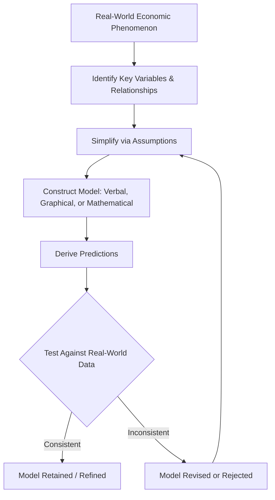

## Economic Models and Their Assumptions

### Definition and Core Concept

An **economic model** is a simplified theoretical or mathematical representation of an economic process, relationship, or system, designed to isolate the essential variables and mechanisms relevant to a specific question while abstracting away extraneous real-world detail. Models allow economists to derive testable predictions, analyze causal relationships, and understand complex phenomena that would otherwise be too intricate to reason about directly.

**Key Points**

- All economic models are simplifications of reality by design — this is a feature, not a flaw, of the modeling approach.
- The value of a model lies in its ability to generate accurate, useful predictions or insights about the phenomenon of interest, not in the literal realism of its assumptions.
- Models can be verbal/conceptual (e.g., supply and demand described in words), graphical (e.g., the PPF, supply-demand diagrams), or mathematical (e.g., utility functions, production functions).

### Why Economists Use Models

- **Complexity reduction**: Real economies involve millions of interacting agents, goods, and decisions; models isolate the relationships relevant to a specific question.
- **Ceteris paribus reasoning**: Models typically hold "all else equal" to isolate the effect of one variable at a time, which would be impossible to observe directly in the real world where many factors change simultaneously.
- **Prediction and testing**: Models generate hypotheses that can, in principle, be tested against real-world data (an application of positive economics).
- **Policy analysis**: Models allow economists to simulate the likely effects of a policy change before it is implemented.

### The Role of Assumptions

Every economic model rests on a set of **assumptions** — simplifying conditions that define the scope and applicability of the model. Assumptions are not claims that the real world literally behaves this way in every detail; rather, they specify the conditions under which the model's logic and predictions are expected to hold.

**Key Points**

- Assumptions serve to make a problem analytically tractable by removing complicating factors not central to the question at hand.
- The appropriateness of an assumption depends on the specific question being analyzed — an assumption reasonable for one purpose may be inappropriate for another.
- Economists generally accept the [Inference: widely-held, though not universally uncontested, methodological] position (associated with economist Milton Friedman's essay on positive economics) that a model should be judged primarily by the accuracy of its *predictions*, not by the literal realism of its assumptions.

### Common Assumptions in Microeconomic Models

| Assumption | Typical Use | Notes |
| --- | --- | --- |
| Ceteris paribus ("all else equal") | Isolating the effect of one variable | Used throughout supply/demand analysis |
| Rational, self-interested agents | Consumer and firm decision-making | Basis of the "homo economicus" framework |
| Perfect information | Baseline competitive market models | Relaxed in models of asymmetric information |
| Fixed resources/technology (short run) | PPF, short-run production models | Relaxed in long-run and growth models |
| Homogeneous goods | Basic supply/demand models | Relaxed in models of product differentiation |
| Many buyers and sellers, no market power | Perfect competition | Relaxed in monopoly/oligopoly models |
| Zero transaction costs | Simplified exchange and Coase Theorem analysis | Relaxed in transaction cost economics |

### Ceteris Paribus: The Foundational Assumption

**Ceteris paribus** (Latin for "other things being equal") is perhaps the most pervasive assumption in microeconomic modeling. It allows economists to analyze the effect of a single variable (e.g., price) on an outcome (e.g., quantity demanded) while holding all other relevant factors (income, tastes, prices of other goods) constant.

**Example**

The law of demand states that, ceteris paribus, an increase in the price of a good leads to a decrease in the quantity demanded. This holds *only* when other determinants of demand (income, preferences, prices of substitutes/complements) remain unchanged; if income rises simultaneously with a price increase, the ceteris paribus assumption is violated, and quantity demanded could rise or remain unchanged despite the price increase.

### Types of Economic Models

#### Descriptive (Positive) Models

Designed to explain or predict how economic agents actually behave and how markets actually function (e.g., the standard supply and demand model, the PPF).

#### Normative Models

Incorporate explicit value judgments to evaluate what outcomes are socially desirable (e.g., welfare economics models using social welfare functions).

#### Static vs. Dynamic Models

- **Static models** analyze a system at a single point in time or compare two equilibrium states without describing the adjustment path (e.g., comparative statics in supply and demand).
- **Dynamic models** explicitly incorporate the passage of time and the path of adjustment (e.g., economic growth models, business cycle models).

#### Partial Equilibrium vs. General Equilibrium Models

- **Partial equilibrium models** analyze a single market in isolation, holding conditions in all other markets constant (e.g., the standard supply-demand model for a single good).
- **General equilibrium models** analyze the simultaneous equilibrium of all markets in an economy, accounting for interconnections and feedback effects between markets.

### Evaluating Models: Simplicity vs. Realism Trade-off

**Key Points**

- There is an inherent trade-off between a model's **simplicity/tractability** and its **descriptive realism**: more realistic models are typically more complex and harder to solve or interpret, while simpler models are easier to use but may omit relevant real-world detail.
- A good model strikes a balance appropriate to its intended purpose — a model built for a principles-level economics course prioritizes intuition and simplicity, while models used for detailed empirical policy analysis often incorporate greater complexity and realism.
- **Occam's razor** is often invoked as a modeling principle: prefer the simplest model that adequately explains/predicts the phenomenon in question.

### Testing and Validating Economic Models

Economic models generate **empirically testable predictions**, which is what distinguishes positive economic models from pure ideology or untestable speculation.

**Key Points**

- Models are tested using historical data, natural experiments, controlled experiments (in experimental economics), or econometric analysis.
- A model that consistently fails to predict real-world outcomes should, in principle, be revised or discarded — although in practice, models are rarely discarded outright and are more often refined by relaxing or modifying specific assumptions.
- **Robustness checks**: Economists often test whether a model's conclusions hold up when key assumptions are relaxed or altered, to assess how sensitive the results are to those assumptions.

### Common Critiques of Economic Modeling

- **Unrealistic behavioral assumptions**: Critics (notably from behavioral economics) argue that assuming perfectly rational, self-interested agents does not accurately capture observed human decision-making, which is subject to cognitive biases, heuristics, and bounded rationality.
- **Model risk in policy application**: Relying on a model whose assumptions do not hold in a specific real-world context can lead to inaccurate predictions and poorly designed policy. [Inference: the degree to which any specific historical policy failure can be attributed to flawed modeling assumptions versus other factors is often contested among economists and is not something that can be stated as settled fact in general terms.]
- **Value-ladenness**: Even ostensibly positive models may implicitly embed normative choices in what variables are included, how success is measured, or which relationships are assumed fixed.

### The Iterative Nature of Model Building

Economic model-building is typically an **iterative process**: an initial simple model is built, tested against evidence, and then refined by relaxing assumptions or adding complexity where the simple version fails to capture important real-world behavior — a process illustrated in the earlier flowchart, where models cycle back through revision when predictions are inconsistent with observed data.

**Example**

The basic competitive market model assumes perfect information among buyers and sellers. When economists observed real-world phenomena inconsistent with this assumption (e.g., persistent price dispersion, adverse selection in insurance markets), the assumption was relaxed, leading to the development of **information economics** (asymmetric information models), a significant extension of the basic competitive framework.

### Related Topics

- Positive vs. Normative Economics
- The Production Possibilities Frontier
- Ceteris Paribus and Comparative Statics
- Rational Choice Theory and Its Critiques
- Behavioral Economics
- Partial vs. General Equilibrium Analysis
- Asymmetric Information and Market Failure