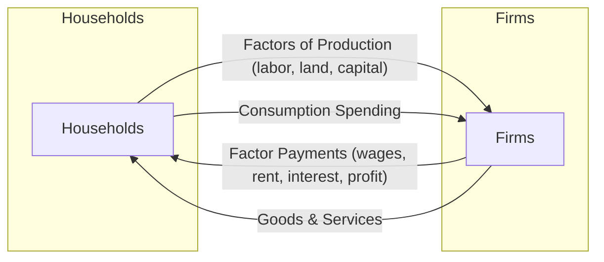
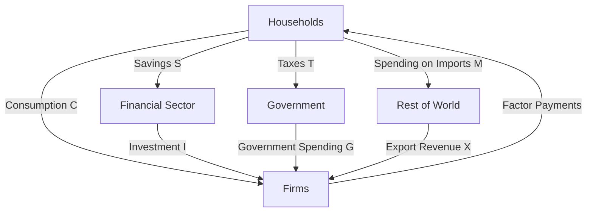

## Circular Flow of Income

### Definition and Core Concept

The **circular flow of income** is a foundational economic model depicting how money, goods, services, and resources move between the key sectors of an economy — primarily **households** and **firms** — in a continuous, cyclical process. It illustrates how income generated in production ultimately returns as spending that sustains further production, forming a closed loop (or "circular" flow) of economic activity.

**Key Points**

- The model captures two simultaneous, opposite-direction flows: a **real flow** (goods, services, and factors of production) and a **money flow** (payments and income) that move in opposite directions between sectors.
- In its simplest form, the model includes two sectors (households and firms); more advanced versions add government, financial sector, and the foreign sector (international trade).
- The circular flow model is a bridge concept between microeconomics (individual market behavior) and macroeconomics (aggregate economic activity, national income accounting).

### The Two-Sector Model

In the simplest version of the model, the economy consists of two sectors:

- **Households**: Own the factors of production (land, labor, capital, entrepreneurship) and supply them to firms; they also purchase goods and services produced by firms.
- **Firms**: Purchase factors of production from households to produce goods and services, which they then sell to households.

Two markets connect these sectors:

- **Factor market (resource market)**: Where households supply factors of production to firms, in exchange for factor payments (wages, rent, interest, profit).
- **Goods market (product market)**: Where firms supply goods and services to households, in exchange for consumer spending.

### Real Flow vs. Money Flow

| Flow Type | Direction: Households → Firms | Direction: Firms → Households |
| --- | --- | --- |
| Real flow | Factors of production (labor, land, capital) supplied to firms | Goods and services provided to households |
| Money flow | Consumption expenditure paid to firms | Factor payments (wages, rent, interest, profit) paid to households |

**Key Points**

- The real flow and money flow move in **opposite directions**: households give up resources/labor and receive goods in the real flow, while money moves from firms to households as factor payments, and back from households to firms as spending.
- In equilibrium, the value of the real flow (output produced) equals the value of the money flow (total spending/income) — this equivalence underlies the identity that **national output = national income = national expenditure** in macroeconomic accounting.

### Graphical Representation: The Basic Circular Flow Diagram

<svg xmlns="http://www.w3.org/2000/svg" viewBox="0 0 560 380" font-family="sans-serif">
<text x="280" y="24" font-size="15" font-weight="bold" text-anchor="middle">Circular Flow of Income: Two-Sector Model (svg_diagram)</text>

<rect x="40" y="150" width="140" height="70" fill="#eaf4ff" stroke="#1f77b4" stroke-width="2" />
<text x="110" y="190" font-size="14" text-anchor="middle">Households</text>

<rect x="380" y="150" width="140" height="70" fill="#eafbea" stroke="#2ca02c" stroke-width="2" />
<text x="450" y="190" font-size="14" text-anchor="middle">Firms</text>

<line x1="180" y1="140" x2="380" y2="140" stroke="#1f77b4" stroke-width="2" marker-end="url(#arrow1)" />
<text x="280" y="125" font-size="11" text-anchor="middle">Factors of Production</text>
<line x1="380" y1="120" x2="180" y2="120" stroke="#d62728" stroke-width="2" marker-end="url(#arrow2)" />
<text x="280" y="105" font-size="11" text-anchor="middle">Factor Payments ($)</text>

<line x1="380" y1="240" x2="180" y2="240" stroke="#2ca02c" stroke-width="2" marker-end="url(#arrow3)" />
<text x="280" y="260" font-size="11" text-anchor="middle">Goods and Services</text>
<line x1="180" y1="260" x2="380" y2="260" stroke="#d62728" stroke-width="2" marker-end="url(#arrow4)" />
<text x="280" y="280" font-size="11" text-anchor="middle">Consumption Spending ($)</text>

<text x="280" y="60" font-size="11" text-anchor="middle" fill="`#1f77b4`">Factor Market (top)</text>

<text x="280" y="330" font-size="11" text-anchor="middle" fill="`#2ca02c`">Goods Market (bottom)</text>

</svg>

### Extending the Model: Injections and Withdrawals (Leakages)

Real economies do not consist solely of a closed loop between households and firms. The model is extended by introducing three additional sectors — government, financial institutions, and the foreign sector — which interact with the circular flow through **injections** (additions to the flow of income) and **withdrawals/leakages** (removals from the flow of income).

| Leakage (Withdrawal) | Corresponding Injection | Sector Involved |
| --- | --- | --- |
| Savings (S) | Investment (I) | Financial sector |
| Taxes (T) | Government spending (G) | Government sector |
| Imports (M) | Exports (X) | Foreign sector |

**Key Points**

- A **leakage/withdrawal** is any income received by households that is *not* passed on to firms as consumption spending (e.g., money saved, paid in taxes, or spent on imported goods).
- An **injection** is any spending that enters the circular flow from outside the household consumption-firm production loop (e.g., firm investment, government spending, export revenue).
- When total injections equal total withdrawals, the level of national income is in **equilibrium** (neither expanding nor contracting).

$$\text{Equilibrium condition: } S + T + M = I + G + X$$

### Five-Sector (Full) Circular Flow Model

The most complete version of the model, commonly used to introduce national income accounting, includes:

1. **Households** — consumption spending, factor supply
2. **Firms** — production, factor payments
3. **Government** — taxation and public spending, regulation
4. **Financial sector** — channels savings into investment (banks, capital markets)
5. **Foreign sector (Rest of World)** — exports and imports, foreign investment flows

**Key Points**

- Government intervenes in the flow via taxation (a withdrawal) and government spending (an injection), and can also influence the flow through subsidies and transfer payments.
- The financial sector acts as an intermediary, converting household savings (a withdrawal) into firm investment (an injection) via loans, bonds, and equity markets.
- The foreign sector connects a domestic economy to the rest of the world: spending on imports is a withdrawal (money leaving the domestic circular flow), while export revenue is an injection (money entering from abroad).

### Applications of the Circular Flow Model

- **National income accounting**: The circular flow provides the conceptual basis for GDP measurement via three equivalent approaches — the **output approach** (value of goods/services produced), the **income approach** (sum of factor payments), and the **expenditure approach** (total spending) — all of which should theoretically yield the same total value, reflecting the circular flow's identity between output, income, and expenditure.
- **Macroeconomic equilibrium analysis**: The injections-withdrawals framework is the basis for basic Keynesian income determination models, showing how changes in investment, government spending, or exports affect the equilibrium level of national income.
- **Policy analysis**: Understanding leakages and injections helps explain the intended mechanisms of fiscal policy (adjusting G and T) and how changes in savings behavior or trade patterns affect the broader economy.

### Limitations of the Model

- **Simplification**: The basic model does not capture the full complexity of financial intermediation, multiple rounds of spending (the multiplier effect), price level changes, or time lags in economic responses.
- **Static representation**: The circular flow diagram represents flows at a conceptual level and does not by itself model dynamic adjustment processes or disequilibrium behavior over time.
- **Aggregation**: Treating "households" and "firms" as single, homogeneous blocks abstracts away significant heterogeneity in behavior across different types of households and firms. [Inference: the practical significance of this aggregation for any specific analytical purpose depends on the question being studied and is not uniform across applications.]

### Related Topics

- The Economic Problem and Resource Allocation
- National Income Accounting: GDP Measurement Approaches
- Injections and Leakages in Macroeconomic Equilibrium
- The Multiplier Effect
- Fiscal Policy: Government Spending and Taxation
- Factor Markets and Factor Payments