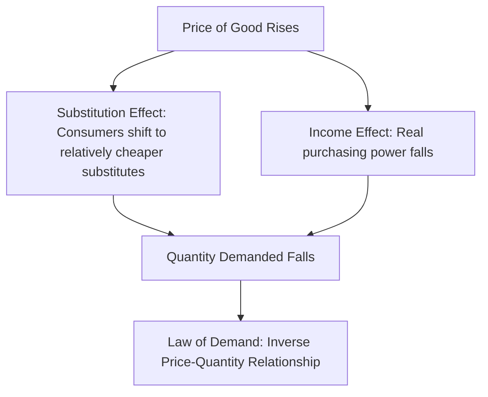

## Law of Demand and the Demand Curve

### Definition and Core Concept

The **law of demand** states that, ceteris paribus (all other factors held constant), there is an **inverse relationship** between the price of a good and the quantity demanded of that good: as price rises, quantity demanded falls; as price falls, quantity demanded rises.

The **demand curve** is the graphical representation of this relationship, plotting the quantity demanded of a good against its price, holding all other determinants of demand constant.

**Key Points**

- The law of demand describes a negative (inverse) relationship between price and quantity demanded.
- The demand curve slopes downward from left to right, reflecting this inverse relationship.
- "Demand" refers to the entire relationship (the whole curve/schedule), while "quantity demanded" refers to a specific amount at a specific price — a critical terminological distinction in microeconomics.

### The Demand Schedule and Demand Curve

A **demand schedule** is a table showing the quantity demanded of a good at various price points, which can be plotted to form the demand curve.

**Example**

| Price ($) | Quantity Demanded (units/week) |
| --- | --- |
| 10 | 20 |
| 8 | 40 |
| 6 | 60 |
| 4 | 80 |
| 2 | 100 |

Plotting these points with price on the vertical axis and quantity on the horizontal axis (following standard economic convention, despite price being the independent variable) produces a downward-sloping demand curve.

<svg xmlns="http://www.w3.org/2000/svg" viewBox="0 0 520 400" font-family="sans-serif">
<text x="260" y="24" font-size="15" font-weight="bold" text-anchor="middle">The Demand Curve (svg_diagram)</text>
<line x1="80" y1="340" x2="80" y2="50" stroke="black" stroke-width="2" />
<line x1="80" y1="340" x2="460" y2="340" stroke="black" stroke-width="2" />
<text x="30" y="55" font-size="12">Price ($)</text>
<text x="420" y="365" font-size="12">Quantity</text>

<line x1="110" y1="80" x2="430" y2="320" stroke="#1f77b4" stroke-width="3" />
<text x="330" y="150" font-size="13" fill="#1f77b4" font-weight="bold">D (Demand Curve)</text>

<circle cx="150" cy="110" r="4" fill="#d62728" />
<circle cx="220" cy="160" r="4" fill="#d62728" />
<circle cx="290" cy="210" r="4" fill="#d62728" />
<circle cx="360" cy="260" r="4" fill="#d62728" />
</svg>

### Why the Demand Curve Slopes Downward

Two primary economic explanations account for the inverse price-quantity relationship:

#### Substitution Effect

When the price of a good rises (holding income and other prices constant), the good becomes relatively more expensive compared to substitute goods, leading consumers to substitute away from it toward relatively cheaper alternatives, reducing quantity demanded.

#### Income Effect

When the price of a good rises, a consumer's **real income** (purchasing power) effectively falls, since a given nominal income now buys less. For a normal good, this reduction in real purchasing power leads to reduced consumption of the good.

$$\text{Total Price Effect} = \text{Substitution Effect} + \text{Income Effect}$$

**Key Points**

- For **normal goods**, the substitution and income effects work in the same direction (both reduce quantity demanded as price rises), reinforcing the law of demand.
- For **inferior goods**, the income effect works in the opposite direction of the substitution effect, but is typically not large enough to reverse the overall negative price-quantity relationship (except in the rare theoretical case of a Giffen good, discussed below).

#### Law of Diminishing Marginal Utility

An additional explanation: as a consumer acquires more units of a good, each successive unit yields progressively less additional (marginal) utility. Since consumers are only willing to pay a price up to the value of the marginal utility received, the price they are willing to pay for successive units declines — this underlies the demand curve as a representation of marginal willingness to pay.

### Movement Along the Demand Curve vs. Shift of the Demand Curve

This distinction is one of the most important — and most commonly confused — concepts in demand analysis.

| Concept | Cause | Effect |
| --- | --- | --- |
| Movement along the curve (change in quantity demanded) | Change in the good's own price | Moves to a different point on the *same* demand curve |
| Shift of the curve (change in demand) | Change in a non-price determinant of demand | Entire curve shifts left (decrease) or right (increase) |

**Key Points**

- A change in the price of the good itself causes a movement **along** a fixed demand curve — this is a change in **quantity demanded**.
- A change in any other determinant of demand (income, tastes, prices of related goods, expectations, number of buyers) causes the **entire curve to shift** — this is a change in **demand**.

<svg xmlns="http://www.w3.org/2000/svg" viewBox="0 0 540 400" font-family="sans-serif">
<text x="270" y="24" font-size="15" font-weight="bold" text-anchor="middle">Movement Along vs. Shift of Demand Curve (svg_diagram)</text>
<line x1="80" y1="340" x2="80" y2="50" stroke="black" stroke-width="2" />
<line x1="80" y1="340" x2="480" y2="340" stroke="black" stroke-width="2" />
<text x="30" y="55" font-size="12">Price</text>
<text x="440" y="365" font-size="12">Quantity</text>

<line x1="110" y1="90" x2="420" y2="310" stroke="#1f77b4" stroke-width="3" />
<text x="330" y="150" font-size="12" fill="#1f77b4">D1 (Original)</text>

<line x1="180" y1="90" x2="460" y2="310" stroke="#2ca02c" stroke-width="3" stroke-dasharray="6,3" />
<text x="390" y="150" font-size="12" fill="#2ca02c">D2 (Increase in Demand)</text>

<circle cx="200" cy="220" r="4" fill="#d62728" />
<circle cx="290" cy="180" r="4" fill="#d62728" />
<text x="200" y="245" font-size="10">Movement along D1</text>
</svg>

### Determinants of Demand (Non-Price Factors That Shift the Curve)

| Determinant | Effect of an Increase | Example |
| --- | --- | --- |
| Income (normal good) | Demand shifts right (increases) | Rising income increases demand for restaurant meals |
| Income (inferior good) | Demand shifts left (decreases) | Rising income decreases demand for instant noodles |
| Price of substitutes | Demand for the good shifts right | Rising price of Pepsi increases demand for Coca-Cola |
| Price of complements | Demand for the good shifts left | Rising price of printers decreases demand for ink cartridges |
| Tastes and preferences | Demand shifts right if preference increases | A health trend increases demand for organic food |
| Expectations of future prices | Demand shifts right if price expected to rise | Expecting a price hike next month increases demand today |
| Number of buyers | Demand shifts right as buyers increase | Population growth increases market demand |

### Normal Goods vs. Inferior Goods

- **Normal good**: Demand increases as consumer income rises (positive income elasticity of demand).
- **Inferior good**: Demand decreases as consumer income rises (negative income elasticity of demand), as consumers switch to higher-quality substitutes.

$$\text{Income elasticity of demand} = \frac{\% \Delta Q_D}{\% \Delta \text{Income}}$$

### Individual Demand vs. Market Demand

- **Individual demand**: The demand curve of a single consumer, reflecting that individual's preferences, income, and budget constraint.
- **Market demand**: The horizontal summation of all individual demand curves in a market at each price point, representing total quantity demanded by all consumers combined.

$$Q_D^{\text{market}} = \sum_i Q_D^{i}$$

### Exceptions and Special Cases

While the law of demand holds in the vast majority of real-world markets, a small number of theoretical exceptions are discussed in economic literature:

- **Giffen goods**: A theoretical case (associated with staple inferior goods) where the income effect of a price increase is so strong and in the opposite direction that it outweighs the substitution effect, resulting in an *upward*-sloping demand curve for that specific good. [Inference: empirically documented, unambiguous real-world examples of Giffen goods are extremely rare and have historically been difficult to verify rigorously, making this largely a theoretical curiosity in introductory treatments.]
- **Veblen goods**: Goods for which higher price itself increases desirability due to conspicuous consumption/status signaling motives (e.g., certain luxury goods), potentially producing an apparent positive price-quantity relationship — though this reflects a shift in preferences/status value at higher prices rather than a strict violation of the underlying law of demand for a fixed good.
- **Speculative demand**: When consumers expect prices to rise further, a current price increase can sometimes increase current quantity demanded (as buyers rush to purchase before further increases) — this is usually treated as a demand *shift* (due to changed expectations) rather than a true violation of the law of demand along a fixed curve.

### Demand Elasticity: A Related Concept

While the law of demand establishes the *direction* of the price-quantity relationship, **price elasticity of demand** measures the *magnitude* of consumers' responsiveness to price changes:

$$E_D = \frac{\% \Delta Q_D}{\% \Delta P}$$

This concept, covered in depth separately, builds directly on the demand curve framework established here.

### Related Topics

- Determinants of Demand and Demand Shifters
- Price Elasticity of Demand
- Consumer Choice Theory and Utility Maximization
- Income and Substitution Effects
- Individual vs. Market Demand
- Giffen Goods and Veblen Goods
- Market Equilibrium: Supply and Demand