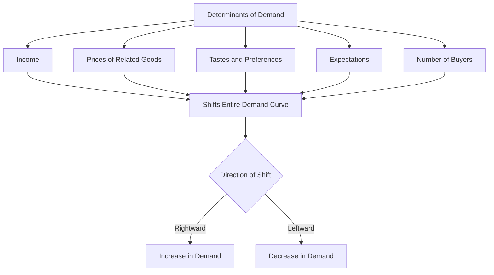

## Determinants of Demand

### Definition and Core Concept

The **determinants of demand** (also called **demand shifters**) are the non-price factors that influence how much of a good or service consumers are willing and able to purchase at every price level. While the law of demand describes the relationship between a good's own price and quantity demanded (holding other factors constant), the determinants of demand are precisely those "other factors" — and a change in any of them causes the **entire demand curve to shift**, rather than causing movement along a fixed curve.

**Key Points**

- A change in a determinant of demand changes **demand** (the whole curve/relationship), as distinct from a change in the good's own price, which changes **quantity demanded** (a movement along a fixed curve).
- An increase in demand shifts the curve rightward (more is demanded at every price); a decrease in demand shifts the curve leftward (less is demanded at every price).
- The standard determinants are often summarized by the mnemonic **TRIBE**: Tastes, Related goods' prices, Income, Buyers (number of), Expectations.

### The Core Determinants of Demand

#### 1. Income

The effect of income changes on demand depends on whether the good is normal or inferior.

| Good Type | Effect of Income Increase | Income Elasticity |
| --- | --- | --- |
| Normal good | Demand increases (shifts right) | Positive ($E_Y > 0$) |
| Inferior good | Demand decreases (shifts left) | Negative ($E_Y < 0$) |

$$E_Y = \frac{\% \Delta Q_D}{\% \Delta \text{Income}}$$

**Example**

As household income rises, demand for restaurant dining (a normal good) typically increases, while demand for instant ramen noodles (commonly cited as an inferior good) may decrease as consumers shift toward higher-quality food options.

#### 2. Prices of Related Goods

The effect depends on whether the related good is a substitute or a complement.

| Relationship | Effect on Good X's Demand | Cross-Price Elasticity |
| --- | --- | --- |
| Substitute (Y is a substitute for X) | Rise in $P_Y$ increases demand for X | Positive ($E_{XY} > 0$) |
| Complement (Y is a complement to X) | Rise in $P_Y$ decreases demand for X | Negative ($E_{XY} < 0$) |

$$E_{XY} = \frac{\% \Delta Q_{D,X}}{\% \Delta P_Y}$$

**Example**

If the price of Pepsi rises, demand for Coca-Cola (a substitute) tends to increase as consumers switch brands. If the price of coffee rises, demand for coffee creamer (a complement) tends to decrease, since less coffee is purchased overall.

#### 3. Tastes and Preferences

Changes in consumer tastes, driven by trends, advertising, cultural shifts, health information, or fashion, shift demand independent of price or income changes.

**Example**

Increased public awareness of health and fitness has historically shifted demand rightward for organic and plant-based food products, while shifting demand leftward for products perceived as unhealthy.

#### 4. Expectations

Consumer expectations about future prices, income, or availability can shift current demand.

**Example**

If consumers expect the price of a good to rise next month, current demand for that good tends to increase (rightward shift) as buyers purchase now to avoid the anticipated higher price. Conversely, if consumers expect their future income to fall (e.g., due to anticipated layoffs), current demand for normal goods may decrease as households increase precautionary saving.

#### 5. Number of Buyers (Market Size)

An increase in the number of buyers in a market — due to population growth, demographic shifts, or market expansion (e.g., a firm entering new geographic markets) — increases market demand at every price level.

**Example**

Population growth in a city directly increases the market demand for housing, holding individual preferences and income constant.

### Graphical Illustration: Shifts vs. Movements

<svg xmlns="http://www.w3.org/2000/svg" viewBox="0 0 540 400" font-family="sans-serif">
<text x="270" y="24" font-size="15" font-weight="bold" text-anchor="middle">Increase and Decrease in Demand (svg_diagram)</text>
<line x1="80" y1="340" x2="80" y2="50" stroke="black" stroke-width="2" />
<line x1="80" y1="340" x2="480" y2="340" stroke="black" stroke-width="2" />
<text x="30" y="55" font-size="12">Price</text>
<text x="440" y="365" font-size="12">Quantity</text>

<line x1="150" y1="90" x2="400" y2="310" stroke="#1f77b4" stroke-width="3" />
<text x="330" y="150" font-size="12" fill="#1f77b4">D0 (Original)</text>

<line x1="220" y1="90" x2="460" y2="310" stroke="#2ca02c" stroke-width="3" stroke-dasharray="6,3" />
<text x="400" y="150" font-size="12" fill="#2ca02c">D1 (Increase)</text>

<line x1="90" y1="90" x2="340" y2="310" stroke="#d62728" stroke-width="3" stroke-dasharray="6,3" />
<text x="110" y="150" font-size="12" fill="#d62728">D2 (Decrease)</text>
</svg>

### Distinguishing "Change in Demand" from "Change in Quantity Demanded"

This is one of the most frequently tested conceptual distinctions in introductory microeconomics.

| Term | Cause | Graphical Effect |
| --- | --- | --- |
| Change in **quantity demanded** | Change in the good's own price | Movement along a fixed demand curve |
| Change in **demand** | Change in any determinant (income, related prices, tastes, expectations, buyers) | Shift of the entire demand curve |

**Key Points**

- Students commonly and incorrectly use "demand increased" when a price change causes a movement along the curve — this is technically a change in *quantity demanded*, not demand.
- The determinants of demand are, by definition, all factors *other than* the good's own price.

### Cross-Price Elasticity as a Formal Measure of Substitutes/Complements

The relationship between a good and its substitutes/complements can be measured precisely using **cross-price elasticity of demand ($E_{XY}$)**:

$$E_{XY} = \frac{\% \Delta Q_{D,X}}{\% \Delta P_Y}$$

- $E_{XY} > 0$: Goods X and Y are substitutes.
- $E_{XY} < 0$: Goods X and Y are complements.
- $E_{XY} = 0$: Goods X and Y are unrelated (independent) in consumption.

### Composite and Derived Demand (Extended Concepts)

Beyond the core determinants, some markets exhibit more specialized demand relationships:

- **Composite demand**: Demand for a good that is used for multiple distinct purposes (e.g., land demanded for both agriculture and housing); an increase in demand for one use can reduce the amount available for the other use, given fixed total supply.
- **Derived demand**: Demand for a good or resource that arises from the demand for another good it helps produce (e.g., demand for steel is derived from demand for automobiles). This concept is especially important in factor markets, where demand for labor and capital is derived from demand for the final goods they help produce.

### Practical Application: Predicting Demand Shifts

**Example**

Suppose the following events occur simultaneously in the market for coffee:

1. Consumer income rises (coffee is a normal good) → demand increases (rightward shift)
2. The price of tea (a substitute) falls → demand for coffee decreases (leftward shift)
3. A new health study links coffee consumption to positive health outcomes → demand increases (rightward shift)

The net effect on coffee demand depends on the **relative magnitude** of these offsetting and reinforcing shifts — a common type of applied multi-factor demand analysis question in microeconomics coursework. Without specific elasticity or magnitude data, the *direction* of the net shift cannot be determined with certainty from qualitative information alone. [Inference: determining the precise net effect in such combined-shift scenarios generally requires quantitative elasticity estimates rather than qualitative reasoning alone.]

### Related Topics

- Law of Demand and the Demand Curve
- Price Elasticity of Demand
- Income Elasticity of Demand
- Cross-Price Elasticity of Demand
- Substitutes and Complements
- Derived Demand in Factor Markets
- Consumer Choice Theory and Utility Maximization