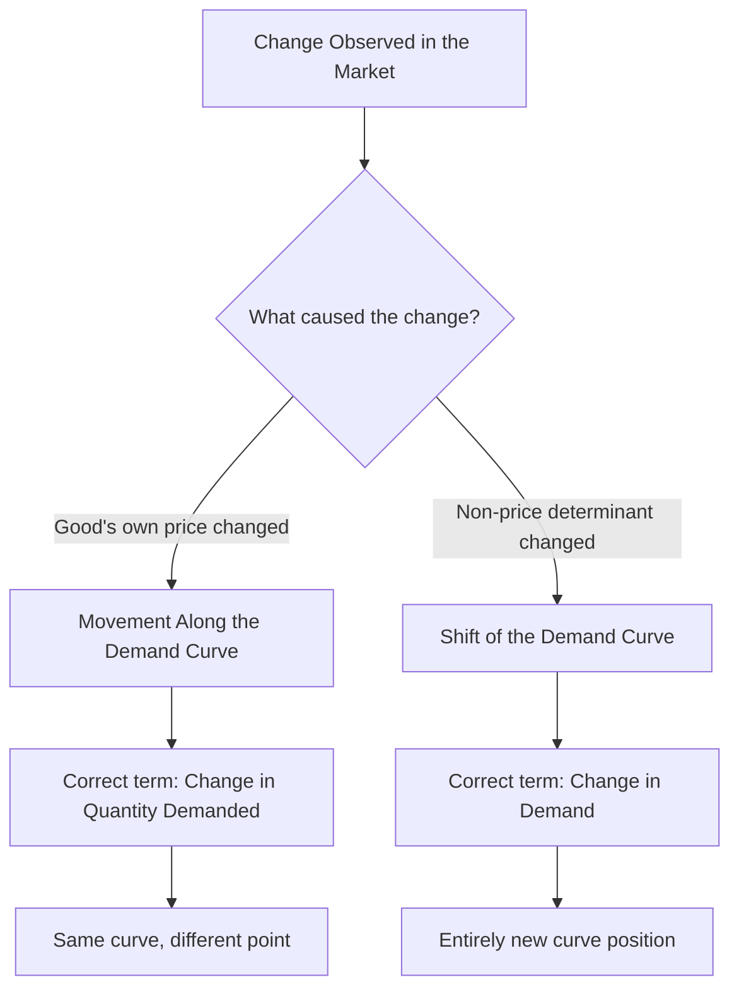

## Movements Along vs Shifts of the Demand Curve

### Definition and Core Concept

This topic addresses the critical analytical distinction between two fundamentally different types of changes that can affect quantity demanded in a market: a **movement along the demand curve** and a **shift of the demand curve**. Correctly distinguishing between these two is essential for accurate microeconomic analysis and is one of the most frequently misunderstood or misapplied concepts at the introductory level.

**Key Points**

- A **movement along** the demand curve is caused *only* by a change in the good's **own price**, holding all other determinants constant.
- A **shift of** the demand curve is caused by a change in any **non-price determinant** of demand (income, prices of related goods, tastes, expectations, number of buyers).
- These two effects are conceptually and graphically distinct, even though both ultimately affect the quantity of a good bought and sold in a market.

### Movement Along the Demand Curve (Change in Quantity Demanded)

A **movement along the demand curve** occurs when the price of the good itself changes, causing a corresponding change in the quantity demanded, while the underlying demand relationship (the curve itself) remains fixed.

- A **decrease in price** causes a movement **downward and to the right** along the curve → an **increase in quantity demanded** (a "extension of demand" in some textbook terminology).
- An **increase in price** causes a movement **upward and to the left** along the curve → a **decrease in quantity demanded** (a "contraction of demand").

**Key Points**

- The correct terminology is "change in **quantity demanded**," not "change in demand," when referring to a price-induced movement along a fixed curve.
- Movement along the curve reflects the law of demand in action — no external factors are changing, only the price-quantity combination observed.

### Shift of the Demand Curve (Change in Demand)

A **shift of the demand curve** occurs when a non-price determinant of demand changes, causing the entire curve to move to a new position — meaning that at **every** price level, a different quantity is now demanded.

- An **increase in demand** shifts the curve **rightward** (more is demanded at every price).
- A **decrease in demand** shifts the curve **leftward** (less is demanded at every price).

**Key Points**

- The correct terminology is "change in **demand**," not "change in quantity demanded," when referring to a shift caused by a non-price factor.
- The determinants that cause shifts include: income, prices of substitutes/complements, tastes and preferences, expectations, and the number of buyers (see Determinants of Demand).

### Side-by-Side Graphical Comparison

<svg xmlns="http://www.w3.org/2000/svg" viewBox="0 0 620 420" font-family="sans-serif">
<text x="310" y="24" font-size="15" font-weight="bold" text-anchor="middle">Movement Along vs. Shift of the Demand Curve (svg_diagram)</text>

<text x="150" y="50" font-size="13" font-weight="bold" text-anchor="middle">Movement Along Curve</text>

<line x1="60" y1="340" x2="60" y2="70" stroke="black" stroke-width="2" />

<line x1="60" y1="340" x2="270" y2="340" stroke="black" stroke-width="2" />

<text x="30" y="80" font-size="11">Price</text>

<text x="235" y="360" font-size="11">Qty</text>

<line x1="80" y1="90" x2="250" y2="320" stroke="#1f77b4" stroke-width="3" />
<text x="190" y="150" font-size="11" fill="#1f77b4">D (fixed)</text>
<circle cx="130" cy="180" r="5" fill="#d62728" />
<text x="138" y="175" font-size="10">A (P high)</text>
<circle cx="190" cy="260" r="5" fill="#d62728" />
<text x="198" y="275" font-size="10">B (P low)</text>
<line x1="130" y1="180" x2="190" y2="260" stroke="#d62728" stroke-width="1.5" stroke-dasharray="3,3" />

<text x="470" y="50" font-size="13" font-weight="bold" text-anchor="middle">Shift of Curve</text>

<line x1="360" y1="340" x2="360" y2="70" stroke="black" stroke-width="2" />

<line x1="360" y1="340" x2="580" y2="340" stroke="black" stroke-width="2" />

<text x="330" y="80" font-size="11">Price</text>

<text x="545" y="360" font-size="11">Qty</text>

<line x1="380" y1="120" x2="500" y2="320" stroke="#1f77b4" stroke-width="3" />
<text x="430" y="150" font-size="11" fill="#1f77b4">D0</text>
<line x1="430" y1="120" x2="560" y2="320" stroke="#2ca02c" stroke-width="3" stroke-dasharray="6,3" />
<text x="500" y="150" font-size="11" fill="#2ca02c">D1</text>
<line x1="380" y1="240" x2="430" y2="240" stroke="#333" stroke-width="1.5" marker-end="url(#arrowshift)" />
</svg>

### Summary Comparison Table

| Feature | Movement Along Curve | Shift of Curve |
| --- | --- | --- |
| Cause | Change in own price | Change in a non-price determinant |
| Terminology | Change in quantity demanded | Change in demand |
| Curve position | Fixed (unchanged) | Moves to a new position |
| Direction described by | Movement up/down the *same* curve | Movement of the *entire* curve left/right |
| Example trigger | Price of coffee rises | Consumer income rises (coffee is normal good) |

### Worked Example: Distinguishing the Two Effects

**Example**

Consider the market for umbrellas.

**Scenario 1 (Movement along the curve)**: A store raises the price of umbrellas from $10 to $15. Consumers respond by buying fewer umbrellas at the higher price. This is a **movement along** the existing demand curve — a decrease in **quantity demanded** caused directly by the price change, with the underlying demand curve itself unchanged.

**Scenario 2 (Shift of the curve)**: A week of heavy, unexpected rainstorms increases consumers' desire for umbrellas at every price point (a change in expectations/immediate need). This is a **shift** of the entire demand curve to the right — an **increase in demand**, since more umbrellas are now demanded at the *original* $10 price, as well as at every other price level.

If both events occurred simultaneously (a price increase to $15 *and* a rainstorm-driven demand increase), the market would experience both an upward movement along the *new*, shifted curve and a rightward shift of the curve itself — illustrating how the two effects can combine in real-world markets, though they remain conceptually distinct forces.

### Common Errors to Avoid

**Key Points**

- **Error**: Saying "demand increased" when a price decrease causes more units to be purchased. **Correction**: This is an increase in **quantity demanded** (movement along the curve), not an increase in demand, since no non-price determinant changed.
- **Error**: Drawing a new, separate demand curve to represent a price change. **Correction**: A price change should be represented as a **different point on the same curve**, not a new curve.
- **Error**: Assuming a shift in demand must be caused by the good's own price. **Correction**: By definition, shifts are caused *only* by non-price determinants; the good's own price is captured *within* the existing curve, not as a shift factor.

### Why the Distinction Matters Analytically

**Key Points**

- Confusing the two effects leads to incorrect predictions about market outcomes — for instance, mistakenly attributing a price-driven change in quantity to a change in underlying consumer demand (or vice versa) can lead to flawed business or policy conclusions.
- In supply and demand equilibrium analysis, movements along the demand curve occur as the market adjusts toward equilibrium (in response to a supply shift, for example), while shifts of the demand curve represent a genuinely new equilibrium relationship between price and quantity.
- This distinction parallels the equivalent movement-vs-shift distinction that applies on the supply side of the market (movement along the supply curve vs. shift of the supply curve), reflecting the general principle that a curve's own-axis variable causes movement, while all other variables cause shifts.

### Related Topics

- Law of Demand and the Demand Curve
- Determinants of Demand
- Movements Along vs Shifts of the Supply Curve
- Market Equilibrium: Supply and Demand
- Price Elasticity of Demand
- Comparative Statics in Market Analysis