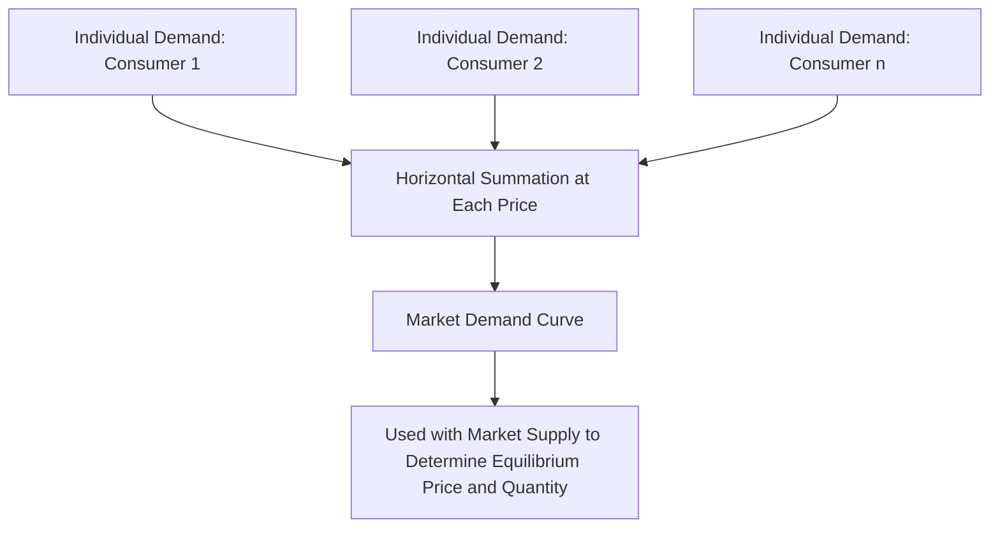

## Individual vs Market Demand

### Definition and Core Concept

**Individual demand** refers to the quantity of a good or service that a single consumer is willing and able to purchase at various price levels, given that consumer's own income, preferences, and budget constraint. **Market demand** refers to the total quantity of a good or service that **all** consumers in a market are collectively willing and able to purchase at various price levels — obtained by aggregating individual demand across every buyer in the market.

**Key Points**

- Market demand is derived directly from individual demand through horizontal summation, not by averaging.
- Both individual and market demand curves typically slope downward, consistent with the law of demand, though the underlying reasons and magnitudes can differ across consumers.
- The distinction matters because market outcomes (equilibrium price and quantity) are determined by market demand and market supply, while individual demand explains the behavior of a single consumer within that market.

### From Individual Demand to Market Demand: Horizontal Summation

Market demand at any given price is calculated by summing the quantities demanded by **each individual consumer** at that specific price — this process is called **horizontal summation** because it involves adding quantities (the horizontal axis) at each price level (the vertical axis), rather than adding prices.

$$Q_D^{\text{market}}(P) = \sum_{i=1}^{n} Q_D^{i}(P)$$

where $Q_D^{i}(P)$ is the quantity demanded by individual consumer $i$ at price $P$.

**Example**

Suppose a market has only two consumers, A and B, with the following individual demand schedules for coffee:

| Price ($) | $Q_D$ Consumer A | $Q_D$ Consumer B | Market $Q_D$ (A + B) |
| --- | --- | --- | --- |
| 5 | 2 | 1 | 3 |
| 4 | 4 | 2 | 6 |
| 3 | 6 | 4 | 10 |
| 2 | 8 | 6 | 14 |

At each price, the market quantity demanded is simply the sum of the individual quantities demanded — $4 produces market demand of $4 + 2 = 6$ units, for example.

### Graphical Illustration: Horizontal Summation

<svg xmlns="http://www.w3.org/2000/svg" viewBox="0 0 620 400" font-family="sans-serif">
<text x="310" y="24" font-size="15" font-weight="bold" text-anchor="middle">Horizontal Summation: Individual to Market Demand (svg_diagram)</text>

<text x="110" y="50" font-size="12" font-weight="bold" text-anchor="middle">Consumer A</text>

<line x1="50" y1="330" x2="50" y2="70" stroke="black" stroke-width="1.5" />

<line x1="50" y1="330" x2="200" y2="330" stroke="black" stroke-width="1.5" />

<line x1="60" y1="100" x2="180" y2="310" stroke="`#1f77b4`" stroke-width="2.5" />

<text x="225" y="200" font-size="20" text-anchor="middle">+</text>

<text x="330" y="50" font-size="12" font-weight="bold" text-anchor="middle">Consumer B</text>

<line x1="270" y1="330" x2="270" y2="70" stroke="black" stroke-width="1.5" />

<line x1="270" y1="330" x2="420" y2="330" stroke="black" stroke-width="1.5" />

<line x1="280" y1="130" x2="380" y2="310" stroke="`#2ca02c`" stroke-width="2.5" />

<text x="445" y="200" font-size="20" text-anchor="middle">=</text>

<text x="540" y="50" font-size="12" font-weight="bold" text-anchor="middle">Market Demand</text>

<line x1="480" y1="330" x2="480" y2="70" stroke="black" stroke-width="1.5" />

<line x1="480" y1="330" x2="610" y2="330" stroke="black" stroke-width="1.5" />

<line x1="490" y1="100" x2="600" y2="310" stroke="`#d62728`" stroke-width="3" />

</svg>

**Key Points**

- The **market demand curve** is generally flatter (more elastic in absolute terms, though this depends on units) and extends further along the quantity axis than any single individual's demand curve, since it aggregates quantities across all buyers.
- Horizontal summation only combines quantities where individuals actually demand a positive amount; a consumer with zero demand at a given price contributes zero to the total at that price, which can cause "kinks" in the market demand curve where additional consumers enter the market as price falls.

### Determinants of Individual vs. Market Demand

| Level | Determinants |
| --- | --- |
| Individual demand | Individual income, individual tastes/preferences, prices of substitutes/complements relevant to that consumer, individual expectations |
| Market demand | All individual-level determinants, **plus** the number of buyers/consumers in the market (population size, market entry of new consumer segments) |

**Key Points**

- The **number of buyers** is a determinant that is meaningful specifically at the market level (it has no analog at the individual level, since an individual demand curve represents just one consumer by definition).
- A change affecting all consumers similarly (e.g., an economy-wide income increase for a normal good) shifts both individual demand curves and, correspondingly, the aggregate market demand curve.
- A change affecting only some consumers (e.g., a tax rebate targeted at low-income households) may shift only a subset of individual demand curves, producing a market-level shift that reflects the weighted impact of the affected group.

### Why the Distinction Matters

**Key Points**

- **Market equilibrium** (price and quantity) is determined by the interaction of **market** demand and **market** supply — individual demand curves are a building block, not the direct determinant of the market price.
- **Price discrimination and market segmentation** strategies used by firms rely on understanding differences in individual demand curves (e.g., different consumer groups' willingness to pay) even though firms often set a single market price.
- **Consumer surplus** can be calculated at both the individual level (area under an individual's demand curve above market price) and the market level (area under the market demand curve above market price, summed across all consumers) — the market-level measure is the aggregate of all individual consumer surpluses.

### Consumer Surplus: Individual and Aggregate

**Consumer surplus** is the difference between what a consumer is willing to pay (as reflected by the demand curve) and what they actually pay (the market price).

$$CS = \int_{0}^{Q^*} [P_D(Q) - P^*] \, dQ$$

At the individual level, this reflects the surplus a single consumer receives; summed across all consumers in the market (i.e., calculated using the market demand curve), it reflects total consumer surplus in that market.

**Example**

If Consumer A is willing to pay up to $8 for a good, and the market price is $5, Consumer A's individual surplus on that unit is $3. If Consumer B is willing to pay only $6 for the same unit, their surplus is $1. Total consumer surplus at the market level aggregates all such individual surpluses across every unit purchased by every consumer.

### Heterogeneity Among Consumers

Real-world markets typically feature significant heterogeneity in individual demand — different consumers have different income levels, tastes, and price sensitivities, meaning individual demand curves within the same market can differ substantially in slope (price sensitivity) and position (willingness to pay).

**Key Points**

- This heterogeneity is the basis for **price discrimination** strategies, where firms attempt to charge different prices to different consumer segments based on differing willingness to pay (reflected in differing individual demand).
- Market demand, as an aggregate, smooths over this individual-level heterogeneity, making it a useful tool for market-level analysis but insufficient on its own for understanding distributional or segment-specific effects.
- [Inference: the extent to which individual-level heterogeneity meaningfully affects aggregate market outcomes, versus washing out in the aggregate, depends on the specific market and the degree of heterogeneity present, and cannot be generalized as uniformly significant or insignificant across all markets.]

### Related Topics

- Law of Demand and the Demand Curve
- Determinants of Demand
- Consumer Surplus and Willingness to Pay
- Price Discrimination
- Market Equilibrium: Supply and Demand
- Consumer Choice Theory and Utility Maximization