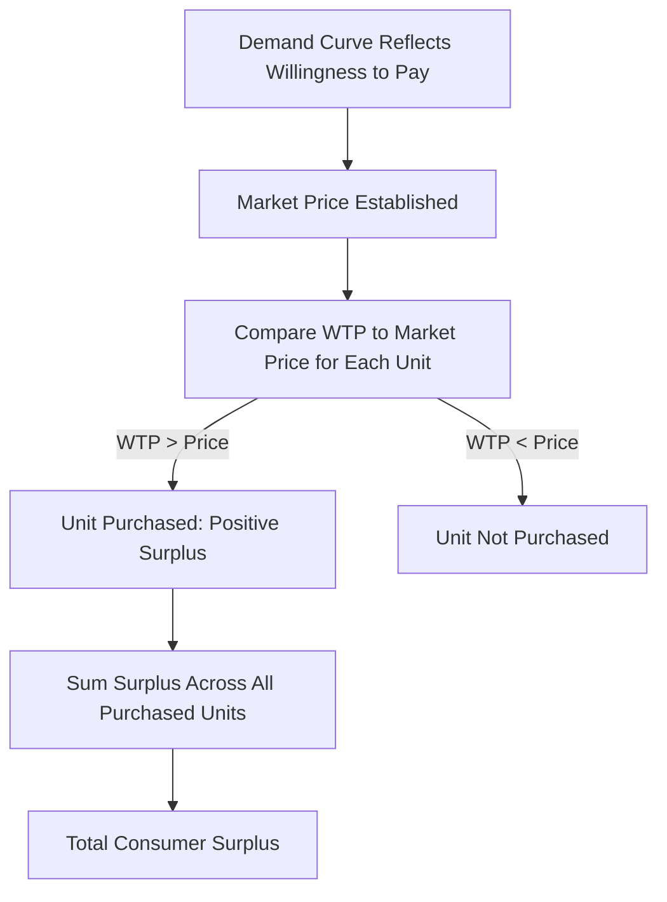

## Consumer Surplus

### Definition and Core Concept

**Consumer surplus** is the economic measure of the net benefit consumers receive from participating in a market, defined as the difference between the maximum price a consumer is **willing to pay** for a good (their **willingness to pay**, reflected by the demand curve) and the price they **actually pay** (the market price).

At the individual level, consumer surplus represents the "extra" value a consumer gains on units they would have paid more for. At the market level, it represents the aggregate net benefit to all consumers in a market from being able to purchase at the prevailing market price rather than their individual maximum willingness to pay.

**Key Points**

- Consumer surplus is a key measure of consumer welfare in microeconomics.
- It is derived directly from the demand curve, which reflects consumers' marginal willingness to pay for successive units of a good.
- Consumer surplus is typically measured graphically as the area between the demand curve and the market price, up to the equilibrium quantity.

### Formal Definition

For a single unit, consumer surplus is:

$$CS_{\text{unit}} = P_{\text{willing to pay}} - P_{\text{market}}$$

For the entire market, total consumer surplus is the sum (or integral, in continuous terms) of this difference across all units purchased, up to the equilibrium quantity $Q^*$:

$$CS = \int_{0}^{Q^*} [P_D(Q) - P^*] \, dQ$$

where $P_D(Q)$ is the inverse demand function (price as a function of quantity) and $P^*$ is the market equilibrium price.

### Graphical Representation

Consumer surplus is represented graphically as the area of the triangle (or more complex shape, for non-linear demand) bounded above by the demand curve, below by the horizontal market price line, and to the right by the vertical line at the equilibrium quantity.

<svg xmlns="http://www.w3.org/2000/svg" viewBox="0 0 540 400" font-family="sans-serif">
<text x="270" y="24" font-size="15" font-weight="bold" text-anchor="middle">Consumer Surplus (svg_diagram)</text>
<line x1="80" y1="340" x2="80" y2="50" stroke="black" stroke-width="2" />
<line x1="80" y1="340" x2="480" y2="340" stroke="black" stroke-width="2" />
<text x="30" y="55" font-size="12">Price</text>
<text x="440" y="365" font-size="12">Quantity</text>

<line x1="90" y1="80" x2="450" y2="320" stroke="#1f77b4" stroke-width="3" />
<text x="380" y="150" font-size="12" fill="#1f77b4">D</text>

<line x1="80" y1="220" x2="290" y2="220" stroke="#333" stroke-width="1.5" stroke-dasharray="4,4" />
<text x="40" y="225" font-size="11">P*</text>

<line x1="290" y1="220" x2="290" y2="340" stroke="#333" stroke-width="1.5" stroke-dasharray="4,4" />
<text x="285" y="358" font-size="11">Q*</text>

<polygon points="80,220 290,220 130,90" fill="#a8d0f0" fill-opacity="0.6" stroke="none" />
<text x="140" y="180" font-size="12" font-weight="bold">Consumer Surplus</text>
</svg>

### Worked Numerical Example

**Example**

Suppose the market demand curve for a good is linear: $P = 20 - 0.5Q$, and the market equilibrium price is $P^* = \$10$.

**Step 1: Find equilibrium quantity**

$$10 = 20 - 0.5Q \implies Q^* = 20$$

**Step 2: Find the maximum willingness to pay (vertical intercept)**

When $Q = 0$: $P = 20$ — this represents the highest price any consumer is willing to pay for the very first unit.

**Step 3: Calculate consumer surplus as the area of the triangle**

$$CS = \frac{1}{2} \times \text{base} \times \text{height} = \frac{1}{2} \times Q^* \times (P_{\text{max}} - P^*) = \frac{1}{2} \times 20 \times (20 - 10) = \$100$$

Total consumer surplus in this market is $100.

### Discrete Example: Individual Units

**Example**

| Unit | Willingness to Pay ($) | Market Price ($) | Surplus per Unit ($) |
| --- | --- | --- | --- |
| 1st | 12 | 8 | 4 |
| 2nd | 10 | 8 | 2 |
| 3rd | 8 | 8 | 0 |
| 4th | 6 | 8 | Not purchased |

The consumer purchases units up to the point where willingness to pay equals market price (the 3rd unit, where surplus reaches zero); the 4th unit is not purchased since its value to the consumer ($6) is below the market price ($8). Total surplus for this individual is $4 + 2 + 0 = \$6$.

### Effect of Price Changes on Consumer Surplus

Changes in market price directly affect the magnitude of consumer surplus, and this relationship is central to welfare analysis of taxes, subsidies, and price controls.

- **Price decrease**: Consumer surplus increases — both because existing consumers pay less on units they already purchased, and because new consumers enter the market at the lower price.
- **Price increase**: Consumer surplus decreases — for the same reasons in reverse.

<svg xmlns="http://www.w3.org/2000/svg" viewBox="0 0 540 400" font-family="sans-serif">
<text x="270" y="24" font-size="15" font-weight="bold" text-anchor="middle">Change in Consumer Surplus from a Price Decrease (svg_diagram)</text>
<line x1="80" y1="340" x2="80" y2="50" stroke="black" stroke-width="2" />
<line x1="80" y1="340" x2="480" y2="340" stroke="black" stroke-width="2" />
<text x="30" y="55" font-size="12">Price</text>
<text x="440" y="365" font-size="12">Quantity</text>
<line x1="90" y1="80" x2="450" y2="320" stroke="#1f77b4" stroke-width="3" />

<line x1="80" y1="200" x2="240" y2="200" stroke="#333" stroke-dasharray="4,4" />
<text x="40" y="205" font-size="11">P1</text>
<line x1="240" y1="200" x2="240" y2="340" stroke="#333" stroke-dasharray="4,4" />

<line x1="80" y1="250" x2="320" y2="250" stroke="#333" stroke-dasharray="4,4" />
<text x="40" y="255" font-size="11">P2</text>
<line x1="320" y1="250" x2="320" y2="340" stroke="#333" stroke-dasharray="4,4" />

<polygon points="80,200 240,200 120,90" fill="#a8d0f0" fill-opacity="0.7" stroke="none" />
<text x="120" y="150" font-size="10">Original CS</text>

<polygon points="80,200 240,200 320,250 240,250" fill="#7fd67f" fill-opacity="0.7" stroke="none" />
<text x="180" y="235" font-size="10">Added CS</text>
</svg>

### Consumer Surplus and Elasticity

**Key Points**

- The magnitude of consumer surplus, and how it responds to price changes, is closely related to the **price elasticity of demand**.
- For a relatively **inelastic** demand curve (steep), consumer surplus tends to be larger relative to a given quantity, since consumers have a high willingness to pay well above the market price for many units.
- For a relatively **elastic** demand curve (flat), consumer surplus tends to be smaller relative to the same quantity, since consumer willingness to pay is closer to the market price throughout.

### Applications: Welfare Analysis

Consumer surplus is a central tool in **welfare economics**, used to evaluate the impact of market interventions and market structures on consumer well-being.

| Policy/Event | Typical Effect on Consumer Surplus |
| --- | --- |
| Price ceiling (below equilibrium) | Ambiguous: existing buyers who get the good gain surplus, but shortages/rationing may reduce total quantity available, and some consumers who wanted the good cannot obtain it |
| Price floor (above equilibrium) | Decreases, since price rises above equilibrium and quantity purchased falls |
| Tax on the good | Decreases, as the price paid by consumers rises and quantity falls |
| Subsidy on the good | Increases, as the effective price paid by consumers falls and quantity rises |
| Increase in market competition | Generally increases, as increased competition tends to lower prices |
| Monopoly pricing (vs. competitive) | Decreases relative to a competitive market, since a monopolist typically restricts output and charges a higher price |

**Key Points**

- Total surplus (consumer surplus + producer surplus) is the standard measure of overall market efficiency used to evaluate **deadweight loss** from taxes, price controls, and market power.
- Consumer surplus is a partial welfare measure — it does not capture producer welfare, government revenue effects, or externalities, all of which must be incorporated for a complete welfare analysis.

### Deadweight Loss and Consumer Surplus

When a market deviates from competitive equilibrium (due to taxes, price controls, or monopoly), part of the consumer surplus (and producer surplus) that would have existed at equilibrium is lost entirely rather than transferred — this lost surplus is called **deadweight loss**, representing a loss of overall economic efficiency.

$$\text{Total Surplus (competitive equilibrium)} = CS + PS$$

$$\text{Total Surplus (with distortion)} = CS' + PS' + \text{Tax Revenue (if applicable)}$$

$$\text{Deadweight Loss} = \text{Total Surplus (competitive)} - \text{Total Surplus (with distortion)}$$

### Limitations of Consumer Surplus as a Welfare Measure

- **Assumes demand curve accurately reflects welfare**: Consumer surplus calculations assume that the demand curve is an accurate reflection of true marginal benefit/willingness to pay, which relies on the standard rational-consumer assumptions of microeconomic theory. [Inference: the accuracy of demand-curve-based welfare measures in capturing real subjective well-being is a subject of ongoing debate in behavioral and welfare economics, rather than an uncontested empirical fact.]
- **Distributional neutrality**: Consumer surplus as an aggregate measure does not account for *how* the surplus is distributed among different consumers (e.g., whether gains accrue mostly to high-income or low-income consumers), a limitation relevant to normative policy evaluation.
- **Ignores externalities**: Standard consumer surplus calculations, based on private demand curves, do not capture external costs or benefits to third parties not reflected in individual willingness to pay.

### Related Topics

- Law of Demand and the Demand Curve
- Individual vs Market Demand
- Producer Surplus
- Deadweight Loss and Market Efficiency
- Price Elasticity of Demand
- Price Ceilings and Price Floors
- Welfare Economics and Pareto Efficiency