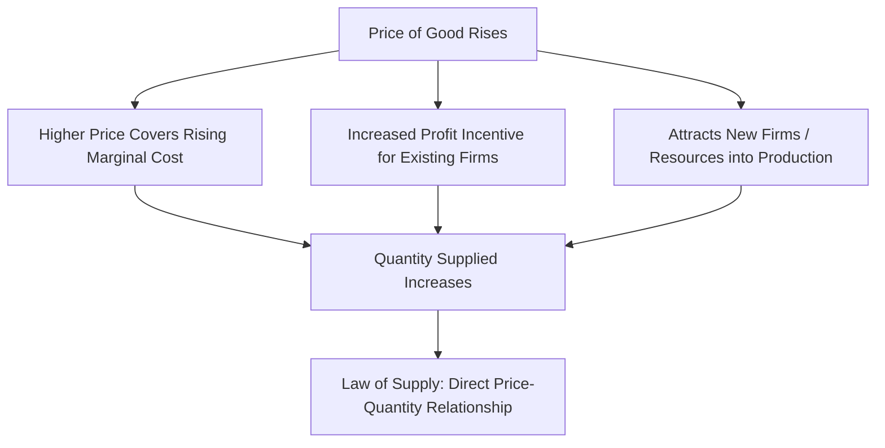

## Law of Supply and the Supply Curve

### Definition and Core Concept

The **law of supply** states that, ceteris paribus (all other factors held constant), there is a **direct (positive) relationship** between the price of a good and the quantity supplied of that good: as price rises, quantity supplied rises; as price falls, quantity supplied falls.

The **supply curve** is the graphical representation of this relationship, plotting the quantity supplied of a good against its price, holding all other determinants of supply constant.

**Key Points**

- The law of supply describes a positive (direct) relationship between price and quantity supplied.
- The supply curve slopes upward from left to right, reflecting this direct relationship.
- "Supply" refers to the entire relationship (the whole curve/schedule), while "quantity supplied" refers to a specific amount at a specific price — paralleling the demand-side terminological distinction.

### The Supply Schedule and Supply Curve

A **supply schedule** is a table showing the quantity supplied of a good at various price points, which can be plotted to form the supply curve.

**Example**

| Price ($) | Quantity Supplied (units/week) |
| --- | --- |
| 2 | 10 |
| 4 | 30 |
| 6 | 50 |
| 8 | 70 |
| 10 | 90 |

Plotting these points with price on the vertical axis and quantity on the horizontal axis produces an upward-sloping supply curve.

<svg xmlns="http://www.w3.org/2000/svg" viewBox="0 0 520 400" font-family="sans-serif">
<text x="260" y="24" font-size="15" font-weight="bold" text-anchor="middle">The Supply Curve (svg_diagram)</text>
<line x1="80" y1="340" x2="80" y2="50" stroke="black" stroke-width="2" />
<line x1="80" y1="340" x2="460" y2="340" stroke="black" stroke-width="2" />
<text x="30" y="55" font-size="12">Price ($)</text>
<text x="420" y="365" font-size="12">Quantity</text>

<line x1="110" y1="320" x2="430" y2="80" stroke="#d62728" stroke-width="3" />
<text x="330" y="150" font-size="13" fill="#d62728" font-weight="bold">S (Supply Curve)</text>

<circle cx="150" cy="280" r="4" fill="#333" />
<circle cx="220" cy="230" r="4" fill="#333" />
<circle cx="290" cy="180" r="4" fill="#333" />
<circle cx="360" cy="130" r="4" fill="#333" />
</svg>

### Why the Supply Curve Slopes Upward

Several economic explanations account for the direct (positive) price-quantity relationship on the supply side:

#### Increasing Marginal Cost of Production

As firms increase output, they typically encounter **rising marginal costs** (due to the law of diminishing marginal returns in the short run, or the need to use progressively less efficient resources). Firms will only be willing to supply additional units if the price received covers this rising marginal cost — hence, higher prices are needed to induce higher quantities supplied.

$$\text{Profit-maximizing supply decision: } P = MC \text{ (in perfect competition)}$$

#### Profit Incentive

Higher prices, holding costs constant, increase the profitability of producing and selling additional units, incentivizing existing firms to increase output and potentially attracting new firms into the market (in the long run).

#### Opportunity Cost of Resources

As a firm or industry expands output of a particular good, it must draw resources away from alternative uses. The opportunity cost of these resources tends to rise as increasingly less-suited resources are drawn into production, requiring a higher price to justify the expanded output — mirroring the increasing opportunity cost logic seen in the Production Possibilities Frontier.

### Movement Along the Supply Curve vs. Shift of the Supply Curve

| Concept | Cause | Effect |
| --- | --- | --- |
| Movement along the curve (change in quantity supplied) | Change in the good's own price | Moves to a different point on the *same* supply curve |
| Shift of the curve (change in supply) | Change in a non-price determinant of supply | Entire curve shifts left (decrease) or right (increase) |

**Key Points**

- A change in the price of the good itself causes a movement **along** a fixed supply curve — this is a change in **quantity supplied**.
- A change in any other determinant of supply (input costs, technology, number of sellers, prices of related goods in production, expectations, taxes/subsidies) causes the **entire curve to shift** — this is a change in **supply**.

<svg xmlns="http://www.w3.org/2000/svg" viewBox="0 0 540 400" font-family="sans-serif">
<text x="270" y="24" font-size="15" font-weight="bold" text-anchor="middle">Movement Along vs. Shift of Supply Curve (svg_diagram)</text>
<line x1="80" y1="340" x2="80" y2="50" stroke="black" stroke-width="2" />
<line x1="80" y1="340" x2="480" y2="340" stroke="black" stroke-width="2" />
<text x="30" y="55" font-size="12">Price</text>
<text x="440" y="365" font-size="12">Quantity</text>

<line x1="110" y1="310" x2="420" y2="90" stroke="#d62728" stroke-width="3" />
<text x="330" y="150" font-size="12" fill="#d62728">S1 (Original)</text>

<line x1="150" y1="310" x2="460" y2="90" stroke="#2ca02c" stroke-width="3" stroke-dasharray="6,3" />
<text x="390" y="200" font-size="12" fill="#2ca02c">S2 (Increase in Supply)</text>
</svg>

### Determinants of Supply (Non-Price Factors That Shift the Curve)

| Determinant | Effect of a Favorable Change | Example |
| --- | --- | --- |
| Input/factor prices | Supply shifts right (increases) if input costs fall | Falling wages decrease production costs, increasing supply |
| Technology | Supply shifts right as technology improves | A new manufacturing process lowers per-unit cost, increasing supply |
| Number of sellers | Supply shifts right as more firms enter | New firms entering an industry increase total market supply |
| Prices of related goods (production) | Supply of good X shifts left if a more profitable alternative good becomes available | Farmland shifted from wheat to more profitable corn reduces wheat supply |
| Expectations of future prices | Supply shifts left today if a higher price is expected in the future | Producers withhold current output expecting higher future prices |
| Taxes | Supply shifts left (decreases), as taxes raise effective production costs | An excise tax on a good reduces the quantity supplied at every price |
| Subsidies | Supply shifts right (increases), as subsidies lower effective production costs | A government subsidy for renewable energy increases its supply |

### Individual Supply vs. Market Supply

- **Individual supply**: The supply curve of a single firm, reflecting that firm's cost structure and production capacity.
- **Market supply**: The horizontal summation of all individual firm supply curves in a market at each price point, representing total quantity supplied by all firms combined.

$$Q_S^{\text{market}} = \sum_i Q_S^{i}$$

### The Supply Curve and Marginal Cost

In a perfectly competitive market, a firm's **short-run supply curve** corresponds to the portion of its **marginal cost curve** that lies above the minimum of its average variable cost curve — since a competitive, profit-maximizing firm produces where $P = MC$, the MC curve directly determines how much the firm is willing to supply at each price.

$$\text{Firm's short-run supply curve} = MC \text{ curve (above shutdown point)}$$

### Time Horizon and Elasticity of Supply

**Key Points**

- **Short run**: At least one factor of production (typically capital) is fixed, limiting how much firms can adjust output in response to price changes — supply tends to be relatively less elastic (less responsive to price).
- **Long run**: All factors of production are variable, including plant size and the number of firms in the industry — supply tends to be relatively more elastic, as firms have greater flexibility to expand or contract production and new firms can enter or exit.
- This time-horizon distinction parallels how price elasticity of supply is typically discussed in relation to production flexibility (see Price Elasticity of Supply).

### Exceptions and Special Cases

- **Perfectly inelastic supply**: A vertical supply curve, where quantity supplied does not change regardless of price — typical of goods with fixed, non-reproducible supply in the very short run (e.g., original artwork, land in a specific location, tickets to a one-time event).
- **Perfectly elastic supply**: A horizontal supply curve, where firms are willing to supply any quantity at a single fixed price — a theoretical extreme, more plausible as an approximation in certain long-run competitive market conditions with constant costs.
- **Backward-bending labor supply curve**: In labor markets specifically, the supply curve for labor can bend backward at high wage levels, as the income effect of higher wages (valuing leisure more) can eventually outweigh the substitution effect (working more at a higher wage) — a notable exception to the standard upward-sloping supply curve, discussed in more depth in labor market economics.

### Supply Elasticity: A Related Concept

While the law of supply establishes the *direction* of the price-quantity relationship, **price elasticity of supply** measures the *magnitude* of producers' responsiveness to price changes:

$$E_S = \frac{\% \Delta Q_S}{\% \Delta P}$$

This concept, covered in depth separately, builds directly on the supply curve framework established here and is heavily influenced by the time horizon (short run vs. long run) available for producers to adjust.

### Related Topics

- Determinants of Supply
- Movements Along vs Shifts of the Supply Curve
- Price Elasticity of Supply
- Producer Surplus
- Marginal Cost and the Firm's Supply Decision
- Market Equilibrium: Supply and Demand
- Short Run vs Long Run in Production