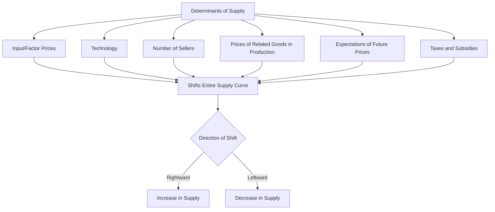

## Determinants of Supply

### Definition and Core Concept

The **determinants of supply** (also called **supply shifters**) are the non-price factors that influence how much of a good or service producers are willing and able to offer for sale at every price level. While the law of supply describes the relationship between a good's own price and quantity supplied (holding other factors constant), the determinants of supply are precisely those "other factors" — and a change in any of them causes the **entire supply curve to shift**, rather than causing movement along a fixed curve.

**Key Points**

- A change in a determinant of supply changes **supply** (the whole curve/relationship), as distinct from a change in the good's own price, which changes **quantity supplied** (a movement along a fixed curve).
- An increase in supply shifts the curve rightward (more is supplied at every price); a decrease in supply shifts the curve leftward (less is supplied at every price).
- The standard determinants are often summarized by the mnemonic **SPENT**: Subsidies/taxes, Prices of related goods (in production), Expectations, Number of sellers, Technology (and input/factor prices).

### The Core Determinants of Supply

#### 1. Input (Factor) Prices

The cost of resources used in production — labor, raw materials, capital, land — directly affects a firm's marginal and average costs, and thus its willingness to supply at any given price.

| Change in Input Price | Effect on Supply |
| --- | --- |
| Input prices rise | Supply decreases (shifts left) — production becomes more costly |
| Input prices fall | Supply increases (shifts right) — production becomes cheaper |

**Example**

If the price of steel (a key input) rises, automobile manufacturers face higher production costs, reducing the quantity of automobiles they are willing to supply at every price level — the automobile supply curve shifts left.

#### 2. Technology

Improvements in production technology allow firms to produce the same output using fewer resources, or greater output using the same resources, effectively lowering per-unit production costs.

**Example**

The introduction of automated assembly line robotics in manufacturing has historically lowered the marginal cost of production, shifting supply curves to the right (increasing supply) in affected industries.

#### 3. Number of Sellers (Producers)

An increase in the number of firms/producers in a market increases market supply at every price level, since more total capacity exists to produce the good.

**Example**

The entry of new coffee shops into a city increases the total market supply of coffee, shifting the market supply curve rightward, independent of any change in individual firms' costs or technology.

#### 4. Prices of Related Goods (in Production)

Firms often can produce multiple different goods using the same or similar resources. If the price of an **alternative good** that a producer could make with the same resources rises, the producer has an incentive to shift production toward that more profitable good, reducing supply of the original good.

**Example**

If the price of corn rises sharply relative to wheat, farmers with land suitable for either crop have an incentive to shift acreage from wheat to corn, decreasing the supply of wheat (a leftward shift) even though nothing about wheat's own price or cost of production has changed.

#### 5. Expectations of Future Prices

If producers expect the price of a good to rise in the future, they may withhold some current supply (reducing supply today) in order to sell at the anticipated higher future price — or conversely, increase current supply if they expect prices to fall.

**Example**

An oil producer who expects crude oil prices to rise significantly next quarter may reduce current output (or hold inventory off the market), shifting the current supply curve to the left, in anticipation of higher future revenue per unit.

#### 6. Government Policy: Taxes and Subsidies

| Policy | Effect on Supply |
| --- | --- |
| Excise/production tax | Decreases supply (shifts left) — raises effective cost of production |
| Subsidy | Increases supply (shifts right) — lowers effective cost of production |

**Example**

A government subsidy per unit of solar panel produced effectively lowers the marginal cost borne by solar panel manufacturers, shifting the supply curve for solar panels to the right.

### Graphical Illustration: Shifts of the Supply Curve

<svg xmlns="http://www.w3.org/2000/svg" viewBox="0 0 540 400" font-family="sans-serif">
<text x="270" y="24" font-size="15" font-weight="bold" text-anchor="middle">Increase and Decrease in Supply (svg_diagram)</text>
<line x1="80" y1="340" x2="80" y2="50" stroke="black" stroke-width="2" />
<line x1="80" y1="340" x2="480" y2="340" stroke="black" stroke-width="2" />
<text x="30" y="55" font-size="12">Price</text>
<text x="440" y="365" font-size="12">Quantity</text>

<line x1="150" y1="310" x2="380" y2="90" stroke="#d62728" stroke-width="3" />
<text x="330" y="140" font-size="12" fill="#d62728">S0 (Original)</text>

<line x1="200" y1="310" x2="430" y2="90" stroke="#2ca02c" stroke-width="3" stroke-dasharray="6,3" />
<text x="400" y="200" font-size="12" fill="#2ca02c">S1 (Increase)</text>

<line x1="100" y1="310" x2="330" y2="90" stroke="#1f77b4" stroke-width="3" stroke-dasharray="6,3" />
<text x="110" y="140" font-size="12" fill="#1f77b4">S2 (Decrease)</text>
</svg>

### Distinguishing "Change in Supply" from "Change in Quantity Supplied"

This distinction mirrors the equivalent demand-side distinction and is equally important for accurate analysis.

| Term | Cause | Graphical Effect |
| --- | --- | --- |
| Change in **quantity supplied** | Change in the good's own price | Movement along a fixed supply curve |
| Change in **supply** | Change in any determinant (input prices, technology, number of sellers, related good prices, expectations, taxes/subsidies) | Shift of the entire supply curve |

**Key Points**

- A common error is describing a price-induced increase in output as "an increase in supply" — this is technically an increase in *quantity supplied* (movement along the curve), not a change in supply.
- The determinants of supply are, by definition, all factors *other than* the good's own price.

### Joint Products and Composite Supply (Extended Concepts)

- **Joint supply**: Occurs when producing one good simultaneously produces another good as a byproduct (e.g., beef and leather from cattle); an increase in demand for one joint product tends to increase the supply of the other.
- **Composite supply**: Occurs when a single resource can be used to produce multiple different goods (as in the corn/wheat land example above); an increase in the profitability of producing one good reduces the resources available for producing the other, decreasing its supply.

### Practical Application: Predicting Supply Shifts

**Example**

Suppose the following events occur simultaneously in the market for wheat:

1. A new drought-resistant seed technology is adopted → supply increases (rightward shift)
2. Fertilizer (a key input) prices rise sharply → supply decreases (leftward shift)
3. Government introduces a per-acre subsidy for wheat farmers → supply increases (rightward shift)

As with combined demand shifts, the **net effect** on wheat supply depends on the relative magnitude of these offsetting and reinforcing shifts. Without quantitative data on the size of each effect, only the qualitative *direction* of each individual shift can be stated with confidence — the *combined* net shift requires further information to determine precisely. [Inference: resolving the net direction in such combined-shift scenarios typically requires empirical elasticity or cost data rather than qualitative reasoning alone.]

### Related Topics

- Law of Supply and the Supply Curve
- Movements Along vs Shifts of the Supply Curve
- Price Elasticity of Supply
- Producer Surplus
- Marginal Cost and the Firm's Supply Decision
- Market Equilibrium: Supply and Demand
- Taxes and Subsidies: Market Effects