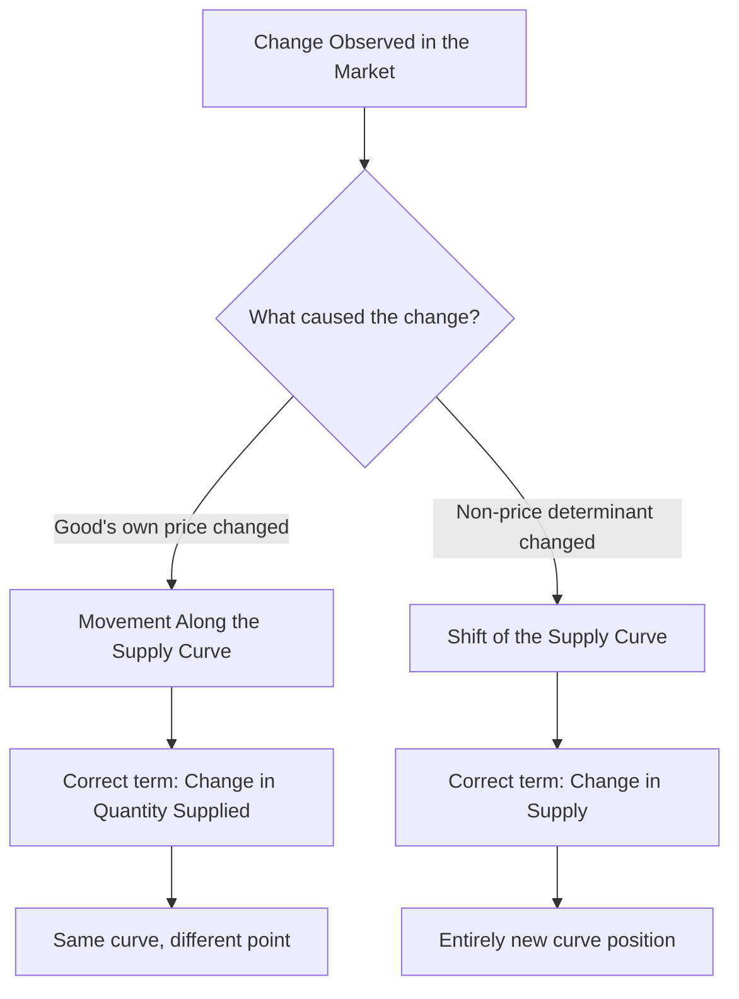

## Movements Along vs Shifts of the Supply Curve

### Definition and Core Concept

This topic addresses the critical analytical distinction between two fundamentally different types of changes that can affect quantity supplied in a market: a **movement along the supply curve** and a **shift of the supply curve**. This distinction directly parallels the equivalent movement-versus-shift distinction on the demand side, and correctly applying it is essential for accurate supply-side analysis.

**Key Points**

- A **movement along** the supply curve is caused *only* by a change in the good's **own price**, holding all other determinants constant.
- A **shift of** the supply curve is caused by a change in any **non-price determinant** of supply (input prices, technology, number of sellers, prices of related goods in production, expectations, taxes/subsidies).
- These two effects are conceptually and graphically distinct, even though both ultimately affect the quantity of a good offered for sale in a market.

### Movement Along the Supply Curve (Change in Quantity Supplied)

A **movement along the supply curve** occurs when the price of the good itself changes, causing a corresponding change in the quantity supplied, while the underlying supply relationship (the curve itself) remains fixed.

- An **increase in price** causes a movement **upward and to the right** along the curve → an **increase in quantity supplied** ("extension of supply").
- A **decrease in price** causes a movement **downward and to the left** along the curve → a **decrease in quantity supplied** ("contraction of supply").

**Key Points**

- The correct terminology is "change in **quantity supplied**," not "change in supply," when referring to a price-induced movement along a fixed curve.
- Movement along the curve reflects the law of supply in action — no external factors are changing, only the price-quantity combination observed, typically driven by firms adjusting output along their existing marginal cost curve.

### Shift of the Supply Curve (Change in Supply)

A **shift of the supply curve** occurs when a non-price determinant of supply changes, causing the entire curve to move to a new position — meaning that at **every** price level, a different quantity is now supplied.

- An **increase in supply** shifts the curve **rightward** (more is supplied at every price).
- A **decrease in supply** shifts the curve **leftward** (less is supplied at every price).

**Key Points**

- The correct terminology is "change in **supply**," not "change in quantity supplied," when referring to a shift caused by a non-price factor.
- The determinants that cause shifts include: input/factor prices, technology, number of sellers, prices of related goods in production, expectations, and taxes/subsidies (see Determinants of Supply).

### Side-by-Side Graphical Comparison

<svg xmlns="http://www.w3.org/2000/svg" viewBox="0 0 620 420" font-family="sans-serif">
<text x="310" y="24" font-size="15" font-weight="bold" text-anchor="middle">Movement Along vs. Shift of the Supply Curve (svg_diagram)</text>

<text x="150" y="50" font-size="13" font-weight="bold" text-anchor="middle">Movement Along Curve</text>

<line x1="60" y1="340" x2="60" y2="70" stroke="black" stroke-width="2" />

<line x1="60" y1="340" x2="270" y2="340" stroke="black" stroke-width="2" />

<text x="30" y="80" font-size="11">Price</text>

<text x="235" y="360" font-size="11">Qty</text>

<line x1="80" y1="320" x2="250" y2="90" stroke="#d62728" stroke-width="3" />
<text x="190" y="150" font-size="11" fill="#d62728">S (fixed)</text>
<circle cx="130" cy="260" r="5" fill="#333" />
<text x="138" y="255" font-size="10">A (P low)</text>
<circle cx="190" cy="180" r="5" fill="#333" />
<text x="198" y="175" font-size="10">B (P high)</text>
<line x1="130" y1="260" x2="190" y2="180" stroke="#333" stroke-width="1.5" stroke-dasharray="3,3" />

<text x="470" y="50" font-size="13" font-weight="bold" text-anchor="middle">Shift of Curve</text>

<line x1="360" y1="340" x2="360" y2="70" stroke="black" stroke-width="2" />

<line x1="360" y1="340" x2="580" y2="340" stroke="black" stroke-width="2" />

<text x="330" y="80" font-size="11">Price</text>

<text x="545" y="360" font-size="11">Qty</text>

<line x1="390" y1="320" x2="540" y2="90" stroke="#d62728" stroke-width="3" />
<text x="470" y="150" font-size="11" fill="#d62728">S0</text>
<line x1="430" y1="320" x2="570" y2="90" stroke="#2ca02c" stroke-width="3" stroke-dasharray="6,3" />
<text x="520" y="150" font-size="11" fill="#2ca02c">S1</text>
<line x1="400" y1="260" x2="440" y2="260" stroke="#333" stroke-width="1.5" marker-end="url(#arrowshift2)" />
</svg>

### Summary Comparison Table

| Feature | Movement Along Curve | Shift of Curve |
| --- | --- | --- |
| Cause | Change in own price | Change in a non-price determinant |
| Terminology | Change in quantity supplied | Change in supply |
| Curve position | Fixed (unchanged) | Moves to a new position |
| Direction described by | Movement up/down the *same* curve | Movement of the *entire* curve left/right |
| Example trigger | Price of wheat rises | Fertilizer (input) prices fall |

### Worked Example: Distinguishing the Two Effects

**Example**

Consider the market for wheat.

**Scenario 1 (Movement along the curve)**: The market price of wheat rises from $5 to $7 per bushel. Farmers respond by planting more wheat and applying more inputs to existing fields, increasing the quantity supplied at the higher price. This is a **movement along** the existing supply curve — an increase in **quantity supplied** caused directly by the price change, with the underlying supply curve itself unchanged.

**Scenario 2 (Shift of the curve)**: A breakthrough in drought-resistant seed technology allows farmers to produce more wheat per acre at the same cost. This is a **shift** of the entire supply curve to the right — an **increase in supply**, since more wheat is now supplied at the *original* $5 price, as well as at every other price level.

If both events occurred simultaneously (a price increase to $7 *and* the technology-driven supply increase), the market would experience both an upward movement along the *new*, shifted curve and a rightward shift of the curve itself — illustrating how the two effects can combine in real-world markets while remaining conceptually distinct forces.

### Common Errors to Avoid

**Key Points**

- **Error**: Saying "supply increased" when a price increase causes producers to offer more units for sale. **Correction**: This is an increase in **quantity supplied** (movement along the curve), not an increase in supply, since no non-price determinant changed.
- **Error**: Drawing a new, separate supply curve to represent a price change. **Correction**: A price change should be represented as a **different point on the same curve**, not a new curve.
- **Error**: Assuming a shift in supply must be caused by the good's own price. **Correction**: By definition, shifts are caused *only* by non-price determinants; the good's own price is captured *within* the existing curve, not as a shift factor.

### Why the Distinction Matters Analytically

**Key Points**

- Confusing the two effects leads to incorrect predictions about market outcomes — mistakenly attributing a price-driven change in quantity supplied to a change in underlying producer supply conditions (or vice versa) can lead to flawed business or policy conclusions.
- In supply and demand equilibrium analysis, movements along the supply curve occur as the market adjusts toward equilibrium (in response to a demand shift, for example), while shifts of the supply curve represent a genuinely new equilibrium relationship between price and quantity on the production side.
- This distinction is symmetric with the demand-side movement-vs-shift distinction, reflecting the general principle in supply and demand analysis that a curve's own-axis variable (price) causes movement along the curve, while all other variables cause the curve itself to shift.

### Related Topics

- Law of Supply and the Supply Curve
- Determinants of Supply
- Movements Along vs Shifts of the Demand Curve
- Market Equilibrium: Supply and Demand
- Price Elasticity of Supply
- Comparative Statics in Market Analysis