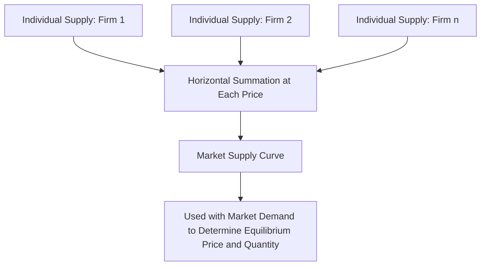

## Individual vs Market Supply

### Definition and Core Concept

**Individual supply** refers to the quantity of a good or service that a single firm (or producer) is willing and able to offer for sale at various price levels, given that firm's own cost structure, production capacity, and technology. **Market supply** refers to the total quantity of a good or service that **all** firms in a market are collectively willing and able to offer for sale at various price levels — obtained by aggregating individual supply across every producer in the market.

**Key Points**

- Market supply is derived directly from individual firm supply through horizontal summation, not by averaging.
- Both individual and market supply curves typically slope upward, consistent with the law of supply, though the underlying cost structures and magnitudes can differ across firms.
- Market outcomes (equilibrium price and quantity) are determined by market supply and market demand, while individual supply explains the production decisions of a single firm within that market.

### From Individual Supply to Market Supply: Horizontal Summation

Market supply at any given price is calculated by summing the quantities supplied by **each individual firm** at that specific price — this process is called **horizontal summation**, since it involves adding quantities (the horizontal axis) at each price level (the vertical axis), rather than adding prices.

$$Q_S^{\text{market}}(P) = \sum_{i=1}^{n} Q_S^{i}(P)$$

where $Q_S^{i}(P)$ is the quantity supplied by firm $i$ at price $P$.

**Example**

Suppose a market has only two firms, X and Y, with the following individual supply schedules for a good:

| Price ($) | $Q_S$ Firm X | $Q_S$ Firm Y | Market $Q_S$ (X + Y) |
| --- | --- | --- | --- |
| 4 | 5 | 0 | 5 |
| 6 | 10 | 4 | 14 |
| 8 | 15 | 8 | 23 |
| 10 | 20 | 12 | 32 |

At $4, Firm Y's marginal cost exceeds the price, so it supplies zero units, while Firm X supplies 5 units — market supply at that price is therefore just Firm X's contribution. As price rises, both firms increase output, and market supply reflects the sum of both firms' quantities.

### Graphical Illustration: Horizontal Summation

<svg xmlns="http://www.w3.org/2000/svg" viewBox="0 0 620 400" font-family="sans-serif">
<text x="310" y="24" font-size="15" font-weight="bold" text-anchor="middle">Horizontal Summation: Individual to Market Supply (svg_diagram)</text>

<text x="110" y="50" font-size="12" font-weight="bold" text-anchor="middle">Firm X</text>

<line x1="50" y1="330" x2="50" y2="70" stroke="black" stroke-width="1.5" />

<line x1="50" y1="330" x2="200" y2="330" stroke="black" stroke-width="1.5" />

<line x1="70" y1="310" x2="180" y2="100" stroke="`#d62728`" stroke-width="2.5" />

<text x="225" y="200" font-size="20" text-anchor="middle">+</text>

<text x="330" y="50" font-size="12" font-weight="bold" text-anchor="middle">Firm Y</text>

<line x1="270" y1="330" x2="270" y2="70" stroke="black" stroke-width="1.5" />

<line x1="270" y1="330" x2="420" y2="330" stroke="black" stroke-width="1.5" />

<line x1="290" y1="310" x2="390" y2="150" stroke="`#ff7f0e`" stroke-width="2.5" />

<text x="445" y="200" font-size="20" text-anchor="middle">=</text>

<text x="540" y="50" font-size="12" font-weight="bold" text-anchor="middle">Market Supply</text>

<line x1="480" y1="330" x2="480" y2="70" stroke="black" stroke-width="1.5" />

<line x1="480" y1="330" x2="610" y2="330" stroke="black" stroke-width="1.5" />

<line x1="500" y1="310" x2="600" y2="90" stroke="`#2ca02c`" stroke-width="3" />

</svg>

**Key Points**

- The **market supply curve** is generally flatter (more elastic in absolute terms) and extends further along the quantity axis than any single firm's individual supply curve, since it aggregates quantities across all producers.
- Horizontal summation includes only firms actually willing to supply a positive quantity at a given price; a firm whose marginal cost exceeds the price at that point contributes zero to the total, which can produce "kinks" in the market supply curve as additional, higher-cost firms begin producing at higher prices.

### Determinants of Individual vs. Market Supply

| Level | Determinants |
| --- | --- |
| Individual supply | Firm-specific input costs, firm-specific technology, firm's production capacity, firm-specific expectations |
| Market supply | All individual-level determinants, **plus** the number of firms/sellers in the market (industry entry and exit) |

**Key Points**

- The **number of sellers** is a determinant meaningful specifically at the market level (it has no analog at the individual firm level, since an individual supply curve represents just one producer by definition).
- A change affecting all firms similarly (e.g., an industry-wide increase in a key input price) shifts both individual firm supply curves and, correspondingly, the aggregate market supply curve.
- A change affecting only some firms (e.g., a new technology adopted by only a subset of producers) may shift only a portion of individual supply curves, producing a market-level shift that reflects the weighted impact of the affected firms.

### The Firm's Individual Supply Curve and Marginal Cost

In a perfectly competitive market, an individual firm's short-run supply curve corresponds to the segment of its **marginal cost (MC) curve** that lies above its **average variable cost (AVC)** curve — the firm supplies at the point where $P = MC$, and will shut down production in the short run if price falls below minimum AVC.

$$\text{Individual firm supply (short run)} = MC \text{ curve above the shutdown point (min AVC)}$$

Since different firms typically have different cost structures (different technology, input costs, or efficiency levels), individual supply curves — and thus the price at which each firm begins producing — can differ substantially across firms within the same market.

### Firm Heterogeneity and Market Supply

Real-world markets typically feature significant heterogeneity among producers — different firms have different production technologies, input costs, and scale of operations, meaning individual supply curves within the same market can differ substantially in both slope (cost sensitivity to output changes) and position (minimum price needed to produce at all).

**Key Points**

- This heterogeneity means that as price rises, progressively higher-cost (less efficient) firms are drawn into production, contributing to the generally more elastic (flatter) shape of market supply relative to any single efficient firm's individual supply curve.
- Understanding firm-level heterogeneity is important for analyzing industry structure, entry/exit dynamics, and long-run competitive equilibrium, where inefficient (high-cost) firms may be driven out of the market if the market price falls below their average total cost.
- [Inference: the precise degree to which firm heterogeneity affects the shape of aggregate market supply varies by industry and is not uniform across all markets — highly homogeneous industries with similar-cost producers will show less pronounced heterogeneity effects than industries with widely varying production technologies.]

### Producer Surplus: Individual and Aggregate

**Producer surplus** is the supply-side analog of consumer surplus — the difference between the price a producer actually receives and the minimum price (reflecting marginal cost) at which the producer would have been willing to supply that unit.

$$PS = \int_{0}^{Q^*} [P^* - P_S(Q)] \, dQ$$

At the individual firm level, this reflects the surplus a single firm receives on units it would have been willing to sell for less than the market price; summed across all firms in the market (using the market supply curve), it reflects total producer surplus in that market.

### Why the Distinction Matters

**Key Points**

- **Market equilibrium** (price and quantity) is determined by the interaction of **market** supply and **market** demand — individual firm supply curves are a building block, not the direct determinant of the market price.
- **Industry entry and exit dynamics** in the long run operate through changes in the *number* of firms, which is a market-level (not individual-level) determinant of supply — as new firms enter (attracted by profits) or existing firms exit (due to losses), the market supply curve shifts even if no individual firm's own cost structure changes.
- Analyzing individual firm supply is essential for understanding firm-level profitability, shutdown decisions, and cost structure, while market supply is essential for understanding overall market price determination and industry-wide output.

### Related Topics

- Law of Supply and the Supply Curve
- Determinants of Supply
- Producer Surplus
- Marginal Cost and the Firm's Supply Decision
- Market Equilibrium: Supply and Demand
- Short Run vs Long Run in Production
- Perfect Competition: Entry, Exit, and Long-Run Equilibrium