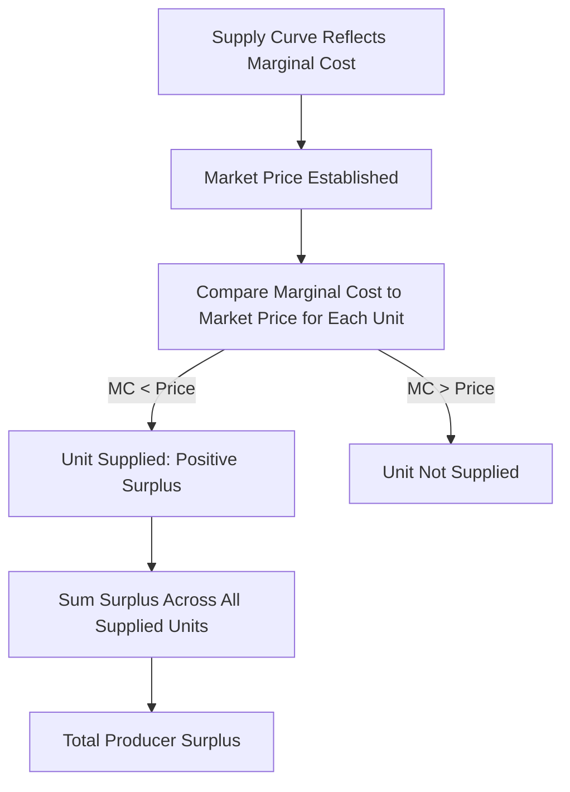

## Producer Surplus

### Definition and Core Concept

**Producer surplus** is the economic measure of the net benefit producers receive from participating in a market, defined as the difference between the price a producer **actually receives** for a good (the market price) and the **minimum price** the producer would have been willing to accept to supply that unit (reflected by the supply curve, which represents marginal cost).

At the individual level, producer surplus represents the "extra" benefit a firm gains on units it would have been willing to sell for less than the market price. At the market level, it represents the aggregate net benefit to all producers in a market from being able to sell at the prevailing market price rather than their individual minimum acceptable price.

**Key Points**

- Producer surplus is the supply-side analog of consumer surplus and a key measure of producer welfare in microeconomics.
- It is derived directly from the supply curve, which reflects producers' marginal cost of successive units.
- Producer surplus is typically measured graphically as the area between the market price and the supply curve, up to the equilibrium quantity.

### Formal Definition

For a single unit, producer surplus is:

$$PS_{\text{unit}} = P_{\text{market}} - P_{\text{minimum acceptable}}$$

For the entire market, total producer surplus is the sum (or integral, in continuous terms) of this difference across all units sold, up to the equilibrium quantity $Q^*$:

$$PS = \int_{0}^{Q^*} [P^* - P_S(Q)] \, dQ$$

where $P_S(Q)$ is the inverse supply function (price as a function of quantity, reflecting marginal cost) and $P^*$ is the market equilibrium price.

### Graphical Representation

Producer surplus is represented graphically as the area of the triangle (or more complex shape, for non-linear supply) bounded below by the supply curve, above by the horizontal market price line, and to the right by the vertical line at the equilibrium quantity.

<svg xmlns="http://www.w3.org/2000/svg" viewBox="0 0 540 400" font-family="sans-serif">
<text x="270" y="24" font-size="15" font-weight="bold" text-anchor="middle">Producer Surplus (svg_diagram)</text>
<line x1="80" y1="340" x2="80" y2="50" stroke="black" stroke-width="2" />
<line x1="80" y1="340" x2="480" y2="340" stroke="black" stroke-width="2" />
<text x="30" y="55" font-size="12">Price</text>
<text x="440" y="365" font-size="12">Quantity</text>

<line x1="100" y1="320" x2="420" y2="80" stroke="#d62728" stroke-width="3" />
<text x="350" y="140" font-size="12" fill="#d62728">S</text>

<line x1="80" y1="180" x2="290" y2="180" stroke="#333" stroke-width="1.5" stroke-dasharray="4,4" />
<text x="40" y="185" font-size="11">P*</text>

<line x1="290" y1="180" x2="290" y2="340" stroke="#333" stroke-width="1.5" stroke-dasharray="4,4" />
<text x="285" y="358" font-size="11">Q*</text>

<polygon points="80,180 290,180 130,290" fill="#f5b8b8" fill-opacity="0.7" stroke="none" />
<text x="120" y="230" font-size="12" font-weight="bold">Producer Surplus</text>
</svg>

### Worked Numerical Example

**Example**

Suppose the market supply curve for a good is linear: $P = 2 + 0.4Q$, and the market equilibrium price is $P^* = \$10$.

**Step 1: Find equilibrium quantity**

$$10 = 2 + 0.4Q \implies Q^* = 20$$

**Step 2: Find the minimum acceptable price (vertical intercept)**

When $Q = 0$: $P = 2$ — this represents the lowest price at which any producer is willing to supply the very first unit.

**Step 3: Calculate producer surplus as the area of the triangle**

$$PS = \frac{1}{2} \times \text{base} \times \text{height} = \frac{1}{2} \times Q^* \times (P^* - P_{\text{min}}) = \frac{1}{2} \times 20 \times (10 - 2) = \$80$$

Total producer surplus in this market is $80.

### Discrete Example: Individual Units

**Example**

| Unit | Minimum Acceptable Price ($) | Market Price ($) | Surplus per Unit ($) |
| --- | --- | --- | --- |
| 1st | 3 | 7 | 4 |
| 2nd | 5 | 7 | 2 |
| 3rd | 7 | 7 | 0 |
| 4th | 9 | 7 | Not supplied |

The producer supplies units up to the point where the minimum acceptable price equals the market price (the 3rd unit, where surplus reaches zero); the 4th unit is not supplied since its marginal cost ($9) exceeds the market price ($7). Total surplus for this producer is $4 + 2 + 0 = \$6$.

### Effect of Price Changes on Producer Surplus

Changes in market price directly affect the magnitude of producer surplus, a relationship central to welfare analysis of taxes, subsidies, and price controls.

- **Price increase**: Producer surplus increases — both because existing producers receive more on units already being sold, and because new (previously unwilling) producers enter the market at the higher price.
- **Price decrease**: Producer surplus decreases — for the same reasons in reverse.

<svg xmlns="http://www.w3.org/2000/svg" viewBox="0 0 540 400" font-family="sans-serif">
<text x="270" y="24" font-size="15" font-weight="bold" text-anchor="middle">Change in Producer Surplus from a Price Increase (svg_diagram)</text>
<line x1="80" y1="340" x2="80" y2="50" stroke="black" stroke-width="2" />
<line x1="80" y1="340" x2="480" y2="340" stroke="black" stroke-width="2" />
<text x="30" y="55" font-size="12">Price</text>
<text x="440" y="365" font-size="12">Quantity</text>
<line x1="100" y1="320" x2="420" y2="80" stroke="#d62728" stroke-width="3" />

<line x1="80" y1="230" x2="230" y2="230" stroke="#333" stroke-dasharray="4,4" />
<text x="40" y="235" font-size="11">P1</text>
<line x1="230" y1="230" x2="230" y2="340" stroke="#333" stroke-dasharray="4,4" />

<line x1="80" y1="170" x2="300" y2="170" stroke="#333" stroke-dasharray="4,4" />
<text x="40" y="175" font-size="11">P2</text>
<line x1="300" y1="170" x2="300" y2="340" stroke="#333" stroke-dasharray="4,4" />

<polygon points="80,230 230,230 130,300" fill="#f5b8b8" fill-opacity="0.8" stroke="none" />
<text x="110" y="270" font-size="10">Original PS</text>

<polygon points="80,170 300,170 230,230 80,230" fill="#7fd67f" fill-opacity="0.7" stroke="none" />
<text x="150" y="200" font-size="10">Added PS</text>
</svg>

### Producer Surplus and Elasticity

**Key Points**

- The magnitude of producer surplus, and how it responds to price changes, is closely related to the **price elasticity of supply**.
- For a relatively **inelastic** supply curve (steep), producer surplus tends to be larger relative to a given quantity, since many units would have been supplied even at prices well below the market price.
- For a relatively **elastic** supply curve (flat), producer surplus tends to be smaller relative to the same quantity, since producers' minimum acceptable prices are closer to the market price throughout.

### Producer Surplus vs. Accounting Profit

**Key Points**

- Producer surplus is **not** the same as accounting profit or economic profit; producer surplus is calculated relative to the marginal cost of production (the supply curve), and does not directly account for fixed costs.
- In the short run, producer surplus equals total revenue minus total variable cost — a firm can have positive producer surplus while still recording an accounting loss overall, if fixed costs exceed the surplus generated.

$$PS_{\text{short run}} = TR - TVC$$

### Applications: Welfare Analysis

Producer surplus is a central tool in **welfare economics**, used alongside consumer surplus to evaluate the impact of market interventions and market structures on overall economic welfare.

| Policy/Event | Typical Effect on Producer Surplus |
| --- | --- |
| Price ceiling (below equilibrium) | Decreases, since price falls below equilibrium and quantity sold falls |
| Price floor (above equilibrium) | Ambiguous: producers who can sell at the higher price gain surplus, but if quantity demanded falls short of quantity supplied, not all output can be sold, and some potential surplus may not be realized |
| Tax on the good | Decreases, as the effective price received by producers falls and quantity sold falls |
| Subsidy on the good | Increases, as the effective price received by producers rises and quantity sold rises |
| Increase in market competition | Ambiguous at the individual firm level (more competition can reduce individual firm surplus), though total market producer surplus effects depend on market structure specifics |
| Monopoly pricing (vs. competitive) | Producer surplus (profit) for the monopolist is generally higher than under competition, though total surplus (consumer + producer) is typically lower due to restricted output |

**Key Points**

- Total surplus (consumer surplus + producer surplus) is the standard measure of overall market efficiency used to evaluate **deadweight loss** from taxes, price controls, and market power.
- Producer surplus is a partial welfare measure — it does not capture consumer welfare, government revenue effects, or externalities, all of which must be incorporated for a complete welfare analysis.

### Deadweight Loss and Producer Surplus

When a market deviates from competitive equilibrium (due to taxes, price controls, or market power), part of the producer surplus (and consumer surplus) that would have existed at equilibrium is lost entirely rather than transferred — contributing, along with lost consumer surplus, to overall **deadweight loss**.

$$\text{Total Surplus (competitive equilibrium)} = CS + PS$$

$$\text{Deadweight Loss} = \text{Total Surplus (competitive)} - \text{Total Surplus (with distortion)}$$

### Limitations of Producer Surplus as a Welfare Measure

- **Assumes supply curve accurately reflects marginal cost**: Producer surplus calculations assume the supply curve accurately reflects true marginal cost of production, which relies on standard competitive market assumptions.
- **Distributional neutrality**: As an aggregate measure, producer surplus does not indicate *how* the surplus is distributed among different firms (e.g., large vs. small producers) — a limitation relevant to normative policy evaluation.
- **Ignores externalities**: Standard producer surplus calculations, based on private marginal cost (the supply curve), do not capture external costs (e.g., pollution) imposed on third parties, which are not reflected in the firm's private cost structure.

### Related Topics

- Law of Supply and the Supply Curve
- Individual vs Market Supply
- Consumer Surplus
- Deadweight Loss and Market Efficiency
- Price Elasticity of Supply
- Price Ceilings and Price Floors
- Welfare Economics and Pareto Efficiency