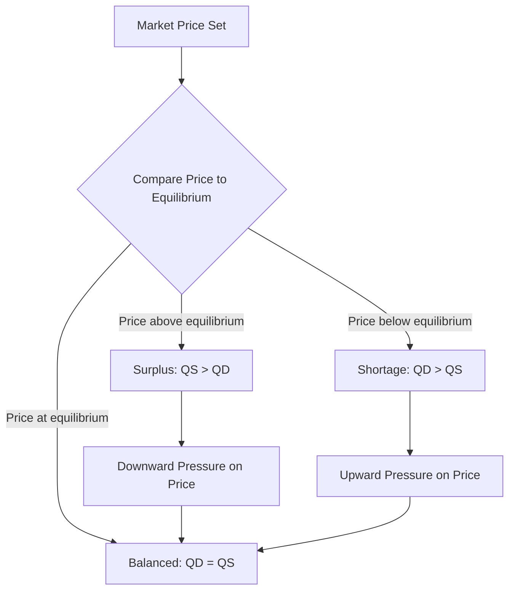

## Equilibrium Price and Quantity

### Definition and Core Concept

**Market equilibrium** is the state in which the quantity of a good that consumers are willing and able to buy (**quantity demanded**) exactly equals the quantity that producers are willing and able to sell (**quantity supplied**), at a specific price. The corresponding price is called the **equilibrium price** (or **market-clearing price**), and the corresponding quantity is called the **equilibrium quantity**.

At equilibrium, there is no inherent tendency for price or quantity to change, because the plans of buyers and sellers are exactly consistent with one another — every buyer willing to pay the equilibrium price finds a willing seller, and vice versa.

**Key Points**

- Equilibrium occurs graphically at the intersection of the market supply curve and the market demand curve.
- At equilibrium, $Q_D = Q_S$ — quantity demanded equals quantity supplied.
- Equilibrium is a state of balance, not necessarily a state that is reached instantly or maintained permanently — real markets are often adjusting toward equilibrium in response to constantly changing conditions.

### Formal Definition and Graphical Representation

Equilibrium occurs where the demand function $Q_D(P)$ and supply function $Q_S(P)$ intersect:

$$Q_D(P^*) = Q_S(P^*) = Q^*$$

where $P^*$ is the equilibrium price and $Q^*$ is the equilibrium quantity.

<svg xmlns="http://www.w3.org/2000/svg" viewBox="0 0 540 400" font-family="sans-serif">
<text x="270" y="24" font-size="15" font-weight="bold" text-anchor="middle">Market Equilibrium: Supply and Demand (svg_diagram)</text>
<line x1="80" y1="340" x2="80" y2="50" stroke="black" stroke-width="2" />
<line x1="80" y1="340" x2="480" y2="340" stroke="black" stroke-width="2" />
<text x="30" y="55" font-size="12">Price</text>
<text x="440" y="365" font-size="12">Quantity</text>

<line x1="110" y1="80" x2="440" y2="320" stroke="#1f77b4" stroke-width="3" />
<text x="380" y="150" font-size="12" fill="#1f77b4">D</text>

<line x1="110" y1="320" x2="440" y2="80" stroke="#d62728" stroke-width="3" />
<text x="380" y="270" font-size="12" fill="#d62728">S</text>

<circle cx="275" cy="200" r="6" fill="black" />
<line x1="275" y1="200" x2="275" y2="340" stroke="#333" stroke-dasharray="4,4" />
<line x1="80" y1="200" x2="275" y2="200" stroke="#333" stroke-dasharray="4,4" />
<text x="40" y="205" font-size="11" font-weight="bold">P*</text>
<text x="260" y="358" font-size="11" font-weight="bold">Q*</text>
<text x="180" y="190" font-size="12" font-weight="bold">Equilibrium (P*, Q*)</text>
</svg>

### Worked Numerical Example

**Example**

Suppose market demand and supply are given by:

$$Q_D = 100 - 4P$$

$$Q_S = -20 + 6P$$

**Step 1: Set $Q_D = Q_S$**

$$100 - 4P = -20 + 6P$$

**Step 2: Solve for equilibrium price**

$$120 = 10P \implies P^* = 12$$

**Step 3: Solve for equilibrium quantity (substitute into either equation)**

$$Q^* = 100 - 4(12) = 100 - 48 = 52$$

Verification: $Q_S = -20 + 6(12) = -20 + 72 = 52$ ✓

The equilibrium price is $12, and the equilibrium quantity is 52 units.

### Disequilibrium: Surplus and Shortage

When the market price is **not** at the equilibrium level, an imbalance between quantity demanded and quantity supplied results, creating market pressure that tends to push the price back toward equilibrium.

#### Surplus (Excess Supply)

Occurs when the market price is **above** equilibrium: $Q_S > Q_D$ at that price. Producers are willing to supply more than consumers wish to buy, resulting in unsold inventory. This surplus creates downward pressure on price as sellers compete to sell excess stock, moving the price back toward equilibrium.

#### Shortage (Excess Demand)

Occurs when the market price is **below** equilibrium: $Q_D > Q_S$ at that price. Consumers wish to buy more than producers are willing to supply at that price, resulting in unmet demand. This shortage creates upward pressure on price as buyers compete for the limited available quantity, moving the price back toward equilibrium.

| Condition | Price Relative to Equilibrium | Market Imbalance | Pressure on Price |
| --- | --- | --- | --- |
| Surplus | Above equilibrium ($P > P^*$) | $Q_S > Q_D$ (excess supply) | Downward |
| Shortage | Below equilibrium ($P < P^*$) | $Q_D > Q_S$ (excess demand) | Upward |
| Equilibrium | At equilibrium ($P = P^*$) | $Q_D = Q_S$ | None (stable) |

### Graphical Illustration: Surplus and Shortage

<svg xmlns="http://www.w3.org/2000/svg" viewBox="0 0 540 400" font-family="sans-serif">
<text x="270" y="24" font-size="15" font-weight="bold" text-anchor="middle">Surplus and Shortage Relative to Equilibrium (svg_diagram)</text>
<line x1="80" y1="340" x2="80" y2="50" stroke="black" stroke-width="2" />
<line x1="80" y1="340" x2="480" y2="340" stroke="black" stroke-width="2" />
<text x="30" y="55" font-size="12">Price</text>
<text x="440" y="365" font-size="12">Quantity</text>
<line x1="110" y1="80" x2="440" y2="320" stroke="#1f77b4" stroke-width="3" />
<line x1="110" y1="320" x2="440" y2="80" stroke="#d62728" stroke-width="3" />
<circle cx="275" cy="200" r="5" fill="black" />
<text x="40" y="205" font-size="11">P*</text>

<line x1="80" y1="130" x2="480" y2="130" stroke="#333" stroke-dasharray="4,4" />
<text x="40" y="135" font-size="11">P1 (high)</text>
<circle cx="205" cy="130" r="4" fill="#1f77b4" />
<circle cx="365" cy="130" r="4" fill="#d62728" />
<line x1="205" y1="130" x2="365" y2="130" stroke="#ff7f0e" stroke-width="3" />
<text x="230" y="115" font-size="10" fill="#ff7f0e">Surplus</text>

<line x1="80" y1="270" x2="480" y2="270" stroke="#333" stroke-dasharray="4,4" />
<text x="40" y="275" font-size="11">P2 (low)</text>
<circle cx="185" cy="270" r="4" fill="#d62728" />
<circle cx="360" cy="270" r="4" fill="#1f77b4" />
<line x1="185" y1="270" x2="360" y2="270" stroke="#2ca02c" stroke-width="3" />
<text x="230" y="290" font-size="10" fill="#2ca02c">Shortage</text>
</svg>

### The Adjustment Process Toward Equilibrium

**Key Points**

- The standard competitive market model assumes that prices adjust relatively freely in response to surpluses and shortages, gradually eliminating the imbalance and moving the market toward equilibrium.
- This adjustment process is sometimes described metaphorically as the operation of an "invisible hand" (a term originating with Adam Smith), coordinating decentralized individual decisions toward a mutually consistent market outcome without centralized direction.
- In practice, the speed of price adjustment varies significantly across different markets and goods, depending on factors such as information availability, contract rigidities, and regulatory constraints. [Inference: the precise speed and completeness of real-world price adjustment toward theoretical equilibrium is an empirical matter that varies by market and is not uniform or instantaneous in all cases, unlike the idealized frictionless adjustment often assumed in introductory models.]

### Comparative Statics: How Equilibrium Changes

**Comparative statics** analyzes how the equilibrium price and quantity change in response to shifts in supply or demand.

| Shift | Effect on Equilibrium Price | Effect on Equilibrium Quantity |
| --- | --- | --- |
| Demand increases (rightward shift) | Increases | Increases |
| Demand decreases (leftward shift) | Decreases | Decreases |
| Supply increases (rightward shift) | Decreases | Increases |
| Supply decreases (leftward shift) | Increases | Decreases |

**Example**

If consumer income rises and coffee is a normal good, demand for coffee increases (shifts right). Holding supply constant, this raises both the equilibrium price and equilibrium quantity of coffee.

If a new coffee-processing technology lowers production costs, supply increases (shifts right). Holding demand constant, this lowers the equilibrium price while raising the equilibrium quantity.

### Simultaneous Shifts in Supply and Demand

When both supply and demand shift simultaneously, the effect on equilibrium price and quantity can be ambiguous without additional information about the relative magnitude of each shift.

| Simultaneous Shifts | Effect on Price | Effect on Quantity |
| --- | --- | --- |
| Demand ↑ and Supply ↑ | Ambiguous | Increases |
| Demand ↓ and Supply ↓ | Ambiguous | Decreases |
| Demand ↑ and Supply ↓ | Increases | Ambiguous |
| Demand ↓ and Supply ↑ | Decreases | Ambiguous |

**Key Points**

- When both curves shift in a way that reinforces the effect on quantity (both increasing or both decreasing), the *quantity* effect is unambiguous but the *price* effect is ambiguous, depending on which shift is proportionally larger.
- When both curves shift in a way that reinforces the effect on price (e.g., demand up and supply down both push price up), the *price* effect is unambiguous but the *quantity* effect is ambiguous.
- Resolving these ambiguous cases requires quantitative information (elasticities and magnitudes of the shifts), not just their direction.

### Stability of Equilibrium

**Key Points**

- Standard competitive market equilibrium is generally treated as **stable**, meaning that if the price is displaced from equilibrium (due to a temporary shock), market forces (surpluses and shortages) tend to push the price back toward the equilibrium level.
- This stability is a standard assumption underlying most introductory supply-and-demand analysis, though more advanced treatments in economics recognize that certain theoretical market conditions (e.g., particular dynamic adjustment mechanisms) could in principle produce unstable equilibria — a topic generally addressed beyond the introductory level.

### Related Topics

- Law of Demand and the Demand Curve
- Law of Supply and the Supply Curve
- Determinants of Demand
- Determinants of Supply
- Consumer Surplus and Producer Surplus
- Price Ceilings and Price Floors
- Comparative Statics in Market Analysis