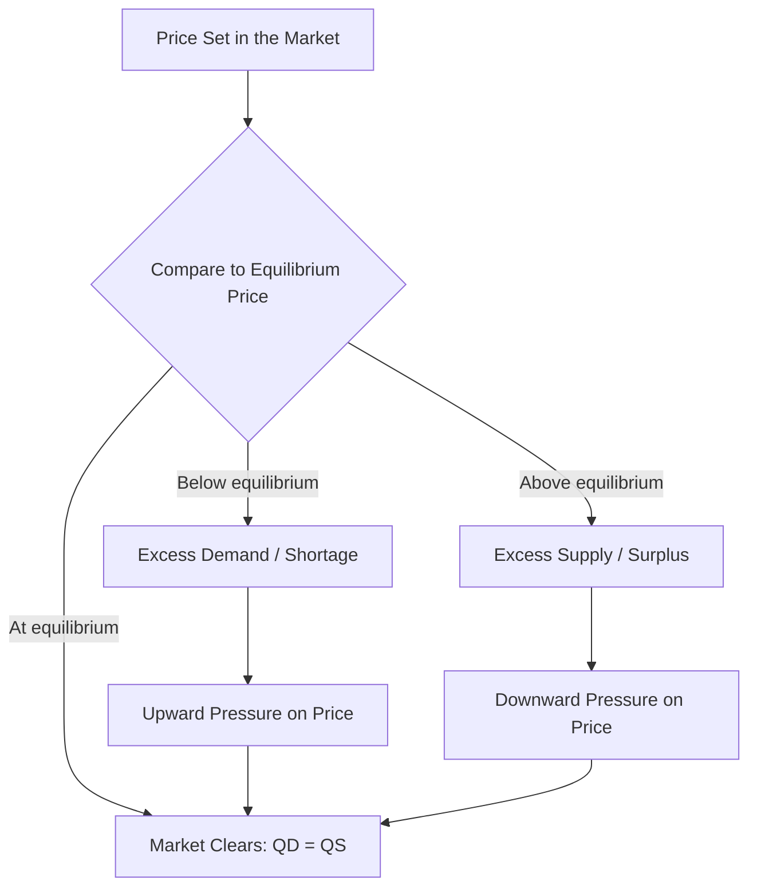

## Excess Demand and Excess Supply

### Definition and Core Concept

**Excess demand** (also called a **shortage**) occurs when, at a given price, the quantity demanded by consumers exceeds the quantity supplied by producers ($Q_D > Q_S$). **Excess supply** (also called a **surplus**) occurs when, at a given price, the quantity supplied by producers exceeds the quantity demanded by consumers ($Q_S > Q_D$).

Both conditions represent states of **market disequilibrium** — situations in which the prevailing price is not the market-clearing (equilibrium) price, and thus a gap exists between the plans of buyers and sellers.

**Key Points**

- Excess demand and excess supply are mirror-image disequilibrium conditions, occurring on opposite sides of the equilibrium price.
- Excess demand arises when price is set **below** equilibrium; excess supply arises when price is set **above** equilibrium.
- Both conditions generate market pressure that, in a freely adjusting market, tends to push the price back toward equilibrium, eliminating the imbalance.

### Excess Demand (Shortage)

Excess demand occurs at any price $P < P^*$ (below the equilibrium price), where:

$$Q_D(P) > Q_S(P)$$

$$\text{Magnitude of shortage} = Q_D(P) - Q_S(P)$$

**Key Points**

- At a below-equilibrium price, consumers wish to purchase more of the good than producers are willing to supply.
- The resulting scarcity relative to demand creates upward pressure on price, as buyers compete for the limited quantity available (e.g., through bidding up prices, or firms recognizing they could sell out and raise prices).
- Shortages caused by government intervention are most commonly associated with **price ceilings** set below the equilibrium price (e.g., rent control).

### Excess Supply (Surplus)

Excess supply occurs at any price $P > P^*$ (above the equilibrium price), where:

$$Q_S(P) > Q_D(P)$$

$$\text{Magnitude of surplus} = Q_S(P) - Q_D(P)$$

**Key Points**

- At an above-equilibrium price, producers wish to sell more of the good than consumers are willing to purchase.
- The resulting unsold inventory creates downward pressure on price, as sellers compete to clear excess stock (e.g., through discounting, promotions, or reduced future production).
- Surpluses caused by government intervention are most commonly associated with **price floors** set above the equilibrium price (e.g., agricultural price supports, minimum wage in the labor market).

### Graphical Representation

<svg xmlns="http://www.w3.org/2000/svg" viewBox="0 0 560 420" font-family="sans-serif">
<text x="280" y="24" font-size="15" font-weight="bold" text-anchor="middle">Excess Demand and Excess Supply (svg_diagram)</text>
<line x1="80" y1="360" x2="80" y2="50" stroke="black" stroke-width="2" />
<line x1="80" y1="360" x2="500" y2="360" stroke="black" stroke-width="2" />
<text x="30" y="55" font-size="12">Price</text>
<text x="460" y="385" font-size="12">Quantity</text>

<line x1="110" y1="90" x2="460" y2="340" stroke="#1f77b4" stroke-width="3" />
<text x="400" y="160" font-size="12" fill="#1f77b4">D</text>

<line x1="110" y1="340" x2="460" y2="90" stroke="#d62728" stroke-width="3" />
<text x="400" y="280" font-size="12" fill="#d62728">S</text>

<circle cx="285" cy="215" r="5" fill="black" />
<line x1="80" y1="215" x2="285" y2="215" stroke="#333" stroke-dasharray="4,4" />
<text x="40" y="220" font-size="11">P*</text>

<line x1="80" y1="290" x2="500" y2="290" stroke="#2ca02c" stroke-width="2" stroke-dasharray="6,3" />
<text x="40" y="295" font-size="11">Pc (ceiling)</text>
<circle cx="200" cy="290" r="4" fill="#d62728" />
<circle cx="395" cy="290" r="4" fill="#1f77b4" />
<line x1="200" y1="290" x2="395" y2="290" stroke="#2ca02c" stroke-width="4" />
<text x="230" y="310" font-size="10" fill="#2ca02c" font-weight="bold">Excess Demand (Shortage)</text>

<line x1="80" y1="150" x2="500" y2="150" stroke="#ff7f0e" stroke-width="2" stroke-dasharray="6,3" />
<text x="40" y="145" font-size="11">Pf (floor)</text>
<circle cx="220" cy="150" r="4" fill="#1f77b4" />
<circle cx="370" cy="150" r="4" fill="#d62728" />
<line x1="220" y1="150" x2="370" y2="150" stroke="#ff7f0e" stroke-width="4" />
<text x="230" y="135" font-size="10" fill="#ff7f0e" font-weight="bold">Excess Supply (Surplus)</text>
</svg>

### Worked Numerical Example

**Example**

Given $Q_D = 100 - 4P$ and $Q_S = -20 + 6P$, equilibrium occurs at $P^* = 12$, $Q^* = 52$ (as derived under Equilibrium Price and Quantity).

**Excess demand at $P = 8$ (below equilibrium):**

$$Q_D = 100 - 4(8) = 68, \quad Q_S = -20 + 6(8) = 28$$

$$\text{Shortage} = 68 - 28 = 40 \text{ units}$$

**Excess supply at $P = 16$ (above equilibrium):**

$$Q_D = 100 - 4(16) = 36, \quad Q_S = -20 + 6(16) = 76$$

$$\text{Surplus} = 76 - 36 = 40 \text{ units}$$

### Causes of Persistent Excess Demand or Excess Supply

In a freely adjusting market, excess demand and excess supply are typically **temporary**, self-correcting through price movement. Persistent disequilibrium generally arises from an external constraint preventing price from adjusting to its equilibrium level.

| Cause | Type of Disequilibrium | Mechanism |
| --- | --- | --- |
| Price ceiling (legal maximum below $P^*$) | Excess demand (shortage) | Price cannot rise to clear the market; quantity supplied remains constrained at the low ceiling price |
| Price floor (legal minimum above $P^*$) | Excess supply (surplus) | Price cannot fall to clear the market; quantity demanded remains constrained at the high floor price |
| Sticky/rigid prices (contracts, menu costs, social norms) | Either, temporarily | Prices adjust slowly due to real-world frictions, even without a legal restriction |
| Rapid, unanticipated demand or supply shocks | Either, temporarily | Prices have not yet had time to adjust to a sudden shift in underlying market conditions |

**Key Points**

- **Price ceilings** below equilibrium are the classic cause of a persistent, government-induced shortage — a widely cited example is rent control policies, which can create persistent housing shortages in the affected market. [Inference: the specific magnitude of shortage effects from any real-world rent control policy depends on numerous local factors and is a matter of ongoing empirical economic research, not a fixed universal outcome.]
- **Price floors** above equilibrium are the classic cause of a persistent, government-induced surplus — historical agricultural price support programs have, in some documented cases, led to surplus stockpiles of supported commodities.
- Even without formal price controls, prices in some markets adjust with a lag due to menu costs (the cost of changing posted prices), long-term contracts, or social/psychological resistance to frequent price changes — leading to temporary, naturally-occurring disequilibrium.

### Non-Price Rationing Under Persistent Excess Demand

When a price ceiling prevents price from rising to clear a shortage, some **non-price mechanism** typically emerges to allocate the limited available supply among the excess number of willing buyers.

**Key Points**

- Common non-price rationing mechanisms include: first-come-first-served (queuing/waiting lines), lotteries, rationing coupons, seller discretion/favoritism, and the emergence of black or secondary markets.
- These non-price mechanisms are generally considered less economically efficient than price-based rationing, since they do not necessarily allocate the good to those who value it most (as reflected by willingness to pay), and often impose additional costs (e.g., time spent waiting in line) not captured in the nominal price paid.

### Distinguishing Excess Demand/Supply from Shifts in Demand/Supply

**Key Points**

- Excess demand and excess supply describe a **disequilibrium condition at a specific price**, whereas shifts in demand or supply describe a change in the underlying curve itself.
- A shift in demand or supply can *create* a temporary state of excess demand or excess supply at the *old* equilibrium price, until the price adjusts to the *new* equilibrium — but excess demand/supply and demand/supply shifts are conceptually distinct: one describes an imbalance at a given price, the other describes a change in the relationship between price and quantity.

**Example**

If market demand suddenly increases (rightward shift) while price remains temporarily fixed at the old equilibrium level, the market will experience excess demand (a shortage) at that now-too-low price, until the price rises to the new, higher equilibrium level that reflects the increased demand.

### Related Topics

- Equilibrium Price and Quantity
- Law of Demand and the Demand Curve
- Law of Supply and the Supply Curve
- Price Ceilings and Price Floors
- Comparative Statics in Market Analysis
- Rationing Mechanisms and Black Markets