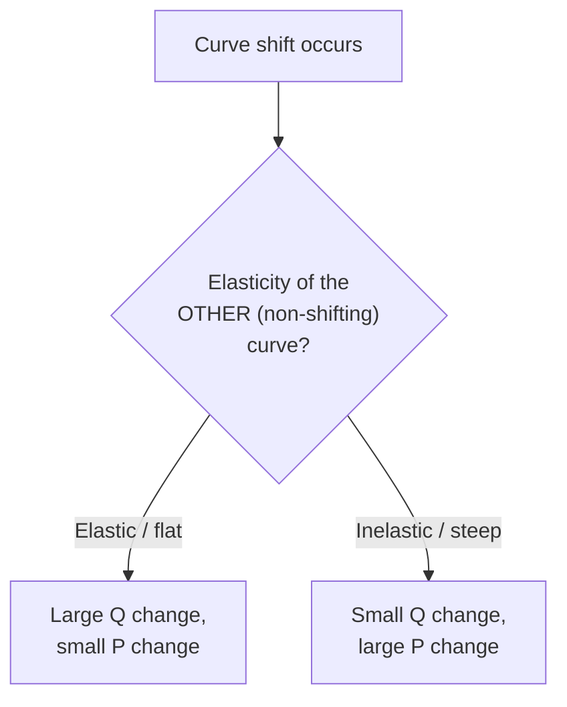

## Comparative Statics of Demand and Supply Shifts

### Definition and Purpose

Comparative statics is the method of analyzing how the equilibrium values of endogenous variables (price and quantity) change in response to a change in an exogenous variable (a shift factor), by comparing the initial equilibrium to the new equilibrium after the market has adjusted. It is "static" because it compares two equilibrium states (before and after) without describing the time path or adjustment process connecting them; that dynamic adjustment process is instead the subject of stability analysis.

The method isolates the effect of one changed variable at a time, holding all other determinants constant (the ceteris paribus assumption), which allows a shift in either the demand curve or supply curve to be mapped cleanly onto predictable changes in equilibrium price ($P^*$) and equilibrium quantity ($Q^*$).

### The Baseline Equilibrium Framework

A competitive market equilibrium is defined by the intersection of a demand function and a supply function:

$$Q_D = D(P, \alpha)$$

$$Q_S = S(P, \beta)$$

where $\alpha$ represents demand shift parameters (income, tastes, prices of related goods, population, expectations) and $\beta$ represents supply shift parameters (input costs, technology, number of sellers, expectations, taxes/subsidies). Equilibrium requires $Q_D = Q_S$, which solves for $P^*$ and $Q^*$.

Comparative statics asks: given a change $d\alpha$ or $d\beta$, what is $dP^*$ and $dQ^*$?

### Distinguishing a Shift from a Movement Along the Curve

**Key Points**

- A change in the good's own price causes movement *along* a fixed curve (a change in quantity demanded/supplied).
- A change in any non-price determinant causes the entire curve to *shift* (a change in demand/supply itself).
- Comparative statics is exclusively concerned with curve shifts, not movements along a curve.

Confusing these two is the most common analytical error at this stage: a fall in equilibrium price caused by a supply increase is a movement along the demand curve, not a shift of the demand curve.

### Demand Shifters

| Shifter | Effect of an Increase | Direction of Demand Shift |
| --- | --- | --- |
| Consumer income (normal good) | Demand rises | Rightward |
| Consumer income (inferior good) | Demand falls | Leftward |
| Price of a substitute | Demand rises | Rightward |
| Price of a complement | Demand falls | Leftward |
| Consumer tastes/preferences (favorable) | Demand rises | Rightward |
| Number of buyers | Demand rises | Rightward |
| Expected future price (rises) | Demand rises today | Rightward |

### Supply Shifters

| Shifter | Effect of an Increase | Direction of Supply Shift |
| --- | --- | --- |
| Input/factor prices | Supply falls | Leftward |
| Technology (improvement) | Supply rises | Rightward |
| Number of sellers | Supply rises | Rightward |
| Taxes on producers | Supply falls | Leftward |
| Subsidies to producers | Supply rises | Rightward |
| Expected future price (rises) | Supply falls today | Leftward |

### Case 1: Demand Shift, Supply Held Constant

**Increase in Demand (Rightward Shift)**

At the original price $P_0$, the rightward shift of demand creates excess demand ($Q_D > Q_S$). This shortage puts upward pressure on price. As price rises, it induces two simultaneous responses: quantity supplied increases (a movement along the unchanged supply curve) and quantity demanded falls back from its initial jump (a movement along the new demand curve) until the market clears.

**Result:** $P^*$ increases, $Q^*$ increases. Price and quantity move in the *same direction* whenever demand alone shifts.

A decrease in demand (leftward shift) produces the exact mirror image: excess supply at $P_0$, price falls, and both $P^*$ and $Q^*$ decrease.

### Case 2: Supply Shift, Demand Held Constant

**Increase in Supply (Rightward Shift)**

At $P_0$, the rightward shift of supply creates excess supply ($Q_S > Q_D$). Sellers accumulate unsold inventory and compete on price, pushing $P$ down. The falling price is a movement along the unchanged demand curve, raising quantity demanded until it matches the new quantity supplied.

**Result:** $P^*$ decreases, $Q^*$ increases. Price and quantity move in *opposite directions* whenever supply alone shifts.

A decrease in supply (leftward shift) is the mirror image: $P^*$ increases, $Q^*$ decreases.

### Summary Table: Single-Curve Shifts

| Shift | $\Delta P^*$ | $\Delta Q^*$ |
| --- | --- | --- |
| Demand increases | + | + |
| Demand decreases | − | − |
| Supply increases | − | + |
| Supply decreases | + | − |

**Key Points**

- Same-direction $P^*$ and $Q^*$ movement always signals a pure demand shift.
- Opposite-direction $P^*$ and $Q^*$ movement always signals a pure supply shift.
- This rule is the standard diagnostic used to infer, from observed price/quantity data alone, which curve moved (identification problem, discussed below).

### Case 3: Simultaneous Shifts of Both Curves

When demand and supply shift at the same time, the outcome for $P^*$ and $Q^*$ splits into a magnitude-determinate component and a magnitude-indeterminate component. Direction is fully determinate for one variable and ambiguous for the other, depending on the combination.

**Both Curves Shift Rightward (Demand ↑, Supply ↑)**

- $Q^*$: unambiguously increases (both effects push quantity up).
- $P^*$: ambiguous — demand increase pushes $P^*$ up, supply increase pushes $P^*$ down. Net effect depends on the *relative magnitude* of the two shifts.

**Both Curves Shift Leftward (Demand ↓, Supply ↓)**

- $Q^*$: unambiguously decreases.
- $P^*$: ambiguous, for the same reason as above (in reverse).

**Demand ↑, Supply ↓**

- $P^*$: unambiguously increases (both effects push price up).
- $Q^*$: ambiguous — demand increase raises $Q^*$, supply decrease lowers $Q^*$.

**Demand ↓, Supply ↑**

- $P^*$: unambiguously decreases.
- $Q^*$: ambiguous.

| Demand Shift | Supply Shift | $\Delta P^*$ | $\Delta Q^*$ |
| --- | --- | --- | --- |
| Increase | Increase | Ambiguous | Increase |
| Decrease | Decrease | Ambiguous | Decrease |
| Increase | Decrease | Increase | Ambiguous |
| Decrease | Increase | Decrease | Ambiguous |

**Example**

Suppose a rise in consumer income increases demand for a normal good (rightward demand shift) at the same time a new, more efficient production technology increases supply (rightward supply shift).

- Effect on $Q^*$: both shifts raise quantity, so $Q^*$ rises unambiguously.
- Effect on $P^*$: the demand shift alone would raise $P^*$; the supply shift alone would lower $P^*$. If the technology shock is proportionally larger than the income effect, $P^*$ falls despite the demand increase. If the income effect dominates, $P^*$ rises. Without knowing the relative elasticities and magnitudes of the two shifts, the sign of $\Delta P^*$ cannot be determined from theory alone — it is an empirical question.

[Inference] The specific magnitude relationship required to resolve the ambiguity (e.g., which shift's absolute size or slope dominates) depends on the functional forms of $D(\cdot)$ and $S(\cdot)$ and cannot be signed without those specifics or accompanying data.

### Mathematical (Algebraic) Comparative Statics

For linear demand and supply functions:

$$Q_D = a - bP + c\alpha$$

$$Q_S = -d + eP + f\beta$$

where $a, b, d, e > 0$; $\alpha$ is a demand shifter (e.g., income) with coefficient $c$; $\beta$ is a supply shifter with coefficient $f$.

Setting $Q_D = Q_S$ and solving for equilibrium price:

$$P^* = \frac{a + d + c\alpha - f\beta}{b + e}$$

Taking partial derivatives isolates the pure effect of each shifter:

$$\frac{\partial P^*}{\partial \alpha} = \frac{c}{b+e} > 0 \quad \text{(demand shifter raises price)}$$

$$\frac{\partial P^*}{\partial \beta} = \frac{-f}{b+e} < 0 \quad \text{(supply shifter lowers price)}$$

Substituting $P^*$ back into either $Q_D$ or $Q_S$ yields:

$$\frac{\partial Q^*}{\partial \alpha} = \frac{ce}{b+e} > 0, \qquad \frac{\partial Q^*}{\partial \beta} = \frac{fb}{b+e} > 0$$

These derivatives formally confirm the diagrammatic results: a demand shifter ($\alpha$) moves $P^*$ and $Q^*$ in the same direction; a supply shifter ($\beta$) moves $P^*$ up/down while $Q^*$ moves the opposite way relative to $P^*$'s direction, but same direction as the shift's sign. This algebraic approach is what resolves the ambiguity in simultaneous-shift cases once actual numerical values of $a$–$f$, $\alpha$, and $\beta$ are specified.

### Role of Elasticity in Determining Magnitude

While direction of change is governed by which curve shifts, the *magnitude* of the price and quantity response is governed by the elasticities (slopes) of the two curves.

- A demand increase against a **highly elastic (flat) supply curve** produces a large $\Delta Q^*$ and small $\Delta P^*$.
- The same demand increase against a **highly inelastic (steep) supply curve** produces a small $\Delta Q^*$ and large $\Delta P^*$.
- Symmetric logic applies to supply shifts interacting with demand elasticity.

This is why comparative statics is often paired with elasticity analysis: direction comes from identifying which curve moved, magnitude comes from the elasticity of the curve that did *not* move.

### The Identification Problem

**Key Points**

- Real-world time-series data show only a scatter of observed equilibrium $(P, Q)$ points — the actual demand and supply curves are never directly observed, only their intersections.
- If both curves are shifting simultaneously and continuously (as in most real markets), it is econometrically difficult to recover the true slope of either curve from the observed equilibria alone.
- This is known as the **identification problem** in econometrics, and it motivates the use of instrumental variables and structural estimation to isolate shifts in one curve while holding the other fixed.

### Diagrammatic (SVG) Illustration

<svg xmlns="http://www.w3.org/2000/svg" viewBox="0 0 640 420" font-family="Helvetica, Arial, sans-serif">
<title>Comparative Statics — Demand Increase (svg_diagram)</title>

<line x1="60" y1="360" x2="600" y2="360" stroke="#333" stroke-width="2" />
<line x1="60" y1="360" x2="60" y2="20" stroke="#333" stroke-width="2" />
<text x="580" y="380" font-size="14">Quantity</text>
<text x="20" y="30" font-size="14">Price</text>

<line x1="90" y1="340" x2="480" y2="40" stroke="#1b5e20" stroke-width="2.5" />
<text x="470" y="35" font-size="13" fill="#1b5e20">S</text>

<line x1="480" y1="40" x2="120" y2="340" stroke="#0d47a1" stroke-width="2.5" />
<text x="500" y="60" font-size="13" fill="#0d47a1">D0</text>

<line x1="560" y1="40" x2="200" y2="340" stroke="#0d47a1" stroke-width="2.5" stroke-dasharray="6,4" />
<text x="565" y="45" font-size="13" fill="#0d47a1">D1</text>

<circle cx="288" cy="207" r="5" fill="#000" />
<text x="298" y="200" font-size="13">E0 (P0, Q0)</text>

<circle cx="345" cy="163" r="5" fill="#c62828" />
<text x="355" y="155" font-size="13" fill="#c62828">E1 (P1, Q1)</text>

<line x1="288" y1="207" x2="288" y2="360" stroke="#888" stroke-width="1" stroke-dasharray="3,3" />
<line x1="60" y1="207" x2="288" y2="207" stroke="#888" stroke-width="1" stroke-dasharray="3,3" />

<line x1="345" y1="163" x2="345" y2="360" stroke="#888" stroke-width="1" stroke-dasharray="3,3" />
<line x1="60" y1="163" x2="345" y2="163" stroke="#888" stroke-width="1" stroke-dasharray="3,3" />

<text x="35" y="211" font-size="12">P0</text>

<text x="35" y="167" font-size="12">P1</text>

<text x="282" y="378" font-size="12">Q0</text>

<text x="339" y="378" font-size="12">Q1</text>

<path d="M 400 100 L 440 90" stroke="#0d47a1" stroke-width="2" fill="none" marker-end="url(#arrow)" />
</svg>

### Worked Numerical Example

**Example**

Given:

$$Q_D = 100 - 2P$$

$$Q_S = -20 + 3P$$

**Initial equilibrium:** Set $Q_D = Q_S$:

$$100 - 2P = -20 + 3P \Rightarrow 120 = 5P \Rightarrow P^* = 24, \quad Q^* = 52$$

**Shock:** Consumer income rises, shifting demand to $Q_D' = 130 - 2P$ (parallel rightward shift of 30 units).

**New equilibrium:**

$$130 - 2P = -20 + 3P \Rightarrow 150 = 5P \Rightarrow P^{*\prime} = 30, \quad Q^{*\prime} = 70$$

**Output**

| Variable | Before | After | Change |
| --- | --- | --- | --- |
| $P^*$ | 24 | 30 | +6 |
| $Q^*$ | 52 | 70 | +18 |

Both price and quantity rose — consistent with the pure demand-shift rule. Note the quantity change (18) exceeds the horizontal parallel shift of the demand curve (30 units divided among both effects) because part of the adjustment is absorbed by the upward-sloping supply curve's response to the higher price.

### Common Pitfalls

**Key Points**

- Treating a price change as a "shift" when it is actually a movement along a stationary curve caused by the other curve shifting.
- Assuming both $P^*$ and $Q^*$ must move by the same proportion as the shift itself; the actual magnitude depends jointly on both curves' slopes.
- Forgetting that when both curves move, one of the two equilibrium variables becomes genuinely indeterminate in sign without further quantitative information — asserting a direction in that case is not the "same in real life"; it is a modeling error.
- Confusing a shift in supply with a change in the price of the good itself (which is a movement along supply, not a supply shift).

### Conclusion

Comparative statics of demand and supply shifts provides the core predictive tool of introductory price theory: by tracking which curve moves and in which direction, the model generates unambiguous predictions for at least one of $P^*$ or $Q^*$, and often both, when only one curve shifts. When both curves move simultaneously, the framework still yields a determinate direction for one variable while flagging the other as an empirical question resolved only by relative magnitudes and elasticities — a distinction that is itself a core analytical skill, not a gap in the model.

**Related Topics**

- Elasticity of demand and supply (price, income, cross-price)
- Consumer and producer surplus under equilibrium shifts
- Price ceilings, price floors, and market disequilibrium
- Tax incidence and the wedge between $Q_D$ and $Q_S$
- Dynamic stability analysis (cobweb model) versus static equilibrium comparison
- General equilibrium and cross-market comparative statics
- The identification problem and instrumental variable estimation of demand/supply curves