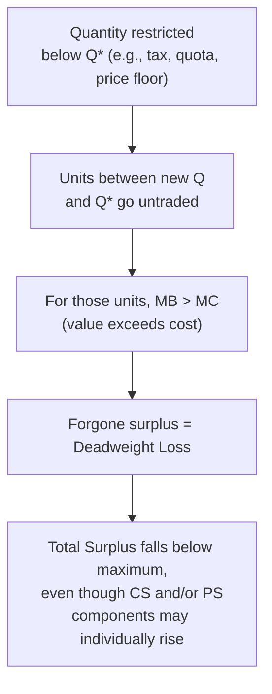

## Market Efficiency and Total Surplus

### Definition and Conceptual Foundation

Market efficiency, in the context of competitive equilibrium, refers to an allocation of resources in which total surplus — the sum of benefits received by all market participants — is maximized. An allocation is efficient (also called **allocatively efficient** or **Pareto efficient** in this context) when it is impossible to reallocate goods or resources in a way that makes at least one participant better off without making another participant worse off.

Total surplus is the standard welfare metric used to evaluate whether a particular market outcome — competitive equilibrium, or an outcome distorted by a tax, price control, or externality — achieves the maximum possible gains from trade.

### Consumer Surplus

**Definition:** Consumer surplus (CS) is the difference between the maximum price a consumer is willing to pay for a unit of a good (as reflected in the demand curve) and the price they actually pay.

$$CS = \int_0^{Q^*} D(Q)\, dQ - P^* Q^*$$

Graphically, consumer surplus is the area between the demand curve and the horizontal equilibrium price line, from zero to the equilibrium quantity $Q^*$.

Each point on the demand curve represents a buyer's (or marginal unit's) **willingness to pay (WTP)**. Because the demand curve slopes downward, inframarginal units are valued more highly than the marginal unit, and every unit purchased at the single market-clearing price $P^*$ generates surplus equal to the gap between that unit's WTP and $P^*$.

### Producer Surplus

**Definition:** Producer surplus (PS) is the difference between the price a seller actually receives and the minimum price at which they would have been willing to sell (as reflected in the supply curve, which reflects marginal cost).

$$PS = P^* Q^* - \int_0^{Q^*} S(Q)\, dQ$$

Graphically, producer surplus is the area between the horizontal equilibrium price line and the supply curve, from zero to $Q^*$.

Each point on the supply curve represents a seller's **marginal cost (MC)** of producing that unit. Because supply slopes upward, inframarginal units cost less to produce than the marginal unit, and every unit sold at $P^*$ generates surplus equal to the gap between $P^*$ and that unit's marginal cost.

### Total Surplus

$$TS = CS + PS$$

Total surplus (also called social surplus or total welfare) represents the entire net gain to society generated by the existence of the market — the total value created by voluntary exchange between buyers and sellers, net of production costs.

### Diagrammatic Illustration

<svg xmlns="http://www.w3.org/2000/svg" viewBox="0 0 640 420" font-family="Helvetica, Arial, sans-serif">

<title>Consumer and Producer Surplus at Equilibrium (svg_diagram)</title>

<line x1="60" y1="360" x2="600" y2="360" stroke="#333" stroke-width="2" />

<line x1="60" y1="360" x2="60" y2="20" stroke="#333" stroke-width="2" />

<text x="580" y="380" font-size="14">Quantity</text>

<text x="20" y="30" font-size="14">Price</text>

<line x1="90" y1="340" x2="480" y2="40" stroke="#1b5e20" stroke-width="2.5" />

<text x="470" y="35" font-size="13" fill="#1b5e20">S (MC)</text>

<line x1="90" y1="40" x2="480" y2="340" stroke="#0d47a1" stroke-width="2.5" />

<text x="470" y="335" font-size="13" fill="#0d47a1">D (WTP)</text>

<circle cx="285" cy="190" r="5" fill="#000" />

<text x="295" y="185" font-size="13">E (P*, Q*)</text>

<polygon points="90,40 285,190 90,190" fill="#0d47a1" fill-opacity="0.2" stroke="none" />

<text x="130" y="110" font-size="13" fill="#0d47a1">Consumer Surplus</text>

<polygon points="90,340 285,190 90,190" fill="#1b5e20" fill-opacity="0.2" stroke="none" />

<text x="110" y="280" font-size="13" fill="#1b5e20">Producer Surplus</text>

<line x1="285" y1="190" x2="285" y2="360" stroke="#888" stroke-width="1" stroke-dasharray="3,3" />

<line x1="60" y1="190" x2="285" y2="190" stroke="#888" stroke-width="1" stroke-dasharray="3,3" />

<text x="35" y="194" font-size="12">P*</text>

<text x="279" y="378" font-size="12">Q*</text>

</svg>

### Why Competitive Equilibrium Maximizes Total Surplus

**Key Points**

- Demand reflects marginal benefit (MB) to consumers; supply reflects marginal cost (MC) to producers.
- At quantities below equilibrium ($Q < Q^*$), $MB > MC$ for the next unit — producing and consuming that unit adds more benefit than it costs, so total surplus rises if that unit is traded.
- At quantities above equilibrium ($Q > Q^*$), $MB < MC$ — that unit costs more to produce than the value it generates, so trading it destroys surplus.
- Total surplus is therefore maximized exactly where $MB = MC$, which is precisely the competitive equilibrium quantity $Q^*$, since demand ($MB$) intersects supply ($MC$) at that point by definition.

This is the formal content of the **First Welfare Theorem** in its partial-equilibrium form: a competitive market, left unregulated and free of externalities or market power, allocates resources to their highest-valued use and produces the surplus-maximizing quantity.

$$\text{At } Q^*: \quad D(Q^*) = S(Q^*) = P^*$$

$$\text{For } Q < Q^*: \quad D(Q) > S(Q) \Rightarrow \text{trading this unit adds } [D(Q) - S(Q)] \text{ to } TS$$

$$\text{For } Q > Q^*: \quad D(Q) < S(Q) \Rightarrow \text{trading this unit subtracts } [S(Q) - D(Q)] \text{ from } TS$$

### Deadweight Loss: The Cost of Deviating from Q*

When a market is prevented from reaching $Q^*$ — by a tax, price ceiling, price floor, quota, or other restriction — some mutually beneficial trades that would have occurred (where $MB > MC$) no longer occur. The forgone surplus from these unrealized trades is called **deadweight loss (DWL)**.

**Example**

A tax of $t$ per unit imposed on a good drives a wedge between the price buyers pay ($P_b$) and the price sellers receive ($P_s$), such that $P_b - P_s = t$. Quantity falls from $Q^*$ to $Q_t < Q^*$.

- Consumer surplus falls (buyers pay more, consume less).
- Producer surplus falls (sellers receive less, produce less).
- Tax revenue = $t \times Q_t$ is captured by the government and is **not** a loss to society — it is a transfer, so it remains part of the surplus accounting.
- Deadweight loss = the triangular area between $Q_t$ and $Q^*$, representing the units where $MB > MC$ that are no longer traded because of the tax wedge.

$$TS_{\text{with tax}} = CS + PS + \text{Tax Revenue} = TS_{\text{no tax}} - DWL$$

### Surplus Accounting Table

| Policy/Distortion | Effect on CS | Effect on PS | Third-Party Effect | DWL? |
| --- | --- | --- | --- | --- |
| No intervention (competitive equilibrium) | Maximized jointly with PS | Maximized jointly with CS | None | None |
| Per-unit tax | Decreases | Decreases | + Tax revenue to government | Yes |
| Per-unit subsidy | Increases | Increases | − Government expenditure | Yes (overproduction beyond $Q^*$) |
| Binding price ceiling | Ambiguous (gains on inframarginal units, losses from shortage/rationing) | Decreases | None | Yes |
| Binding price floor | Decreases | Ambiguous (gains on inframarginal units, losses from surplus/unsold output) | None | Yes |
| Binding quota | Ambiguous | Ambiguous | Possible quota-rents | Yes |

### Worked Numerical Example

**Example**

Given the linear market:

$$Q_D = 100 - 2P \quad \Rightarrow \quad P = 50 - 0.5Q \text{ (inverse demand)}$$

$$Q_S = -20 + 3P \quad \Rightarrow \quad P = \tfrac{20 + Q}{3} \text{ (inverse supply)}$$

**Equilibrium:** $100 - 2P = -20 + 3P \Rightarrow P^* = 24, \ Q^* = 52$.

**Consumer surplus** (triangle with height = demand intercept minus $P^*$, base = $Q^*$):

- Demand vertical intercept: $P = 50$ (when $Q=0$).

  $$CS = \tfrac{1}{2} \times Q^* \times (50 - P^*) = \tfrac{1}{2} \times 52 \times (50-24) = \tfrac{1}{2} \times 52 \times 26 = 676$$

**Producer surplus** (triangle with height = $P^*$ minus supply intercept, base = $Q^*$):

- Supply vertical intercept: $P = 20/3 \approx 6.67$ (when $Q=0$).

  $$PS = \tfrac{1}{2} \times Q^* \times (P^* - 6.67) = \tfrac{1}{2} \times 52 \times (24 - 6.67) = \tfrac{1}{2} \times 52 \times 17.33 \approx 450.6$$

**Output**

| Measure | Value |
| --- | --- |
| $P^*$ | 24 |
| $Q^*$ | 52 |
| Consumer Surplus | 676 |
| Producer Surplus | ≈ 450.67 |
| Total Surplus | ≈ 1,126.67 |

This total surplus figure (≈1,126.67) represents the maximum achievable in this market; any policy that pushes quantity away from $Q^*=52$ in either direction will produce a total surplus below this value, with the shortfall equal to the resulting deadweight loss.

### Efficiency Conditions Summary

**Key Points**

- **Marginal condition for efficiency:** $MB(Q^*) = MC(Q^*)$.
- **Competitive equilibrium satisfies this condition automatically**, because price-taking consumers set $MB = P$ and price-taking producers set $MC = P$, so $MB = MC = P^*$ at the market-clearing quantity.
- **Efficiency ≠ equity.** Total surplus maximization says nothing about how surplus is *distributed* between consumers and producers — a market can be fully efficient while producing highly unequal distributional outcomes; efficiency and fairness are separate normative criteria.
- **Assumptions required for this efficiency result to hold:** perfect competition (no market power on either side), no externalities (all costs and benefits are internal to the transacting parties), complete information, and well-defined property rights. Violating any of these assumptions (monopoly, pollution externalities, asymmetric information) breaks the equivalence between competitive equilibrium and surplus-maximizing allocation, since demand and supply curves would then no longer represent true marginal social benefit and marginal social cost. [Inference] The magnitude of surplus loss under each specific violation depends on the particular market's cost/demand structure and the size of the market failure, and is addressed in later, dedicated topics on externalities and market power.

### Common Pitfalls

**Key Points**

- Treating consumer surplus and producer surplus as fixed pools rather than areas that expand or contract with $Q^*$ and $P^*$; both must be recalculated whenever equilibrium changes.
- Forgetting that tax revenue and subsidy expenditure are transfers, not losses — only the deadweight-loss triangle represents genuine destruction of surplus.
- Assuming that any change raising producer surplus or consumer surplus individually must raise total surplus — a policy can raise one component while lowering total surplus by more (e.g., a price floor raises PS for units still sold but destroys more CS and creates DWL).
- Confusing "efficient" with "fair" or "desirable" — efficiency is a positive, technical property of the allocation's total value, not a normative judgment about who benefits.

### Conclusion

Total surplus — the sum of consumer and producer surplus — provides the standard measure of the value a market creates from voluntary exchange. Because competitive equilibrium occurs precisely where marginal benefit (demand) equals marginal cost (supply), it is the quantity that maximizes total surplus under standard assumptions. Any policy or market failure that pushes quantity away from this equilibrium level, in either direction, necessarily generates deadweight loss: a permanent reduction in total surplus from forgone mutually beneficial trades. This framework — CS, PS, TS, and DWL — is the foundational toolkit used throughout welfare economics to evaluate taxes, subsidies, price controls, trade policy, and market failures.

**Related Topics**

- Deadweight loss from taxation and the elasticity determinants of tax incidence
- Price ceilings and price floors: welfare effects and non-price rationing
- Externalities and the divergence between private and social marginal cost/benefit
- Market power (monopoly, oligopoly) and the welfare loss from restricted output
- The First and Second Welfare Theorems
- Pareto efficiency and Pareto improvements in general equilibrium
- Cost-benefit analysis using surplus measures in public policy evaluation