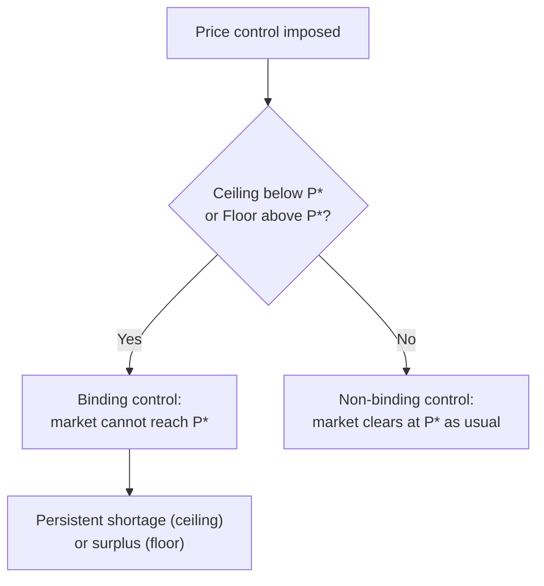

## Price Ceilings and Price Floors

### Definitions

**Price ceiling:** A legally established maximum price that sellers may charge for a good or service. A price ceiling only has an economic effect if it is set **below** the equilibrium price $P^*$; a ceiling set above $P^*$ is non-binding and has no effect on market outcomes.

**Price floor:** A legally established minimum price that sellers may accept for a good or service. A price floor only has an economic effect if it is set **above** the equilibrium price $P^*$; a floor set below $P^*$ is non-binding.

Both are examples of **price controls**: government interventions that prevent the market price from adjusting freely to clear supply and demand.

### Binding vs. Non-Binding Controls

**Key Points**

- Only binding controls have any allocative consequence.
- A binding price ceiling always creates a shortage (excess demand): $Q_D > Q_S$ at the controlled price.
- A binding price floor always creates a surplus (excess supply): $Q_S > Q_D$ at the controlled price.

### Price Ceilings: Mechanics

At a ceiling price $P_c < P^*$:

$$Q_D(P_c) > Q_S(P_c)$$

Quantity actually transacted is constrained by the **short side of the market** — the smaller of the two quantities — so the observed quantity traded is $Q_S(P_c)$, not $Q_D(P_c)$. Sellers will not produce more than $Q_S(P_c)$ at that price, regardless of how much buyers wish to purchase.

**Consequences of a binding price ceiling:**

- **Persistent shortage:** $Q_D(P_c) - Q_S(P_c)$ represents unmet demand.
- **Non-price rationing:** since price can no longer allocate the scarce good, other mechanisms emerge — queuing/waiting lines, first-come-first-served rules, seller discretion, favoritism, or formal rationing coupons.
- **Reduction in quantity supplied:** output falls from $Q^*$ to $Q_S(P_c)$, below the efficient level.
- **Black markets:** because some buyers are willing to pay more than $P_c$ (up to their WTP at the reduced quantity $Q_S(P_c)$, which is $D^{-1}(Q_S(P_c)) > P_c$), an incentive exists for illegal resale at prices above the ceiling.
- **Quality deterioration:** [Inference] in markets where quality is not perfectly observable or contractible (e.g., rental housing), sellers facing a binding ceiling may reduce non-price dimensions of quality (maintenance, service) as an alternative margin of adjustment, though the magnitude of this effect is empirically context-dependent.

**Example: Rent Control**

If the equilibrium monthly rent is $1,500 and a city imposes a ceiling of $1,000:

- At $1,000, quantity demanded (renters seeking units) exceeds quantity supplied (units landlords offer).
- Landlords supply only $Q_S(\$1{,}000)$ units — fewer than $Q^*$.
- Long waiting lists, under-the-table "key fees," and reduced apartment maintenance are commonly documented non-price adjustment margins.

### Price Floors: Mechanics

At a floor price $P_f > P^*$:

$$Q_S(P_f) > Q_D(P_f)$$

The quantity actually transacted is again bound by the short side of the market — here, $Q_D(P_f)$, since buyers will not purchase more than they demand at the elevated price, regardless of how much sellers wish to sell.

**Consequences of a binding price floor:**

- **Persistent surplus:** $Q_S(P_f) - Q_D(P_f)$ represents unsold output.
- **Reduction in quantity transacted:** output falls from $Q^*$ to $Q_D(P_f)$, below the efficient level — symmetric to the ceiling case.
- **Disposal or storage problem:** unsold surplus must be absorbed somehow — historically via government purchase and storage/destruction (common in agricultural price-support programs), or simply left unsold (as with labor under a minimum wage, where the "surplus" takes the form of unemployment/underemployment).
- **Non-price competition among sellers:** sellers may compete on quality, service, or other margins to be among those who successfully sell at $P_f$.

**Example: Minimum Wage**

If the equilibrium wage in a specific labor market is $12/hour and a minimum wage of $15/hour is imposed:

- At $15, quantity of labor supplied (workers wanting jobs) exceeds quantity demanded (jobs firms wish to fill).
- Employment settles at $Q_D(\$15)$ — the demand-side quantity — which is below both $Q^*$ and below the quantity of labor supplied at $15.
- The gap represents involuntary unemployment among those willing to work at $15 who cannot find a job.
- [Inference] The size of the employment effect in real minimum-wage markets is a heavily studied and empirically debated magnitude question, sensitive to the elasticity of labor demand in the specific market and the size of the wage increase relative to $P^*$; the direction of the basic competitive-model prediction (reduced employment below $Q^*$) is the standard theoretical result, though its empirical magnitude is contested in the labor economics literature.

### Diagrammatic Illustration

<svg xmlns="http://www.w3.org/2000/svg" viewBox="0 0 660 460" font-family="Helvetica, Arial, sans-serif">
<title>Price Ceiling and Price Floor (svg_diagram)</title>

<text x="60" y="20" font-size="15" font-weight="bold">Price Ceiling (Shortage)</text>

<line x1="60" y1="200" x2="280" y2="200" stroke="#333" stroke-width="2" />

<line x1="60" y1="200" x2="60" y2="30" stroke="#333" stroke-width="2" />

<line x1="80" y1="185" x2="240" y2="45" stroke="`#1b5e20`" stroke-width="2" />

<text x="230" y="42" font-size="11" fill="`#1b5e20`">S</text>

<line x1="80" y1="45" x2="240" y2="185" stroke="`#0d47a1`" stroke-width="2" />

<text x="230" y="182" font-size="11" fill="`#0d47a1`">D</text>

<circle cx="160" cy="115" r="4" fill="#000" />

<text x="168" y="110" font-size="11">E (P*)</text>

<line x1="60" y1="150" x2="280" y2="150" stroke="`#c62828`" stroke-width="2" stroke-dasharray="5,3" />

<text x="285" y="153" font-size="11" fill="`#c62828`">Pc (ceiling)</text>

<line x1="123" y1="150" x2="123" y2="200" stroke="#888" stroke-dasharray="2,2" />

<line x1="207" y1="150" x2="207" y2="200" stroke="#888" stroke-dasharray="2,2" />

<text x="118" y="215" font-size="10">Qs</text>

<text x="200" y="215" font-size="10">Qd</text>

<line x1="123" y1="145" x2="207" y2="145" stroke="`#c62828`" stroke-width="3" />

<text x="130" y="135" font-size="10" fill="`#c62828`">Shortage</text>

<text x="380" y="20" font-size="15" font-weight="bold">Price Floor (Surplus)</text>

<line x1="380" y1="200" x2="600" y2="200" stroke="#333" stroke-width="2" />

<line x1="380" y1="200" x2="380" y2="30" stroke="#333" stroke-width="2" />

<line x1="400" y1="185" x2="560" y2="45" stroke="`#1b5e20`" stroke-width="2" />

<text x="550" y="42" font-size="11" fill="`#1b5e20`">S</text>

<line x1="400" y1="45" x2="560" y2="185" stroke="`#0d47a1`" stroke-width="2" />

<text x="550" y="182" font-size="11" fill="`#0d47a1`">D</text>

<circle cx="480" cy="115" r="4" fill="#000" />

<text x="488" y="110" font-size="11">E (P*)</text>

<line x1="380" y1="80" x2="600" y2="80" stroke="`#c62828`" stroke-width="2" stroke-dasharray="5,3" />

<text x="605" y="83" font-size="11" fill="`#c62828`">Pf (floor)</text>

<line x1="428" y1="80" x2="428" y2="200" stroke="#888" stroke-dasharray="2,2" />

<line x1="513" y1="80" x2="513" y2="200" stroke="#888" stroke-dasharray="2,2" />

<text x="422" y="215" font-size="10">Qd</text>

<text x="507" y="215" font-size="10">Qs</text>

<line x1="428" y1="75" x2="513" y2="75" stroke="`#c62828`" stroke-width="3" />

<text x="435" y="65" font-size="10" fill="`#c62828`">Surplus</text>

</svg>

### Welfare Analysis

**Price Ceiling — Surplus Effects**

| Group | Effect | Explanation |
| --- | --- | --- |
| Consumers who still buy | Gain per unit | Pay $P_c$ instead of $P^*$ |
| Consumers rationed out | Lose entirely | Cannot obtain the good despite $MB > P_c$ |
| Net effect on CS | Ambiguous | Depends on relative size of price-gain vs. quantity-loss effects |
| Producers | Lose | Receive lower price and sell less quantity than at $P^*$ |
| Deadweight loss | Yes | Triangle from $Q_S(P_c)$ to $Q^*$ where $MB > MC$ but no trade occurs |

**Price Floor — Surplus Effects**

| Group | Effect | Explanation |
| --- | --- | --- |
| Producers who still sell | Gain per unit | Receive $P_f$ instead of $P^*$ |
| Producers unable to sell | Lose entirely | Cannot sell despite $MC < P_f$ |
| Net effect on PS | Ambiguous | Depends on relative size of price-gain vs. quantity-loss effects |
| Consumers | Lose | Pay higher price and consume less quantity than at $P^*$ |
| Deadweight loss | Yes | Triangle from $Q_D(P_f)$ to $Q^*$ where $MB > MC$ but no trade occurs |

In both cases, **total surplus falls** relative to the competitive equilibrium, because quantity transacted moves away from $Q^*$ (the surplus-maximizing quantity established in the theory of market efficiency), generating deadweight loss regardless of which side of the market benefits from the controlled price.

### Worked Numerical Example — Price Ceiling

**Example**

Given:

$$Q_D = 100 - 2P, \qquad Q_S = -20 + 3P$$

Equilibrium (uncontrolled): $P^* = 24$, $Q^* = 52$ (as established in prior equilibrium calculations).

Suppose a ceiling is imposed at $P_c = 18$ (below $P^*$, hence binding):

$$Q_D(18) = 100 - 2(18) = 64$$

$$Q_S(18) = -20 + 3(18) = 34$$

**Output**

| Measure | Value |
| --- | --- |
| Quantity demanded at ceiling | 64 |
| Quantity supplied at ceiling | 34 |
| Quantity actually transacted | 34 (short side) |
| Shortage | $64 - 34 = 30$ units |

Since only 34 units are produced (versus 52 at equilibrium), the market has moved further from the efficient quantity, and the shortage of 30 units represents unmet demand that must be resolved through non-price rationing.

### Worked Numerical Example — Price Floor

**Example**

Using the same demand and supply functions, suppose a floor is imposed at $P_f = 30$ (above $P^*=24$, hence binding):

$$Q_D(30) = 100 - 2(30) = 40$$

$$Q_S(30) = -20 + 3(30) = 70$$

**Output**

| Measure | Value |
| --- | --- |
| Quantity demanded at floor | 40 |
| Quantity supplied at floor | 70 |
| Quantity actually transacted | 40 (short side) |
| Surplus (unsold output) | $70 - 40 = 30$ units |

Only 40 units are transacted, again below the efficient $Q^* = 52$, with 30 units of unsold production representing the excess supply that firms are willing but unable to sell.

### Comparison Summary

| Feature | Price Ceiling | Price Floor |
| --- | --- | --- |
| Direction relative to $P^*$ | Set below | Set above |
| Binding condition | $P_c < P^*$ | $P_f > P^*$ |
| Market imbalance | Shortage ($Q_D > Q_S$) | Surplus ($Q_S > Q_D$) |
| Quantity transacted | $Q_S(P_c)$ (short side = supply) | $Q_D(P_f)$ (short side = demand) |
| Group facing rationing | Buyers | Sellers |
| Common real-world examples | Rent control, price caps on essentials during shortages, interest rate caps (usury laws) | Minimum wage, agricultural price supports, tariff-equivalent floors |
| Effect on quantity vs. $Q^*$ | Decreases | Decreases |
| Deadweight loss | Yes | Yes |

### Additional Effects of Binding Controls

**Key Points**

- **Search and matching costs:** buyers under a ceiling (or sellers under a floor) expend real resources — time, effort — searching for a transaction partner, which is itself a form of surplus dissipation not captured in the basic DWL triangle.
- **Persistence of shadow/informal markets:** binding ceilings create incentive for resale above the legal maximum; binding floors create incentive for below-floor transactions (e.g., informal or "off the books" wage arrangements), both undermining the intended policy target.
- **Dynamic effects:** [Inference] over longer time horizons, supply curves are typically more elastic than in the short run (producers can exit or reduce investment in ceiling-affected markets, e.g., landlords converting rental units to condos), which tends to enlarge the resulting shortage or surplus and the associated deadweight loss relative to a short-run analysis; the specific magnitude of this dynamic elasticity effect depends on the market studied.

### Common Pitfalls

**Key Points**

- Assuming a price ceiling or floor changes the underlying demand and supply curves — it does not; it only restricts which price/quantity combination on those curves can legally be realized.
- Forgetting to check whether the control is binding before analyzing its effects; a non-binding control produces no change to the original equilibrium.
- Assuming quantity transacted under a ceiling equals quantity demanded — it does not; the actual transacted quantity is always constrained to the *smaller* of $Q_D$ and $Q_S$ at the controlled price (the short-side rule).
- Treating the entire surplus/shortage gap as deadweight loss — the DWL is only the triangle representing forgone efficient trades between the new (restricted) quantity and $Q^*$; the surplus/shortage gap itself measures the size of the market imbalance, a related but distinct concept.

### Conclusion

Price ceilings and price floors are direct government interventions in the price mechanism, effective only when set on the "wrong" side of equilibrium price. Both types of binding control push the quantity transacted away from the surplus-maximizing level $Q^*$, generating deadweight loss, and both replace price-based allocation with an inefficient combination of rationing, waiting, or unsold surplus. While a ceiling protects buyers from high prices and a floor protects sellers from low prices for those who remain in the market, both create losers on the "excluded" side — buyers unable to purchase under a ceiling, sellers unable to sell under a floor — making price controls a canonical illustration of the trade-off between distributional intent and allocative efficiency.

**Related Topics**

- Market efficiency and total surplus (baseline against which price controls are measured)
- Deadweight loss and its formal calculation
- Tax incidence and the wedge between buyer and seller prices
- Black markets and informal-sector responses to binding controls
- Minimum wage empirics and monopsony labor markets
- Agricultural price supports and government purchase/storage programs
- Rent control policy design (e.g., vacancy decontrol, rent stabilization variants)