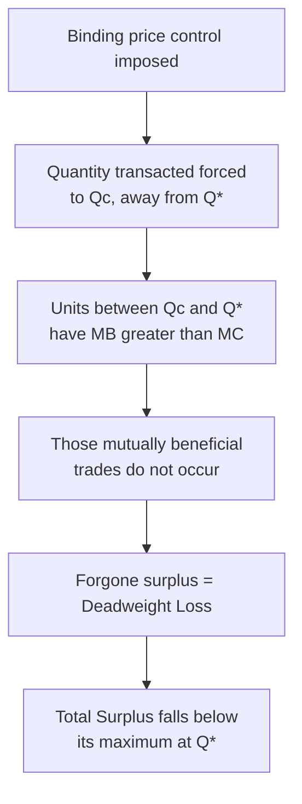
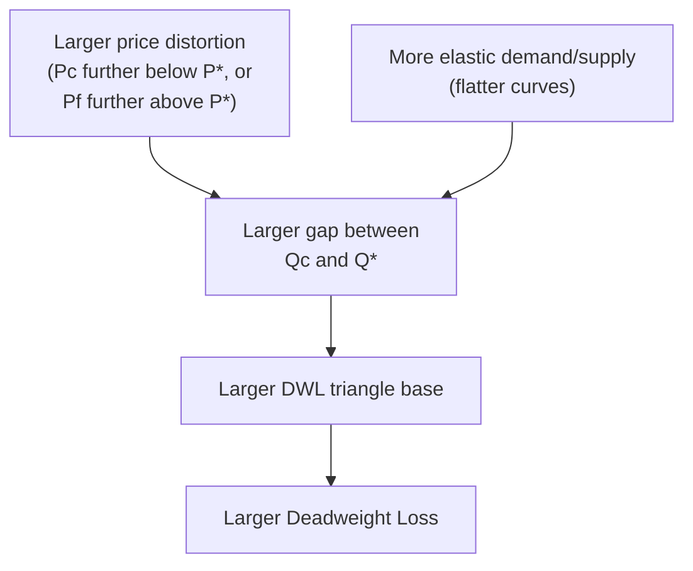

## Deadweight Loss from Price Controls

### Definition

Deadweight loss (DWL) from a price control is the reduction in total surplus that results when a binding price ceiling or price floor forces the quantity transacted away from the competitive equilibrium quantity $Q^*$. It represents the value of mutually beneficial trades — units for which marginal benefit exceeds marginal cost — that fail to occur solely because the price control prevents the market from reaching the quantity at which those trades would otherwise take place.

$$DWL = TS(Q^*) - TS(Q_{\text{control}})$$

where $TS(Q^*)$ is the maximum total surplus achieved at the uncontrolled equilibrium and $TS(Q_{\text{control}})$ is total surplus at the quantity actually transacted under the control.

### The Mechanism: Why Restricting Quantity Destroys Surplus

As established in the theory of market efficiency, total surplus is maximized at $Q^*$ because that is where marginal benefit ($MB$, given by the demand curve) equals marginal cost ($MC$, given by the supply curve). Any binding price control forces the transacted quantity to a level $Q_c \neq Q^*$. For every unit between $Q_c$ and $Q^*$:

$$MB(Q) > MC(Q) \quad \text{for } Q_c < Q < Q^*$$

Each such unit would generate positive surplus $[MB(Q) - MC(Q)]$ if traded, but is not traded because the control restricts total quantity to $Q_c$. The sum of this forgone surplus across all untraded units between $Q_c$ and $Q^*$ constitutes the deadweight loss.

### Key Structural Point: The Short-Side Rule

Under a binding price ceiling at $P_c < P^*$, quantity transacted equals $Q_S(P_c)$ (quantity supplied, the smaller of the two quantities). Under a binding price floor at $P_f > P^*$, quantity transacted equals $Q_D(P_f)$ (quantity demanded, again the smaller quantity). In both cases:

$$Q_c < Q^*$$

**Key Points**

- Both ceilings and floors reduce the *quantity transacted* relative to $Q^*$ — they never increase it.
- Because deadweight loss arises specifically from a quantity distortion (not from the price itself), both types of control generate DWL of the same qualitative kind, even though a ceiling benefits buyers and a floor benefits sellers.
- The DWL triangle is always bounded on one side by $Q_c$ and on the other by $Q^*$, regardless of which control produced $Q_c$.

### Diagrammatic Illustration

<svg xmlns="http://www.w3.org/2000/svg" viewBox="0 0 640 440" font-family="Helvetica, Arial, sans-serif">
<title>Deadweight Loss from a Binding Price Ceiling (svg_diagram)</title>

<line x1="60" y1="380" x2="600" y2="380" stroke="#333" stroke-width="2" />
<line x1="60" y1="380" x2="60" y2="20" stroke="#333" stroke-width="2" />
<text x="580" y="400" font-size="14">Quantity</text>
<text x="20" y="30" font-size="14">Price</text>

<line x1="90" y1="360" x2="480" y2="60" stroke="#1b5e20" stroke-width="2.5" />
<text x="470" y="55" font-size="13" fill="#1b5e20">S (MC)</text>

<line x1="90" y1="60" x2="480" y2="360" stroke="#0d47a1" stroke-width="2.5" />
<text x="470" y="355" font-size="13" fill="#0d47a1">D (MB)</text>

<circle cx="285" cy="210" r="5" fill="#000" />
<text x="295" y="205" font-size="13">E (P*, Q*)</text>

<line x1="60" y1="270" x2="600" y2="270" stroke="#c62828" stroke-width="2" stroke-dasharray="6,4" />
<text x="605" y="273" font-size="12" fill="#c62828">Pc (ceiling)</text>

<line x1="200" y1="270" x2="200" y2="380" stroke="#888" stroke-dasharray="2,2" />
<text x="192" y="395" font-size="11">Qc</text>
<line x1="285" y1="210" x2="285" y2="380" stroke="#888" stroke-dasharray="2,2" />
<text x="278" y="395" font-size="11">Q*</text>

<polygon points="200,270 285,210 200,157" fill="#f9a825" fill-opacity="0.45" stroke="#f57f17" stroke-width="1.5" />
<text x="150" y="200" font-size="13" fill="#e65100" font-weight="bold">DWL</text>

<circle cx="200" cy="270" r="4" fill="#1b5e20" />

<circle cx="200" cy="157" r="4" fill="#0d47a1" />
</svg>

### Formal Geometry of the DWL Triangle

For linear (or locally linear) demand and supply, the deadweight loss triangle has:

- **Base** = $|Q^* - Q_c|$ (the quantity gap)
- **Height** = $|D(Q_c) - S(Q_c)|$ (the vertical gap between the demand and supply curves at $Q_c$, i.e., the difference between what the marginal unit is worth to buyers and what it costs to produce)

$$DWL = \frac{1}{2} \times \text{base} \times \text{height} = \frac{1}{2} \times |Q^* - Q_c| \times |D(Q_c) - S(Q_c)|$$

This triangular approximation is exact for linear demand and supply curves and is the standard formula used in introductory analysis.

### Worked Numerical Example — Deadweight Loss from a Price Ceiling

**Example**

Given:

$$Q_D = 100 - 2P, \qquad Q_S = -20 + 3P$$

From prior analysis: equilibrium $P^* = 24$, $Q^* = 52$.

A ceiling is imposed at $P_c = 18$:

$$Q_S(18) = -20 + 3(18) = 34 = Q_c$$

To find the height of the DWL triangle, evaluate the **inverse demand curve** at $Q_c = 34$ (this gives the marginal buyer's willingness to pay for the 34th unit, which exceeds $P_c$ since fewer units are available than buyers want):

Inverse demand: $P = 50 - 0.5Q$

$$D^{-1}(34) = 50 - 0.5(34) = 33$$

This means the 34th unit is valued at $33 by the marginal buyer, while it costs only $P_c = 18$ … but note the correct height for DWL uses the marginal cost of the 34th unit (which, at the margin of production, equals $P_c$ under a ceiling, since suppliers set $MC = P_c$ at their chosen output) versus the marginal benefit of that unit ($33). So:

$$\text{Height} = D^{-1}(Q_c) - P_c = 33 - 18 = 15$$

$$\text{Base} = Q^* - Q_c = 52 - 34 = 18$$

$$DWL = \frac{1}{2} \times 18 \times 15 = 135$$

**Output**

| Measure | Value |
| --- | --- |
| Equilibrium quantity $Q^*$ | 52 |
| Quantity transacted under ceiling $Q_c$ | 34 |
| Marginal buyer's WTP at $Q_c$ | $33 |
| Ceiling price $P_c$ | $18 |
| Deadweight loss | $135 |

### Worked Numerical Example — Deadweight Loss from a Price Floor

**Example**

Using the same market, a floor is imposed at $P_f = 30$:

$$Q_D(30) = 100 - 2(30) = 40 = Q_c$$

Here, quantity transacted is bound by demand, so evaluate the **inverse supply curve** at $Q_c = 40$ to find the marginal cost of that unit (which is below $P_f$, since fewer units are demanded than sellers wish to supply at $P_f$):

Inverse supply: $P = (20+Q)/3$

$$S^{-1}(40) = (20+40)/3 = 20$$

$$\text{Height} = P_f - S^{-1}(Q_c) = 30 - 20 = 10$$

$$\text{Base} = Q^* - Q_c = 52 - 40 = 12$$

$$DWL = \frac{1}{2} \times 12 \times 10 = 60$$

**Output**

| Measure | Value |
| --- | --- |
| Equilibrium quantity $Q^*$ | 52 |
| Quantity transacted under floor $Q_c$ | 40 |
| Marginal seller's cost at $Q_c$ | $20 |
| Floor price $P_f$ | $30 |
| Deadweight loss | $60 |

### Determinants of DWL Magnitude

**Key Points**

- **Distance of the control from $P^*$:** the further $P_c$ is below $P^*$ (or $P_f$ above $P^*$), the further $Q_c$ is pushed from $Q^*$, and DWL grows — approximately with the *square* of the price distortion for linear curves, since DWL is a triangular area.
- **Elasticity of demand and supply:** flatter (more elastic) curves produce a larger $Q_c$ change for a given price distortion, which enlarges the base of the DWL triangle and therefore increases DWL. Steeper (more inelastic) curves shrink the quantity response and reduce DWL for the same price distortion.
- **Curvature/shape of demand and supply:** for non-linear curves, the DWL is calculated via integration of $[MB(Q) - MC(Q)]$ over the gap between $Q_c$ and $Q^*$, rather than the simple triangle formula, though the triangle remains a standard first-order approximation.

$$DWL_{\text{general}} = \int_{Q_c}^{Q^*} \big[D(Q) - S(Q)\big]\, dQ$$

### Distinguishing DWL from the Shortage/Surplus Gap

**Key Points**

- The **shortage** (under a ceiling) or **surplus** (under a floor) measures the *imbalance between quantity demanded and quantity supplied* at the controlled price — it is a measure of market disequilibrium, not lost value.
- The **deadweight loss** measures the *lost surplus* from the units that go untraded between $Q_c$ and $Q^*$ — it is a welfare measure, not a quantity measure.
- These are numerically different quantities that should not be conflated: the shortage/surplus gap uses $Q_D(P_{\text{control}}) - Q_S(P_{\text{control}})$, while DWL's base uses $Q^* - Q_c$.

| Concept | Formula | What It Measures |
| --- | --- | --- |
| Shortage (ceiling) | $Q_D(P_c) - Q_S(P_c)$ | Excess demand at the controlled price |
| Surplus (floor) | $Q_S(P_f) - Q_D(P_f)$ | Excess supply at the controlled price |
| Deadweight loss | $\tfrac{1}{2}\|Q^*-Q_c\|\times\|D(Q_c)-S(Q_c)\|$ | Value of forgone efficient trades |

### DWL as Part of a Complete Surplus Accounting

Under a price ceiling, total surplus is redistributed and partly destroyed:

$$TS_{\text{ceiling}} = CS_{\text{ceiling}} + PS_{\text{ceiling}} = TS(Q^*) - DWL$$

There is no third party capturing the lost value (unlike a tax, where the "wedge" partly becomes government revenue rather than pure loss). In a price ceiling or floor, the DWL triangle represents surplus that vanishes entirely — it accrues to no one.

**Example**

Continuing the ceiling example ($P_c=18$, $Q_c=34$):

- $CS_{\text{ceiling}}$ = area between demand curve and $P_c$, from 0 to $Q_c=34$ (larger per-unit gain for surviving buyers, but over a smaller quantity — net effect ambiguous relative to original CS).
- $PS_{\text{ceiling}}$ = area between $P_c$ and supply curve, from 0 to $Q_c=34$ (necessarily smaller than original PS, since both price received and quantity sold have fallen).
- The $135 DWL calculated above is surplus that existed at $Q^*=52$ but disappears entirely once quantity falls to 34 — it is not transferred to buyers, sellers, or government.

### Common Pitfalls

**Key Points**

- Using $P_c$ or $P_f$ directly as one side of the DWL triangle's height — the correct height requires evaluating the *other* curve (demand's inverse function under a ceiling, supply's inverse function under a floor) at $Q_c$ to find the true marginal-benefit/marginal-cost gap.
- Calculating DWL using the shortage or surplus quantity gap instead of the $Q^* - Q_c$ gap — these use different quantity pairs and yield different (incorrect) results if swapped.
- Assuming DWL is symmetric between a ceiling and a floor of "equal size" (e.g., $6 below vs. $6 above $P^*$) — DWL magnitude depends on the *elasticities* on each side of the market at the relevant quantities, which are generally asymmetric, so equal price deviations do not produce equal DWL in general. [Inference] Exact symmetry would require special conditions on the functional forms of demand and supply (e.g., perfectly linear and symmetric curves around $P^*$), which is not the case in most real markets.
- Forgetting that DWL requires the control to be *binding*; a non-binding ceiling or floor produces zero deadweight loss since $Q_c = Q^*$.

### Conclusion

Deadweight loss from price controls quantifies the efficiency cost of preventing a market from transacting at its equilibrium quantity. Whether generated by a ceiling (which restricts quantity to the supply-side amount) or a floor (which restricts quantity to the demand-side amount), the loss arises from the same underlying mechanism: units for which marginal benefit exceeds marginal cost go untraded. The magnitude of this loss depends jointly on how far the control price sits from $P^*$ and on the elasticities of demand and supply, and — unlike a tax wedge — the lost surplus under a price control accrues to no one, making it a pure efficiency cost of the intervention.

**Related Topics**

- Market efficiency and total surplus (baseline surplus-maximizing benchmark)
- Price ceilings and price floors (full mechanics of shortage/surplus generation)
- Tax incidence and deadweight loss from taxation (comparison of wedge-based vs. control-based DWL)
- Elasticity and its role in determining the size of deadweight loss
- Black markets and enforcement costs as additional welfare losses beyond the standard triangle
- Quotas and their equivalence to price floors/ceilings in quantity-restriction terms
- Second-best theory: interactions between multiple simultaneous market distortions