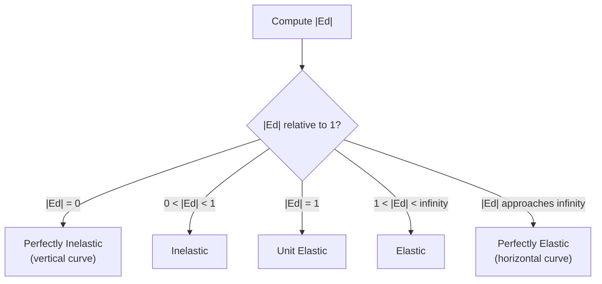
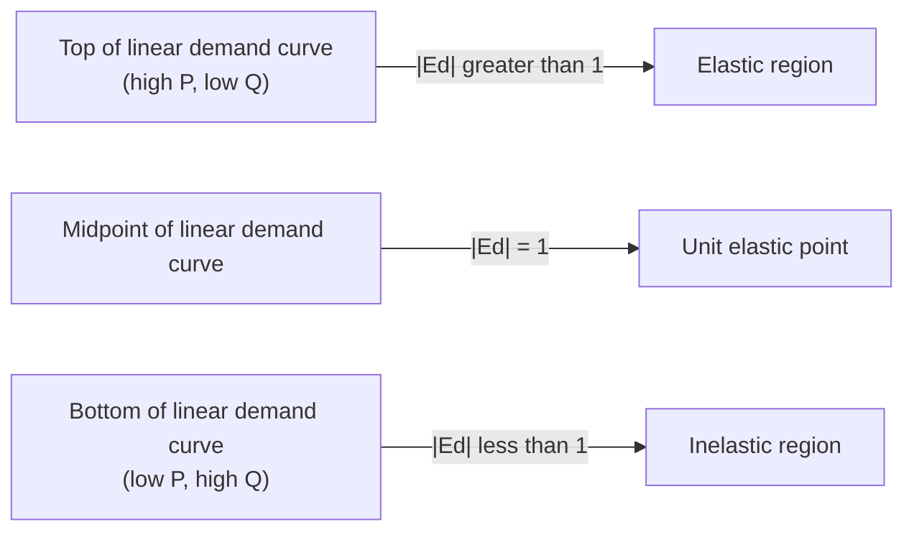

## Price Elasticity of Demand

### Definition

Price elasticity of demand ($E_d$ or $\varepsilon_d$) measures the responsiveness of quantity demanded to a change in the price of a good, expressed as the ratio of the percentage change in quantity demanded to the percentage change in price.

$$E_d = \frac{\%\Delta Q_D}{\%\Delta P} = \frac{\Delta Q / Q}{\Delta P / P}$$

Because demand curves slope downward (price and quantity demanded move in opposite directions), $E_d$ is mathematically negative for virtually all goods. By convention, economists typically report and discuss its **absolute value** ($|E_d|$) when classifying elasticity, though the signed value is retained in formal derivations.

### Methods of Calculation

**Point Elasticity**

Point elasticity measures elasticity at a single, specific point on the demand curve, using calculus:

$$E_d = \frac{dQ}{dP} \times \frac{P}{Q}$$

This is the appropriate method when an explicit demand function $Q = D(P)$ is given and the exact point of evaluation is known.

**Arc (Midpoint) Elasticity**

Arc elasticity measures elasticity between two points on the demand curve and avoids the asymmetry problem of using simple percentage changes (where computing elasticity from $A \to B$ gives a different denominator than from $B \to A$). It uses the average of the two endpoints as the base:

$$E_d = \frac{(Q_2 - Q_1)/[(Q_1+Q_2)/2]}{(P_2 - P_1)/[(P_1+P_2)/2]}$$

The midpoint formula is the standard method used in introductory courses when only two discrete price-quantity pairs are given, because it yields the same elasticity value regardless of the direction of the price change.

### Classification of Elasticity Values

| $\|E_d\|$ Value | Classification | Interpretation |
| --- | --- | --- |
| $\|E_d\| = 0$ | Perfectly inelastic | Quantity demanded does not respond to price at all (vertical demand curve) |
| $0 < \|E_d\| < 1$ | Inelastic | Quantity demanded changes proportionally less than price |
| $\|E_d\| = 1$ | Unit elastic | Quantity demanded changes by exactly the same percentage as price |
| $1 < \|E_d\| < \infty$ | Elastic | Quantity demanded changes proportionally more than price |
| $\|E_d\| \to \infty$ | Perfectly elastic | Any price increase drives quantity demanded to zero (horizontal demand curve) |

### Diagrammatic Illustration of Extreme Cases

<svg xmlns="http://www.w3.org/2000/svg" viewBox="0 0 660 320" font-family="Helvetica, Arial, sans-serif">
<title>Perfectly Inelastic vs. Perfectly Elastic Demand (svg_diagram)</title>

<text x="60" y="20" font-size="14" font-weight="bold">Perfectly Inelastic (Ed = 0)</text>

<line x1="60" y1="260" x2="280" y2="260" stroke="#333" stroke-width="2" />

<line x1="60" y1="260" x2="60" y2="40" stroke="#333" stroke-width="2" />

<line x1="170" y1="250" x2="170" y2="50" stroke="`#0d47a1`" stroke-width="2.5" />

<text x="178" y="60" font-size="12" fill="`#0d47a1`">D</text>

<text x="270" y="278" font-size="11">Quantity</text>

<text x="30" y="45" font-size="11">Price</text>

<text x="400" y="20" font-size="14" font-weight="bold">Perfectly Elastic (Ed → ∞)</text>

<line x1="400" y1="260" x2="620" y2="260" stroke="#333" stroke-width="2" />

<line x1="400" y1="260" x2="400" y2="40" stroke="#333" stroke-width="2" />

<line x1="410" y1="150" x2="610" y2="150" stroke="`#0d47a1`" stroke-width="2.5" />

<text x="590" y="140" font-size="12" fill="`#0d47a1`">D</text>

<text x="610" y="278" font-size="11">Quantity</text>

<text x="370" y="45" font-size="11">Price</text>

</svg>

### Determinants of Price Elasticity of Demand

**Key Points**

- **Availability of substitutes:** the more close substitutes a good has, the more elastic its demand — consumers can easily switch away when price rises.
- **Necessities vs. luxuries:** necessities tend to have inelastic demand (consumers must purchase them regardless of price); luxuries tend to have elastic demand.
- **Share of budget:** goods that represent a small fraction of a consumer's total spending tend to be inelastic (the price change is barely felt), while goods commanding a large budget share tend to be more elastic.
- **Time horizon:** demand becomes more elastic over longer time periods, as consumers have more time to find substitutes, change habits, or adjust consumption patterns. Short-run demand for the same good is typically more inelastic than long-run demand.
- **Definition of the market:** narrowly defined goods (e.g., "Granny Smith apples") tend to have more elastic demand than broadly defined categories (e.g., "food"), since narrow categories have more available substitutes.

### Elasticity Varies Along a Linear Demand Curve

A critical and frequently tested property: **for a linear (straight-line) demand curve, the slope is constant, but the elasticity is not constant** — it varies continuously along the curve.

$$Q = a - bP \quad \Rightarrow \quad \frac{dQ}{dP} = -b \text{ (constant slope)}$$

$$E_d = \frac{dQ}{dP} \times \frac{P}{Q} = -b \times \frac{P}{a-bP}$$

Since $P/Q$ changes at every point along the curve even though $-b$ does not, $|E_d|$ takes different values at different points:

- Near the **vertical (price) intercept**, $Q \to 0$, so $P/Q \to \infty$, meaning $|E_d| \to \infty$ (elastic region).
- Near the **horizontal (quantity) intercept**, $P \to 0$, so $P/Q \to 0$, meaning $|E_d| \to 0$ (inelastic region).
- At the **exact midpoint** of a linear demand curve, $|E_d| = 1$ (unit elastic).

### Elasticity and Total Revenue

Total revenue $TR = P \times Q$. The relationship between elasticity and how $TR$ responds to a price change is one of the most tested applications of this concept.

| Region | Price Increase → TR | Price Decrease → TR |
| --- | --- | --- |
| Elastic ($\|E_d\| > 1$) | TR falls | TR rises |
| Unit elastic ($\|E_d\| = 1$) | TR unchanged (at maximum) | TR unchanged (at maximum) |
| Inelastic ($\|E_d\| < 1$) | TR rises | TR falls |

**Intuition:** In the elastic region, the percentage drop in quantity from a price increase outweighs the percentage gain in price, so revenue falls. In the inelastic region, quantity falls by proportionally less than price rises, so revenue rises.

This relationship implies that **total revenue is maximized at exactly the unit-elastic point** on a linear demand curve — the midpoint.

**Example**

For linear demand $Q = 100 - 2P$:

$$TR(P) = P \times Q = P(100-2P) = 100P - 2P^2$$

Maximizing: $\frac{d(TR)}{dP} = 100 - 4P = 0 \Rightarrow P = 25$

At $P=25$: $Q = 100 - 2(25) = 50$, and $E_d = -2 \times \frac{25}{50} = -1$ (unit elastic), confirming that TR is maximized exactly where $|E_d|=1$.

**Output**

| $P$ | $Q$ | $TR = PQ$ | $\|E_d\|$ (point) | Elastic Region? |
| --- | --- | --- | --- | --- |
| 10 | 80 | 800 | $2(10/80)=0.25$ | Inelastic |
| 25 | 50 | 1,250 | $2(25/50)=1.00$ | Unit elastic |
| 40 | 20 | 800 | $2(40/20)=4.00$ | Elastic |

This table confirms: moving from $P=10$ to $P=25$ (still inelastic region), a price increase raises TR; moving from $P=25$ to $P=40$ (elastic region), a further price increase lowers TR back down.

### Special Cases: Constant-Elasticity Demand

A demand curve of the form $Q = AP^{-\varepsilon}$ (a power/log-linear function) has **constant elasticity equal to $-\varepsilon$ at every point**, unlike the linear case. This functional form is common in applied/empirical demand estimation precisely because it yields a single elasticity parameter valid across the whole curve.

$$\ln Q = \ln A - \varepsilon \ln P \quad \Rightarrow \quad E_d = -\varepsilon \text{ (constant)}$$

### Elasticity and Tax/Price-Control Incidence (Cross-Reference)

**Key Points**

- The more inelastic a group's demand, the larger the share of a per-unit tax that group bears, and the smaller the deadweight loss generated relative to a more elastic scenario — this connects directly to tax incidence analysis.
- Flatter (more elastic) demand curves widen the base of the deadweight-loss triangle under a given price distortion (price ceiling, floor, or tax), producing larger DWL, consistent with the general elasticity-DWL relationship established in the analysis of deadweight loss from price controls.
- Perfectly inelastic demand implies buyers bear 100% of a per-unit tax and a price ceiling below $P^*$ generates the *maximum possible reduction in CS per unit* without any offsetting quantity-side loss, since quantity does not adjust at all. [Inference] This is a limiting theoretical case; real-world demand curves are rarely perfectly inelastic across a meaningful price range.

### Common Pitfalls

**Key Points**

- Confusing **elasticity** with **slope** — a steep demand curve is not necessarily inelastic at every point, and a flat demand curve is not necessarily elastic at every point; elasticity depends on both the slope *and* the specific $P/Q$ ratio at the point of evaluation.
- Assuming a linear demand curve has one single elasticity value — it does not; elasticity varies continuously from $\infty$ at the price intercept to $0$ at the quantity intercept.
- Mixing up the direction of the TR relationship — remembering "elastic: price and revenue move opposite; inelastic: price and revenue move together" is the standard mnemonic, but it must be tied to the correct region of the curve for that specific good.
- Forgetting to take the absolute value when classifying elasticity as elastic/inelastic — the raw computed value of $E_d$ is negative for standard goods, and comparing $-2$ to $-0.5$ using signed values without taking absolute value produces the wrong ranking (since $-2 < -0.5$ numerically, but $|-2| > |-0.5|$ in elasticity terms).

### Conclusion

Price elasticity of demand quantifies how sensitively quantity demanded reacts to price changes, and its value — ranging from perfectly inelastic to perfectly elastic — is shaped by the availability of substitutes, the necessity of the good, its budget share, and the time horizon under consideration. Because elasticity varies along a linear demand curve even though slope does not, the point or arc of evaluation must always be specified. The elasticity value directly determines how total revenue responds to price changes, making this concept a foundational tool for pricing decisions, tax incidence analysis, and the study of deadweight loss under market interventions.

**Related Topics**

- Price elasticity of supply
- Cross-price elasticity of demand (substitutes and complements)
- Income elasticity of demand (normal vs. inferior goods)
- Tax incidence and the elasticity-based sharing of tax burden
- Deadweight loss and its relationship to elasticity magnitude
- Revenue-maximizing pricing strategies for firms with market power
- Empirical demand estimation methods (log-linear models, instrumental variables)