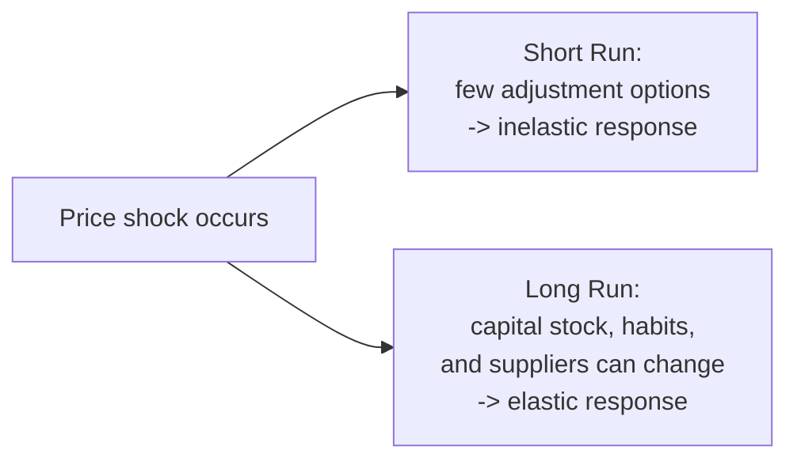

## Determinants of Price Elasticity of Demand

### Overview

The magnitude of price elasticity of demand for any given good is not fixed by the good's identity alone — it is shaped by a set of underlying structural factors. Understanding these determinants allows prediction of whether a good is likely to exhibit elastic or inelastic demand *before* any empirical estimation is performed, and explains why the same good can have different elasticities across different contexts, markets, and time horizons.

### 1. Availability of Close Substitutes

**Key Points**

- This is generally regarded as the single most important determinant of elasticity.
- The more close substitutes available for a good, the more elastic its demand, because consumers can easily switch to an alternative when the good's price rises.
- The fewer substitutes available, the more inelastic demand becomes, since consumers have limited alternatives and must continue purchasing even as price rises.

**Example**

A specific brand of butter (e.g., one particular supermarket brand) has highly elastic demand, since other brands of butter and margarine are close substitutes — a small price increase causes many buyers to switch away. Butter *as a broad category*, by contrast, has more inelastic demand, since the category itself has fewer close substitutes (margarine being only a partial substitute for some consumers).

### 2. Necessities vs. Luxuries

**Key Points**

- Necessities (staple foods, basic utilities, essential medications) tend to have inelastic demand, because consumers must continue purchasing them even when prices rise — there is limited scope to reduce consumption.
- Luxuries (jewelry, vacations, high-end electronics) tend to have elastic demand, because consumption of these goods can be postponed, reduced, or foregone entirely when prices rise without threatening basic wellbeing.
- This classification is not absolute — it depends on the consumer's circumstances and the specific good; what functions as a luxury for one consumer segment may be closer to a necessity for another (e.g., a car in a location with no public transit versus a car in a dense urban center with alternatives).

### 3. Share of the Good in the Consumer's Budget

**Key Points**

- Goods that make up a small fraction of total consumer spending (salt, matches, toothpicks) tend to have inelastic demand, because even a large percentage price increase translates into a negligible absolute change in the consumer's total expenditure, generating little incentive to search for alternatives or reduce consumption.
- Goods that command a large share of the household budget (housing, automobiles, higher education) tend to have more elastic demand, because a price change has a materially larger impact on the consumer's overall budget constraint, creating a stronger incentive to adjust the quantity purchased.

### 4. Time Horizon

**Key Points**

- Demand for the same good becomes progressively more elastic as the time horizon lengthens.
- In the **short run**, consumers face fixed habits, existing capital stock (appliances, vehicles), and limited information about alternatives, so quantity demanded responds only weakly to a price change — demand is relatively inelastic.
- In the **long run**, consumers can adjust behavior more fully: replacing appliances with more efficient models, relocating, changing suppliers, or altering consumption habits — demand becomes progressively more elastic.

**Example**

Gasoline demand is a canonical illustration: in the short run, a driver who owns a car and lives far from work has few immediate alternatives to buying gasoline despite a price spike, so short-run demand is inelastic. Over several years, the same driver can purchase a more fuel-efficient vehicle, relocate closer to work, or shift to public transit, making long-run demand for gasoline substantially more elastic than short-run demand.

### 5. Breadth of Market/Good Definition

**Key Points**

- Narrowly defined goods have more elastic demand than broadly defined categories, because a narrow definition has more available substitutes (other narrowly defined goods within the broader category).
- Broadly defined categories have fewer substitutes by construction (there is nothing "outside" the category to switch to), making demand for the category as a whole more inelastic.

**Example**

Demand for "Coca-Cola" (a specific brand) is more elastic than demand for "cola" (the broader category), which is in turn more elastic than demand for "soft drinks" (an even broader category), which is more elastic than demand for "beverages" as a whole. At each step of broadening the definition, the number of available substitutes shrinks, so demand becomes more inelastic.

| Market Definition | Relative Elasticity |
| --- | --- |
| Specific brand (e.g., a single cola brand) | Most elastic |
| Product category (e.g., cola) | More elastic |
| Broader category (e.g., soft drinks) | Less elastic |
| Very broad category (e.g., beverages) | Most inelastic |

### 6. Addictive or Habit-Forming Nature of the Good

**Key Points**

- Goods with addictive or strongly habitual consumption patterns (tobacco, certain narcotics, some caffeine products) tend to exhibit unusually inelastic demand, since consumption is driven by physiological or psychological dependence rather than a purely price-responsive cost-benefit calculation.
- [Inference] The degree of inelasticity for addictive goods can still vary with time horizon and with the availability of substitute products or cessation-support programs, so "addictive implies perfectly inelastic" is an oversimplification; empirical estimates for such goods generally show low but non-zero elasticity, and the specific magnitude depends on the population and substance studied.

### Summary Table of Determinants

| Determinant | Condition for More Elastic Demand | Condition for More Inelastic Demand |
| --- | --- | --- |
| Substitutes | Many close substitutes available | Few or no substitutes available |
| Necessity classification | Luxury good | Necessity |
| Budget share | Large share of income/budget | Small share of income/budget |
| Time horizon | Long run | Short run |
| Market definition | Narrowly defined good | Broadly defined category |
| Habit/addiction | Non-habitual, easily substitutable | Addictive or strongly habitual |

### Interaction Effects Among Determinants

**Key Points**

- These determinants do not operate in isolation; a good's overall elasticity reflects the *combined* influence of all applicable factors, which can reinforce or partially offset one another.
- A good can be simultaneously a necessity (pushing toward inelastic) and narrowly defined with many substitutes (pushing toward elastic) — the net elasticity depends on which factor dominates for that specific good and market.

**Example**

Insulin for a diagnosed diabetic patient is a necessity with essentially no substitute (extremely inelastic on both the necessity and substitute-availability dimensions, reinforcing each other toward very low elasticity). A specific brand of running shoes is a luxury/discretionary good with many close substitutes (both factors reinforcing toward high elasticity). A specific brand of table salt is a necessity-adjacent good with limited close substitutes but also a trivial budget share — here, the necessity/no-substitute factors push toward inelastic, and the budget-share factor also reinforces that same conclusion, so demand is inelastic through multiple compounding channels.

### Applying Determinants to Predict Relative Elasticity — Worked Comparison

**Example**

Rank the following goods from most elastic to most inelastic demand, using the determinants above: (a) a specific brand of blue jeans, (b) residential water service, (c) international air travel for vacation purposes.

- **(a) Specific brand of blue jeans:** many close substitutes (other brands/styles), a discretionary/luxury-leaning good for most consumers, moderate budget share → **relatively elastic**.
- **(b) Residential water service:** essential necessity, no practical substitute, but also typically a small share of most households' total budget (two offsetting factors) → the necessity/no-substitute factors dominate in standard analysis → **highly inelastic**.
- **(c) International vacation air travel:** luxury/discretionary good, meaningful substitutes exist (domestic travel, staying home), and a large budget share for most travelers → **relatively elastic**, likely the most elastic of the three given the compounding of luxury classification and large budget share.

**Output**

| Good | Substitutes | Necessity? | Budget Share | Predicted Elasticity |
| --- | --- | --- | --- | --- |
| Specific jeans brand | Many | No (luxury-leaning) | Moderate | Elastic |
| Residential water | Few/none | Yes | Small | Inelastic |
| International vacation air travel | Some | No (luxury) | Large | Most elastic |

[Inference] This ranking reflects the standard theoretical prediction from the determinants framework; actual empirical elasticity estimates for any specific market would depend on demographic composition, income levels, and available alternatives in that particular market, and could deviate from this baseline ranking.

### Common Pitfalls

**Key Points**

- Treating "necessity" as a fixed, universal property of a good rather than a classification that can depend on the specific consumer, income level, or availability of alternatives in a given market.
- Ignoring the interaction between determinants — assessing only one factor (e.g., "it's a necessity, so it must be inelastic") while ignoring an offsetting factor (e.g., a necessity that also has many close substitutes may still be relatively elastic).
- Assuming market-definition breadth is irrelevant to elasticity comparisons — comparing the elasticity of "a specific brand" to the elasticity of "the entire product category" without recognizing that this comparison is itself driven by the substitutes-availability determinant, not a separate, unrelated effect.
- Forgetting the time-horizon determinant when interpreting a single elasticity estimate — a low estimated elasticity from short-run data does not imply the good will remain equally inelastic in long-run analysis.

### Conclusion

The determinants of price elasticity of demand — availability of substitutes, necessity versus luxury classification, budget share, time horizon, market definition breadth, and habitual/addictive nature — together explain why elasticity varies so widely across different goods and contexts. Substitute availability is typically the most influential single factor, but a good's overall elasticity reflects the combined, sometimes offsetting, influence of all applicable determinants. This framework allows qualitative prediction of relative elasticity magnitudes even before formal econometric estimation, and it underlies applied analysis of taxation, pricing strategy, and welfare policy wherever the responsiveness of demand to price is a decision-relevant parameter.

**Related Topics**

- Price elasticity of demand (formal definition, calculation, and revenue relationship)
- Price elasticity of supply and its own determinants
- Cross-price elasticity of demand and the formal definition of substitutes/complements
- Income elasticity of demand and the necessity/luxury distinction restated formally
- Tax incidence and how elasticity determinants shape the distribution of tax burden
- Deadweight loss and the role of elasticity magnitude in welfare loss calculations
- Empirical estimation techniques for recovering real-world elasticity values