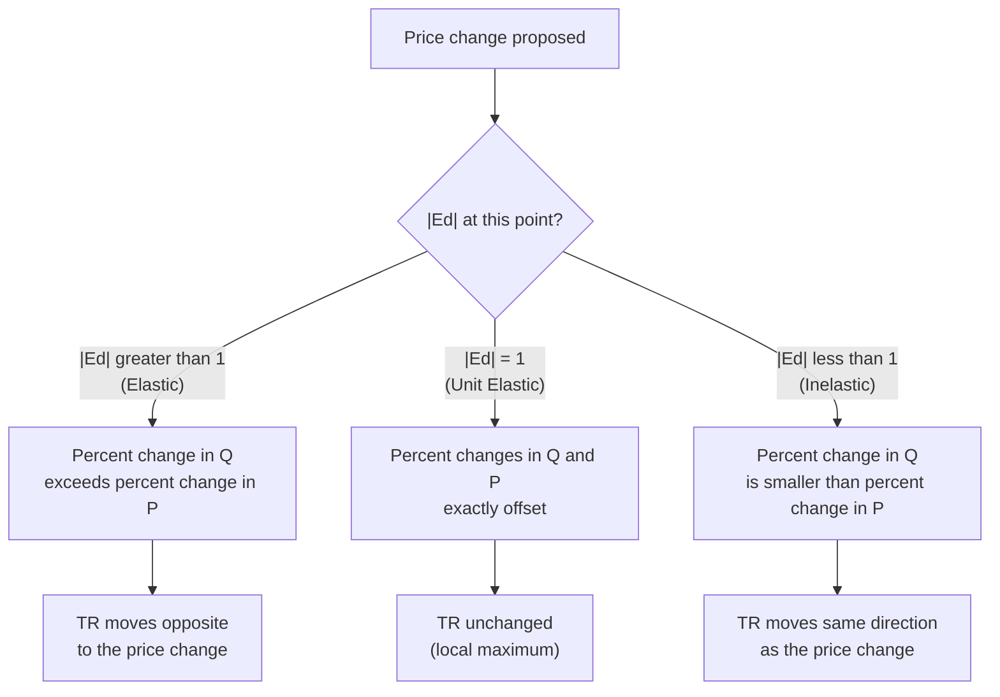
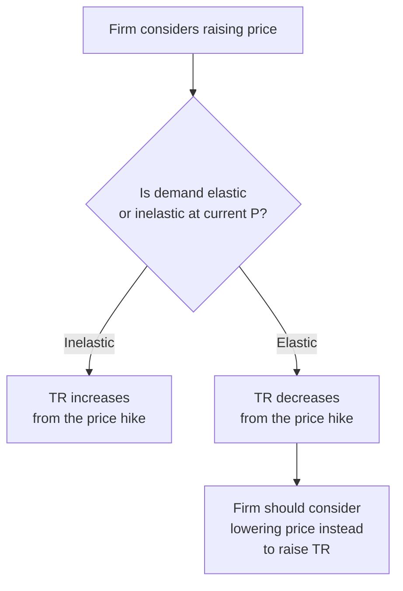

## Elasticity and Total Revenue

### Definition and the Core Relationship

Total revenue (TR) is the total amount received by sellers from the sale of a good, defined as price multiplied by quantity sold:

$$TR = P \times Q$$

The price elasticity of demand determines *how* total revenue responds when price changes, because a price change simultaneously affects both factors in this product: raising price increases revenue per unit but (given a downward-sloping demand curve) reduces the number of units sold. Which effect dominates depends entirely on the elasticity of demand at that point.

### Derivation of the Relationship

Consider a small price change $\Delta P$. The resulting change in total revenue can be decomposed as:

$$\Delta TR \approx Q\,\Delta P + P\,\Delta Q$$

Dividing through by $TR = PQ$:

$$\frac{\Delta TR}{TR} \approx \frac{\Delta P}{P} + \frac{\Delta Q}{Q}$$

Since $E_d = \dfrac{\Delta Q/Q}{\Delta P/P}$, this can be rewritten as:

$$\frac{\Delta TR}{TR} \approx \frac{\Delta P}{P}\big(1 + E_d\big)$$

Because $E_d$ is negative for standard downward-sloping demand, the sign of $(1+E_d)$ — equivalently, whether $|E_d|$ is greater than, equal to, or less than 1 — determines whether total revenue rises or falls following a price increase.

### The Three-Region Rule

| Elasticity Region | $\|E_d\|$ | Price Increase | Price Decrease |
| --- | --- | --- | --- |
| Elastic | $> 1$ | TR decreases | TR increases |
| Unit elastic | $= 1$ | TR unchanged (at maximum) | TR unchanged (at maximum) |
| Inelastic | $< 1$ | TR increases | TR decreases |

**Key Points**

- The intuitive mnemonic: in the **elastic** region, price and total revenue move in **opposite** directions; in the **inelastic** region, price and total revenue move in the **same** direction.
- This relationship holds only locally — at the specific point/region of the demand curve being evaluated — since elasticity itself varies along most demand curves (as established in the analysis of price elasticity of demand).

### Diagrammatic Illustration: TR Along a Linear Demand Curve

<svg xmlns="http://www.w3.org/2000/svg" viewBox="0 0 680 460" font-family="Helvetica, Arial, sans-serif">
<title>Total Revenue and Elasticity Along a Linear Demand Curve (svg_diagram)</title>

<text x="60" y="20" font-size="14" font-weight="bold">Demand Curve</text>

<line x1="60" y1="180" x2="600" y2="180" stroke="#333" stroke-width="2" />

<line x1="60" y1="180" x2="60" y2="30" stroke="#333" stroke-width="2" />

<line x1="80" y1="45" x2="580" y2="165" stroke="`#0d47a1`" stroke-width="2.5" />

<text x="30" y="45" font-size="11">P</text>

<text x="590" y="185" font-size="11">Q</text>

<circle cx="330" cy="105" r="4" fill="#000" />
<text x="338" y="100" font-size="11">Midpoint (Ed = -1)</text>
<line x1="330" y1="105" x2="330" y2="180" stroke="#888" stroke-dasharray="2,2" />

<text x="120" y="65" font-size="12" fill="`#c62828`">Elastic region (|Ed| greater than 1)</text>

<text x="400" y="150" font-size="12" fill="`#1b5e20`">Inelastic region (|Ed| less than 1)</text>

<text x="60" y="230" font-size="14" font-weight="bold">Total Revenue Curve</text>

<line x1="60" y1="440" x2="600" y2="440" stroke="#333" stroke-width="2" />

<line x1="60" y1="440" x2="60" y2="250" stroke="#333" stroke-width="2" />

<text x="30" y="255" font-size="11">TR</text>

<text x="590" y="455" font-size="11">Q</text>

<path d="M 80 430 Q 330 260 580 430" stroke="#f57f17" stroke-width="2.5" fill="none" />
<circle cx="330" cy="270" r="4" fill="#000" />
<text x="338" y="265" font-size="11">TR maximized here </text>
<line x1="330" y1="270" x2="330" y2="440" stroke="#888" stroke-dasharray="2,2" />
</svg>

The upper panel shows a linear demand curve with its elastic region (upper-left, high price/low quantity) and inelastic region (lower-right, low price/high quantity), separated by the midpoint where $|E_d|=1$. The lower panel shows the corresponding total revenue curve, which rises through the elastic region, peaks exactly at the unit-elastic quantity, and falls through the inelastic region as price continues to decrease (quantity continues to increase).

### Worked Numerical Example

**Example**

Given linear demand: $Q = 100 - 2P$, so $TR = PQ = P(100-2P) = 100P - 2P^2$.

Compute TR and point elasticity at several prices:

$$E_d = \frac{dQ}{dP}\times\frac{P}{Q} = -2 \times \frac{P}{100-2P}$$

**Output**

| $P$ | $Q = 100-2P$ | $TR = PQ$ | $E_d$ (signed) | $\|E_d\|$ | Region |
| --- | --- | --- | --- | --- | --- |
| 10 | 80 | 800 | $-2(10/80) = -0.25$ | 0.25 | Inelastic |
| 20 | 60 | 1,200 | $-2(20/60) = -0.67$ | 0.67 | Inelastic |
| 25 | 50 | 1,250 | $-2(25/50) = -1.00$ | 1.00 | Unit elastic |
| 30 | 40 | 1,200 | $-2(30/40) = -1.50$ | 1.50 | Elastic |
| 40 | 20 | 800 | $-2(40/20) = -4.00$ | 4.00 | Elastic |

Observe: as $P$ rises from 10 to 25 (inelastic region throughout), TR rises from 800 to 1,250. As $P$ continues rising from 25 to 40 (elastic region), TR falls back from 1,250 to 800. TR peaks exactly at $P=25$, precisely where $|E_d|=1$ — confirming the calculus result that $dTR/dP = 0$ coincides with unit elasticity.

**Verification via calculus:**

$$\frac{d(TR)}{dP} = 100 - 4P = 0 \Rightarrow P^* = 25 \text{ (revenue-maximizing price)}$$

### Application: Pricing Decisions for Firms

**Key Points**

- A firm considering a price increase should first assess whether current demand at that price is elastic or inelastic.
- If demand is **inelastic** at the current price, raising price **increases** total revenue (fewer units sold, but each at a sufficiently higher price to more than compensate).
- If demand is **elastic** at the current price, raising price **decreases** total revenue (the drop in quantity sold outweighs the higher per-unit price); in this case, a firm seeking higher revenue should instead consider *lowering* price.
- No profit-maximizing firm operating with positive marginal cost will rationally choose to sell in the inelastic region of its demand curve: since TR could be increased by raising price (selling fewer units) while simultaneously reducing production costs (from producing fewer units), profit is not maximized there. This is why observed prices set by firms with market power are generally found in the elastic region of demand.

### Distinguishing Total Revenue from Profit

**Key Points**

- The elasticity-TR relationship describes *revenue* behavior only — it says nothing directly about *profit*, which also depends on production costs.
- A firm could raise total revenue by moving into the inelastic region (lowering price further would raise TR less relevant here; rather, moving toward inelastic via price hikes raises TR) while simultaneously changing total cost, so profit-maximizing price setting requires the additional marginal-revenue-equals-marginal-cost condition, not the TR-maximizing condition alone.
- TR-maximization ($MR=0$) and profit-maximization ($MR=MC$) coincide only in the special case where marginal cost is zero; for any positive marginal cost, the profit-maximizing price is always higher than the revenue-maximizing price, placing the profit-maximizing point further into the elastic region.

### Application to Tax Policy

**Key Points**

- Government revenue-raising through taxation exhibits a directly analogous relationship: taxing a good with highly inelastic demand tends to preserve quantity purchased and therefore preserve tax revenue collected, while taxing a good with highly elastic demand causes a larger quantity reduction, potentially undermining the revenue-raising goal even as the per-unit tax rate rises.
- This is part of the standard rationale for "sin taxes" on inelastically demanded goods (tobacco, alcohol) as revenue-generating tools, distinct from — though sometimes conflated with — their separate rationale as tools for discouraging consumption of goods with negative externalities. [Inference] The actual revenue-maximizing tax rate for any specific good depends on the precise shape and elasticity of that good's demand curve across the relevant range of prices, which is an empirical question the qualitative elasticity-revenue relationship alone cannot answer.

### Common Pitfalls

**Key Points**

- Assuming total revenue and total surplus are the same concept — they are not; TR is a measure of seller receipts (a component of producer surplus calculations, before subtracting cost), while total surplus is a welfare measure combining consumer and producer surplus.
- Assuming a single elasticity value applies to the *entire* demand curve when working with a linear demand function — the elastic/inelastic classification, and hence the TR relationship, only holds locally at the specific price/quantity point being analyzed.
- Conflating **revenue-maximizing** price with **profit-maximizing** price — these coincide only when marginal cost is zero; in general, profit maximization requires additional information about costs beyond the elasticity-TR relationship alone.
- Misapplying the mnemonic direction — a common error is reversing which region ("elastic" vs. "inelastic") corresponds to TR moving with versus against the price change; the safest approach when in doubt is to recompute directly from $\%\Delta TR \approx \%\Delta P (1+E_d)$.

### Conclusion

The relationship between elasticity and total revenue provides one of the most practically useful applications of the elasticity concept: it tells a decision-maker, without needing to compute revenue at every possible price, whether raising or lowering price will increase or decrease total revenue, based solely on which elasticity region currently applies. Total revenue is maximized precisely where demand is unit elastic, rises through the inelastic region as price increases, and falls through the elastic region as price continues to rise — a relationship with direct applications to firm pricing strategy and government tax-revenue policy, though it must be kept distinct from the separate question of profit maximization, which additionally depends on the cost side of the firm's decision.

**Related Topics**

- Price elasticity of demand (formal definition and calculation methods)
- Determinants of price elasticity of demand
- Profit maximization and the marginal revenue–marginal cost condition
- Tax incidence and revenue-maximizing taxation (the "Laffer curve" concept in public finance)
- Price discrimination and revenue extraction across elasticity segments
- Cross-price and income elasticity as complements to the price-elasticity-revenue framework
- Monopoly pricing and the requirement to operate in the elastic region of demand