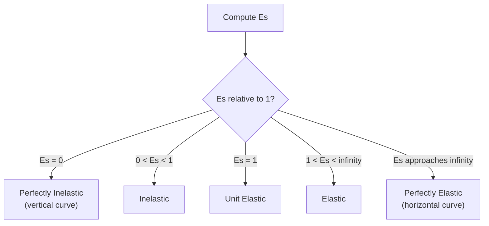
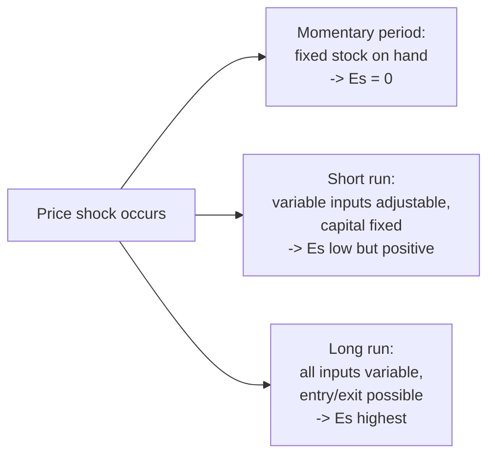
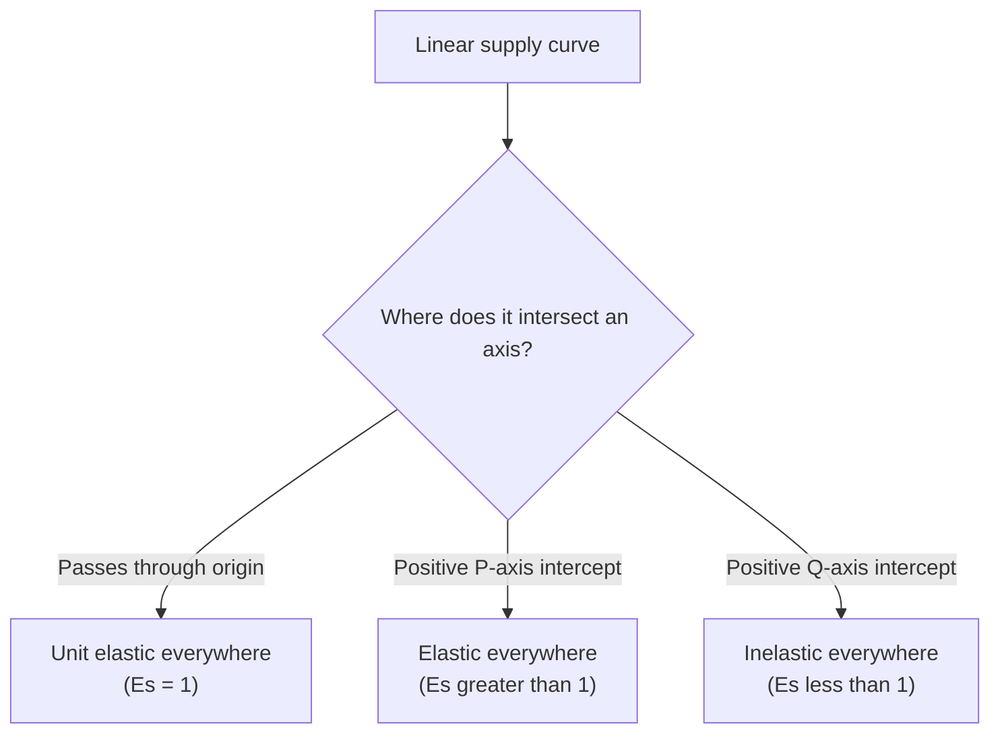

## Price Elasticity of Supply

### Definition

Price elasticity of supply ($E_s$) measures the responsiveness of quantity supplied to a change in the price of a good, expressed as the ratio of the percentage change in quantity supplied to the percentage change in price.

$$E_s = \frac{\%\Delta Q_S}{\%\Delta P} = \frac{\Delta Q / Q}{\Delta P / P}$$

Because supply curves are typically upward-sloping (price and quantity supplied move in the same direction), $E_s$ is positive for standard goods — this is the key sign difference from price elasticity of demand, which is negative.

### Methods of Calculation

**Point Elasticity**

$$E_s = \frac{dQ}{dP} \times \frac{P}{Q}$$

Used when an explicit supply function $Q = S(P)$ is available and the specific point of evaluation is known.

**Arc (Midpoint) Elasticity**

$$E_s = \frac{(Q_2 - Q_1)/[(Q_1+Q_2)/2]}{(P_2 - P_1)/[(P_1+P_2)/2]}$$

As with demand, the midpoint method is used when only two discrete price-quantity pairs are available, and it yields a symmetric result regardless of the direction of the price change.

### Classification of Elasticity Values

| $E_s$ Value | Classification | Interpretation |
| --- | --- | --- |
| $E_s = 0$ | Perfectly inelastic | Quantity supplied is fixed regardless of price (vertical supply curve) |
| $0 < E_s < 1$ | Inelastic | Quantity supplied changes proportionally less than price |
| $E_s = 1$ | Unit elastic | Quantity supplied changes by exactly the same percentage as price |
| $1 < E_s < \infty$ | Elastic | Quantity supplied changes proportionally more than price |
| $E_s \to \infty$ | Perfectly elastic | Any price decrease drives quantity supplied to zero (horizontal supply curve) |

### Diagrammatic Illustration of Extreme Cases

<svg xmlns="http://www.w3.org/2000/svg" viewBox="0 0 660 320" font-family="Helvetica, Arial, sans-serif">
<title>Perfectly Inelastic vs. Perfectly Elastic Supply (svg_diagram)</title>

<text x="60" y="20" font-size="14" font-weight="bold">Perfectly Inelastic (Es = 0)</text>

<line x1="60" y1="260" x2="280" y2="260" stroke="#333" stroke-width="2" />

<line x1="60" y1="260" x2="60" y2="40" stroke="#333" stroke-width="2" />

<line x1="170" y1="250" x2="170" y2="50" stroke="`#1b5e20`" stroke-width="2.5" />

<text x="178" y="60" font-size="12" fill="`#1b5e20`">S</text>

<text x="270" y="278" font-size="11">Quantity</text>

<text x="30" y="45" font-size="11">Price</text>

<text x="400" y="20" font-size="14" font-weight="bold">Perfectly Elastic (Es → ∞)</text>

<line x1="400" y1="260" x2="620" y2="260" stroke="#333" stroke-width="2" />

<line x1="400" y1="260" x2="400" y2="40" stroke="#333" stroke-width="2" />

<line x1="410" y1="150" x2="610" y2="150" stroke="`#1b5e20`" stroke-width="2.5" />

<text x="590" y="140" font-size="12" fill="`#1b5e20`">S</text>

<text x="610" y="278" font-size="11">Quantity</text>

<text x="370" y="45" font-size="11">Price</text>

</svg>

### Determinants of Price Elasticity of Supply

**Key Points**

- **Availability and flexibility of inputs:** if producers can easily obtain additional units of labor, capital, and raw materials, supply is more elastic; if inputs are scarce, specialized, or slow to acquire, supply is more inelastic.
- **Spare production capacity:** firms operating well below full capacity can expand output quickly in response to a price increase (elastic supply); firms already operating at or near full capacity face steeply rising marginal costs to expand further (inelastic supply).
- **Time horizon:** this is one of the most important determinants — supply becomes progressively more elastic as the time horizon lengthens, mirroring the time-horizon determinant for demand.
- **Ease of storage/inventory:** goods that can be stored and released from inventory in response to price changes exhibit more elastic supply; perishable goods that cannot be stored exhibit more inelastic supply.
- **Mobility of resources:** the more easily factors of production can be reallocated into (or out of) producing this specific good, the more elastic supply becomes.

### The Time-Horizon Determinant in Detail

Because time horizon is especially central to supply elasticity, it is conventionally broken into three distinct periods:

| Period | Definition | Typical Elasticity |
| --- | --- | --- |
| Momentary (market period) | Period too short to adjust output at all | Perfectly inelastic ($E_s = 0$) |
| Short run | Some inputs (typically capital/plant size) are fixed; only variable inputs (labor, materials) can be adjusted | Inelastic, but $E_s > 0$ |
| Long run | All inputs are variable; firms can build new plants, and new firms can enter or exit the industry | Most elastic |

**Example**

Agricultural markets are a classic illustration of the momentary period: once a harvest is in, the quantity of that season's crop available for sale is essentially fixed regardless of price — supply is close to perfectly inelastic within that market period. Over the following growing season (short run), farmers can adjust the quantity of labor and other variable inputs applied to existing land. Over several years (long run), farmers can shift acreage between crops, and new producers can enter or exit farming altogether, making long-run agricultural supply substantially more elastic than momentary or short-run supply.

### Elasticity Along Non-Linear Supply Curves Through the Origin

A useful special-case result: any **straight-line supply curve that passes through the origin** has constant unit elasticity ($E_s = 1$) at every point along it, regardless of its slope.

$$Q = cP \quad \Rightarrow \quad \frac{dQ}{dP} = c \quad \Rightarrow \quad E_s = c \times \frac{P}{cP} = 1$$

This is a distinctive property that does not depend on the steepness of the line — a very steep line through the origin and a very flat line through the origin both have $E_s=1$ everywhere. This result is often used to illustrate that supply elasticity, like demand elasticity, is not equivalent to slope, and the *intercept* of a linear supply curve determines its elasticity classification:

| Linear Supply Curve Intercept | Elasticity Classification |
| --- | --- |
| Passes through the origin ($Q=cP$) | Unit elastic ($E_s=1$) everywhere |
| Positive vertical (price) intercept ($P = a + bQ$, $a>0$) | Elastic ($E_s > 1$) at every point |
| Positive horizontal (quantity) intercept ($Q = -a + bP$, $a>0$) | Inelastic ($E_s < 1$) at every point |

**Example**

For supply $Q = -20 + 3P$ (positive horizontal/quantity intercept when solved as $P = (20+Q)/3$, i.e., the line would cross the price axis at a negative price, meaning it has a positive $Q$-intercept structure — check via the sign convention: setting $P=0$ gives $Q=-20$, so the line's $Q$-intercept is negative, meaning the line crosses the **positive P-axis** at $P = 20/3$):

$$\frac{dQ}{dP} = 3, \qquad E_s = 3 \times \frac{P}{3P-20}$$

At $P=24$: $Q = -20+3(24) = 52$, so $E_s = 3 \times \frac{24}{52} \approx 1.38$ (elastic), consistent with this curve having a positive vertical (price) intercept structure.

### Worked Numerical Example

**Example**

Given supply function $Q_S = -20 + 3P$, compute elasticity at two different prices.

**Output**

| $P$ | $Q_S = -20+3P$ | $E_s = 3 \times (P/Q_S)$ | Classification |
| --- | --- | --- | --- |
| 10 | 10 | $3(10/10) = 3.00$ | Elastic |
| 24 | 52 | $3(24/52) \approx 1.38$ | Elastic |
| 50 | 130 | $3(50/130) \approx 1.15$ | Elastic |

Consistent with the intercept rule above, this supply curve (having a positive price intercept at $P=20/3$) exhibits $E_s > 1$ at every price level, though the elasticity value itself declines gradually as price rises, approaching 1 in the limit as $P \to \infty$.

### Elasticity of Supply and Deadweight Loss (Cross-Reference)

**Key Points**

- Flatter (more elastic) supply curves widen the base of the deadweight-loss triangle for a given price ceiling, floor, or tax, increasing the magnitude of deadweight loss, consistent with the general elasticity-DWL relationship established in prior analysis.
- Perfectly inelastic supply implies that a binding price ceiling generates **zero deadweight loss**, since quantity supplied does not change at all in response to the lower price — the entire effect of the ceiling becomes a pure transfer from producers to consumers (a reduction in producer surplus captured as consumer surplus), with no unit going untraded. [Inference] This is a limiting theoretical case; most real-world supply curves are not perfectly inelastic across a meaningful price range, particularly beyond the momentary market period.
- Tax incidence: the more inelastic supply is relative to demand, the larger the share of a per-unit tax borne by producers rather than consumers.

### Common Pitfalls

**Key Points**

- Assuming elasticity of supply is fixed for a given good — as with demand, the same good can exhibit very different supply elasticities depending on the time horizon under consideration (momentary vs. short run vs. long run).
- Confusing the slope of a supply curve with its elasticity — a steep supply line is not necessarily inelastic; the intercept (not merely the steepness) determines the elasticity classification for linear supply curves, as shown by the constant-unit-elasticity property of any line through the origin regardless of steepness.
- Forgetting the sign convention — because $E_s$ is generally reported as a positive number (unlike $E_d$, which requires taking an absolute value of an inherently negative computed figure), students sometimes mistakenly apply the same negative-sign convention to supply elasticity calculations.
- Overgeneralizing the agricultural "fixed harvest" example to all short-run supply — the degree of short-run inelasticity varies significantly by industry, input flexibility, and existing spare capacity; not all goods exhibit momentary supply as inelastic as an already-harvested agricultural crop.

### Conclusion

Price elasticity of supply measures how responsively producers adjust quantity supplied to a change in price, governed primarily by input flexibility, spare capacity, storability, and — most importantly — the time horizon available for adjustment. Supply elasticity typically rises from near-zero in the momentary period, through a low-but-positive short-run value, to its highest level in the long run once all inputs and entry/exit decisions become variable. As with demand elasticity, the magnitude of $E_s$ (not merely the slope of the supply curve) plays a central role in determining tax incidence and the size of deadweight loss under price controls or taxation.

**Related Topics**

- Price elasticity of demand (parallel concept and cross-comparison)
- Determinants of price elasticity of demand
- Tax incidence and the relative elasticity rule for burden-sharing
- Deadweight loss from price controls and its dependence on supply elasticity
- Short-run vs. long-run cost curves and the theory of the firm
- Agricultural economics and price volatility under inelastic short-run supply
- Producer surplus and its sensitivity to elasticity of supply