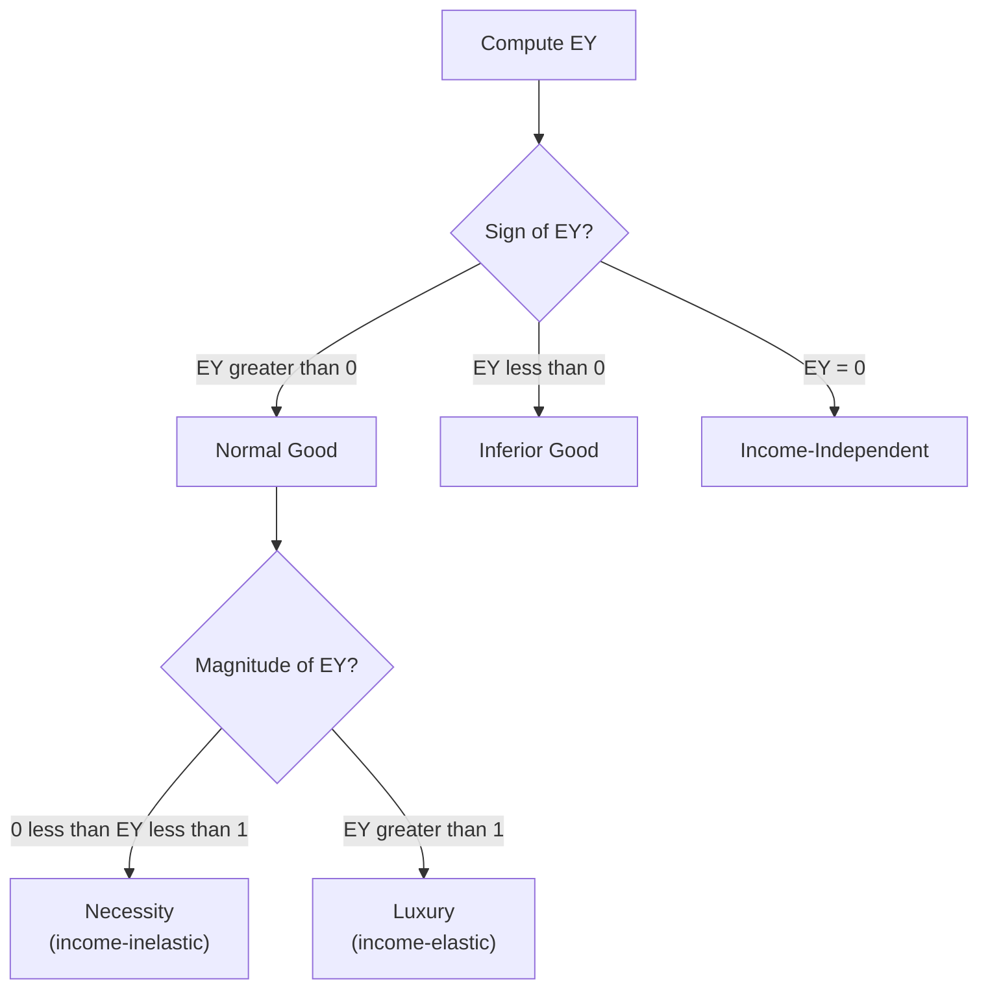

## Income Elasticity of Demand

### Definition

Income elasticity of demand ($E_Y$ or $\varepsilon_Y$) measures the responsiveness of quantity demanded for a good to a change in consumer income, holding the good's own price and all other determinants constant. It is defined as the ratio of the percentage change in quantity demanded to the percentage change in income.

$$E_Y = \frac{\%\Delta Q_D}{\%\Delta Y} = \frac{\Delta Q / Q}{\Delta Y / Y}$$

Unlike price elasticity of demand, income elasticity can be **positive, negative, or zero**, and its sign — not merely its magnitude — carries the primary economic classification information.

### Methods of Calculation

**Point Elasticity**

$$E_Y = \frac{\partial Q}{\partial Y} \times \frac{Y}{Q}$$

Used when the demand function $Q = D(P, Y)$ is explicitly given and income appears as an argument.

**Arc (Midpoint) Elasticity**

$$E_Y = \frac{(Q_2-Q_1)/[(Q_1+Q_2)/2]}{(Y_2-Y_1)/[(Y_1+Y_2)/2]}$$

Used when only two discrete income-quantity observations are available, yielding a result independent of the direction of the income change.

### Classification by Sign: Normal vs. Inferior Goods

**Key Points**

- $E_Y > 0$: the good is a **normal good** — quantity demanded rises as income rises.
- $E_Y < 0$: the good is an **inferior good** — quantity demanded falls as income rises (consumers substitute toward higher-quality or more expensive alternatives as they become more able to afford them).
- $E_Y = 0$: demand for the good is **income-independent** — quantity demanded does not respond to income changes at all.

### Sub-Classification Within Normal Goods: Necessities vs. Luxuries

For normal goods ($E_Y > 0$), a further distinction is made based on magnitude:

| $E_Y$ Range | Classification | Interpretation |
| --- | --- | --- |
| $E_Y < 0$ | Inferior good | Quantity demanded falls as income rises |
| $0 < E_Y < 1$ | Necessity (income-inelastic normal good) | Quantity demanded rises, but proportionally less than income |
| $E_Y = 1$ | Unit income-elastic | Quantity demanded rises exactly proportionally with income |
| $E_Y > 1$ | Luxury (income-elastic normal good) | Quantity demanded rises proportionally more than income |

**Key Points**

- This magnitude-based classification of "necessity" and "luxury" using income elasticity is directly analogous to, but formally distinct from, the same terms used qualitatively as a determinant of price elasticity of demand — here the classification comes from a precisely measured income-response coefficient rather than a general qualitative judgment.
- As income rises, spending on necessities (income-inelastic normal goods) represents a shrinking share of the household budget, while spending on luxuries (income-elastic normal goods) represents a growing share — this relationship is formalized as **Engel's Law**, originally observed with respect to food expenditure share declining as household income rises.

### Diagrammatic Illustration: Engel Curves

An **Engel curve** plots quantity demanded of a good against income, holding price fixed — the natural graphical representation of income elasticity.

<svg xmlns="http://www.w3.org/2000/svg" viewBox="0 0 680 380" font-family="Helvetica, Arial, sans-serif">
<title>Engel Curves for Normal, Inferior, and Luxury Goods (svg_diagram)</title>
<line x1="60" y1="340" x2="620" y2="340" stroke="#333" stroke-width="2" />
<line x1="60" y1="340" x2="60" y2="30" stroke="#333" stroke-width="2" />
<text x="600" y="360" font-size="13">Income (Y)</text>
<text x="20" y="30" font-size="13">Quantity (Q)</text>

<path d="M 80 320 Q 300 280 560 60" stroke="#c62828" stroke-width="2.5" fill="none" />
<text x="500" y="80" font-size="12" fill="#c62828">Luxury (EY greater than 1)</text>

<path d="M 80 330 Q 300 200 560 150" stroke="#1b5e20" stroke-width="2.5" fill="none" />
<text x="480" y="145" font-size="12" fill="#1b5e20">Necessity (0 less than EY less than 1)</text>

<path d="M 80 340 Q 250 220 400 240 Q 500 260 560 300" stroke="#f57f17" stroke-width="2.5" fill="none" />
<text x="440" y="320" font-size="12" fill="#f57f17">Inferior (EY less than 0, beyond a point)</text>
</svg>

### Worked Numerical Example

**Example**

A household's monthly income rises from $4,000 to $4,400 (a 10% increase). In response, their monthly purchases of two goods change as follows:

- **Restaurant meals:** rise from 8 to 10 per month.
- **Instant noodles:** fall from 20 to 17 packages per month.

Using arc elasticity for restaurant meals:

$$\%\Delta Q = \frac{10-8}{(8+10)/2} = \frac{2}{9} \approx 22.2\%$$

$$\%\Delta Y = \frac{4400-4000}{(4000+4400)/2} = \frac{400}{4200} \approx 9.5\%$$

$$E_Y^{\text{meals}} = \frac{22.2\%}{9.5\%} \approx 2.34$$

Using arc elasticity for instant noodles:

$$\%\Delta Q = \frac{17-20}{(20+17)/2} = \frac{-3}{18.5} \approx -16.2\%$$

$$E_Y^{\text{noodles}} = \frac{-16.2\%}{9.5\%} \approx -1.71$$

**Output**

| Good | $E_Y$ | Classification |
| --- | --- | --- |
| Restaurant meals | ≈ 2.34 | Normal good, luxury (income-elastic) |
| Instant noodles | ≈ −1.71 | Inferior good |

The positive, greater-than-one elasticity for restaurant meals confirms it behaves as a luxury for this household over this income range; the negative elasticity for instant noodles confirms that as income rose, this household reduced consumption of what they treat as a lower-preference substitute for other food options.

### Income Elasticity Can Vary Across Income Ranges

**Key Points**

- A good's income elasticity is not necessarily constant across all income levels — the same good can behave as a normal good at low income levels and an inferior good at higher income levels (or vice versa), producing a non-monotonic Engel curve.
- This is the standard explanation for goods like margarine, low-cost cuts of meat, or public transit in some contexts: consumption may rise with income up to a point (while still a normal good relative to even lower incomes), then decline as income rises further and higher-income consumers substitute toward preferred alternatives (butter, higher-quality cuts, private vehicles).
- [Inference] Whether a specific good exhibits this reversal, and at what income threshold, is an empirical matter specific to the good, the consumer population, and the available substitutes in that market; it cannot be determined from theory alone.

### Distinguishing Income Elasticity from Price Elasticity

| Feature | Price Elasticity of Demand | Income Elasticity of Demand |
| --- | --- | --- |
| Holds constant | Income, other prices, preferences | Own price, other prices, preferences |
| Typical sign | Negative (by convention, reported as positive magnitude) | Positive, negative, or zero (sign is meaningful and retained) |
| Classification driven by | Magnitude only (elastic/inelastic relative to 1) | Both sign (normal/inferior) and magnitude (necessity/luxury) |
| Underlying curve shifted | Movement along the demand curve | The entire demand curve shifts as income changes |

**Key Points**

- A change in income does not move a consumer along a fixed demand curve — it shifts the demand curve itself (as covered in comparative statics of demand and supply shifts), and income elasticity specifically quantifies the *size and direction* of that shift relative to the size of the income change that caused it.

### Applications

**Key Points**

- **Business strategy:** firms selling goods with high positive income elasticity (luxury goods) benefit disproportionately during economic expansions and are disproportionately harmed during recessions, since their sales are more sensitive to aggregate income fluctuations than sellers of necessities.
- **Countercyclical inferior goods:** firms selling inferior goods may see sales rise during recessions (as consumers trade down) and fall during expansions — a pattern sometimes observed for goods marketed as "budget" or "value" alternatives.
- **International trade and development economics:** income elasticity estimates are used to project how demand for categories of goods (food, durable goods, services) will evolve as national income grows, informing long-run structural and trade policy analysis.
- **Engel's Law and poverty measurement:** the declining share of food expenditure as income rises (reflecting food's typically low, though still positive, income elasticity) has historically been used as a component of poverty and living-standard indices.

### Common Pitfalls

**Key Points**

- Assuming "inferior" carries a negative connotation about the good's quality — in economics, "inferior" is a strictly technical classification based on the *sign of the income response*, not a judgment about the good's intrinsic quality or desirability.
- Assuming a good's classification as normal/inferior or necessity/luxury is fixed and universal — classification can vary by the specific consumer population, the income range examined, and the time period, and a good can shift categories as income changes.
- Confusing income elasticity's sign convention with price elasticity's — because price elasticity of demand is typically reported using its absolute value (masking the underlying negative sign), some students incorrectly expect income elasticity to also always be reported as a positive number; the sign of $E_Y$ must be retained and interpreted directly.
- Treating a demand curve shift caused by income change as if it were a movement along the curve — income elasticity describes how much the curve shifts, not a point elasticity along a single fixed curve.

### Conclusion

Income elasticity of demand classifies goods according to how quantity demanded responds to changes in consumer income, distinguishing normal goods (positive $E_Y$) from inferior goods (negative $E_Y$), and further separating normal goods into necessities ($0<E_Y<1$) and luxuries ($E_Y>1$). Because income changes shift the entire demand curve rather than producing movement along it, income elasticity captures a fundamentally different economic response than price elasticity, with its own distinct applications in business cycle analysis, international trade projections, and living-standard measurement via Engel's Law.

**Related Topics**

- Price elasticity of demand and cross-price elasticity of demand
- Comparative statics of demand and supply shifts (the mechanism by which income changes move the demand curve)
- Engel's Law and historical food-expenditure-share analysis
- Normal and inferior goods in consumer choice theory (indifference curve analysis)
- Business cycle sensitivity of luxury-goods and value-goods firms
- Giffen goods as a theoretical extreme case combining inferior-good income effects with price-response anomalies
- Development economics applications of income elasticity in demand forecasting