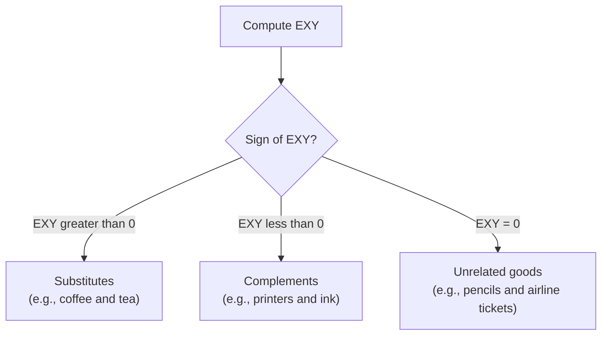

## Cross-Price Elasticity of Demand

### Definition

Cross-price elasticity of demand ($E_{XY}$) measures the responsiveness of quantity demanded for one good (Good X) to a change in the price of a different good (Good Y), holding the price of Good X, income, and all other determinants constant. It is defined as the ratio of the percentage change in quantity demanded of Good X to the percentage change in the price of Good Y.

$$E_{XY} = \frac{\%\Delta Q_X}{\%\Delta P_Y} = \frac{\Delta Q_X / Q_X}{\Delta P_Y / P_Y}$$

As with income elasticity, cross-price elasticity can be **positive, negative, or zero**, and the sign is the primary carrier of economic meaning — it reveals the underlying relationship between the two goods in consumption.

### Methods of Calculation

**Point Elasticity**

$$E_{XY} = \frac{\partial Q_X}{\partial P_Y} \times \frac{P_Y}{Q_X}$$

Used when the demand function $Q_X = D(P_X, P_Y, Y)$ is explicitly specified.

**Arc (Midpoint) Elasticity**

$$E_{XY} = \frac{(Q_{X2}-Q_{X1})/[(Q_{X1}+Q_{X2})/2]}{(P_{Y2}-P_{Y1})/[(P_{Y1}+P_{Y2})/2]}$$

Used when only two discrete observations of Good X's quantity and Good Y's price are available.

### Classification by Sign: Substitutes, Complements, and Independent Goods

**Key Points**

- $E_{XY} > 0$: Goods X and Y are **substitutes** — a rise in the price of Y causes consumers to switch toward X, raising quantity demanded of X.
- $E_{XY} < 0$: Goods X and Y are **complements** — a rise in the price of Y (a good consumed jointly with X) reduces quantity demanded of X, since the two goods are used together.
- $E_{XY} = 0$: Goods X and Y are **unrelated (independent)** in consumption — a price change in Y has no effect on quantity demanded of X.

### Magnitude and Degree of Relationship

**Key Points**

- The magnitude of $E_{XY}$, in addition to its sign, indicates the *strength* of the relationship between the two goods.
- A large positive value indicates goods that are close substitutes (e.g., two nearly identical brands of the same product); a value close to zero (but still positive) indicates weak substitutability.
- A large negative value indicates goods that are strong complements (used in a fixed or near-fixed ratio); a value close to zero (but still negative) indicates weak complementarity.

| $E_{XY}$ Value | Relationship | Example |
| --- | --- | --- |
| Large positive | Strong substitutes | Two competing brands of the same soft drink |
| Small positive | Weak substitutes | Butter and margarine (partial substitutability) |
| ≈ 0 | Unrelated | Notebooks and international flights |
| Small negative | Weak complements | Bread and butter |
| Large negative | Strong complements | Printers and printer ink cartridges |

### Diagrammatic Illustration

<svg xmlns="http://www.w3.org/2000/svg" viewBox="0 0 660 340" font-family="Helvetica, Arial, sans-serif">
<title>Effect of a Price Change in Good Y on Demand for Good X (svg_diagram)</title>

<text x="60" y="20" font-size="14" font-weight="bold">Substitutes: Py rises</text>

<line x1="60" y1="260" x2="280" y2="260" stroke="#333" stroke-width="2" />

<line x1="60" y1="260" x2="60" y2="40" stroke="#333" stroke-width="2" />

<line x1="80" y1="230" x2="200" y2="70" stroke="`#0d47a1`" stroke-width="2" stroke-dasharray="5,3" />

<text x="205" y="70" font-size="11" fill="`#0d47a1`">Dx0</text>

<line x1="110" y1="230" x2="230" y2="70" stroke="`#0d47a1`" stroke-width="2.5" />

<text x="235" y="70" font-size="11" fill="`#0d47a1`">Dx1 (shifted right)</text>

<text x="270" y="278" font-size="11">Qx</text>

<text x="30" y="45" font-size="11">Px</text>

<text x="400" y="20" font-size="14" font-weight="bold">Complements: Py rises</text>

<line x1="400" y1="260" x2="620" y2="260" stroke="#333" stroke-width="2" />

<line x1="400" y1="260" x2="400" y2="40" stroke="#333" stroke-width="2" />

<line x1="450" y1="230" x2="570" y2="70" stroke="`#0d47a1`" stroke-width="2" stroke-dasharray="5,3" />

<text x="575" y="70" font-size="11" fill="`#0d47a1`">Dx0</text>

<line x1="420" y1="230" x2="540" y2="70" stroke="`#0d47a1`" stroke-width="2.5" />

<text x="410" y="235" font-size="11" fill="`#0d47a1`">Dx1 (shifted left)</text>

<text x="610" y="278" font-size="11">Qx</text>

<text x="370" y="45" font-size="11">Px</text>

</svg>

An increase in the price of Y shifts the demand curve for X to the **right** if the goods are substitutes (consumers switch toward X), and to the **left** if the goods are complements (reduced use of Y drags down demand for the jointly consumed good X).

### Worked Numerical Example

**Example**

The price of coffee rises from $4.00 to $4.40 per bag (a 10% increase). In response:

- **Tea** (a candidate substitute): quantity demanded rises from 100 to 108 units per week.
- **Coffee creamer** (a candidate complement): quantity demanded falls from 60 to 55 units per week.

Using arc elasticity for tea:

$$\%\Delta Q_{\text{tea}} = \frac{108-100}{(100+108)/2} = \frac{8}{104} \approx 7.7\%$$

$$\%\Delta P_{\text{coffee}} = \frac{4.40-4.00}{(4.00+4.40)/2} = \frac{0.40}{4.20} \approx 9.5\%$$

$$E_{XY}^{\text{tea, coffee}} = \frac{7.7\%}{9.5\%} \approx 0.81$$

Using arc elasticity for coffee creamer:

$$\%\Delta Q_{\text{creamer}} = \frac{55-60}{(60+55)/2} = \frac{-5}{57.5} \approx -8.7\%$$

$$E_{XY}^{\text{creamer, coffee}} = \frac{-8.7\%}{9.5\%} \approx -0.92$$

**Output**

| Good Pair | $E_{XY}$ | Classification |
| --- | --- | --- |
| Tea (relative to coffee price) | ≈ +0.81 | Substitutes (moderate) |
| Coffee creamer (relative to coffee price) | ≈ −0.92 | Complements (moderate-to-strong) |

The positive elasticity confirms tea and coffee behave as substitutes in this market — consumers shift toward tea as coffee becomes more expensive. The negative elasticity confirms coffee and creamer behave as complements — reduced coffee consumption drags down demand for the good used alongside it.

### Asymmetry of Cross-Price Elasticity

**Key Points**

- $E_{XY}$ is not generally equal to $E_{YX}$ — the responsiveness of X's demand to a change in Y's price need not equal the responsiveness of Y's demand to a change in X's price, even though both measure the same underlying substitute/complement *relationship* in sign.
- This asymmetry commonly arises when the two goods represent different shares of total spending on the category, or when one good has more available alternatives than the other.

**Example**

Suppose a specific budget-brand cola has many substitutes (including a market-leading premium brand), while the premium brand has fewer substitutes perceived as equivalent by its typical buyers (brand loyalty). A price increase in the premium brand may cause a large percentage increase in quantity demanded of the budget brand ($E_{XY}$ large and positive), while an equivalent percentage price increase in the budget brand may cause a smaller percentage increase in quantity demanded of the premium brand ($E_{YX}$ smaller and positive) — both confirm a substitute relationship, but the magnitudes differ because the two brands do not hold symmetric positions in consumers' choice sets.

### Applications

**Key Points**

- **Merger and antitrust analysis:** cross-price elasticity is a central tool used by competition regulators to define the relevant market for a proposed merger — goods with high positive cross-price elasticity are considered part of the same competitive market, since consumers can readily substitute between them, limiting any single firm's pricing power. [Inference] The specific numerical threshold used to classify goods as being "in the same market" for antitrust purposes varies by jurisdiction and case, and is a legal/regulatory determination informed by, but not mechanically derived from, the elasticity estimate alone.
- **Pricing strategy for complementary goods:** firms selling complementary goods (e.g., game consoles and games, razors and blades) often price one good (the "anchor," e.g., the console or razor handle) at a low margin, relying on strong negative cross-price elasticity to sustain demand for the higher-margin complement (games or blades) once the anchor good is purchased.
- **Forecasting demand shocks:** knowledge of cross-price elasticities allows firms and analysts to predict how demand for their product will be affected by price changes made by competitors (substitutes) or by suppliers of complementary goods, without those firms directly controlling the price that triggered the change.

### Distinguishing Cross-Price from Other Elasticity Types

| Feature | Price Elasticity of Demand | Income Elasticity of Demand | Cross-Price Elasticity of Demand |
| --- | --- | --- | --- |
| Price/income that changes | Good's own price | Consumer income | Price of a *different* good |
| Held constant | Income, other prices | Own price, other prices | Own price, income |
| Typical sign meaning | Magnitude only (own-price response) | Normal (+) vs. inferior (−) | Substitutes (+) vs. complements (−) |
| Underlying curve effect | Movement along the good's own demand curve | Shift of the good's demand curve | Shift of the good's demand curve |

### Common Pitfalls

**Key Points**

- Assuming cross-price elasticity must be symmetric between two goods — $E_{XY} \ne E_{YX}$ in general, even though both share the same sign classification (substitutes or complements).
- Confusing a positive cross-price elasticity with a positive *price* elasticity of demand — these measure entirely different relationships (own-price responsiveness vs. a different good's price responsiveness) and a positive $E_{XY}$ says nothing about whether Good X's *own*-price elasticity is elastic or inelastic.
- Assuming all goods must be classifiable as either substitutes or complements — a value of $E_{XY}$ very close to zero indicates the goods are essentially unrelated in consumption, a valid third category rather than a "weak" version of one of the other two.
- Treating a cross-price elasticity estimated at one set of prices/income levels as universally fixed — like other elasticities, $E_{XY}$ can vary depending on the price and income levels at which it is measured.

### Conclusion

Cross-price elasticity of demand reveals the consumption relationship between two distinct goods by measuring how the quantity demanded of one responds to a price change in the other. A positive value identifies substitutes, a negative value identifies complements, and a value near zero identifies goods that are essentially unrelated in consumer choice — with the magnitude in each case indicating the strength of that relationship. Because this measure captures cross-good interactions rather than a good's response to its own price or to income, it plays a distinct and important role in market definition for antitrust analysis, complementary-goods pricing strategy, and demand forecasting in the presence of competitor or supplier price changes.

**Related Topics**

- Price elasticity of demand and income elasticity of demand (companion elasticity concepts)
- Comparative statics of demand and supply shifts (the mechanism underlying cross-price effects)
- Antitrust market definition and the SSNIP test (small but significant non-transitory increase in price)
- Complementary goods pricing strategies (razor-and-blades, platform/anchor pricing)
- Consumer choice theory and the formal substitute/complement distinction via indifference curves
- Bundling and tying strategies for complementary goods
- Network effects and their interaction with cross-price relationships in platform markets