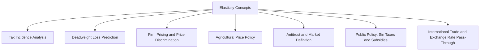
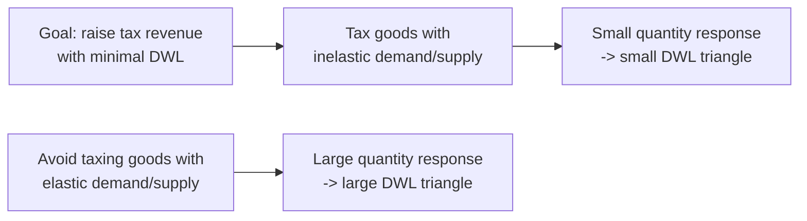
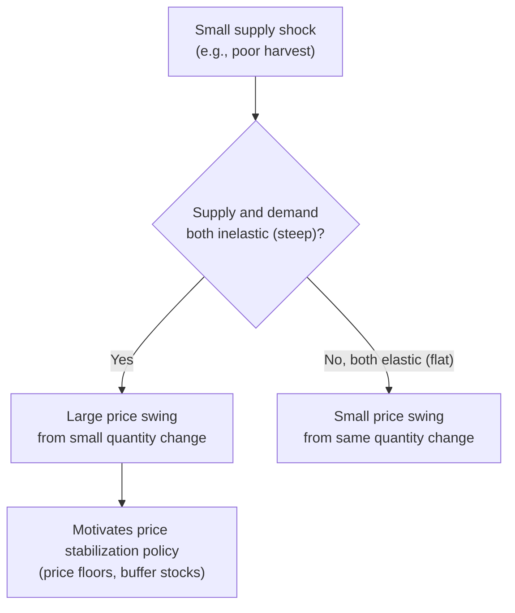

## Applications of Elasticity

### Overview

Elasticity concepts — price elasticity of demand, price elasticity of supply, income elasticity, and cross-price elasticity — are not merely descriptive statistics; they function as decision-making inputs across firm strategy, public policy, and market analysis. This section synthesizes the practical applications that draw on these elasticity measures, connecting them to the underlying theory developed in prior topics.

### Application 1: Tax Incidence

**Key Points**

- Tax incidence refers to how the economic burden of a per-unit tax is actually divided between buyers and sellers, which is generally **not** the same as who is legally required to remit the tax.
- The **relative elasticity rule** governs incidence: the side of the market that is *more inelastic* (less responsive to price) bears a *larger* share of the tax burden, because that side has fewer alternatives and cannot easily avoid the tax by adjusting quantity.

$$\frac{\text{Burden on consumers}}{\text{Burden on producers}} = \frac{E_s}{|E_d|}$$

**Example**

If demand for a good is highly inelastic ($|E_d| = 0.2$) and supply is relatively elastic ($E_s = 2.0$), consumers bear the overwhelming majority of any per-unit tax imposed on the good, regardless of whether the tax is legally levied on buyers or sellers — because consumers have few substitutes and cannot easily reduce quantity demanded to avoid the higher price, while producers can more readily redirect resources elsewhere.

This is the standard theoretical justification for taxing goods like tobacco and gasoline (both relatively inelastic in demand) as efficient revenue-raising and behavior-influencing tools, since a large share of the tax is passed through to consumers with comparatively small quantity distortion.

### Application 2: Predicting Deadweight Loss Magnitude

**Key Points**

- As established in the analysis of deadweight loss from price controls and in the elasticity topics themselves, the size of the DWL triangle from a tax, price ceiling, or price floor grows larger the more elastic are demand and supply at the relevant quantities.
- This informs the choice of *which* goods to tax when a revenue target must be met with minimal efficiency cost: taxing goods with inelastic demand and supply raises revenue with comparatively little deadweight loss, since quantity traded barely changes.
- This principle underlies the public-finance concept of **optimal (Ramsey) taxation**: to minimize aggregate deadweight loss for a given revenue requirement, tax rates should be set inversely related to the elasticity of demand for each good — higher rates on more inelastic goods, lower rates on more elastic goods. [Inference] Ramsey taxation as an optimal policy prescription abstracts from distributional/equity concerns, which in practice often push policy in the opposite direction (e.g., avoiding heavy taxation of inelastically demanded necessities like food, for equity reasons), so real-world tax design reflects a trade-off between this efficiency principle and other policy objectives.

### Application 3: Firm Pricing Decisions and Revenue Management

**Key Points**

- As established in the elasticity–total revenue relationship, a profit-seeking firm assesses whether current demand is elastic or inelastic before adjusting price, since the direction of the total revenue response depends entirely on this classification.
- **Price discrimination** — charging different prices to different customer segments for the same good — is a direct application of *differences in price elasticity across segments*. Firms charge a **higher price to the segment with more inelastic demand** (who are less likely to reduce purchases in response) and a **lower price to the segment with more elastic demand** (who would otherwise substitute away).

**Example**

Airlines commonly charge higher fares to business travelers (who often must travel on short notice for work reasons and have relatively inelastic demand due to limited scheduling flexibility) and lower fares to leisure travelers who book further in advance (who have more flexible travel dates and more elastic demand, since they can shift their trip or destination in response to price). This segmentation strategy relies directly on the empirical observation that these two customer groups exhibit measurably different price elasticities for the same underlying service.

### Application 4: Agricultural Price Policy and Price Volatility

**Key Points**

- Agricultural markets combine highly inelastic short-run supply (crops cannot be quickly increased once planted, and are perishable/hard to store in some cases) with often inelastic demand for staple foods, producing a market structure prone to large price swings from relatively small supply shocks (weather, pests, disease).
- Because both curves are steep (inelastic) in the short run, a given shift in either curve produces a *larger* change in equilibrium price than the same shift would produce in a market with more elastic curves — this connects directly to the elasticity-and-magnitude relationship established in comparative statics.
- This volatility has historically motivated government intervention in agricultural markets, including price floors (price supports), buffer stock schemes, and crop insurance programs, aimed at stabilizing farmer income against the price swings generated by inelastic short-run supply and demand.

### Application 5: Antitrust and Market Definition

**Key Points**

- As established under cross-price elasticity, regulators use measured cross-price elasticity between candidate goods to determine whether they belong in the same relevant market for merger review and monopoly investigations.
- The **SSNIP test** (Small but Significant Non-transitory Increase in Price) operationalizes this: regulators ask whether a hypothetical monopolist controlling all sellers of a candidate product group could profitably impose a small price increase (typically modeled around 5–10%) without losing so many sales to substitutes that the price increase becomes unprofitable. A high positive cross-price elasticity with an excluded product suggests that product should be included in the relevant market, since consumers would readily switch to it.
- Own-price elasticity of demand for the candidate market as a whole is also directly relevant: if measured demand for the proposed market definition is highly elastic, this suggests the market boundary may be drawn too narrowly (excluding relevant substitutes that are dampening the true market power of firms within it).

### Application 6: International Trade and Exchange Rate Pass-Through

**Key Points**

- Price elasticity of demand for imports and exports determines how much a change in exchange rates affects trade volumes versus prices — a concept closely related to the **Marshall-Lerner condition**, which states that a currency devaluation improves a country's trade balance only if the sum of the absolute values of the price elasticities of demand for exports and imports exceeds one.
- Countries whose export goods face highly elastic foreign demand benefit more from currency devaluation (in terms of increased export volume) than countries whose exports face inelastic foreign demand, where devaluation primarily just lowers foreign-currency revenue without generating a large offsetting quantity increase.
- [Inference] Real-world exchange rate pass-through and trade responses depend on numerous additional factors beyond static elasticity estimates — including contract rigidities, pricing-to-market behavior by exporters, and lagged adjustment dynamics (the "J-curve" effect) — so elasticity provides the underlying theoretical mechanism but not a complete predictive model on its own.

### Application 7: Public Health and "Sin Tax" Policy Design

**Key Points**

- Governments frequently combine price elasticity of demand estimates with public health objectives when designing taxes on goods such as tobacco, alcohol, and sugar-sweetened beverages.
- A tension exists between two policy goals that pull in different directions with respect to the desired elasticity: **revenue maximization** is best served by taxing inelastically demanded goods (since quantity — and thus the tax base — barely shrinks), while **consumption reduction** (the public health goal) is more effectively achieved when demand is relatively elastic (since a given tax-induced price increase produces a larger quantity reduction).
- For goods with low but non-zero elasticity (as is typical for many addictive goods, per the determinants of price elasticity of demand), sin taxes tend to generate substantial revenue with a comparatively modest quantity reduction — meaning such taxes are more reliably justified on revenue grounds than on consumption-reduction grounds alone, though both rationales are commonly cited together in public discourse.

### Summary Table: Elasticity Concept to Application Mapping

| Elasticity Concept | Primary Applications |
| --- | --- |
| Price elasticity of demand | Tax incidence, DWL prediction, TR-based pricing, sin tax design |
| Price elasticity of supply | Tax incidence, DWL prediction, agricultural price volatility |
| Cross-price elasticity | Antitrust market definition, complementary-good pricing strategy |
| Income elasticity | Business cycle sensitivity, demand forecasting, trade/development projections |

### Common Pitfalls

**Key Points**

- Conflating the legal incidence of a tax (who remits it to the government) with the economic incidence (who actually bears the cost) — these are determined by relative elasticity, not by statutory assignment.
- Assuming price discrimination based on elasticity differences is equivalent to simple "overcharging" one group — the underlying mechanism is that the firm is exploiting differences in willingness/ability to substitute across identified segments, not applying an arbitrary markup.
- Overlooking that revenue-maximizing and consumption-reduction goals for sin taxes can conflict, and that a policy justified using one elasticity-based rationale may not simultaneously achieve the other stated objective as effectively.
- Applying elasticity estimates from one time horizon (e.g., a short-run estimate) to a policy analysis that spans a much longer horizon, without accounting for the fact that both demand and supply elasticities generally rise over longer adjustment periods.

### Conclusion

The applications of elasticity span nearly every domain of applied microeconomics: determining who truly bears a tax burden, predicting the efficiency cost of interventions, informing firm pricing and price discrimination strategy, explaining agricultural price volatility, defining markets for competition policy, analyzing trade responses to exchange rate movements, and shaping public health tax design. Across all these applications, the same underlying principle recurs — the elasticity of demand and/or supply governs the *magnitude and distribution* of a market's response to a shock or policy, making elasticity estimation a foundational input for both positive analysis (predicting outcomes) and normative analysis (designing efficient or effective policy).

**Related Topics**

- Price elasticity of demand and its determinants
- Price elasticity of supply and the role of time horizon
- Income elasticity of demand and business cycle sensitivity
- Cross-price elasticity of demand and antitrust market definition
- Deadweight loss from price controls and taxation
- Optimal (Ramsey) taxation theory
- Price discrimination strategies (first, second, and third degree)
- The Marshall-Lerner condition in international trade