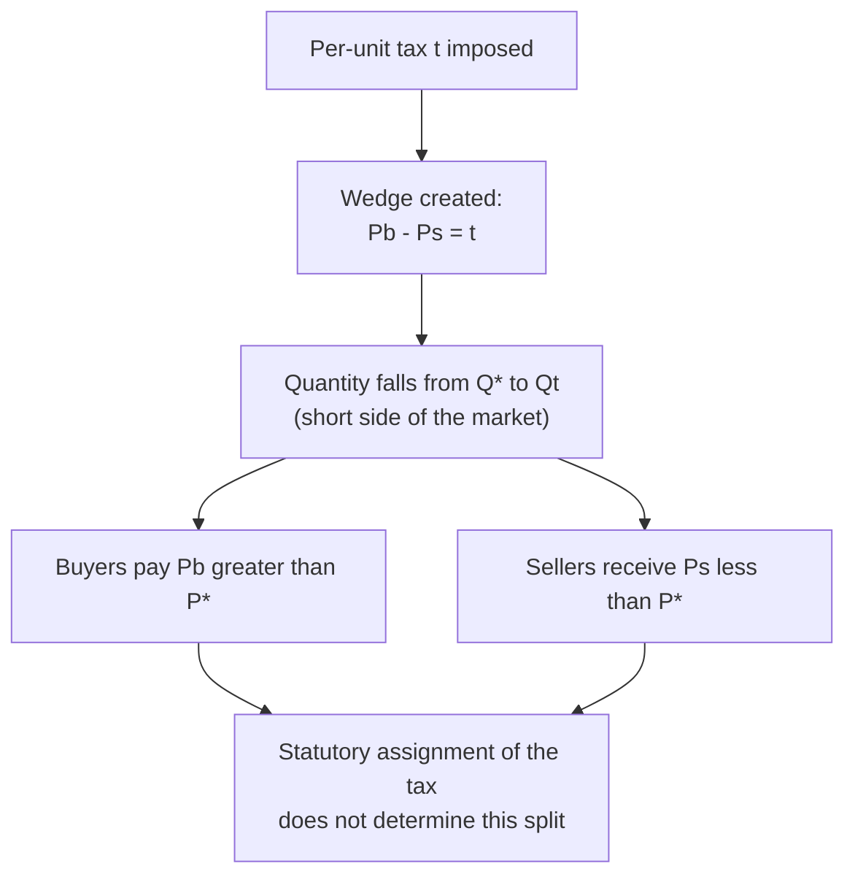
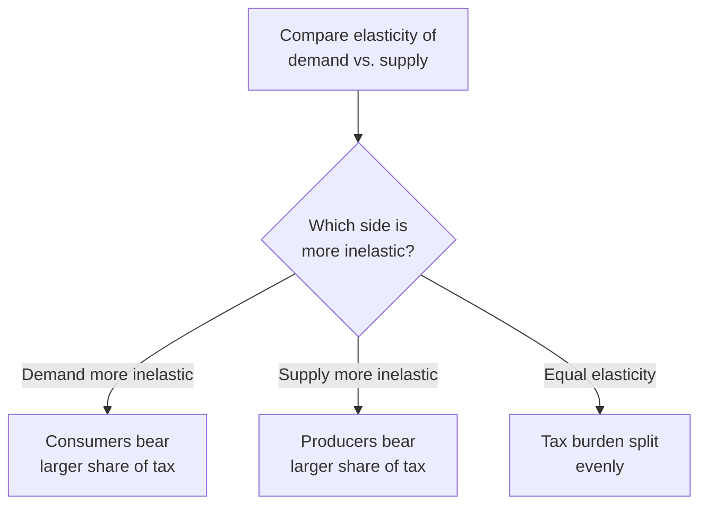

## Taxes and Tax Incidence

### Definition

A per-unit (specific) tax is a fixed monetary charge levied on each unit of a good bought or sold, driving a wedge between the price buyers pay and the price sellers receive. **Tax incidence** refers to the analysis of how the *economic burden* of this tax is actually distributed between buyers and sellers — a distribution that is determined entirely by market forces (specifically, relative elasticity) and is generally independent of which side of the market is legally required to remit the tax to the government.

### The Tax Wedge

When a per-unit tax $t$ is imposed, the price consumers pay ($P_b$, "buyer's price") and the price producers receive ($P_s$, "seller's price") diverge:

$$P_b - P_s = t$$

Regardless of whether the tax is statutorily collected from buyers or from sellers, equilibrium requires that quantity demanded at $P_b$ equal quantity supplied at $P_s$:

$$Q_D(P_b) = Q_S(P_s) = Q_t$$

where $Q_t$ is the new, lower quantity transacted after the tax.

### Statutory Incidence vs. Economic Incidence

**Key Points**

- **Statutory incidence** refers to who is legally required to send the tax payment to the government — this is a matter of administrative and legal design.
- **Economic incidence** refers to who actually bears the *cost* of the tax, measured by how much each side's price changes relative to the pre-tax equilibrium price.
- A foundational result of tax theory is that **economic incidence is invariant to statutory incidence** — a tax legally imposed on sellers produces the identical equilibrium price and quantity outcome as an equivalent tax legally imposed on buyers, given the same demand and supply curves. This equivalence holds because both scenarios generate the same wedge $t$ between $P_b$ and $P_s$, and the market-clearing condition is unaffected by which side physically transfers the tax payment to the government.

### Diagrammatic Illustration

<svg xmlns="http://www.w3.org/2000/svg" viewBox="0 0 640 440" font-family="Helvetica, Arial, sans-serif">
<title>Tax Wedge and Incidence Split (svg_diagram)</title>

<line x1="60" y1="380" x2="600" y2="380" stroke="#333" stroke-width="2" />
<line x1="60" y1="380" x2="60" y2="20" stroke="#333" stroke-width="2" />
<text x="580" y="400" font-size="14">Quantity</text>
<text x="20" y="30" font-size="14">Price</text>

<line x1="90" y1="360" x2="480" y2="60" stroke="#1b5e20" stroke-width="2.5" />
<text x="470" y="55" font-size="13" fill="#1b5e20">S</text>

<line x1="90" y1="60" x2="480" y2="360" stroke="#0d47a1" stroke-width="2.5" />
<text x="470" y="355" font-size="13" fill="#0d47a1">D</text>

<circle cx="285" cy="210" r="5" fill="#000" />
<text x="295" y="205" font-size="13">E (P*, Q*)</text>

<line x1="220" y1="380" x2="220" y2="60" stroke="#888" stroke-dasharray="2,2" />
<text x="212" y="398" font-size="11">Qt</text>

<circle cx="220" cy="130" r="4" fill="#0d47a1" />
<line x1="60" y1="130" x2="220" y2="130" stroke="#0d47a1" stroke-dasharray="4,3" />
<text x="35" y="134" font-size="11" fill="#0d47a1">Pb</text>

<circle cx="220" cy="290" r="4" fill="#1b5e20" />
<line x1="60" y1="290" x2="220" y2="290" stroke="#1b5e20" stroke-dasharray="4,3" />
<text x="35" y="294" font-size="11" fill="#1b5e20">Ps</text>

<line x1="60" y1="210" x2="285" y2="210" stroke="#888" stroke-dasharray="2,2" />
<text x="35" y="214" font-size="11">P*</text>

<line x1="240" y1="130" x2="240" y2="290" stroke="#c62828" stroke-width="2" />
<text x="248" y="215" font-size="12" fill="#c62828">tax = t</text>
</svg>

### The Relative Elasticity Rule

**Key Points**

- The economic burden of a tax falls disproportionately on the side of the market that is **more inelastic** — that is, less able to adjust quantity in response to the price change.
- This occurs because the inelastic side has fewer alternatives (substitute goods for buyers, alternative uses of resources for sellers) and therefore cannot avoid the tax by reducing quantity as readily as the elastic side can.

The formal split of the tax burden between consumers and producers is given by:

$$\frac{\text{Consumer burden}}{\text{Producer burden}} = \frac{E_s}{|E_d|}$$

**Extreme cases:**

- If demand is perfectly inelastic ($|E_d|=0$): consumers bear 100% of the tax; price paid by buyers rises by the full amount of $t$, while price received by sellers is unchanged.
- If demand is perfectly elastic ($|E_d|\to\infty$): producers bear 100% of the tax; price paid by buyers is unchanged, while price received by sellers falls by the full amount of $t$.
- If supply is perfectly inelastic ($E_s=0$): producers bear 100% of the tax, regardless of demand elasticity.
- If supply is perfectly elastic ($E_s\to\infty$): consumers bear 100% of the tax, regardless of demand elasticity.

### Worked Numerical Example

**Example**

Given:

$$Q_D = 100 - 2P, \qquad Q_S = -20 + 3P$$

Pre-tax equilibrium: $P^* = 24$, $Q^* = 52$ (established in prior equilibrium analysis).

A per-unit tax of $t=10$ is imposed on sellers. The new supply relationship in terms of the price buyers pay is: sellers require $P_s = P_b - 10$ to supply the same quantity, so:

$$Q_S = -20 + 3(P_b - 10) = -50 + 3P_b$$

Setting $Q_D = Q_S$ in terms of $P_b$:

$$100 - 2P_b = -50 + 3P_b \Rightarrow 150 = 5P_b \Rightarrow P_b = 30$$

Then $P_s = P_b - 10 = 20$, and $Q_t = 100 - 2(30) = 40$.

**Output**

| Measure | Value |
| --- | --- |
| Pre-tax equilibrium price $P^*$ | 24 |
| Price paid by buyers $P_b$ | 30 |
| Price received by sellers $P_s$ | 20 |
| Tax per unit $t$ | 10 |
| Post-tax quantity $Q_t$ | 40 (down from 52) |
| Consumer burden per unit | $P_b - P^* = 30-24 = 6$ |
| Producer burden per unit | $P^* - P_s = 24-20 = 4$ |
| Total tax revenue | $t \times Q_t = 10 \times 40 = 400$ |

**Verification using elasticities at the original equilibrium:**

$$E_d = -2 \times \frac{24}{52} \approx -0.923, \qquad E_s = 3 \times \frac{24}{52} \approx 1.385$$

$$\frac{\text{Consumer burden}}{\text{Producer burden}} = \frac{E_s}{|E_d|} = \frac{1.385}{0.923} \approx 1.5$$

This matches the computed split: consumer burden (6) is 1.5 times producer burden (4), confirming that buyers bear the larger share because demand is more inelastic than supply at this equilibrium ($|E_d| \approx 0.923 < E_s \approx 1.385$).

### Statutory Equivalence Verification

**Example**

Suppose instead the identical $t=10$ tax is imposed on **buyers** rather than sellers. Buyers are now willing to pay only $P_b = P_s - 10$ wait — more precisely, buyers' effective willingness to pay the seller is reduced by the tax they must remit, so quantity demanded becomes a function of $P_s + t$:

$$Q_D = 100 - 2(P_s+10) = 80 - 2P_s$$

Setting equal to original supply $Q_S = -20+3P_s$:

$$80-2P_s = -20+3P_s \Rightarrow 100 = 5P_s \Rightarrow P_s = 20$$

Then the price buyers actually pay in total (to the seller plus the tax) is $P_s + 10 = 30$, and $Q_t = -20+3(20)=40$.

**Output**

| Measure | Tax on Sellers | Tax on Buyers |
| --- | --- | --- |
| Price received by sellers | 20 | 20 |
| Total price paid by buyers | 30 | 30 |
| Quantity transacted | 40 | 40 |

The results are identical regardless of statutory assignment, confirming the invariance principle: only the size of the tax wedge $t$ and the elasticities of demand and supply determine the economic outcome.

### Tax Revenue and Deadweight Loss

Total tax revenue collected is:

$$\text{Tax Revenue} = t \times Q_t$$

This revenue is a **transfer** from the private sector to the government — it is not itself a loss to society, but rather a redistribution captured in the total surplus accounting. However, the tax simultaneously creates a **deadweight loss** equal to the forgone surplus from units between $Q_t$ and $Q^*$ that would have been mutually beneficial to trade but are no longer transacted because of the tax wedge, consistent with the general deadweight-loss framework established for price controls.

$$TS_{\text{with tax}} = CS + PS + \text{Tax Revenue} = TS_{\text{no tax}} - DWL$$

$$DWL = \frac{1}{2} \times (Q^* - Q_t) \times t$$

**Example (continued):**

$$DWL = \frac{1}{2} \times (52-40) \times 10 = \frac{1}{2} \times 12 \times 10 = 60$$

### Summary Table: Elasticity and Tax Outcomes

| Scenario | Consumer Share of Tax | Quantity Reduction | Deadweight Loss |
| --- | --- | --- | --- |
| Demand very inelastic, supply elastic | High | Small | Small |
| Demand elastic, supply very inelastic | Low | Small | Small |
| Both demand and supply elastic | Split depends on relative elasticity | Large | Large |
| Both demand and supply inelastic | Split depends on relative elasticity | Small | Small |

**Key Points**

- The *size* of the quantity reduction and resulting DWL depends on the elasticities of **both** curves jointly (flatter curves on either side widen the DWL triangle), while the *distribution* of the burden between buyers and sellers depends on their **relative** elasticities to each other.
- A tax imposed in a market where both demand and supply are highly inelastic raises substantial revenue with comparatively little distortion (small DWL) — this is the same principle underlying the discussion of optimal (Ramsey) taxation and sin-tax policy design under applications of elasticity.

### Ad Valorem Taxes (Percentage-Based)

**Key Points**

- The analysis above assumes a **specific tax** (fixed dollar amount per unit). An **ad valorem tax** (a percentage of the price, such as a sales tax or VAT) operates on the same underlying incidence principles but creates a wedge that is proportional to price rather than a constant dollar amount.
- Graphically, an ad valorem tax rotates the supply (or demand) curve rather than shifting it in parallel, since the absolute size of the wedge grows with the price level; the qualitative incidence conclusions (inelastic side bears more of the burden) remain unchanged. [Inference] The precise geometric rotation and its interaction with curve curvature introduce additional algebraic complexity relative to the specific-tax case, but the core relative-elasticity incidence result carries over directly.

### Common Pitfalls

**Key Points**

- Assuming the side of the market that is legally required to pay the tax is the side that economically bears it — statutory and economic incidence are frequently different, and only the latter reflects the true cost distribution.
- Assuming a 50-50 split of tax burden is the "default" outcome — the actual split depends entirely on relative elasticities and will be 50-50 only in the special case where $E_s = |E_d|$.
- Confusing tax revenue with deadweight loss — tax revenue is a transfer (a component of total surplus accounting, not a loss), while DWL is the separate forgone-surplus triangle representing genuinely destroyed value.
- Forgetting that both the magnitude of the quantity reduction and the distribution of burden depend on elasticity, but through different specific relationships — magnitude depends on the elasticities jointly (widening the DWL triangle), while distribution depends on their ratio relative to each other.

### Conclusion

Tax incidence analysis demonstrates that the economic burden of a per-unit or ad valorem tax is determined by market forces — specifically, the relative price elasticities of demand and supply — rather than by the legal designation of who remits the tax. The side of the market with more inelastic elasticity bears a proportionally larger share of the burden, since it has fewer options to avoid the tax by adjusting quantity. This framework connects directly to the broader analysis of deadweight loss, showing that both the size of the efficiency cost and the distribution of the tax's economic burden are governed by the same underlying elasticity parameters, making tax incidence one of the most direct practical applications of elasticity theory in public finance.

**Related Topics**

- Price elasticity of demand and price elasticity of supply (the parameters determining incidence)
- Deadweight loss from price controls (parallel efficiency-cost framework)
- Applications of elasticity (optimal/Ramsey taxation, sin tax design)
- Subsidies and their incidence (the mirror-image analysis of tax incidence)
- Market efficiency and total surplus (baseline against which tax-distorted surplus is measured)
- Ad valorem vs. specific taxation in public finance design
- International tax competition and cross-border tax incidence effects