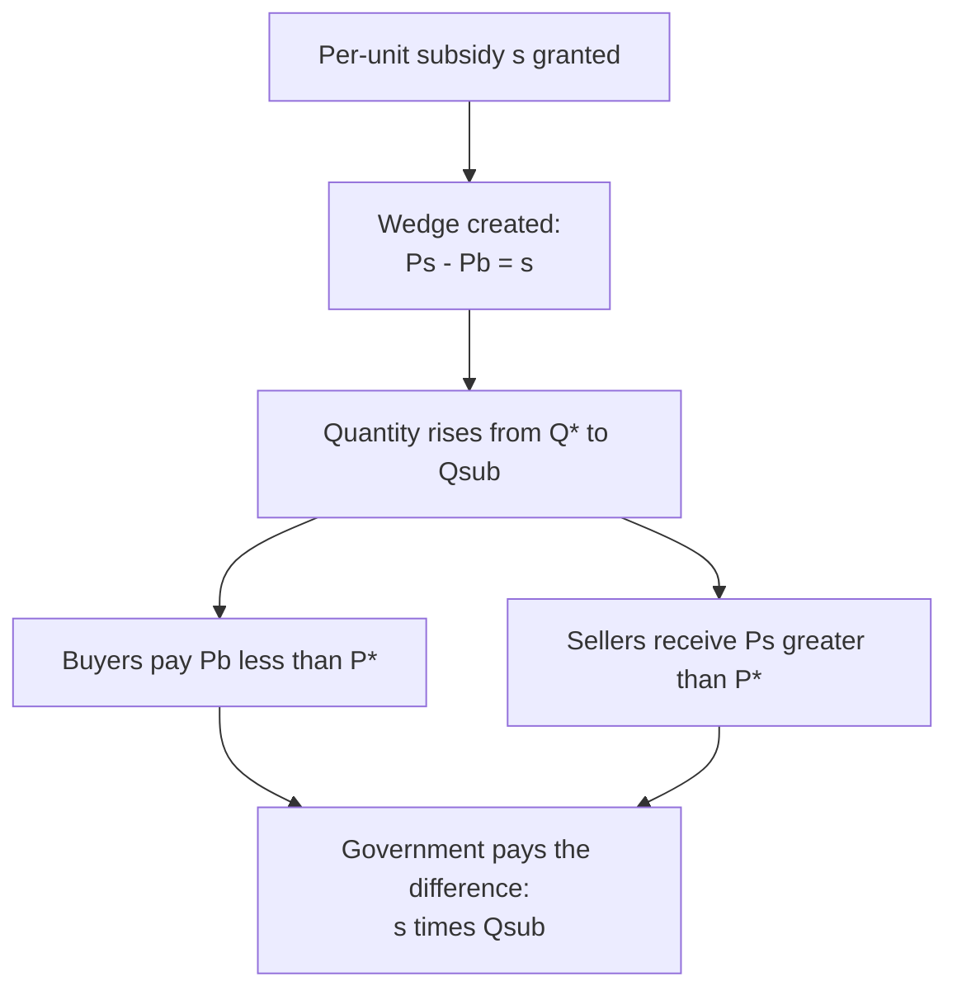
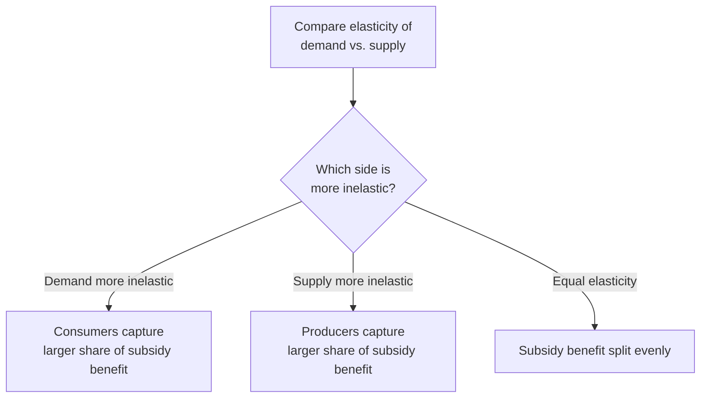
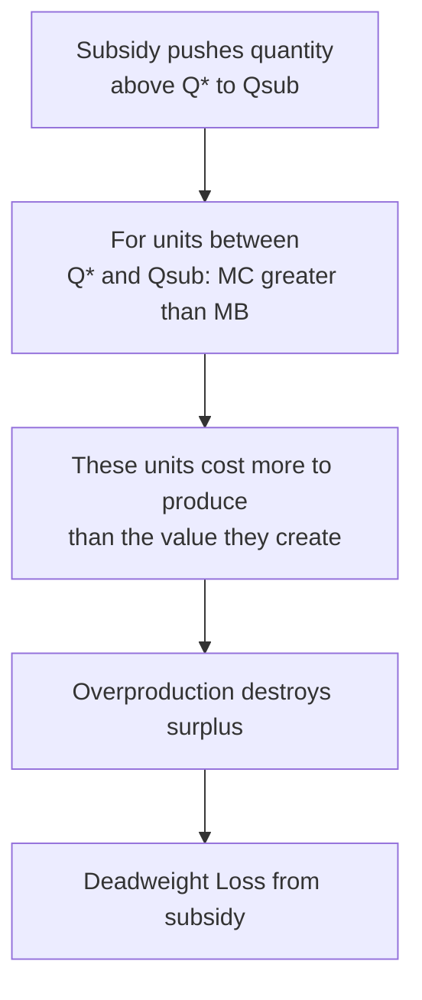

## Subsidies

### Definition

A subsidy is a per-unit payment made by the government to buyers or sellers of a good, functioning as a "negative tax" that drives a wedge between the price paid by consumers and the price received by producers — but in the opposite direction from a tax. Where a tax makes the buyer's price exceed the seller's price, a subsidy makes the price received by sellers **exceed** the price paid by buyers, with the government covering the difference.

### The Subsidy Wedge

When a per-unit subsidy $s$ is granted, the price sellers receive ($P_s$) and the price buyers pay ($P_b$) diverge in the opposite direction from a tax:

$$P_s - P_b = s$$

Market clearing requires that quantity demanded at $P_b$ equal quantity supplied at $P_s$:

$$Q_D(P_b) = Q_S(P_s) = Q_{\text{sub}}$$

where $Q_{\text{sub}}$ is the new, **higher** quantity transacted after the subsidy — the mirror image of the tax case, where quantity falls.

### Statutory vs. Economic Incidence of a Subsidy

**Key Points**

- As with taxes, the **statutory** assignment of a subsidy (paid directly to buyers or directly to sellers) does not determine the **economic** distribution of its benefit between the two sides of the market.
- The equivalence result carries over directly: a subsidy paid to sellers produces the identical equilibrium prices and quantity as an economically equivalent subsidy paid to buyers, given the same demand and supply curves — because both generate the same wedge $s$ between $P_b$ and $P_s$.

### The Relative Elasticity Rule for Subsidy Benefit

**Key Points**

- The economic benefit of a subsidy is captured disproportionately by the side of the market that is **more inelastic** — the mirror image of the tax-incidence rule, since the same relative-elasticity logic applies: the inelastic side has fewer alternatives and would otherwise have adjusted its price/quantity the least, so it "gains" the most in relative terms when the constraint (price) is loosened by a subsidy.

$$\frac{\text{Consumer benefit share}}{\text{Producer benefit share}} = \frac{E_s}{|E_d|}$$

**Extreme cases:**

- If demand is perfectly inelastic ($|E_d|=0$): consumers capture the entire subsidy; the price they pay falls by the full amount $s$, while the price sellers receive is unchanged.
- If supply is perfectly inelastic ($E_s=0$): producers capture the entire subsidy; the price sellers receive rises by the full amount $s$, while the price buyers pay is unchanged.
- Intermediate elasticities split the benefit between both sides in proportion to their relative elasticities, exactly as with tax incidence.

### Diagrammatic Illustration

<svg xmlns="http://www.w3.org/2000/svg" viewBox="0 0 640 440" font-family="Helvetica, Arial, sans-serif">
<title>Subsidy Wedge and Benefit Split (svg_diagram)</title>

<line x1="60" y1="380" x2="600" y2="380" stroke="#333" stroke-width="2" />
<line x1="60" y1="380" x2="60" y2="20" stroke="#333" stroke-width="2" />
<text x="580" y="400" font-size="14">Quantity</text>
<text x="20" y="30" font-size="14">Price</text>

<line x1="90" y1="360" x2="480" y2="60" stroke="#1b5e20" stroke-width="2.5" />
<text x="470" y="55" font-size="13" fill="#1b5e20">S</text>

<line x1="90" y1="60" x2="480" y2="360" stroke="#0d47a1" stroke-width="2.5" />
<text x="470" y="355" font-size="13" fill="#0d47a1">D</text>

<circle cx="285" cy="210" r="5" fill="#000" />
<text x="295" y="205" font-size="13">E (P*, Q*)</text>

<line x1="350" y1="380" x2="350" y2="60" stroke="#888" stroke-dasharray="2,2" />
<text x="342" y="398" font-size="11">Qsub</text>

<circle cx="350" cy="150" r="4" fill="#1b5e20" />
<line x1="60" y1="150" x2="350" y2="150" stroke="#1b5e20" stroke-dasharray="4,3" />
<text x="35" y="154" font-size="11" fill="#1b5e20">Ps</text>

<circle cx="350" cy="270" r="4" fill="#0d47a1" />
<line x1="60" y1="270" x2="350" y2="270" stroke="#0d47a1" stroke-dasharray="4,3" />
<text x="35" y="274" font-size="11" fill="#0d47a1">Pb</text>

<line x1="60" y1="210" x2="285" y2="210" stroke="#888" stroke-dasharray="2,2" />
<text x="35" y="214" font-size="11">P*</text>

<line x1="370" y1="150" x2="370" y2="270" stroke="#f57f17" stroke-width="2" />
<text x="378" y="215" font-size="12" fill="#f57f17">subsidy = s</text>
</svg>

### Worked Numerical Example

**Example**

Given:

$$Q_D = 100 - 2P, \qquad Q_S = -20 + 3P$$

Pre-subsidy equilibrium: $P^* = 24$, $Q^* = 52$.

A per-unit subsidy of $s=10$ is granted to sellers. Sellers now receive $P_s = P_b + 10$ for any quantity, so their supply behavior in terms of the price buyers pay becomes:

$$Q_S = -20+3(P_b+10) = 10+3P_b$$

Setting $Q_D = Q_S$ in terms of $P_b$:

$$100-2P_b = 10+3P_b \Rightarrow 90 = 5P_b \Rightarrow P_b = 18$$

Then $P_s = P_b+10 = 28$, and $Q_{\text{sub}} = 100-2(18) = 64$.

**Output**

| Measure | Value |
| --- | --- |
| Pre-subsidy equilibrium price $P^*$ | 24 |
| Price paid by buyers $P_b$ | 18 |
| Price received by sellers $P_s$ | 28 |
| Subsidy per unit $s$ | 10 |
| Post-subsidy quantity $Q_{\text{sub}}$ | 64 (up from 52) |
| Consumer benefit per unit | $P^* - P_b = 24-18 = 6$ |
| Producer benefit per unit | $P_s - P^* = 28-24 = 4$ |
| Total government expenditure | $s \times Q_{\text{sub}} = 10 \times 64 = 640$ |

**Verification using elasticities at the original equilibrium:**

$$E_d = -2\times\frac{24}{52}\approx-0.923, \qquad E_s = 3\times\frac{24}{52}\approx1.385$$

$$\frac{\text{Consumer benefit}}{\text{Producer benefit}} = \frac{E_s}{|E_d|} = \frac{1.385}{0.923}\approx1.5$$

This confirms the computed split: consumer benefit (6) is 1.5 times producer benefit (4), consistent with buyers capturing the larger share of subsidy benefit because demand is more inelastic than supply — the identical elasticity ratio derived for the tax-incidence example on this same market, illustrating the mirror-image relationship.

### Subsidies and Overproduction: The "Deadweight Loss" of a Subsidy

**Key Points**

- Unlike a tax, which reduces quantity below the efficient level $Q^*$, a subsidy **increases** quantity above $Q^*$ — this is also inefficient, since it induces units to be traded for which marginal cost exceeds marginal benefit.
- For all units between $Q^*$ and $Q_{\text{sub}}$: $MC(Q) > MB(Q)$, meaning these units cost more to produce than the value they generate for consumers. Producing and consuming them destroys surplus rather than creating it, exactly analogous in structure — though opposite in direction — to the deadweight loss from a binding price ceiling or floor.

$$DWL_{\text{subsidy}} = \frac{1}{2} \times (Q_{\text{sub}} - Q^*) \times s$$

**Example (continued):**

$$DWL_{\text{subsidy}} = \frac{1}{2} \times (64-52) \times 10 = \frac{1}{2}\times12\times10 = 60$$

### Complete Surplus and Government Expenditure Accounting

$$TS_{\text{with subsidy}} = CS_{\text{sub}} + PS_{\text{sub}} - \text{Government Expenditure}$$

Unlike tax revenue (which flows *into* the government and is a transfer within the surplus accounting), subsidy expenditure flows *out of* the government budget, funded ultimately by other tax revenue or borrowing. Consumer surplus and producer surplus both individually **increase** relative to the no-subsidy equilibrium (both sides gain from the lower/higher effective prices they face), but the *sum* of (CS gain + PS gain) is **smaller** than the government expenditure required to fund the subsidy — the gap between them is exactly the deadweight loss.

$$TS_{\text{with subsidy}} = TS_{\text{no subsidy}} - DWL_{\text{subsidy}}$$

### Summary Comparison: Taxes vs. Subsidies

| Feature | Tax | Subsidy |
| --- | --- | --- |
| Wedge direction | $P_b > P_s$ | $P_s > P_b$ |
| Effect on quantity | Decreases below $Q^*$ | Increases above $Q^*$ |
| Government cash flow | Revenue collected | Expenditure incurred |
| CS and PS individually | Both decrease | Both increase |
| Source of deadweight loss | Units between $Q_t$ and $Q^*$ where $MB > MC$ go untraded | Units between $Q^*$ and $Q_{\text{sub}}$ where $MC > MB$ are traded anyway |
| Incidence/benefit rule | More inelastic side bears more burden | More inelastic side captures more benefit |

**Key Points**

- Despite the opposite direction of the quantity distortion, both taxes and subsidies generate deadweight loss through the same underlying mechanism: a departure of transacted quantity from the surplus-maximizing level $Q^*$, whether that departure is a shortfall (tax) or an excess (subsidy).
- The relative-elasticity rule applies with the same mathematical form ($E_s/|E_d|$) in both cases, but its interpretation flips from "who bears the burden" (tax) to "who captures the benefit" (subsidy).

### Rationales for Subsidies

**Key Points**

- **Positive externalities:** subsidies are commonly used to correct underproduction of goods that generate benefits to third parties beyond the direct buyer and seller (e.g., education, vaccination, renewable energy), where the unsubsidized private market equilibrium quantity would fall short of the socially optimal quantity. [Inference] The efficiency case for a subsidy in the presence of positive externalities is strongest when the subsidy is sized to align private marginal benefit with social marginal benefit; a subsidy set arbitrarily larger than this externality-correcting size would itself induce inefficient overproduction relative to the *true* social optimum, distinct from the standard DWL calculation above (which is relative to the private-market $Q^*$, not the externality-adjusted social optimum).
- **Income/producer support:** subsidies are also used for distributional or strategic reasons unrelated to externalities — agricultural subsidies to support farm incomes, for example — in which case the DWL framework above applies directly, since there is no offsetting externality benefit to weigh against the calculated efficiency loss.
- **Strategic industrial policy:** subsidies to nascent or strategically important industries (e.g., renewable energy manufacturing, semiconductor production) are sometimes justified on dynamic grounds (learning curves, national security) that fall outside the static surplus-maximization framework presented here. [Inference] Evaluating these dynamic rationales requires additional analytical tools beyond static comparative-statics and surplus accounting, and is a matter of ongoing debate in the applied public economics and industrial policy literature.

### Common Pitfalls

**Key Points**

- Assuming a subsidy is simply "good for everyone" because both CS and PS rise — while both components individually increase, the *net* change in total surplus (accounting for government expenditure) is negative in the standard no-externality case, since the subsidy induces genuine overproduction.
- Applying the tax deadweight-loss diagram's directionality to a subsidy without adjusting — the DWL triangle for a subsidy sits on the *opposite* side of $Q^*$ (beyond it) compared to a tax's DWL triangle (short of it), reflecting overproduction rather than underproduction.
- Ignoring the externality-correction case when evaluating subsidy efficiency — the standard DWL calculation shown here assumes no externality; when a genuine positive externality is present, a correctly sized subsidy can move the market *closer* to the true social optimum, making a blanket claim that "all subsidies create deadweight loss" incomplete without specifying whether an externality is being corrected.
- Forgetting that subsidy benefit distribution follows the *same* relative-elasticity ratio formula as tax burden distribution, just with the more-inelastic side now gaining more of the benefit rather than bearing more of the cost.

### Conclusion

Subsidies operate as the structural mirror image of taxes: a per-unit payment that widens rather than narrows the effective price wedge, pushing quantity above rather than below the market equilibrium level. As with taxes, the statutory assignment of a subsidy does not determine its economic incidence — the same relative-elasticity rule governs how the benefit is shared between buyers and sellers, with the more inelastic side capturing the larger share. In the absence of an externality justification, subsidies generate deadweight loss through overproduction — trading units for which marginal cost exceeds marginal benefit — making the standard efficiency analysis of subsidies structurally parallel to, but directionally opposite from, the deadweight loss analysis of taxation.

**Related Topics**

- Taxes and tax incidence (the direct structural counterpart to subsidy analysis)
- Deadweight loss from price controls and taxation
- Externalities and the case for Pigouvian subsidies and taxes
- Market efficiency and total surplus (the baseline against which subsidy-distorted surplus is measured)
- Agricultural price supports and producer income policy
- Public goods and government provision as an alternative to subsidizing private provision
- Industrial policy and dynamic/strategic rationales for government support of specific sectors