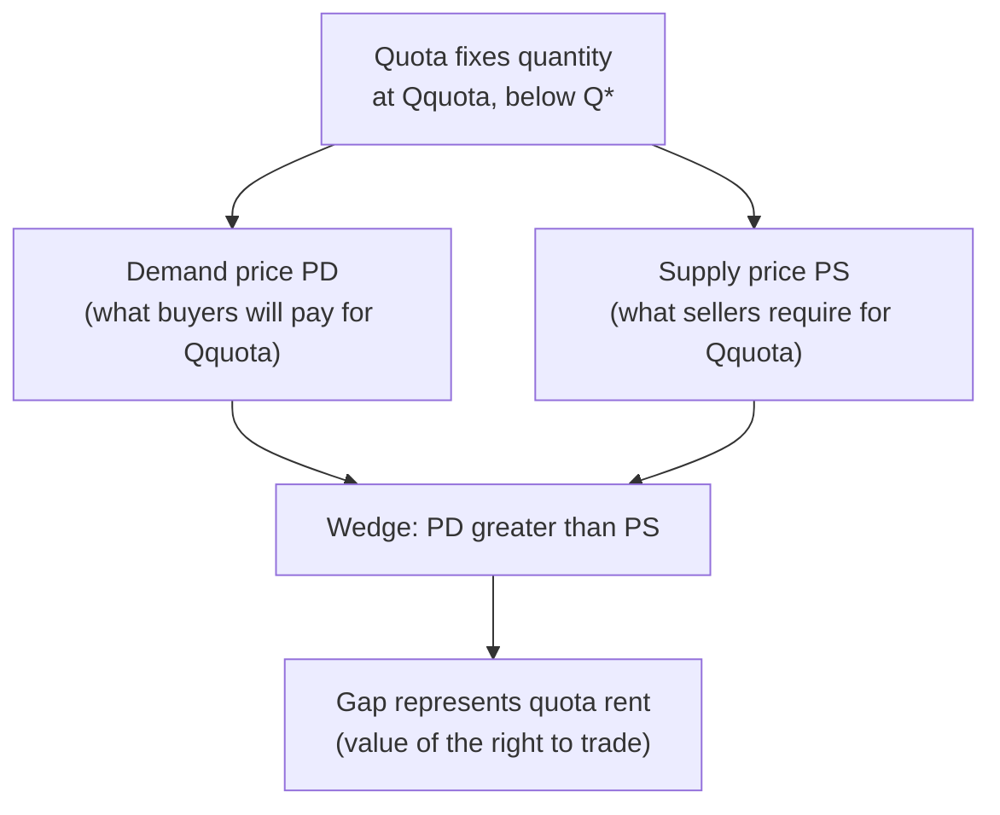
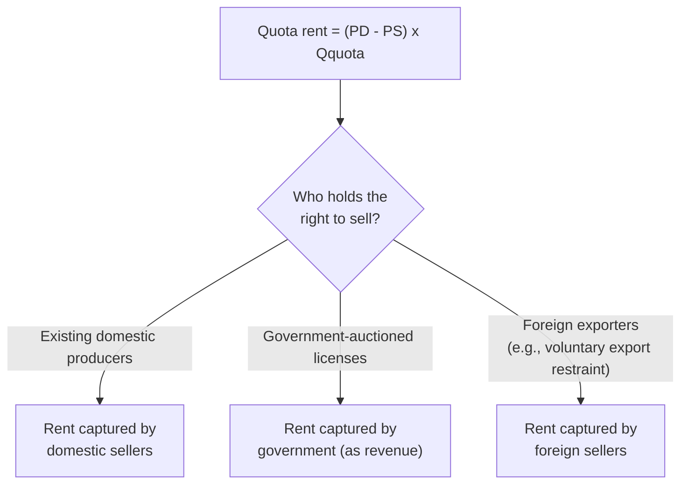
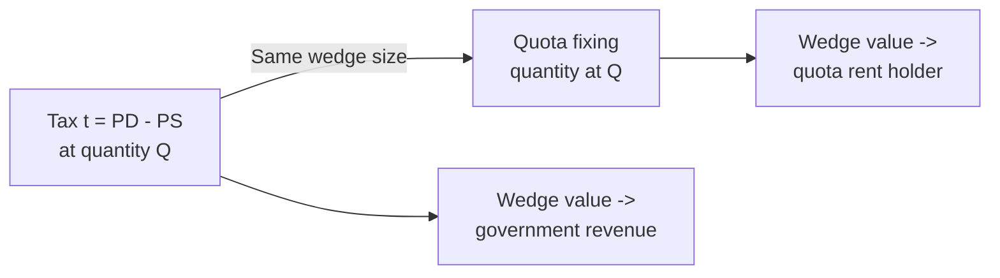

## Quotas and Quantity Controls

### Definition

A quota is a government-imposed restriction on the quantity of a good that may be bought or sold in a market, set at a level below the free-market equilibrium quantity $Q^*$. Unlike a price ceiling or price floor — which directly fix a price and let quantity adjust to the short side of the market — a quota directly fixes the **quantity**, and the market price(s) then adjust around that quantity restriction.

### The Quantity-Restriction Mechanism

A binding quota fixes quantity at $Q_{\text{quota}} < Q^*$. At this restricted quantity, the demand curve and supply curve generally do **not** intersect at a single price — instead, two distinct prices emerge:

- **Demand price:** $P_D = D^{-1}(Q_{\text{quota}})$ — the price buyers are willing to pay for that restricted quantity (read off the demand curve).
- **Supply price:** $P_S = S^{-1}(Q_{\text{quota}})$ — the price at which sellers are willing to supply that restricted quantity (read off the supply curve).

Because the quota restricts quantity below $Q^*$, and demand slopes downward while supply slopes upward, it always holds that:

$$P_D > P_S \quad \text{for } Q_{\text{quota}} < Q^*$$

This gap, $P_D - P_S$, is known as the **quota wedge** — structurally identical in form to the tax wedge analyzed in tax incidence, even though no tax has been imposed.

### Diagrammatic Illustration

<svg xmlns="http://www.w3.org/2000/svg" viewBox="0 0 640 440" font-family="Helvetica, Arial, sans-serif">
<title>Binding Quota and the Quota Wedge (svg_diagram)</title>

<line x1="60" y1="380" x2="600" y2="380" stroke="#333" stroke-width="2" />
<line x1="60" y1="380" x2="60" y2="20" stroke="#333" stroke-width="2" />
<text x="580" y="400" font-size="14">Quantity</text>
<text x="20" y="30" font-size="14">Price</text>

<line x1="90" y1="360" x2="480" y2="60" stroke="#1b5e20" stroke-width="2.5" />
<text x="470" y="55" font-size="13" fill="#1b5e20">S</text>

<line x1="90" y1="60" x2="480" y2="360" stroke="#0d47a1" stroke-width="2.5" />
<text x="470" y="355" font-size="13" fill="#0d47a1">D</text>

<circle cx="285" cy="210" r="5" fill="#000" />
<text x="295" y="205" font-size="13">E (P*, Q*)</text>

<line x1="200" y1="380" x2="200" y2="60" stroke="#888" stroke-dasharray="2,2" />
<text x="188" y="398" font-size="11">Qquota</text>

<circle cx="200" cy="150" r="4" fill="#0d47a1" />
<line x1="60" y1="150" x2="200" y2="150" stroke="#0d47a1" stroke-dasharray="4,3" />
<text x="35" y="154" font-size="11" fill="#0d47a1">PD</text>

<circle cx="200" cy="290" r="4" fill="#1b5e20" />
<line x1="60" y1="290" x2="200" y2="290" stroke="#1b5e20" stroke-dasharray="4,3" />
<text x="35" y="294" font-size="11" fill="#1b5e20">PS</text>

<line x1="220" y1="150" x2="220" y2="290" stroke="#f57f17" stroke-width="2" />
<text x="228" y="225" font-size="12" fill="#f57f17">quota wedge (rent)</text>
</svg>

### Quota Rent

**Key Points**

- The gap between $P_D$ and $P_S$ multiplied by the restricted quantity is called the **quota rent**: $(P_D - P_S) \times Q_{\text{quota}}$.
- This rent represents the value of the legal right to sell within the restricted quantity — whoever holds that right (a license, permit, or import quota allocation) can potentially capture this per-unit gap as pure profit, since they can sell at $P_D$ while their marginal cost of production is only $P_S$.
- **Who captures the quota rent** depends entirely on **who is allocated the right to sell** under the quota system — this is a policy design choice distinct from the underlying supply-and-demand mechanics.

### Methods of Allocating Quota Rights

| Allocation Method | Who Captures the Rent | Common Context |
| --- | --- | --- |
| Grandfathered to existing producers | Existing sellers (domestic firms) | Historical production-based allocations, agricultural quotas |
| Auctioned by government | Government (converted to revenue) | Some import license and emissions-permit systems |
| Allocated to foreign exporters | Foreign sellers | Voluntary export restraints (VERs) |
| First-come, first-served licensing | Whoever obtains the license first | Some import/export permit systems |
| Lottery | Randomly selected license-holders | Certain visa/permit-style quota systems |

### Worked Numerical Example

**Example**

Given:

$$Q_D = 100-2P, \qquad Q_S = -20+3P$$

Free-market equilibrium: $P^*=24$, $Q^*=52$.

A quota restricts quantity to $Q_{\text{quota}} = 40$ (below $Q^*=52$, hence binding).

**Demand price** (inverse demand at $Q=40$): $P = 50-0.5(40) = 30 \Rightarrow P_D = 30$

**Supply price** (inverse supply at $Q=40$): $P = (20+40)/3 = 20 \Rightarrow P_S = 20$

**Output**

| Measure | Value |
| --- | --- |
| Free-market quantity $Q^*$ | 52 |
| Quota quantity $Q_{\text{quota}}$ | 40 |
| Demand price $P_D$ | 30 |
| Supply price $P_S$ | 20 |
| Quota wedge $(P_D - P_S)$ | 10 |
| Total quota rent | $10 \times 40 = 400$ |

Notably, comparing this to the earlier per-unit tax example on the identical demand and supply functions (a $t=10$ tax produced $Q_t=40$, $P_b=30$, $P_s=20$): a quota of $Q_{\text{quota}}=40$ produces the **exact same prices and quantity** as a $t=10$ tax. This numerical coincidence illustrates a general structural result explored next.

### Equivalence Between Quotas and Taxes

**Key Points**

- A quota set at quantity $Q_{\text{quota}}$ and a per-unit tax set at $t = P_D(Q_{\text{quota}}) - P_S(Q_{\text{quota}})$ produce **identical** equilibrium prices ($P_b=P_D$, $P_s=P_S$) and identical quantity transacted, since both mechanisms create the same wedge between the price buyers pay and the price sellers receive.
- The key **difference** lies in who captures the resulting wedge value: under a tax, the wedge value flows to the **government** as tax revenue; under a quota, the wedge value (the quota rent) flows to **whoever holds the right to sell** under the quota's allocation mechanism, as summarized in the table above.
- This equivalence is why quotas are sometimes described as functioning like a tax "in kind," with the critical policy distinction being the *destination* of the wedge value rather than its *existence or size*.

### Deadweight Loss from a Quota

**Key Points**

- Because a binding quota restricts quantity below $Q^*$ in exactly the same way as a binding price ceiling or an equivalent per-unit tax, it generates deadweight loss through the identical mechanism: units between $Q_{\text{quota}}$ and $Q^*$ have $MB > MC$ but go untraded.
- **If the quota rent is captured domestically** (by producers or the government), the DWL calculation mirrors the tax case: the rent itself is a transfer (not a loss), and only the triangle beyond the rent rectangle constitutes genuine deadweight loss.
- **If the quota rent is captured by foreign sellers** (as under a voluntary export restraint, where a foreign government or foreign firms are allocated the right to sell into the domestic market), the domestic economy loses this rent value as well — from the domestic perspective, foreign capture of the rent represents an *additional* loss beyond the standard DWL triangle, since that portion of value leaves the domestic economy entirely rather than being redistributed within it.

$$DWL_{\text{quota}} = \frac{1}{2} \times (Q^* - Q_{\text{quota}}) \times (P_D - P_S)$$

**Example (continued):**

$$DWL = \frac{1}{2} \times (52-40) \times 10 = \frac{1}{2}\times12\times10 = 60$$

matching the deadweight loss computed for the equivalent $t=10$ tax on this same market — a direct numerical confirmation of the quota-tax equivalence.

### Import Quotas: A Common Applied Context

**Key Points**

- Import quotas restrict the quantity of a good that may be imported from abroad, commonly analyzed by separating the market into a domestic supply curve and a combined domestic-plus-import supply curve.
- Without a quota, imports fill the entire gap between domestic quantity demanded and domestic quantity supplied at the world price. A binding import quota restricts this gap, causing domestic price to rise above the world price.
- The resulting price increase benefits domestic producers (higher producer surplus from the higher domestic price) while harming domestic consumers (lower consumer surplus from paying more), with the quota rent on the restricted import quantity captured by whoever holds the import licenses — often foreign exporters under a voluntary export restraint, or domestic import-license holders under a domestically-administered quota system.
- [Inference] The precise magnitude of domestic price increase and welfare redistribution in an import-quota scenario depends on the specific domestic supply and demand elasticities and the size of the quota relative to the free-trade import volume, and requires the full domestic-supply-plus-import-supply framework to calculate exactly; the qualitative direction of the effects (higher domestic price, producer gain, consumer loss, and a rent for quota holders) follows directly from the general quota mechanism described above.

### Comparison: Quotas vs. Price Ceilings vs. Taxes

| Feature | Price Ceiling | Per-Unit Tax | Quota |
| --- | --- | --- | --- |
| Directly fixed variable | Price (maximum) | Wedge between $P_b$ and $P_s$ | Quantity |
| Resulting quantity | $Q_S(P_c)$, the short side | Falls to $Q_t < Q^*$ | Fixed at $Q_{\text{quota}} < Q^*$ |
| Resulting price(s) | Single price $P_c$ | Two prices, $P_b$ and $P_s$ | Two prices, $P_D$ and $P_S$ |
| Value of the wedge/gap | No wedge (single controlled price; forgone value is pure DWL beyond the shortage) | Captured by government as revenue | Captured by rent-holder (varies by allocation method) |
| DWL mechanism | Units between $Q_S(P_c)$ and $Q^*$ untraded | Units between $Q_t$ and $Q^*$ untraded | Units between $Q_{\text{quota}}$ and $Q^*$ untraded |

**Key Points**

- All three interventions share the same underlying deadweight-loss mechanism (quantity displaced from $Q^*$), but differ in *what is directly controlled* (price vs. wedge vs. quantity) and, where applicable, in *who captures* any resulting wedge value.
- A price ceiling, notably, does not create a "wedge" with two distinct prices in the same way — there is only the single controlled price $P_c$, and the analogous rent-like value (the gap between the marginal buyer's willingness to pay and $P_c$ at the restricted quantity) is not automatically captured by any specific party; it may be dissipated through search costs, black-market activity, or non-price rationing, or partially captured by whoever manages to buy at $P_c$ and can resell.

### Common Pitfalls

**Key Points**

- Assuming a quota produces a single equilibrium price like a free market — a binding quota generally produces **two** distinct prices ($P_D$ and $P_S$), not one, since demand and supply no longer intersect at the restricted quantity.
- Assuming the quota rent automatically benefits the domestic economy — this depends entirely on the allocation mechanism; rent captured by foreign exporters under a voluntary export restraint represents value leaving the domestic economy, not merely a domestic transfer.
- Treating a quota's deadweight loss as necessarily different in size from an equivalent tax's deadweight loss — when the quota quantity is set to match the quantity a given tax would produce, the DWL triangles are identical in size, differing only in where the non-DWL wedge value (rent vs. revenue) ends up.
- Confusing quota rent with producer surplus — quota rent specifically reflects the gap created by the *quantity restriction itself* (the value of the right to sell), which is a distinct concept from the general producer surplus that would exist even in the unrestricted market.

### Conclusion

Quotas restrict market quantity directly, rather than fixing price as a ceiling or floor does, and this quantity restriction opens a wedge between what buyers are willing to pay and what sellers require, generating a quota rent whose value depends on the wedge size and the restricted quantity. Structurally, a well-chosen quota is equivalent to a per-unit tax in its effect on prices, quantity, and deadweight loss — the essential policy distinction is that quota rent flows to whoever holds the right to sell, which may be domestic producers, the government, or foreign exporters, whereas tax revenue flows unambiguously to the government. This makes the choice of quota-rent allocation mechanism a first-order policy consideration, with direct implications for whether the wedge value stays within the domestic economy or is transferred abroad.

**Related Topics**

- Taxes and tax incidence (the structural equivalent mechanism to quotas)
- Subsidies (the opposite-direction quantity distortion)
- Deadweight loss from price controls and taxation
- International trade policy: tariffs, voluntary export restraints, and quota administration
- Rent-seeking behavior and the political economy of quota allocation
- Licensing and permit systems as quantity-control mechanisms (e.g., taxi medallions, fishing quotas)
- Cap-and-trade systems as a market-based quantity-control mechanism for externalities