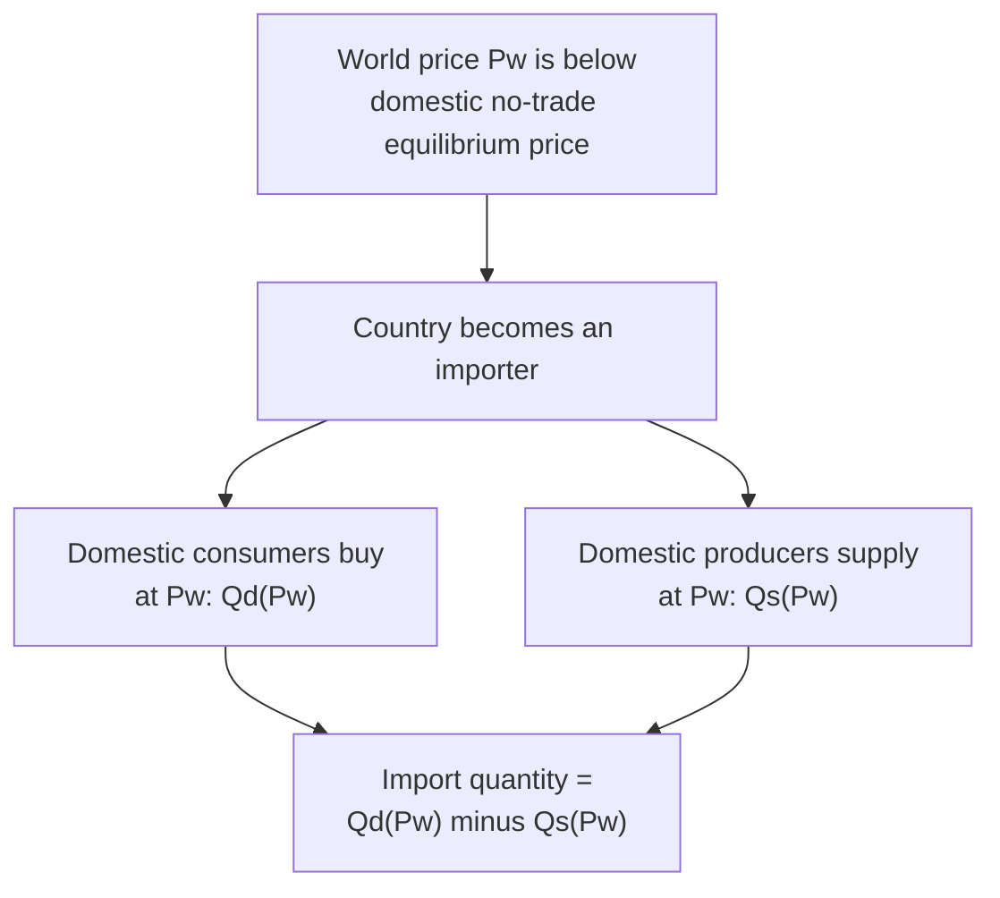
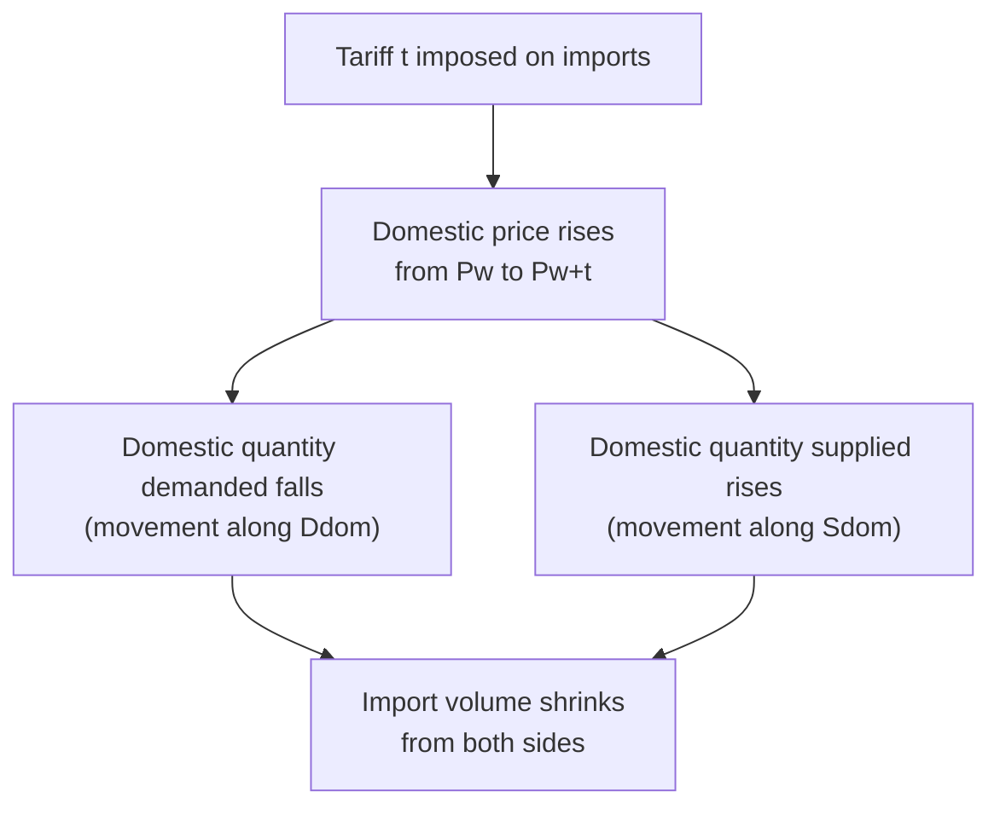
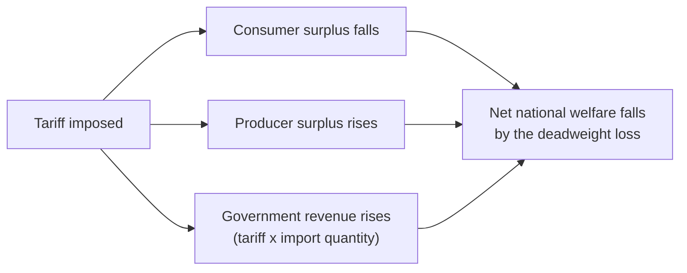

## Tariffs and Trade Restrictions

### Definition

A tariff is a tax imposed specifically on imported goods, functioning as a special case of the general per-unit or ad valorem tax framework applied at a national border. Trade restrictions more broadly encompass tariffs alongside quotas, voluntary export restraints, and other measures designed to limit the quantity or alter the price of goods crossing international borders.

### Setting Up the Small-Country Trade Model

The standard framework separates domestic supply and demand from the world market:

- $D_{\text{dom}}$: domestic demand curve
- $S_{\text{dom}}$: domestic supply curve
- $P_W$: the world price, taken as fixed and unaffected by this country's trade decisions (the **small-country assumption**, meaning the country is a price-taker in the world market)

**Under free trade** at world price $P_W$ (assumed below the domestic no-trade equilibrium price, making the country a natural importer of this good):

$$Q_D^{\text{dom}}(P_W) = \text{domestic quantity demanded at } P_W$$

$$Q_S^{\text{dom}}(P_W) = \text{domestic quantity supplied at } P_W$$

$$\text{Imports} = Q_D^{\text{dom}}(P_W) - Q_S^{\text{dom}}(P_W)$$

### Diagrammatic Illustration: Free Trade vs. Tariff

<svg xmlns="http://www.w3.org/2000/svg" viewBox="0 0 640 460" font-family="Helvetica, Arial, sans-serif">
<title>Effect of a Tariff on the Domestic Market (svg_diagram)</title>

<line x1="60" y1="400" x2="600" y2="400" stroke="#333" stroke-width="2" />
<line x1="60" y1="400" x2="60" y2="20" stroke="#333" stroke-width="2" />
<text x="580" y="420" font-size="14">Quantity</text>
<text x="20" y="30" font-size="14">Price</text>

<line x1="90" y1="380" x2="480" y2="60" stroke="#1b5e20" stroke-width="2.5" />
<text x="470" y="55" font-size="13" fill="#1b5e20">S_dom</text>

<line x1="90" y1="60" x2="480" y2="380" stroke="#0d47a1" stroke-width="2.5" />
<text x="470" y="375" font-size="13" fill="#0d47a1">D_dom</text>

<circle cx="285" cy="220" r="4" fill="#000" />

<line x1="60" y1="320" x2="600" y2="320" stroke="#f57f17" stroke-width="2" stroke-dasharray="5,3" />
<text x="605" y="323" font-size="12" fill="#f57f17">Pw</text>

<line x1="60" y1="280" x2="600" y2="280" stroke="#c62828" stroke-width="2" stroke-dasharray="5,3" />
<text x="605" y="283" font-size="12" fill="#c62828">Pw + tariff</text>

<line x1="180" y1="320" x2="180" y2="400" stroke="#888" stroke-dasharray="2,2" />
<line x1="400" y1="320" x2="400" y2="400" stroke="#888" stroke-dasharray="2,2" />
<text x="172" y="415" font-size="10">Qs(Pw)</text>
<text x="390" y="415" font-size="10">Qd(Pw)</text>
<line x1="180" y1="315" x2="400" y2="315" stroke="#f57f17" stroke-width="3" />
<text x="240" y="308" font-size="10" fill="#f57f17">Imports (free trade)</text>

<line x1="220" y1="280" x2="220" y2="400" stroke="#888" stroke-dasharray="2,2" />
<line x1="350" y1="280" x2="350" y2="400" stroke="#888" stroke-dasharray="2,2" />
<text x="210" y="435" font-size="10">Qs(Pw+t)</text>
<text x="340" y="435" font-size="10">Qd(Pw+t)</text>
<line x1="220" y1="275" x2="350" y2="275" stroke="#c62828" stroke-width="3" />
<text x="250" y="268" font-size="10" fill="#c62828">Imports (with tariff)</text>
</svg>

### Effect of Imposing a Tariff

**Key Points**

- A tariff $t$ raises the domestic price of the imported good from $P_W$ to $P_W + t$ (assuming, as in the small-country case, that the world price itself does not change — foreign exporters continue selling at $P_W$, but domestic buyers must additionally pay the tariff).
- At the higher domestic price $P_W + t$: domestic quantity demanded **falls** (movement along $D_{\text{dom}}$), and domestic quantity supplied **rises** (movement along $S_{\text{dom}}$), since domestic producers now find it profitable to supply more at the higher protected price.
- Import quantity shrinks on **both** margins simultaneously: $\text{Imports}_{\text{tariff}} = Q_D^{\text{dom}}(P_W+t) - Q_S^{\text{dom}}(P_W+t) < \text{Imports}_{\text{free trade}}$

### Welfare Effects of a Tariff

A tariff redistributes surplus among four groups: domestic consumers, domestic producers, the domestic government, and — in the small-country model — no one abroad captures any of the wedge, since foreign exporters continue receiving $P_W$ per unit.

| Group | Effect | Magnitude |
| --- | --- | --- |
| Domestic consumers | Lose | Pay higher price $(P_W+t)$, consume less; loss = area under demand curve between old and new consumption, above $P_W$ |
| Domestic producers | Gain | Receive higher price $(P_W+t)$, produce more; gain = area above supply curve between old and new production, below $P_W+t$ |
| Government | Gain | Tariff revenue = $t \times \text{Imports}_{\text{tariff}}$ |
| Total (net) | Lose | Consumer loss exceeds the sum of producer gain and government revenue by the deadweight loss |

**Key Points**

- The tariff's deadweight loss consists of **two distinct triangles**, unlike a domestic tax's single triangle:
  - **Production-side loss:** domestic producers expand output beyond the efficient level, using resources that cost more than the world price to produce units that could have been imported more cheaply — a loss from inefficient domestic overproduction.
  - **Consumption-side loss:** domestic consumers reduce consumption below the efficient (free-trade) level, forgoing units for which their willingness to pay exceeds the true (world) cost of the good — a loss from reduced consumption.

$$DWL_{\text{tariff}} = \underbrace{\frac{1}{2} \times t \times \big[Q_S^{\text{dom}}(P_W+t) - Q_S^{\text{dom}}(P_W)\big]}_{\text{production loss}} + \underbrace{\frac{1}{2} \times t \times \big[Q_D^{\text{dom}}(P_W) - Q_D^{\text{dom}}(P_W+t)\big]}_{\text{consumption loss}}$$

### Worked Numerical Example

**Example**

Given domestic demand and supply:

$$Q_D^{\text{dom}} = 100-2P, \qquad Q_S^{\text{dom}} = -20+3P$$

World price $P_W = 15$ (below the domestic no-trade equilibrium of $P^*=24$, confirming this country is a natural importer).

**Free trade outcome:**

$$Q_D^{\text{dom}}(15) = 100-2(15) = 70$$

$$Q_S^{\text{dom}}(15) = -20+3(15) = 25$$

$$\text{Imports}_{\text{free trade}} = 70-25 = 45$$

**With a tariff of $t=6$**, domestic price rises to $P_W+t = 21$:

$$Q_D^{\text{dom}}(21) = 100-2(21) = 58$$

$$Q_S^{\text{dom}}(21) = -20+3(21) = 43$$

$$\text{Imports}_{\text{tariff}} = 58-43 = 15$$

**Output**

| Measure | Free Trade ($P=15$) | With Tariff ($P=21$) |
| --- | --- | --- |
| Domestic quantity demanded | 70 | 58 |
| Domestic quantity supplied | 25 | 43 |
| Import quantity | 45 | 15 |
| Tariff revenue | — | $6 \times 15 = 90$ |

**Deadweight loss calculation:**

$$\text{Production loss} = \frac{1}{2}\times6\times(43-25) = \frac{1}{2}\times6\times18 = 54$$

$$\text{Consumption loss} = \frac{1}{2}\times6\times(70-58) = \frac{1}{2}\times6\times12 = 36$$

$$DWL_{\text{tariff}} = 54+36 = 90$$

This total deadweight loss of 90 represents the net national welfare cost of the tariff, after accounting for the offsetting transfers to domestic producers (via higher prices) and to the domestic government (via tariff revenue).

### Tariffs vs. Quotas: A Trade-Specific Comparison

**Key Points**

- A tariff and an import quota can be set to produce the *same* reduction in import quantity, in which case they generate the identical price increase and identical deadweight loss — a direct application of the general tax-quota equivalence established previously, now specialized to the trade context.
- The critical distinction again concerns who captures the wedge value: under a tariff, the wedge ($t$ per unit) becomes **government revenue**; under an equivalent import quota, the wedge becomes **quota rent**, captured by whichever party holds the import licenses.
- If import licenses under a quota are allocated to **foreign** exporters (as under a **voluntary export restraint**, where the exporting country's government or firms directly administer the quantity limit), the quota rent flows abroad — a first-order difference from a tariff of equivalent import-reducing effect, since the domestic economy loses this rent value in addition to the standard deadweight loss, whereas an equivalent tariff at least returns that value as domestic government revenue.

| Feature | Tariff | Import Quota (domestic license holders) | Import Quota (foreign license holders / VER) |
| --- | --- | --- | --- |
| Wedge value destination | Domestic government revenue | Domestic quota-rent holders | Foreign rent holders |
| Domestic welfare (net of transfers) | $-DWL$ only | $-DWL$ only | $-DWL - \text{rent transferred abroad}$ |
| Price certainty | Domestic price may still adjust if underlying demand/supply shift | Quantity is precisely fixed regardless of demand/supply shifts | Quantity is precisely fixed regardless of demand/supply shifts |

**Key Points**

- An additional distinction beyond static welfare: a tariff allows import *quantity* to still adjust with underlying market conditions (e.g., a demand increase raises both price and import quantity somewhat, since the tariff only fixes the wedge, not the quantity), whereas a quota rigidly fixes quantity regardless of subsequent demand or supply shifts, meaning all further adjustment falls entirely on price.

### Other Trade Restriction Instruments

**Key Points**

- **Voluntary export restraints (VERs):** a quota-like restriction where the *exporting* country agrees to limit the quantity shipped, often negotiated to preempt a more formal tariff or quota from the importing country; economically equivalent to an import quota, with rent typically captured by foreign exporters.
- **Anti-dumping duties:** tariffs specifically imposed in response to a determination that foreign firms are selling into the domestic market below their cost of production or below their home-market price ("dumping"), analyzed using the same tariff welfare framework once the duty rate is set.
- **Non-tariff barriers:** regulatory standards, quotas, licensing requirements, and customs procedures that restrict trade without an explicit price mechanism; these can be analyzed as shifting the effective domestic supply curve for imports (raising the cost of compliance) or as functioning like a quantity restriction, depending on the specific mechanism. [Inference] The precise welfare analysis of a given non-tariff barrier depends on its specific mechanism and is typically modeled as a case-specific hybrid of the tariff and quota frameworks presented here, rather than a single unified formula.

### Rationales and Critiques of Tariffs

**Key Points**

- **Revenue generation:** historically a primary purpose of tariffs, particularly for governments with limited domestic tax-collection infrastructure, though this rationale conflicts somewhat with protectionist goals, since the revenue-maximizing tariff rate is generally lower than a strongly protective rate (a trade-policy parallel to the Ramsey-taxation tension discussed under applications of elasticity).
- **Protecting domestic industry:** the producer-surplus gain identified above is the standard economic rationale offered for tariffs, though the DWL framework demonstrates this gain comes at a larger cost to consumers and to net national welfare in the standard competitive model.
- **Infant industry argument:** protecting a developing domestic industry from established foreign competition until it achieves sufficient scale or learning-curve cost reductions to compete unprotected — a dynamic rationale that, like analogous subsidy rationales, falls outside the static welfare framework presented here. [Inference] Assessing whether a specific infant-industry tariff is welfare-improving in the long run requires evidence on whether the protected industry actually achieves competitive cost levels within a reasonable time horizon, which is an empirical question specific to each case rather than a general theoretical guarantee.
- **National security and strategic considerations:** tariffs on goods deemed critical to national security (e.g., certain defense-related manufacturing) are sometimes justified on grounds outside standard economic efficiency criteria entirely.
- **Retaliation and trade wars:** tariffs imposed by one country frequently provoke retaliatory tariffs from trading partners, a dynamic that falls outside the single-country static model presented here and is instead analyzed using game-theoretic frameworks in international trade policy.

### Common Pitfalls

**Key Points**

- Applying the small-country assumption to a large economy without qualification — if a country is large enough to affect the world price through its own trade policy (a "large-country" case), a tariff can theoretically improve the tariff-imposing country's welfare by improving its terms of trade (extracting some surplus from foreign exporters via a lower world price), a possibility that does not arise in the small-country model presented here. [Inference] This large-country optimal-tariff result is a standard extension in international trade theory but requires assumptions about the foreign country's market power and response that go beyond the basic small-country framework.
- Forgetting that a tariff's deadweight loss consists of *two* separate triangles (production-side and consumption-side), unlike the single triangle in a purely domestic tax — omitting one of the two triangles understates the total efficiency cost.
- Assuming all trade restrictions produce identical welfare outcomes regardless of instrument choice — the tariff-versus-quota distinction over rent destination (government revenue vs. domestic or foreign rent-holders) is a first-order consideration, not a minor technical detail.
- Conflating the producer-surplus gain from a tariff with an improvement in overall national welfare — producer gains are real but are outweighed by consumer losses in the standard competitive small-country model, making the *net* effect on national welfare negative absent additional externality, infant-industry, or large-country terms-of-trade considerations.

### Conclusion

Tariffs apply the general tax framework specifically to imported goods, raising domestic price above the world price and generating the standard redistribution from consumers to producers and government, plus a deadweight loss composed of both a production-side inefficiency (excess domestic output) and a consumption-side inefficiency (reduced domestic consumption). Because a tariff and an equivalent import quota can produce identical price and quantity outcomes, the choice between these instruments turns primarily on the destination of the resulting wedge value — government revenue under a tariff, versus quota rent captured domestically or, in the case of voluntary export restraints, abroad. This makes trade-restriction policy design a direct extension of the general tax-and-quota equivalence framework, applied at the international border with the added complexity of distinguishing domestic from foreign surplus capture.

**Related Topics**

- Taxes and tax incidence (the direct domestic analogue of a tariff)
- Quotas and quantity controls (tariff-quota equivalence)
- Subsidies (export subsidies as the trade-policy mirror image of tariffs)
- Comparative advantage and the gains from trade
- The Marshall-Lerner condition and exchange rate effects on trade volumes
- Large-country terms-of-trade effects and the optimal tariff argument
- WTO dispute mechanisms and anti-dumping/countervailing duty procedures