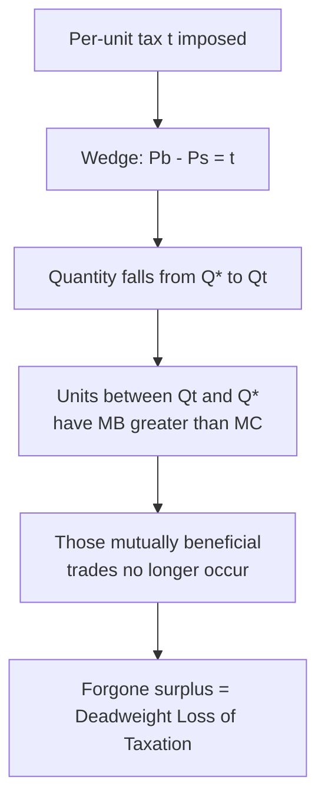
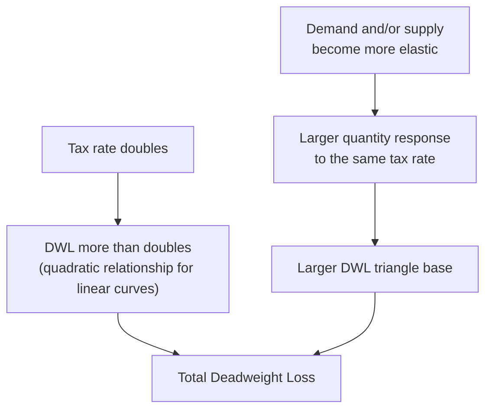
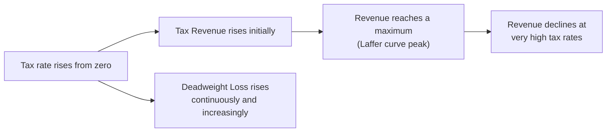

## Deadweight Loss of Taxation

### Definition

The deadweight loss of taxation is the reduction in total surplus caused by a tax, arising because the tax-induced wedge between the price buyers pay and the price sellers receive reduces the quantity transacted below the surplus-maximizing equilibrium quantity $Q^*$. It represents the value of mutually beneficial trades that fail to occur solely because of the tax, distinct from the tax revenue itself, which is a transfer rather than a loss.

### The Mechanism

A per-unit tax $t$ creates a wedge such that $P_b - P_s = t$, where $P_b$ is the price paid by buyers and $P_s$ is the price received by sellers. Market clearing at the post-tax quantity $Q_t$ requires $Q_D(P_b) = Q_S(P_s) = Q_t$, and because both curves respond to the tax by moving quantity away from $Q^*$:

$$Q_t < Q^*$$

For every unit between $Q_t$ and $Q^*$, marginal benefit exceeds marginal cost ($MB(Q) > MC(Q)$), meaning these units would generate positive surplus if traded — but the tax wedge prevents them from being traded, since no price exists in that range that simultaneously satisfies both the buyer's willingness to pay and the seller's required compensation net of the tax.

### Diagrammatic Illustration

<svg xmlns="http://www.w3.org/2000/svg" viewBox="0 0 640 460" font-family="Helvetica, Arial, sans-serif">
<title>Deadweight Loss from a Per-Unit Tax (svg_diagram)</title>

<line x1="60" y1="400" x2="600" y2="400" stroke="#333" stroke-width="2" />
<line x1="60" y1="400" x2="60" y2="20" stroke="#333" stroke-width="2" />
<text x="580" y="420" font-size="14">Quantity</text>
<text x="20" y="30" font-size="14">Price</text>

<line x1="90" y1="380" x2="480" y2="60" stroke="#1b5e20" stroke-width="2.5" />
<text x="470" y="55" font-size="13" fill="#1b5e20">S</text>

<line x1="90" y1="60" x2="480" y2="380" stroke="#0d47a1" stroke-width="2.5" />
<text x="470" y="375" font-size="13" fill="#0d47a1">D</text>

<circle cx="285" cy="220" r="5" fill="#000" />
<text x="295" y="215" font-size="13">E (P*, Q*)</text>

<line x1="220" y1="400" x2="220" y2="60" stroke="#888" stroke-dasharray="2,2" />
<text x="205" y="418" font-size="11">Qt</text>
<line x1="285" y1="220" x2="285" y2="400" stroke="#888" stroke-dasharray="2,2" />
<text x="278" y="418" font-size="11">Q*</text>

<circle cx="220" cy="140" r="4" fill="#0d47a1" />
<line x1="60" y1="140" x2="220" y2="140" stroke="#0d47a1" stroke-dasharray="4,3" />
<text x="35" y="144" font-size="11" fill="#0d47a1">Pb</text>

<circle cx="220" cy="300" r="4" fill="#1b5e20" />
<line x1="60" y1="300" x2="220" y2="300" stroke="#1b5e20" stroke-dasharray="4,3" />
<text x="35" y="304" font-size="11" fill="#1b5e20">Ps</text>

<rect x="90" y="140" width="130" height="160" fill="#f9a825" fill-opacity="0.3" stroke="none" />
<text x="95" y="225" font-size="12" fill="#e65100">Tax Revenue (transfer)</text>

<polygon points="220,140 285,220 220,300" fill="#c62828" fill-opacity="0.4" stroke="#c62828" stroke-width="1.5" />
<text x="228" y="222" font-size="12" fill="#c62828" font-weight="bold">DWL</text>
</svg>

### Formal Geometry of the DWL Triangle

For linear or locally linear demand and supply, the tax's deadweight loss triangle has:

- **Base** = $Q^* - Q_t$ (the quantity reduction caused by the tax)
- **Height** = $t$ (the full tax wedge, since $P_b - P_s = t$ spans the entire vertical distance between demand and supply at $Q_t$)

$$DWL = \frac{1}{2} \times (Q^* - Q_t) \times t$$

This is a direct application of the general triangular DWL formula established for price controls, specialized to the case where the "height" is exactly the known tax rate $t$, rather than requiring separate evaluation of inverse demand and inverse supply.

### Complete Surplus Accounting Under a Tax

$$TS_{\text{with tax}} = CS_{\text{tax}} + PS_{\text{tax}} + \text{Tax Revenue}$$

$$TS_{\text{with tax}} = TS_{\text{no tax}} - DWL$$

**Key Points**

- Consumer surplus falls because buyers pay $P_b > P^*$ and consume less.
- Producer surplus falls because sellers receive $P_s < P^*$ and produce less.
- Tax revenue ($t \times Q_t$) is captured by the government — this is a **transfer**, not a loss, and remains part of total surplus in the aggregate social accounting (assuming the revenue is put to some socially valuable use, which is the standard simplifying assumption in this partial-equilibrium framework).
- The deadweight loss is the **only** genuine reduction in total surplus — it is the portion of the lost CS and PS that is captured by **no one**, neither the private parties nor the government.

### Worked Numerical Example

**Example**

Given:

$$Q_D = 100-2P, \qquad Q_S = -20+3P$$

Pre-tax equilibrium: $P^*=24$, $Q^*=52$ (established previously).

A per-unit tax of $t=10$ produces (as computed under tax incidence): $P_b=30$, $P_s=20$, $Q_t=40$.

$$DWL = \frac{1}{2} \times (52-40) \times 10 = \frac{1}{2}\times12\times10 = 60$$

**Full Surplus Breakdown**

Pre-tax surplus (from the market-efficiency worked example on this identical market):

- $CS_{\text{no tax}} = 676$
- $PS_{\text{no tax}} \approx 450.67$
- $TS_{\text{no tax}} \approx 1{,}126.67$

Post-tax surplus components:

$$CS_{\text{tax}} = \frac{1}{2}\times Q_t \times (50-P_b) = \frac{1}{2}\times40\times(50-30) = \frac{1}{2}\times40\times20 = 400$$

$$PS_{\text{tax}} = \frac{1}{2}\times Q_t\times(P_s - 6.67) = \frac{1}{2}\times40\times(20-6.67) = \frac{1}{2}\times40\times13.33 \approx 266.67$$

$$\text{Tax Revenue} = t\times Q_t = 10\times40 = 400$$

**Output**

| Measure | Pre-Tax | Post-Tax |
| --- | --- | --- |
| Consumer Surplus | 676 | 400 |
| Producer Surplus | ≈ 450.67 | ≈ 266.67 |
| Tax Revenue | 0 | 400 |
| Total Surplus | ≈ 1,126.67 | $400+266.67+400 = 1{,}066.67$ |
| Deadweight Loss | 0 | $1{,}126.67-1{,}066.67 = 60$ |

The directly computed DWL (60) matches the difference between pre-tax and post-tax total surplus, confirming the triangular formula and the surplus-accounting approach yield identical results.

### Determinants of DWL Magnitude

**Key Points**

- **Size of the tax:** deadweight loss grows with the *square* of the tax rate for linear demand and supply, since DWL is a triangular area with both base and height depending (directly or indirectly) on $t$. Doubling a tax rate more than doubles the resulting deadweight loss — a critical result for tax policy design.
- **Elasticity of demand and supply:** more elastic curves on either side of the market produce a larger quantity response to a given tax rate, widening the DWL triangle's base and increasing DWL — directly connecting to the tax-incidence analysis and to the elasticity-DWL relationship established under price controls generally.
- This combination — DWL rising with the square of the tax rate, and rising with elasticity — underlies the case for preferring several small taxes spread across many inelastic goods over one large tax concentrated on a single elastic good, when a fixed amount of revenue must be raised with minimal efficiency cost (the Ramsey-taxation principle introduced under applications of elasticity).

### The Quadratic Relationship: Formal Illustration

**Example**

Using the same demand and supply functions, compare DWL at two different tax rates.

At $t=10$: $DWL=60$ (computed above).

At $t=20$: solving for the new equilibrium, sellers require $P_b-20$ to supply, so $Q_S = -20+3(P_b-20) = -80+3P_b$. Setting equal to demand:

$$100-2P_b = -80+3P_b \Rightarrow 180=5P_b \Rightarrow P_b=36, \quad P_s=16, \quad Q_t = 100-2(36)=28$$

$$DWL = \frac{1}{2}\times(52-28)\times20 = \frac{1}{2}\times24\times20=240$$

**Output**

| Tax Rate $t$ | Quantity $Q_t$ | Deadweight Loss |
| --- | --- | --- |
| 10 | 40 | 60 |
| 20 | 28 | 240 |

Doubling the tax rate from 10 to 20 (a 2x increase) increased deadweight loss from 60 to 240 (a 4x increase) — confirming the quadratic relationship: DWL scales approximately with the square of the tax rate for linear demand and supply curves.

### Laffer Curve Connection

**Key Points**

- The relationship between tax rate, quantity reduction, and tax revenue is closely connected to the **Laffer curve** concept in public finance: tax revenue ($t \times Q_t$) initially rises as the tax rate increases from zero, but because $Q_t$ falls as $t$ rises, revenue eventually reaches a maximum and then **declines** at sufficiently high tax rates, as the shrinking tax base outweighs the rising per-unit rate.
- Deadweight loss, by contrast, rises continuously (and at an accelerating, quadratic rate) throughout this entire range — meaning that even before the revenue-maximizing tax rate is reached, the efficiency cost per additional dollar of revenue raised is increasing. [Inference] The specific tax rate at which revenue is maximized, and the specific point at which the marginal deadweight loss per dollar of revenue becomes "too high" by some policy standard, both depend on the precise elasticities of the market in question and are empirical questions rather than fixed theoretical constants.

### Distinguishing Tax DWL from Related Concepts

| Concept | What It Measures | Relationship to Tax DWL |
| --- | --- | --- |
| Tax revenue | Government receipts ($t \times Q_t$) | A transfer, not a loss; appears alongside DWL in the surplus identity |
| Consumer/producer surplus loss | Total reduction in CS + PS from the tax | Includes both the transferred tax revenue *and* the DWL; DWL is only the portion captured by no one |
| Excess burden | An alternative name for deadweight loss of taxation, used interchangeably in public finance literature | Identical concept to DWL as defined here |
| Marginal excess burden | The additional DWL generated by a small increase in an *already-existing* tax rate | Rises with the tax rate, reflecting the quadratic DWL-to-rate relationship |

### Common Pitfalls

**Key Points**

- Treating the entire loss in consumer surplus plus producer surplus as deadweight loss — the correct DWL is only the portion of that combined loss that is not captured as tax revenue; the tax revenue captured by government must be subtracted out first.
- Assuming deadweight loss scales linearly with the tax rate — for linear demand and supply, DWL scales approximately with the *square* of the tax rate, meaning small tax increases on an already-high tax produce disproportionately large additional efficiency costs.
- Confusing the revenue-maximizing tax rate (the Laffer curve peak) with the efficiency-optimal tax rate — these are different concepts; revenue continues to be positive well past the point where the *marginal* deadweight loss per dollar of revenue has become very high, meaning a revenue-maximizing rate is not the same as, and is typically higher than, an efficiency-minimizing rate for a given revenue target.
- Forgetting that DWL depends on both the tax rate *and* the elasticities of demand and supply jointly — a given tax rate produces a much larger DWL in a market with elastic curves than in a market with inelastic curves, so cross-market comparisons of DWL cannot be made from the tax rate alone.

### Conclusion

The deadweight loss of taxation quantifies the pure efficiency cost of a tax — the value of forgone mutually beneficial trades caused by the tax-induced wedge between buyer and seller prices — distinct from the redistributive transfer represented by tax revenue itself. Because this loss scales with the square of the tax rate and grows with the elasticity of demand and supply, both the size of a tax and the elasticity of the market it is applied to are first-order considerations in efficient tax design, directly motivating the Ramsey-taxation principle of favoring lower rates on elastic goods and higher rates on inelastic goods when a given revenue target must be met with minimal aggregate efficiency cost.

**Related Topics**

- Taxes and tax incidence (the mechanism generating the tax wedge analyzed here)
- Deadweight loss from price controls (the parallel non-tax framework)
- Applications of elasticity (Ramsey taxation, sin tax design)
- Subsidies (the mirror-image deadweight loss from quantity expansion)
- The Laffer curve and revenue-maximizing taxation
- Market efficiency and total surplus (the baseline against which tax-distorted surplus is measured)
- Excess burden and marginal cost of public funds in public finance theory