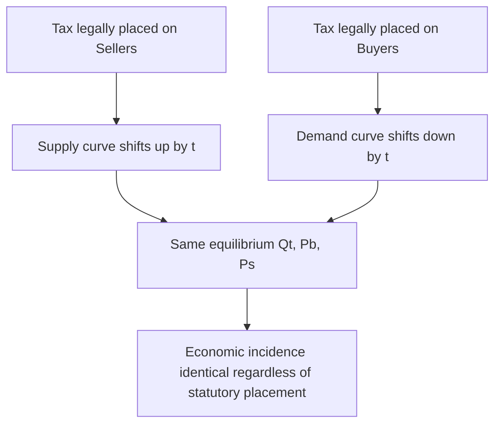

## Who Bears the Burden of a Tax

### Overview

Tax incidence is the analysis of how the economic burden of a tax is actually distributed between buyers and sellers in a market, as distinguished from who is legally responsible for remitting the tax to the government. The statutory incidence (who writes the check to the tax authority) frequently differs from the economic incidence (who actually experiences reduced welfare from the tax). This distinction is one of the most important and counterintuitive results in microeconomics.

### Statutory vs. Economic Incidence

**Key Points**

- Statutory incidence refers to the legal obligation to pay the tax — determined by law or regulation.
- Economic incidence refers to the actual change in welfare (surplus) experienced by each party — determined by market forces, not legislation.
- Markets adjust prices in response to a tax regardless of which side is legally taxed, so the party writing the check is not necessarily the party who loses the most economic value.

**Example**

If a government imposes a $1 tax per unit on sellers of a good, sellers may respond by raising the price they charge buyers. If the price rises by $0.70, buyers effectively bear $0.70 of the tax burden even though sellers remit the full $1 to the government. The remaining $0.30 is borne by sellers through a lower after-tax price received.

### The Core Principle: Elasticity Determines Incidence

The central result of tax incidence theory is that **the burden of a tax falls more heavily on the side of the market that is less elastic (less responsive to price changes)** — regardless of whether the tax is levied on buyers or sellers.

This occurs because elasticity measures how easily a party can adjust their behavior (quantity demanded or supplied) to avoid the tax. A party that cannot easily reduce quantity in response to a worse price (inelastic) has less ability to escape the tax, and therefore absorbs more of it.

### Formal Derivation

Consider a per-unit tax $t$ levied on a good. Let $P_b$ denote the price paid by buyers and $P_s$ denote the price received by sellers, where:

$$P_b - P_s = t$$

At the new equilibrium quantity $Q_t$, both the demand and supply relationships must hold:

$$Q_t = D(P_b) = S(P_s)$$

**The incidence split** can be derived using the price elasticities of demand ($E_d$) and supply ($E_s$). The share of the tax borne by buyers ($\text{Share}_b$) and by sellers ($\text{Share}_s$) is given by:

$$\text{Share}_b = \frac{E_s}{E_s + |E_d|}$$

$$\text{Share}_s = \frac{|E_d|}{E_s + |E_d|}$$

**Key Points**

- If demand is perfectly inelastic ($E_d = 0$), buyers bear 100% of the tax.
- If demand is perfectly elastic ($E_d \to \infty$), sellers bear 100% of the tax.
- If supply is perfectly inelastic ($E_s = 0$), sellers bear 100% of the tax.
- If supply is perfectly elastic ($E_s \to \infty$), buyers bear 100% of the tax.
- When $|E_d| = E_s$, the burden splits evenly.

### Graphical Illustration

The following diagram shows the classic supply-and-demand tax wedge, where the vertical distance between the demand curve price and the supply curve price at the new quantity equals the tax $t$.

<svg xmlns="http://www.w3.org/2000/svg" viewBox="0 0 640 480" font-family="Arial, sans-serif">
<text x="320" y="24" text-anchor="middle" font-size="16" font-weight="bold">Tax Incidence: Supply and Demand Wedge (svg_diagram)</text>

<line x1="80" y1="420" x2="600" y2="420" stroke="black" stroke-width="2" />
<line x1="80" y1="420" x2="80" y2="50" stroke="black" stroke-width="2" />
<text x="600" y="440" font-size="13">Quantity</text>
<text x="40" y="50" font-size="13">Price</text>

<line x1="120" y1="80" x2="560" y2="380" stroke="#1f77b4" stroke-width="2.5" />
<text x="565" y="385" font-size="13" fill="#1f77b4">D</text>

<line x1="120" y1="380" x2="560" y2="80" stroke="#d62728" stroke-width="2.5" />
<text x="565" y="80" font-size="13" fill="#d62728">S (no tax)</text>

<line x1="120" y1="440" x2="560" y2="140" stroke="#d62728" stroke-width="2.5" stroke-dasharray="6,4" />
<text x="565" y="140" font-size="13" fill="#d62728">S + tax</text>

<line x1="320" y1="230" x2="320" y2="420" stroke="gray" stroke-width="1" stroke-dasharray="3,3" />
<circle cx="320" cy="230" r="4" fill="black" />
<text x="325" y="225" font-size="12">E0 (P0, Q0)</text>

<line x1="260" y1="0" x2="260" y2="420" stroke="gray" stroke-width="1" stroke-dasharray="3,3" />

<circle cx="260" cy="180" r="4" fill="#1f77b4" />
<text x="150" y="178" font-size="12" fill="#1f77b4">Pb (price buyers pay)</text>
<line x1="80" y1="180" x2="260" y2="180" stroke="#1f77b4" stroke-width="1" stroke-dasharray="3,3" />

<circle cx="260" cy="290" r="4" fill="#d62728" />
<text x="150" y="305" font-size="12" fill="#d62728">Ps (price sellers keep)</text>
<line x1="80" y1="290" x2="260" y2="290" stroke="#d62728" stroke-width="1" stroke-dasharray="3,3" />

<line x1="260" y1="180" x2="260" y2="290" stroke="black" stroke-width="3" />
<text x="270" y="240" font-size="13" font-weight="bold">Tax = t</text>

<text x="245" y="435" font-size="12">Qt</text>

<text x="308" y="435" font-size="12">Q0</text>

</svg>

**Explanation of the diagram:**

- The tax shifts the effective supply curve upward (or equivalently, shifts demand downward if levied on buyers) by the exact amount of the tax $t$.
- Equilibrium quantity falls from $Q_0$ to $Q_t$.
- Buyers pay $P_b$ (higher than the original price $P_0$); sellers receive $P_s$ (lower than $P_0$), after remitting the tax.
- The vertical distance between $P_b$ and $P_s$ at $Q_t$ equals the per-unit tax $t$.
- The steeper curve (more inelastic) is positioned closer to the new equilibrium price change, indicating it absorbs a larger share of the burden.

### Legal Placement of the Tax Does Not Matter

**Key Points**

- Whether the tax is legally imposed on buyers or sellers, the economic incidence (final split of burden) is identical in a competitive market.
- Placing the tax on sellers shifts the supply curve upward by $t$; placing the tax on buyers shifts the demand curve downward by $t$. Both cases yield the same after-tax equilibrium prices $P_b$ and $P_s$, and the same tax revenue.
- This is a foundational result: **the market, not the legislature, determines who really pays**.

The following diagram summarizes this equivalence conceptually.

### Extreme Cases: Perfectly Elastic and Inelastic Curves

**Example**

1. **Perfectly Inelastic Demand** (e.g., life-saving insulin with no substitutes): Buyers bear the entire tax; price paid rises by the full amount of $t$, quantity does not change.
2. **Perfectly Elastic Demand** (e.g., a good with many close substitutes in a competitive market): Sellers bear the entire tax; price paid by buyers stays essentially unchanged, and sellers absorb the full reduction in the price they receive.
3. **Perfectly Inelastic Supply** (e.g., unimproved land): Sellers (landowners) bear the entire tax, since they cannot reduce the quantity supplied in response to a lower net price.
4. **Perfectly Elastic Supply** (e.g., a constant-cost industry with free entry/exit long-run): Buyers bear the entire tax.

### Tax Incidence and Deadweight Loss

**Key Points**

- A tax creates a wedge between $P_b$ and $P_s$, reducing the quantity traded below the efficient level $Q_0$.
- This reduction in quantity causes a **deadweight loss (DWL)** — a loss of total surplus that is not captured by anyone (neither the government, buyers, nor sellers).
- The size of the deadweight loss also depends on elasticity: **more elastic markets (on either side) generate larger deadweight loss for a given tax rate**, because quantity adjusts more, meaning more mutually beneficial trades are eliminated.
- The deadweight loss can be approximated as:

$$DWL \approx \frac{1}{2} \times t \times \Delta Q$$

where $\Delta Q = Q_0 - Q_t$ is the reduction in quantity traded due to the tax.

**Key Points (Revenue vs. Efficiency Trade-off)**

- Tax revenue collected equals $t \times Q_t$.
- As $t$ increases, revenue does not necessarily increase proportionally, because $Q_t$ falls — this trade-off is central to the concept of the Laffer Curve (relevant primarily at very high tax rates, though the core elasticity logic applies at any rate).

### Numerical Example

**Example**

Suppose the market for a good has the following linear demand and supply curves (before tax):

$$Q_d = 100 - 2P$$

$$Q_s = -20 + 3P$$

**Step 1 — Find pre-tax equilibrium:**

Setting $Q_d = Q_s$:

$$100 - 2P = -20 + 3P$$

$$120 = 5P$$

$$P_0 = 24, \quad Q_0 = 52$$

**Step 2 — Impose a $5 per-unit tax on sellers.**

Sellers now receive $P_s = P_b - 5$. Substitute into supply:

$$Q_s = -20 + 3(P_b - 5) = -20 + 3P_b - 15 = -35 + 3P_b$$

Set equal to demand:

$$100 - 2P_b = -35 + 3P_b$$

$$135 = 5P_b$$

$$P_b = 27$$

Then:

$$P_s = 27 - 5 = 22$$

$$Q_t = 100 - 2(27) = 46$$

**Step 3 — Interpret the incidence split:**

- Buyers' price rose from $24 to $27 → buyers bear $3 of the $5 tax.
- Sellers' price fell from $24 to $22 → sellers bear $2 of the $5 tax.
- Since buyers bear the larger share ($3 vs $2), demand is relatively less elastic than supply at this equilibrium — consistent with the elasticity formula: with $E_d$ smaller in magnitude relative to $E_s$, buyers absorb more.

**Step 4 — Verify with elasticity ratio (using point elasticities at $P_0, Q_0$):**

$$E_d = \frac{dQ_d}{dP} \times \frac{P_0}{Q_0} = -2 \times \frac{24}{52} \approx -0.923$$

$$E_s = \frac{dQ_s}{dP} \times \frac{P_0}{Q_0} = 3 \times \frac{24}{52} \approx 1.385$$

$$\text{Share}_b = \frac{E_s}{E_s + |E_d|} = \frac{1.385}{1.385 + 0.923} \approx 0.60$$

This predicts buyers bear approximately 60% of the tax — consistent with the $3 out of $5 (60%) found directly, confirming the elasticity-based incidence formula. [Inference: minor rounding differences may occur when using point elasticity approximations versus the exact linear-model solution.]

### Special Case: Tax Incidence in Labor Markets

**Key Points**

- Payroll taxes are a widely studied real-world application: legally, payroll taxes are often split between employers and employees (e.g., in the U.S. Social Security system).
- Empirical labor economics research suggests that because labor supply tends to be relatively inelastic in many contexts (workers cannot easily reduce hours worked in the short run), workers bear a substantial share of payroll taxes even when the statutory incidence falls partly or fully on employers. [Unverified: the precise magnitude varies significantly by country, labor market structure, and time horizon studied.]

### Tax Incidence Under Monopoly

**Key Points**

- The competitive-market elasticity framework changes under monopoly, since a monopolist sets price using marginal revenue and marginal cost rather than a supply curve per se.
- A monopolist facing a per-unit tax $t$ will generally pass on **less than 100% but more than zero** of the tax to consumers if marginal cost is constant, with the exact pass-through rate depending on the curvature of the demand curve. [Inference: for linear demand and constant marginal cost, a monopolist passes through exactly 50% of a per-unit tax; this result is a standard textbook derivation but assumes specific functional forms.]
- With more convex demand curves, pass-through can exceed 100% (over-shifting), a result not possible in the perfectly competitive case.

### Incidence in the Long Run vs. Short Run

**Key Points**

- Elasticities tend to be larger in the long run than the short run, since economic agents have more time to adjust behavior (switch suppliers, change production technology, relocate, exit an industry).
- Consequently, the incidence of a tax can shift over time: a party that bears most of the burden in the short run (due to inelastic short-run behavior) may shift more of the burden to the other side as long-run adjustments occur.

### Common Misconceptions

**Key Points**

- **Misconception:** "If the government taxes sellers, sellers pay the tax." — Incorrect; the economic burden depends on relative elasticities, not legal designation.
- **Misconception:** "Splitting the tax burden 50/50 is typical." — Incorrect; the split depends entirely on the relative elasticities of supply and demand in that specific market and is rarely exactly even.
- **Misconception:** "A tax on a good only affects the party paying it." — Incorrect; both sides of the market experience a change in surplus (unless one side has perfectly elastic behavior).

### Conclusion

Tax incidence demonstrates that market forces, not legislative language, determine who truly bears the economic cost of a tax. The side of the market that is less elastic — meaning it has fewer available substitutes or is less able to adjust the quantity transacted — bears a disproportionately larger share of the burden, regardless of whether the tax is statutorily levied on buyers or sellers. This principle extends across competitive markets, labor markets, and (with modification) monopoly markets, and interacts closely with the concept of deadweight loss, since taxes on more elastic markets tend to create larger efficiency losses even as they collect the same statutory tax rate.

**Related Topics**

- Deadweight loss and the efficiency cost of taxation
- Price elasticity of demand and supply (foundational prerequisite)
- Excise taxes and specific vs. ad valorem taxation
- Tax incidence under monopoly and imperfect competition
- The Laffer Curve and revenue-maximizing tax rates
- Subsidy incidence (the mirror-image analysis of tax incidence)
- Payroll tax incidence and labor market applications
- Consumer surplus and producer surplus
- Price controls (price ceilings and floors) as related government interventions
- Tax incidence in international trade (tariff incidence)