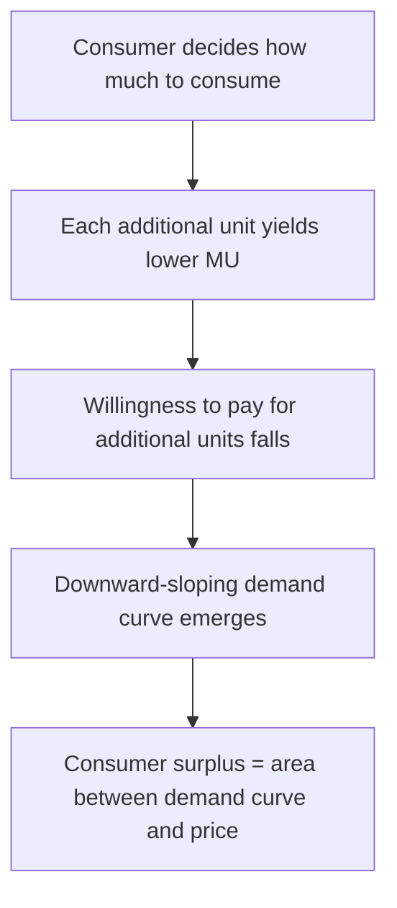

## Utility and Marginal Utility

### Overview

Utility is the theoretical measure of satisfaction, well-being, or benefit that a consumer derives from consuming goods and services. Marginal utility measures the additional satisfaction gained from consuming one more unit of a good, holding consumption of all other goods constant. These concepts form the foundation of consumer choice theory, explaining how rational individuals allocate limited income across competing wants to maximize their well-being.

### Total Utility

**Key Points**

- Total utility (TU) represents the overall satisfaction a consumer derives from consuming a given quantity of a good or bundle of goods.
- Total utility is a theoretical construct — it is not directly observable or measurable in real-world units, but it provides an internally consistent framework for modeling preferences and choices.
- Total utility generally increases as consumption increases, at least up to a point, after which it may plateau or decline (satiation).

**Notation:**

$$TU = U(Q)$$

where $Q$ is the quantity consumed of a good, and $U(\cdot)$ is the utility function.

### Marginal Utility

**Key Points**

- Marginal utility (MU) is the change in total utility resulting from consuming one additional unit of a good.
- Formally, marginal utility is the first derivative of the total utility function with respect to quantity:

$$MU = \frac{dTU}{dQ}$$

- In discrete terms (useful for tabular examples), marginal utility is:

$$MU_n = TU_n - TU_{n-1}$$

where $n$ is the unit number.

**Example**

Consider a consumer eating slices of pizza, with the following hypothetical total utility values (measured in "utils," an artificial unit used for illustration):

| Slices Consumed | Total Utility (TU) | Marginal Utility (MU) |
| --- | --- | --- |
| 0 | 0 | — |
| 1 | 20 | 20 |
| 2 | 36 | 16 |
| 3 | 48 | 12 |
| 4 | 56 | 8 |
| 5 | 60 | 4 |
| 6 | 60 | 0 |
| 7 | 56 | -4 |

Each marginal utility value is calculated as the change in total utility between consecutive rows. Note that total utility continues rising as long as marginal utility is positive, reaches a maximum when marginal utility is zero (6th slice), and total utility declines once marginal utility becomes negative (7th slice, indicating disutility from overconsumption).

### The Law of Diminishing Marginal Utility

**Key Points**

- The Law of Diminishing Marginal Utility states that as a consumer consumes additional units of a good, the marginal utility derived from each successive unit tends to decrease, holding all else constant.
- This is one of the most fundamental behavioral assumptions in microeconomics and underlies the derivation of downward-sloping demand curves.
- Diminishing marginal utility does not mean total utility decreases — it means total utility increases at a *decreasing rate*.
- The law is considered a generalization based on typical consumer behavior rather than a strict mathematical necessity for all conceivable utility functions. [Inference: some specialized goods, such as addictive substances or collectible sets, may exhibit increasing marginal utility over certain ranges, though standard consumer theory assumes diminishing marginal utility for the vast majority of goods.]

### Relationship Between Total Utility and Marginal Utility

The following diagram illustrates how total utility and marginal utility curves relate to one another.

<svg xmlns="http://www.w3.org/2000/svg" viewBox="0 0 640 520" font-family="Arial, sans-serif">
<text x="320" y="24" text-anchor="middle" font-size="16" font-weight="bold">Total Utility and Marginal Utility Curves (svg_diagram)</text>

<text x="320" y="50" text-anchor="middle" font-size="13" font-weight="bold">Total Utility (TU)</text>

<line x1="80" y1="200" x2="600" y2="200" stroke="black" stroke-width="2" />

<line x1="80" y1="200" x2="80" y2="60" stroke="black" stroke-width="2" />

<text x="600" y="215" font-size="12">Quantity</text>

<text x="45" y="60" font-size="12">Utils</text>

<path d="M 80,200 C 160,110 240,75 340,65 C 420,60 480,70 560,110" fill="none" stroke="`#1f77b4`" stroke-width="2.5" />

<circle cx="340" cy="65" r="4" fill="`#1f77b4`" />

<line x1="340" y1="65" x2="340" y2="200" stroke="gray" stroke-dasharray="3,3" />

<text x="345" y="220" font-size="11">Q* (TU max)</text>

<text x="320" y="270" text-anchor="middle" font-size="13" font-weight="bold">Marginal Utility (MU)</text>

<line x1="80" y1="420" x2="600" y2="420" stroke="black" stroke-width="2" />

<line x1="80" y1="420" x2="80" y2="290" stroke="black" stroke-width="2" />

<text x="600" y="435" font-size="12">Quantity</text>

<text x="45" y="290" font-size="12">Utils</text>

<line x1="80" y1="380" x2="600" y2="380" stroke="gray" stroke-width="1" stroke-dasharray="2,2" />
<text x="55" y="384" font-size="10">0</text>

<path d="M 80,300 C 160,320 240,340 340,380 C 420,405 480,412 560,418" fill="none" stroke="`#d62728`" stroke-width="2.5" />

<circle cx="340" cy="380" r="4" fill="`#d62728`" />

<line x1="340" y1="380" x2="340" y2="420" stroke="gray" stroke-dasharray="3,3" />

<text x="345" y="440" font-size="11">Q* (MU = 0)</text>

<text x="90" y="460" font-size="12" fill="#333">Note: When MU = 0, TU is at its maximum point.</text>

<text x="90" y="480" font-size="12" fill="#333">When MU is negative, TU declines.</text>

</svg>

**Key Points**

- When marginal utility is positive, total utility is increasing.
- When marginal utility equals zero, total utility is at its maximum (the peak of satiation).
- When marginal utility is negative, total utility is decreasing (overconsumption leading to disutility).
- The marginal utility curve is the slope of the total utility curve at each point.

### Cardinal vs. Ordinal Utility

**Key Points**

- **Cardinal utility** theory assumes utility can be measured in specific numerical units (e.g., "utils"), allowing statements like "Good A provides twice the utility of Good B."
- **Ordinal utility** theory assumes consumers can only rank bundles of goods in order of preference (e.g., "I prefer bundle A to bundle B") without assigning specific numerical magnitudes to the difference in satisfaction.
- Modern microeconomic theory predominantly relies on **ordinal utility**, since it requires weaker assumptions and still generates the core results of consumer theory (demand curves, indifference curves) without needing to measure satisfaction in absolute terms.
- Cardinal utility remains pedagogically useful (as in marginal utility tables) for building intuition, even though modern general equilibrium and demand theory formally rest on ordinal rankings and utility functions that are unique only up to a positive monotonic transformation.

### Marginal Utility and the Law of Demand

**Key Points**

- Diminishing marginal utility provides an intuitive (though not the only formal) justification for the law of demand: a consumer is willing to pay less for each additional unit of a good because each additional unit provides less additional satisfaction.
- This links directly to consumer surplus: the gap between the maximum a consumer would be willing to pay for a unit (reflecting its marginal utility) and the price actually paid.

### Utility Maximization Subject to a Budget Constraint

**Key Points**

- A rational consumer seeks to maximize total utility subject to a limited budget (income) and given market prices.
- The consumer's problem is formally expressed as:

$$\max U(X, Y) \quad \text{subject to} \quad P_X X + P_Y Y = I$$

where $X$ and $Y$ are quantities of two goods, $P_X$ and $P_Y$ are their respective prices, and $I$ is income.

- The utility-maximizing solution occurs where the **marginal utility per dollar spent is equal across all goods** — known as the **equimarginal principle**:

$$\frac{MU_X}{P_X} = \frac{MU_Y}{P_Y}$$

- If this equality does not hold, the consumer can increase total utility by reallocating spending toward the good offering higher marginal utility per dollar, until the ratios equalize (assuming diminishing marginal utility drives the ratios back into balance).

### The Equimarginal Principle — Worked Example

**Example**

Suppose a consumer has $10 to spend on two goods, apples (A) and bananas (B), priced at $2 and $1 respectively. The marginal utility schedule is:

| Units | MU of Apples | MU of Bananas |
| --- | --- | --- |
| 1 | 20 | 12 |
| 2 | 16 | 10 |
| 3 | 12 | 8 |
| 4 | 8 | 6 |
| 5 | 4 | 4 |

**Step 1 — Compute marginal utility per dollar for each unit:**

$$\frac{MU_A}{P_A}: \quad 10, \, 8, \, 6, \, 4, \, 2$$

$$\frac{MU_B}{P_B}: \quad 12, \, 10, \, 8, \, 6, \, 4$$

**Step 2 — Allocate the budget** by purchasing units in order of highest MU per dollar, until the $10 budget is exhausted, matching MU per dollar across both goods as closely as possible:

Purchasing 3 bananas ($3, MU/$ = 12, 10, 8) and 2 apples ($4, MU/$ = 10, 8) uses $3 + $4 = $7, leaving $3. Continuing to allocate the remaining budget toward whichever good has the next-highest MU per dollar (comparing the 3rd apple at MU/$=6 vs. the 4th banana at MU/$=6 — tied) allows purchase of both, using the remaining $3 exactly (1 apple = $2, 1 banana = $1).

**Final allocation:** 3 apples ($6) and 4 bananas ($4) = $10 total spent, with $\frac{MU_A}{P_A} = \frac{12}{2} = 6$ and $\frac{MU_B}{P_B} = \frac{6}{1} = 6$ — the equimarginal condition is satisfied, confirming this allocation maximizes total utility given the budget constraint.

### Diminishing Marginal Utility and Risk Aversion

**Key Points**

- Diminishing marginal utility of income or wealth is the standard microeconomic explanation for **risk aversion**: since each additional dollar provides less additional utility than the previous dollar, the utility lost from a potential loss exceeds the utility gained from an equivalent potential gain.
- This concept underlies expected utility theory, used extensively in the economics of insurance, gambling, and uncertainty. [Inference: this is a widely accepted theoretical framework, though behavioral economics research has identified systematic deviations from strict expected utility maximization in real-world decision-making, such as loss aversion asymmetries described in prospect theory.]

### Marginal Utility and Water-Diamond Paradox

**Key Points**

- The "paradox of value" (or water-diamond paradox), historically associated with classical economists including Adam Smith, asks why water — essential to life — is cheap, while diamonds — largely non-essential — are expensive.
- The marginal utility framework resolves this paradox: price is determined by the **marginal** utility of the last unit consumed, not the **total** utility of the good overall.
- Because water is abundant, its marginal utility (and thus price) is low despite its high total utility. Diamonds are scarce, so their marginal utility (and thus price) remains high despite low total utility relative to water.

### Interpersonal Utility Comparisons

**Key Points**

- A significant methodological limitation of utility theory is that **interpersonal utility comparisons** (comparing utility levels or changes between different individuals) are generally considered invalid or at least not scientifically measurable in mainstream neoclassical economics.
- This limitation is one reason why modern welfare economics often relies on concepts like Pareto efficiency (which does not require interpersonal utility comparison) rather than direct utility summation across individuals.

### Common Misconceptions

**Key Points**

- **Misconception:** "Diminishing marginal utility means total utility eventually falls for every good." — Incorrect; total utility can plateau (as in the pizza example) rather than fall, depending on the specific utility function.
- **Misconception:** "Utility is measured in real, comparable units like money." — Incorrect; especially under the ordinal approach, utility functions are only meaningful for ranking preferences, not for measuring absolute satisfaction in transferable units.
- **Misconception:** "A good with higher total utility must have a higher price." — Incorrect; price is driven by marginal utility at the margin of consumption, not total utility (see water-diamond paradox).

### Conclusion

Utility and marginal utility provide the conceptual foundation for understanding consumer choice: total utility captures overall satisfaction, while marginal utility captures the incremental satisfaction from each additional unit consumed. The Law of Diminishing Marginal Utility explains why consumers allocate spending the way they do, why demand curves slope downward, and why goods are valued according to their marginal — not total — contribution to well-being. The equimarginal principle formalizes how rational consumers allocate a limited budget across goods to reach utility-maximizing equilibrium, a result that recurs throughout consumer theory, welfare economics, and the economics of uncertainty.

**Related Topics**

- Indifference curves and the marginal rate of substitution
- Budget constraints and the consumer's optimization problem
- Consumer surplus and its relationship to demand curves
- Cardinal vs. ordinal utility theory in depth
- Expected utility theory and risk preferences
- Income and substitution effects
- Deriving individual and market demand curves from utility maximization
- Revealed preference theory
- Behavioral economics critiques of standard utility theory (prospect theory, loss aversion)