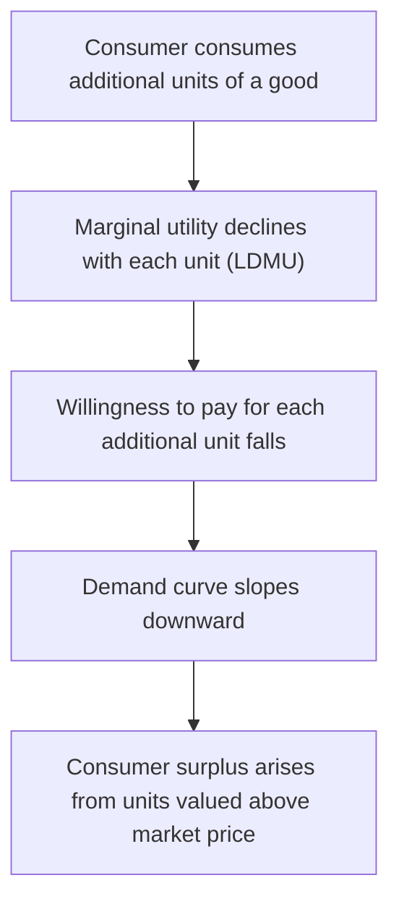

## Law of Diminishing Marginal Utility

### Overview

The Law of Diminishing Marginal Utility (LDMU) states that as a consumer consumes successive additional units of a good, holding consumption of all other goods constant, the additional (marginal) satisfaction derived from each successive unit tends to decline. This law is one of the most foundational behavioral postulates in microeconomics, underpinning the derivation of downward-sloping demand curves, the equimarginal principle of consumer choice, and the concept of consumer surplus.

### Formal Statement

**Key Points**

- Formally, if $TU(Q)$ represents total utility as a function of quantity consumed $Q$, marginal utility is:

$$MU(Q) = \frac{dTU}{dQ}$$

- The Law of Diminishing Marginal Utility states that:

$$\frac{dMU}{dQ} < 0 \quad \text{for } Q > Q_{\min}$$

meaning marginal utility is a decreasing function of quantity beyond some initial threshold $Q_{\min}$ (which may be the very first unit for many goods).

- Equivalently, in second-derivative terms, the total utility function is assumed to be **concave** over the relevant range:

$$\frac{d^2TU}{dQ^2} < 0$$

### Assumptions Underlying the Law

**Key Points**

- **Constant consumption of other goods:** The law holds *ceteris paribus* — only the quantity of the good in question changes; the consumption bundle of all other goods remains fixed.
- **Homogeneous units:** The units of the good consumed must be identical or standard (e.g., successive identical slices of pizza, not qualitatively different variants).
- **Continuous, uninterrupted consumption:** The law typically applies within a single consumption episode or a defined time period; large gaps in time between units (e.g., separate meals on separate days) may reset the satiation process.
- **No change in consumer tastes:** Preferences are assumed stable during the period of analysis.
- **Rationality:** The consumer is assumed to behave rationally in evaluating the marginal satisfaction of each unit.

### Numerical Illustration

**Example**

Consider a thirsty individual consuming glasses of water on a hot day:

| Glasses Consumed | Total Utility (TU) | Marginal Utility (MU) |
| --- | --- | --- |
| 0 | 0 | — |
| 1 | 30 | 30 |
| 2 | 50 | 20 |
| 3 | 65 | 15 |
| 4 | 75 | 10 |
| 5 | 80 | 5 |
| 6 | 80 | 0 |
| 7 | 76 | -4 |

Each successive glass adds less to total utility than the previous one — marginal utility falls monotonically from 30 down to 0, and then turns negative at the 7th glass, representing actual discomfort from overconsumption (a point at which total utility begins to decline).

### Graphical Representation

<svg xmlns="http://www.w3.org/2000/svg" viewBox="0 0 640 420" font-family="Arial, sans-serif">
<text x="320" y="24" text-anchor="middle" font-size="16" font-weight="bold">Law of Diminishing Marginal Utility (svg_diagram)</text>

<line x1="80" y1="370" x2="600" y2="370" stroke="black" stroke-width="2" />
<line x1="80" y1="370" x2="80" y2="60" stroke="black" stroke-width="2" />
<text x="600" y="390" font-size="13">Quantity Consumed</text>
<text x="30" y="55" font-size="13">Marginal Utility</text>

<line x1="80" y1="300" x2="600" y2="300" stroke="gray" stroke-width="1" stroke-dasharray="3,3" />
<text x="55" y="304" font-size="11">0</text>

<path d="M 110,90 C 200,150 280,220 340,300 C 400,350 480,365 560,368" fill="none" stroke="`#d62728`" stroke-width="3" />

<circle cx="110" cy="90" r="4" fill="#d62728" />
<circle cx="180" cy="140" r="4" fill="#d62728" />
<circle cx="250" cy="200" r="4" fill="#d62728" />
<circle cx="340" cy="300" r="4" fill="#d62728" />
<circle cx="450" cy="350" r="4" fill="#d62728" />

<text x="105" y="75" font-size="11">Unit 1</text>

<text x="175" y="125" font-size="11">Unit 2</text>

<text x="245" y="185" font-size="11">Unit 3</text>

<text x="330" y="325" font-size="11">Unit n (MU=0)</text>

<text x="90" y="400" font-size="12" fill="#333">MU falls with each successive unit consumed, eventually reaching zero and turning negative.</text>

</svg>

### Relationship to Demand Curves

**Key Points**

- The LDMU provides the classical, intuitive justification for the **downward-sloping demand curve**: since each additional unit of a good yields progressively less marginal satisfaction, a rational consumer is only willing to pay progressively lower prices for additional units.
- This connects marginal utility directly to willingness-to-pay: the marginal utility of a unit (expressed in monetary terms, i.e., divided by the marginal utility of money) approximates the maximum price a consumer would pay for that specific unit.
- Modern consumer theory technically derives the downward-sloping demand curve from the more general framework of utility maximization subject to a budget constraint (via indifference curves and the substitution effect), rather than relying solely on cardinal marginal utility. However, the diminishing marginal utility explanation remains the standard introductory intuition. [Inference: rigorous derivation of demand curve slope typically separates diminishing marginal utility (a cardinal utility concept) from the income and substitution effects (an ordinal utility concept), though both frameworks arrive at consistent predictions for normal goods.]

### The Equimarginal Principle (Application of LDMU)

**Key Points**

- The LDMU is the driving force behind the **equimarginal principle**, which states that a utility-maximizing consumer allocates a fixed budget across goods so that the marginal utility per dollar spent is equal across all goods:

$$\frac{MU_X}{P_X} = \frac{MU_Y}{P_Y} = \cdots = \frac{MU_N}{P_N}$$

- Because marginal utility diminishes as more of a good is purchased, spending more on any one good eventually lowers its MU per dollar below that of alternative goods, creating an incentive to reallocate spending — this adjustment process is what drives the consumer toward the equimarginal equilibrium.
- Without diminishing marginal utility, a consumer would have no interior optimum and would rationally spend their entire budget on a single good (the one with consistently highest marginal utility per dollar).

### Consumer Surplus and LDMU

**Key Points**

- Consumer surplus — the difference between what a consumer is willing to pay (reflecting marginal utility) and what they actually pay (the market price) — is a direct application of diminishing marginal utility.
- Because early units carry higher marginal utility than the market price, while only the last unit purchased has marginal utility just equal to price, all earlier units generate a surplus of utility beyond what was paid.

$$\text{Consumer Surplus} = \sum_{i=1}^{Q} (MU_i \text{ in monetary terms} - P)$$

### Exceptions and Limitations

**Key Points**

- **Addictive or habit-forming goods:** Some goods may exhibit *increasing* marginal utility over certain ranges (e.g., certain addictive substances), directly violating the standard LDMU assumption. [Inference: this is a recognized theoretical exception discussed in behavioral and health economics, though it is not the standard case assumed in introductory consumer theory.]
- **Collectible or complementary goods:** Goods that gain additional value when part of a complete set (e.g., a missing puzzle piece, a matched pair) may show marginal utility that rises as the collection nears completion, rather than steadily diminishing.
- **Indivisible or lumpy goods:** For goods that are not finely divisible (e.g., a car, a house), the standard smooth marginal utility framework may not apply cleanly, since consumption typically occurs in large discrete jumps rather than small increments.
- **Very small quantities:** For some goods, the *first* unit may actually provide lower utility than the second (e.g., a single puzzle piece may be nearly useless until a second piece allows partial assembly) — meaning marginal utility can rise briefly before beginning its typical decline.

### Distinguishing "Diminishing" from "Negative"

**Key Points**

- A common point of confusion is equating "diminishing" marginal utility with "negative" marginal utility. These are distinct concepts:
  - **Diminishing marginal utility** means each additional unit provides *less additional* satisfaction than the previous unit — but the additional satisfaction can still be positive.
  - **Negative marginal utility** means an additional unit actually *reduces* total utility (true overconsumption or satiation-driven discomfort).
- Diminishing marginal utility can occur with MU still positive at every unit; negative marginal utility only occurs beyond the point where total utility peaks (illustrated in the water-drinking example above, where MU stays positive through unit 5, becomes zero at unit 6, and turns negative at unit 7).

### Real-World Applications

**Key Points**

- **Progressive taxation:** Diminishing marginal utility of income is often invoked as an economic (though normatively contested) justification for progressive income tax systems, since each additional dollar of income is assumed to provide successively less marginal utility to the earner, implying that taxing higher incomes causes proportionally less utility loss than taxing lower incomes. [Inference: this argument relies on interpersonal utility comparisons, which are generally considered methodologically problematic in mainstream neoclassical economics; it is more commonly framed as a normative/political argument rather than a strictly positive economic prediction.]
- **Insurance and risk aversion:** Diminishing marginal utility of wealth explains why individuals are willing to pay a premium (in expected-value terms) to avoid risk — since the utility lost from a potential loss of wealth exceeds the utility gained from an equivalent potential gain.
- **Bulk pricing and quantity discounts:** Firms may use quantity discounts partly informed by the recognition that consumers' marginal willingness to pay falls for additional units, requiring lower prices to induce additional purchases.

### Common Misconceptions

**Key Points**

- **Misconception:** "Diminishing marginal utility means the consumer likes the good less overall." — Incorrect; total utility (and overall liking) can still be high and increasing; only the *rate of increase* is falling.
- **Misconception:** "The law applies to all goods in all situations without exception." — Incorrect; exceptions exist for addictive goods, collectibles, and indivisible goods, as discussed above.
- **Misconception:** "Marginal utility must reach zero or negative for the law to apply." — Incorrect; the law describes a declining trend in MU, which can remain strictly positive throughout the relevant consumption range.

### Conclusion

The Law of Diminishing Marginal Utility is a cornerstone behavioral assumption in microeconomics, explaining why consumers value additional units of a good progressively less as consumption increases. It underlies the intuitive derivation of downward-sloping demand curves, provides the logical foundation for the equimarginal principle of utility-maximizing budget allocation, and explains phenomena ranging from consumer surplus to risk aversion. While the law admits exceptions for certain classes of goods (addictive substances, collectibles, indivisible goods), it remains one of the most widely applicable and pedagogically central principles in the study of consumer behavior.

**Related Topics**

- Total utility vs. marginal utility (foundational prerequisite)
- The equimarginal principle and utility-maximizing consumer choice
- Consumer surplus and its derivation from marginal utility
- Cardinal vs. ordinal utility theory
- Indifference curves and the marginal rate of substitution
- Income and substitution effects
- Expected utility theory and risk aversion
- The water-diamond paradox (paradox of value)
- Behavioral economics exceptions: addiction models, prospect theory