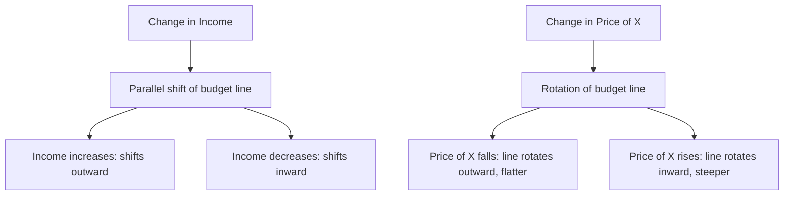

## Budget Constraints

### Overview

A budget constraint defines the complete set of consumption bundles that a consumer can afford given their income and the prices of available goods. It represents the fundamental economic limitation that consumers face: unlimited wants confronting limited resources. Together with preferences (represented by utility functions or indifference curves), the budget constraint forms one of the two essential building blocks of consumer choice theory, defining the feasible set over which utility maximization occurs.

### The Budget Constraint Equation

**Key Points**

- For a consumer choosing between two goods, $X$ and $Y$, with prices $P_X$ and $P_Y$ respectively, and income $I$, the budget constraint is expressed as:

$$P_X X + P_Y Y \leq I$$

- When the consumer spends their entire income (the standard assumption in most models, since more consumption is generally preferred to less — non-satiation), the constraint holds with equality, known as the **budget line**:

$$P_X X + P_Y Y = I$$

- Rearranging to express $Y$ as a function of $X$ (useful for graphing) gives the **budget line equation**:

$$Y = \frac{I}{P_Y} - \frac{P_X}{P_Y} X$$

### Components of the Budget Line

**Key Points**

- **Vertical intercept** ($X = 0$): $Y = \frac{I}{P_Y}$ — the maximum quantity of $Y$ affordable if all income is spent on $Y$.
- **Horizontal intercept** ($Y = 0$): $X = \frac{I}{P_X}$ — the maximum quantity of $X$ affordable if all income is spent on $X$.
- **Slope**: $-\frac{P_X}{P_Y}$ — the rate at which the consumer must trade off $Y$ for an additional unit of $X$ in the market, holding expenditure constant. This slope represents the **opportunity cost** of good $X$ in terms of good $Y$, and its absolute value is sometimes referred to as the market rate of substitution.

### Graphical Representation

<svg xmlns="http://www.w3.org/2000/svg" viewBox="0 0 640 480" font-family="Arial, sans-serif">
<text x="320" y="24" text-anchor="middle" font-size="16" font-weight="bold">The Budget Line and Budget Set (svg_diagram)</text>

<line x1="90" y1="420" x2="580" y2="420" stroke="black" stroke-width="2" />
<line x1="90" y1="420" x2="90" y2="60" stroke="black" stroke-width="2" />
<text x="585" y="440" font-size="13">Quantity of X</text>
<text x="55" y="55" font-size="13">Quantity of Y</text>

<line x1="90" y1="90" x2="520" y2="420" stroke="#1f77b4" stroke-width="3" />
<text x="90" y="80" font-size="12" fill="#1f77b4">I / P_Y</text>
<text x="500" y="440" font-size="12" fill="#1f77b4">I / P_X</text>

<polygon points="90,420 90,90 520,420" fill="#1f77b4" fill-opacity="0.1" />
<text x="180" y="380" font-size="13" fill="#1f77b4">Affordable Budget Set</text>
<text x="180" y="398" font-size="11" fill="#1f77b4">(P_X X + P_Y Y ≤ I)</text>

<text x="350" y="150" font-size="13" fill="#888">Unaffordable</text>

<text x="350" y="168" font-size="11" fill="#888">(beyond budget line)</text>

<text x="280" y="270" font-size="12" font-weight="bold" fill="`#1f77b4`">Slope = -P_X / P_Y</text>

<circle cx="305" cy="255" r="4" fill="black" />
</svg>

**Key Points**

- The **budget set** includes all bundles on or below the budget line (all affordable combinations, including underspending).
- The **budget line** itself represents bundles where the entire income is exactly spent.
- Points beyond the budget line (up and to the right) are unaffordable given current income and prices.

### Shifts and Rotations of the Budget Line

**Key Points**

**Change in Income (Parallel Shift):**

- An **increase in income** ($I$) shifts the budget line outward, parallel to the original line, since both intercepts ($I/P_X$ and $I/P_Y$) increase proportionally while the slope ($-P_X/P_Y$) remains unchanged.
- A **decrease in income** shifts the budget line inward, parallel to the original, shrinking the budget set.

**Change in Price (Rotation):**

- A **decrease in the price of $X$** ($P_X$) causes the budget line to rotate outward around the vertical intercept: the horizontal intercept ($I/P_X$) increases (more $X$ can now be purchased), while the vertical intercept ($I/P_Y$) stays fixed. This makes the line flatter (the slope $-P_X/P_Y$ becomes less steep in absolute value).
- An **increase in the price of $X$** rotates the line inward around the same vertical intercept, making it steeper.
- Analogous rotations around the horizontal intercept occur for changes in $P_Y$.

### Numerical Example

**Example**

Suppose a consumer has income $I = \$100$, and the prices of goods $X$ and $Y$ are $P_X = \$5$ and $P_Y = \$4$.

**Step 1 — Find the intercepts:**

$$\text{Vertical intercept: } Y = \frac{100}{4} = 25$$

$$\text{Horizontal intercept: } X = \frac{100}{5} = 20$$

**Step 2 — Find the slope:**

$$\text{Slope} = -\frac{P_X}{P_Y} = -\frac{5}{4} = -1.25$$

This means the consumer must give up 1.25 units of $Y$ to obtain 1 additional unit of $X$ (the market opportunity cost of $X$ in terms of $Y$).

**Step 3 — Verify a specific bundle:** Is the bundle $(X = 12, Y = 10)$ affordable?

$$P_X X + P_Y Y = 5(12) + 4(10) = 60 + 40 = 100$$

Since total expenditure equals exactly $100, this bundle lies precisely on the budget line (fully exhausting income).

**Step 4 — Effect of a price change:** If $P_X$ falls to $4 (holding $P_Y$ and $I$ constant), the new horizontal intercept becomes $\frac{100}{4} = 25$, while the vertical intercept remains at 25 — the budget line rotates outward and becomes less steep, with a new slope of $-\frac{4}{4} = -1$.

### The Budget Constraint in the Consumer's Optimization Problem

**Key Points**

- The budget constraint defines the **feasible region** over which a consumer maximizes utility. The full constrained optimization problem is:

$$\max_{X,Y} \, U(X, Y) \quad \text{subject to} \quad P_X X + P_Y Y = I$$

- The utility-maximizing bundle occurs where the highest attainable indifference curve is **tangent** to the budget line — at this point, the slope of the indifference curve (the marginal rate of substitution, $MRS$) equals the slope of the budget line (the price ratio):

$$MRS_{XY} = \frac{MU_X}{MU_Y} = \frac{P_X}{P_Y}$$

- This tangency condition is mathematically equivalent to the equimarginal principle:

$$\frac{MU_X}{P_X} = \frac{MU_Y}{P_Y}$$

### Corner Solutions

**Key Points**

- A **corner solution** occurs when the consumer's utility-maximizing bundle lies at one of the axes (i.e., the consumer spends their entire budget on only one good), rather than at an interior tangency point.
- Corner solutions typically arise when goods are **perfect substitutes** with different price-to-marginal-utility ratios, or when the marginal rate of substitution never equals the price ratio anywhere along the budget line (e.g., strongly convex or non-standard preferences).
- In a corner solution, the tangency condition $MRS = P_X/P_Y$ does not hold with equality; instead, the consumer's MRS remains strictly greater than or less than the price ratio across the entire feasible budget line.

### Composite Goods and Kinked Budget Constraints

**Key Points**

- Real-world budget constraints are sometimes **non-linear or kinked**, departing from the simple straight-line model:
  - **Quantity discounts**: If a good's per-unit price falls after purchasing a threshold quantity, the budget line becomes flatter (less steep) beyond that quantity, creating a kink.
  - **Rationing**: If government policy or firm rules limit the maximum quantity of a good that can be purchased regardless of income, the budget line is truncated with a vertical segment at the rationed quantity.
  - **Overtime wages / labor-leisure models**: In labor supply models, a higher overtime wage rate for hours beyond a standard threshold creates a kinked budget constraint between income and leisure.
- These kinked constraints are important extensions of the basic linear budget line model and are commonly analyzed in more advanced treatments of consumer and labor supply theory.

### Multi-Good Generalization

**Key Points**

- The two-good budget constraint generalizes naturally to $n$ goods:

$$\sum_{i=1}^{n} P_i X_i \leq I$$

- In practice, the two-good model is often used pedagogically by treating one "good" as a composite representing "all other goods," measured in generic monetary units (with an implicit price of 1), which allows the two-dimensional graphical framework to still apply to a multi-good world.

### Budget Constraints and Real Income (Effect of Inflation)

**Key Points**

- If both prices ($P_X$ and $P_Y$) and income ($I$) increase by the same proportion (e.g., general inflation with fully indexed income), the budget line remains **unchanged** — both intercepts and the slope stay the same, since:

$$\frac{I}{P_X}, \frac{I}{P_Y}, \text{ and } -\frac{P_X}{P_Y} \text{ are all unaffected by uniform proportional scaling.}$$

- This illustrates the concept that consumer choices depend on **relative prices and real income**, not on nominal (absolute) price and income levels alone.

### Common Misconceptions

**Key Points**

- **Misconception:** "The budget line shows what a consumer wants to buy." — Incorrect; the budget line shows what a consumer is *able* to afford, independent of preferences. What they actually choose to buy depends on the interaction between the budget constraint and their utility function (preferences).
- **Misconception:** "A steeper budget line always means the consumer is worse off." — Incorrect; the slope reflects the relative price ratio, not the consumer's absolute welfare; welfare changes are assessed by whether the entire budget set expands or contracts.
- **Misconception:** "Income and price changes affect the budget line the same way." — Incorrect; income changes shift the line parallel, while price changes for a single good rotate the line around one intercept.

### Conclusion

The budget constraint is the fundamental representation of the economic limits faced by a consumer, defining the complete set of affordable bundles given income and prices. Its slope reflects the relative opportunity cost between goods, while shifts and rotations in response to income and price changes provide the analytical starting point for deriving individual demand curves, understanding income and substitution effects, and modeling the tangency condition central to utility maximization. Extensions such as kinked budget constraints and corner solutions expand the basic linear model to capture more realistic and complex real-world consumption environments.

**Related Topics**

- Indifference curves and the marginal rate of substitution
- Utility maximization and the tangency condition
- Income effect and substitution effect
- Deriving individual demand curves from consumer optimization
- Corner solutions and perfect substitutes/complements
- Labor-leisure choice models and kinked budget constraints
- Engel curves and income consumption curves
- Revealed preference theory