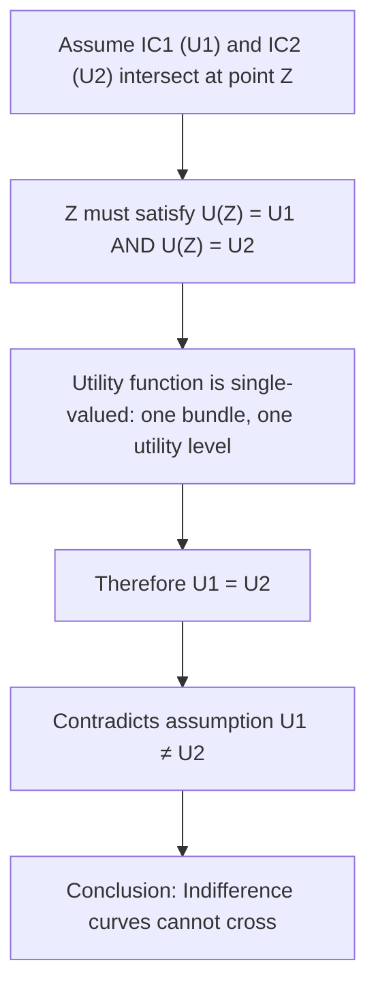

## Indifference Curves and Their Properties

### Overview

An indifference curve represents the set of all consumption bundles that provide a consumer with the same level of total utility, meaning the consumer is equally satisfied by — or indifferent between — any bundle lying on that curve. Indifference curves are the graphical representation of ordinal consumer preferences and, together with the budget constraint, form the analytical apparatus used to derive utility-maximizing consumer choice and individual demand curves.

### Definition and Basic Concept

**Key Points**

- An indifference curve is defined mathematically as the set of bundles $(X, Y)$ satisfying:

$$U(X, Y) = \bar{U}$$

for some constant utility level $\bar{U}$.

- Each indifference curve corresponds to a single, specific level of utility; different curves represent different utility levels.
- A collection of indifference curves for a given consumer, covering a range of utility levels, is called an **indifference map**.

### The Indifference Map

<svg viewBox="0 0 640 480" xmlns="http://www.w3.org/2000/svg" font-family="Arial, sans-serif">
<text x="320" y="24" text-anchor="middle" font-size="16" font-weight="bold">Indifference Map (svg_diagram)</text>
<!-- Axes -->
<line x1="90" y1="420" x2="580" y2="420" stroke="black" stroke-width="2"/>
<line x1="90" y1="420" x2="90" y2="60" stroke="black" stroke-width="2"/>
<text x="585" y="440" font-size="13">Quantity of X</text>
<text x="55" y="55" font-size="13">Quantity of Y</text>
<!-- Indifference curve 1 (lowest utility) -->
<path d="M 130,400 C 160,280 230,180 380,150" fill="none" stroke="#1f77b4" stroke-width="2.5"/>
<text x="385" y="150" font-size="12" fill="#1f77b4">IC1 (U1)</text>
<!-- Indifference curve 2 (medium utility) -->
<path d="M 180,410 C 220,300 300,200 460,170" fill="none" stroke="#2ca02c" stroke-width="2.5"/>
<text x="465" y="170" font-size="12" fill="#2ca02c">IC2 (U2)</text>
<!-- Indifference curve 3 (highest utility) -->
<path d="M 240,415 C 290,320 380,230 540,195" fill="none" stroke="#d62728" stroke-width="2.5"/>
<text x="545" y="195" font-size="12" fill="#d62728">IC3 (U3)</text>

<text x="90" y="460" font-size="12" fill="#333">Direction of increasing utility: U1 < U2 < U3 (curves farther from origin = higher utility)</text>

</svg>

**Key Points**

- Curves farther from the origin represent higher levels of utility, since they contain bundles with more of both goods (under the standard assumption that more is preferred to less).

### Property 1: Downward Sloping (Negative Slope)

**Key Points**

- Indifference curves are downward sloping (assuming both goods are "goods" that provide positive marginal utility, rather than "bads").
- This follows logically from the non-satiation assumption: if the consumer gains more of good $X$, they must give up some amount of good $Y$ to remain at the same total utility level; otherwise, they would strictly prefer the new bundle (having more of both), contradicting the definition of indifference.
- The slope of the indifference curve at any point is called the **marginal rate of substitution (MRS)**, discussed in detail below.

### Property 2: Indifference Curves Do Not Cross

**Key Points**

- Two distinct indifference curves representing different utility levels can never intersect.
- **Proof by contradiction:** Suppose two indifference curves, $IC_1$ (utility level $U_1$) and $IC_2$ (utility level $U_2 \neq U_1$), intersect at point $Z$. Since $Z$ lies on both curves, it must simultaneously satisfy $U(Z) = U_1$ and $U(Z) = U_2$. Since a utility function is single-valued (each bundle maps to exactly one utility level), this requires $U_1 = U_2$, contradicting the assumption that the curves represent different utility levels. Therefore, indifference curves cannot cross.

### Property 3: Convexity to the Origin

**Key Points**

- Indifference curves are typically assumed to be **convex to the origin**, meaning they bow inward toward the origin rather than bulging outward.
- Convexity reflects the assumption of a **diminishing marginal rate of substitution**: as a consumer acquires more of good $X$ (and less of $Y$) while remaining on the same indifference curve, they become increasingly unwilling to give up further units of $Y$ for each additional unit of $X$.
- Formally, convexity implies that a weighted average of two bundles on the same indifference curve is at least as preferred as (typically strictly preferred to) either bundle individually — reflecting a general preference for balanced or diversified consumption bundles over extreme ones.

### Property 4: Higher Curves Represent Higher Utility

**Key Points**

- Any indifference curve farther from the origin represents a strictly higher level of utility than any curve closer to the origin, under the standard assumption of **non-satiation** ("more is always preferred to less" — also called monotonicity of preferences).
- This ranking property allows indifference maps to fully represent an ordinal ranking of consumer preferences across all conceivable bundles, without requiring a cardinal utility measure.

### Property 5: Indifference Curves Are Everywhere Dense (Fill the Entire Commodity Space)

**Key Points**

- Given standard assumptions (completeness and continuity of preferences), an indifference curve passes through every possible consumption bundle in the relevant commodity space.
- This means that for any given bundle, there exists exactly one indifference curve passing through it, reflecting the completeness axiom of consumer preference theory (the consumer can rank, or is indifferent between, any two conceivable bundles).

### The Marginal Rate of Substitution (MRS)

**Key Points**

- The **Marginal Rate of Substitution (MRS)** is the rate at which a consumer is willing to trade one good for another while remaining on the same indifference curve (maintaining constant utility).
- Formally, the MRS is the negative of the slope of the indifference curve at a given point:

$$MRS_{XY} = -\frac{dY}{dX}\bigg|_{U = \bar{U}}$$

- The MRS can also be expressed in terms of marginal utilities, derived using the total differential of the utility function set equal to zero along an indifference curve:

$$dU = MU_X \, dX + MU_Y \, dY = 0 \quad \Rightarrow \quad MRS_{XY} = \frac{MU_X}{MU_Y}$$

- **Diminishing MRS**: As a consumer moves down and to the right along a convex indifference curve (acquiring more $X$, less $Y$), the MRS typically diminishes — the consumer requires increasingly smaller amounts of $Y$ to compensate for each additional unit of $X$, since $X$ becomes relatively more abundant (lower marginal utility) and $Y$ becomes relatively scarcer (higher marginal utility).

### Special Cases of Indifference Curves

**Key Points**

**Perfect Substitutes:**

- When two goods are perfect substitutes (the consumer is willing to trade them at a constant, fixed rate regardless of the quantities consumed), indifference curves are **straight lines** with a constant slope, reflecting a constant MRS.
- Example utility function: $U(X, Y) = aX + bY$, where $a$ and $b$ are constants representing the fixed trade-off ratio.

**Perfect Complements:**

- When two goods are perfect complements (always consumed together in a fixed proportion, such as left shoes and right shoes), indifference curves are **L-shaped** (right angles), reflecting that additional units of only one good provide no additional utility without a matching increase in the other good.
- Example utility function: $U(X, Y) = \min(aX, bY)$.

**Goods vs. "Bads":**

- If one of the two commodities is a "bad" (something that decreases utility, such as pollution or garbage), the indifference curve for that combination will be **upward sloping**, since more of the bad must be compensated for by more of the good to maintain the same utility level.

The following diagram illustrates these special-case shapes.

<svg xmlns="http://www.w3.org/2000/svg" viewBox="0 0 640 420" font-family="Arial, sans-serif">
<text x="320" y="24" text-anchor="middle" font-size="15" font-weight="bold">Special-Case Indifference Curve Shapes (svg_diagram)</text>

<text x="100" y="55" font-size="12" font-weight="bold">Standard (Convex)</text>

<line x1="60" y1="180" x2="200" y2="180" stroke="black" stroke-width="1.5" />

<line x1="60" y1="180" x2="60" y2="60" stroke="black" stroke-width="1.5" />

<path d="M 70,160 C 90,110 130,80 190,70" fill="none" stroke="`#1f77b4`" stroke-width="2.5" />

<text x="320" y="55" font-size="12" font-weight="bold">Perfect Substitutes</text>

<line x1="270" y1="180" x2="410" y2="180" stroke="black" stroke-width="1.5" />

<line x1="270" y1="180" x2="270" y2="60" stroke="black" stroke-width="1.5" />

<line x1="280" y1="160" x2="400" y2="70" stroke="`#2ca02c`" stroke-width="2.5" />

<text x="520" y="55" font-size="12" font-weight="bold">Perfect Complements</text>

<line x1="480" y1="180" x2="620" y2="180" stroke="black" stroke-width="1.5" />

<line x1="480" y1="180" x2="480" y2="60" stroke="black" stroke-width="1.5" />

<path d="M 520,160 L 520,100 L 590,100" fill="none" stroke="`#d62728`" stroke-width="2.5" />

<text x="100" y="245" font-size="12" font-weight="bold">One Good is a "Bad"</text>

<line x1="60" y1="380" x2="200" y2="380" stroke="black" stroke-width="1.5" />

<line x1="60" y1="380" x2="60" y2="260" stroke="black" stroke-width="1.5" />

<path d="M 70,360 C 110,320 150,290 190,270" fill="none" stroke="`#9467bd`" stroke-width="2.5" />

<text x="30" y="270" font-size="10">Y (good)</text>

<text x="150" y="400" font-size="10">X (bad)</text>

</svg>

### Numerical Example of MRS Calculation

**Example**

Suppose a consumer's utility function is $U(X, Y) = X^{0.5} Y^{0.5}$ (a Cobb-Douglas utility function).

**Step 1 — Find marginal utilities:**

$$MU_X = \frac{\partial U}{\partial X} = 0.5 X^{-0.5} Y^{0.5}$$

$$MU_Y = \frac{\partial U}{\partial Y} = 0.5 X^{0.5} Y^{-0.5}$$

**Step 2 — Compute the MRS:**

$$MRS_{XY} = \frac{MU_X}{MU_Y} = \frac{0.5 X^{-0.5} Y^{0.5}}{0.5 X^{0.5} Y^{-0.5}} = \frac{Y}{X}$$

**Step 3 — Evaluate at a specific bundle**, say $(X = 4, Y = 16)$:

$$MRS_{XY} = \frac{16}{4} = 4$$

This means at the bundle $(4, 16)$, the consumer is willing to give up 4 units of $Y$ to obtain 1 additional unit of $X$, while remaining equally satisfied.

**Step 4 — Verify diminishing MRS:** At a different bundle further along the same indifference curve with more $X$ and less $Y$, say $(X = 16, Y = 4)$ (same utility level, since $U = \sqrt{16 \times 4} = \sqrt{64} = 8$, compared to $U = \sqrt{4 \times 16} = \sqrt{64} = 8$ at the original bundle):

$$MRS_{XY} = \frac{4}{16} = 0.25$$

The MRS has fallen from 4 to 0.25 as $X$ increased and $Y$ decreased along the same indifference curve, confirming diminishing MRS and consistent with the assumed convexity of this Cobb-Douglas indifference curve.

### Indifference Curves and Utility Maximization

**Key Points**

- The consumer's optimal (utility-maximizing) bundle occurs where the highest attainable indifference curve is **tangent** to the budget line.
- At this tangency point, the slope of the indifference curve (MRS) equals the slope of the budget line (the price ratio):

$$MRS_{XY} = \frac{MU_X}{MU_Y} = \frac{P_X}{P_Y}$$

- This tangency condition is the graphical equivalent of the equimarginal principle from utility theory, linking indifference curve analysis directly to the algebraic conditions for utility maximization.

### Ordinal vs. Cardinal Interpretation of Indifference Curves

**Key Points**

- Indifference curve analysis relies on **ordinal utility** — only the *ranking* of bundles matters (which bundles are preferred, equally preferred, or less preferred to others), not the specific numerical utility values assigned to them.
- Any monotonic transformation of a utility function (e.g., multiplying by a positive constant, or applying a function like $\ln(U)$) produces the exact same indifference map and the same set of optimal choices, since rankings are preserved. This underscores that the *shape and position* of indifference curves — not the specific numbers labeling them — carry the economically meaningful information.

### Common Misconceptions

**Key Points**

- **Misconception:** "Indifference curves that are farther apart represent proportionally more utility (e.g., twice the distance means twice the utility)." — Incorrect; since indifference curves rely on ordinal utility, only the ranking (higher vs. lower) is meaningful, not the numerical distance or ratio between curves.
- **Misconception:** "All indifference curves must be convex curves that never touch the axes." — Incorrect; special cases (perfect substitutes, perfect complements, or goods that can be consumed in isolation) can produce straight lines, L-shapes, or curves that touch an axis.
- **Misconception:** "Indifference curves can cross if a consumer's preferences change." — Incorrect within a single, fixed indifference map representing one stable set of preferences at one point in time; the non-crossing property is a logical consequence of a well-defined utility function, not an empirical claim about preference stability over time.

### Conclusion

Indifference curves provide the graphical foundation for ordinal consumer preference theory, representing all bundles that yield equal utility to a consumer. Their key properties — downward sloping, non-intersecting, convex to the origin, and increasing in utility as they move away from the origin — follow logically from standard assumptions about rational, well-behaved preferences (completeness, transitivity, non-satiation, and diminishing marginal rate of substitution). Combined with the budget constraint, indifference curves allow economists to derive the utility-maximizing consumer choice through the tangency condition, forming the essential bridge between abstract preference theory and observable consumer demand behavior.

**Related Topics**

- Marginal rate of substitution in depth
- Utility maximization and the tangency condition
- Budget constraints and the consumer's optimization problem
- Perfect substitutes and perfect complements as utility function special cases
- Cobb-Douglas utility functions
- Income and substitution effects
- Deriving demand curves from indifference curve analysis
- Revealed preference theory
- Axioms of rational preference (completeness, transitivity, non-satiation)