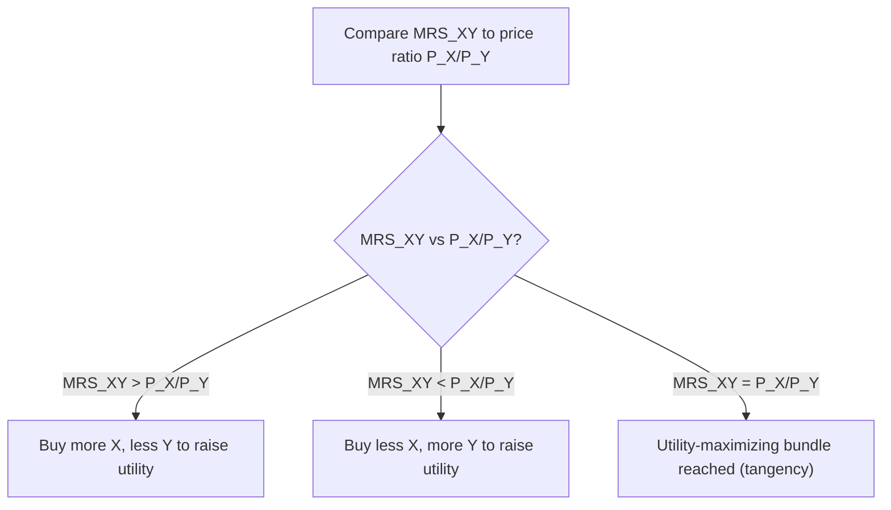

## Marginal Rate of Substitution

### Overview

The Marginal Rate of Substitution (MRS) measures the rate at which a consumer is willing to give up one good in exchange for an additional unit of another good, while remaining equally satisfied (holding total utility constant). It is geometrically represented as the (absolute value of the) slope of an indifference curve at a given bundle, and it plays a central role in the tangency condition that determines a consumer's utility-maximizing choice.

### Formal Definition

**Key Points**

- The MRS of good $X$ for good $Y$, denoted $MRS_{XY}$, is defined as the amount of $Y$ a consumer is willing to sacrifice to obtain one additional unit of $X$, while remaining on the same indifference curve:

$$MRS_{XY} = -\frac{dY}{dX}\bigg|_{U = \bar{U}}$$

- The negative sign converts the naturally negative slope of a standard (downward-sloping) indifference curve into a positive number, representing a rate of exchange rather than a signed slope.

### Derivation from the Utility Function

**Key Points**

- The MRS can be derived formally using the **total differential** of the utility function. Along any single indifference curve, total utility is constant, so the total differential equals zero:

$$dU = \frac{\partial U}{\partial X} dX + \frac{\partial U}{\partial Y} dY = MU_X \, dX + MU_Y \, dY = 0$$

- Solving for $\frac{dY}{dX}$:

$$MU_X \, dX = -MU_Y \, dY$$

$$\frac{dY}{dX} = -\frac{MU_X}{MU_Y}$$

- Since $MRS_{XY} = -\frac{dY}{dX}$, this yields the key result:

$$MRS_{XY} = \frac{MU_X}{MU_Y}$$

**Key Points**

- This equation shows that the MRS is simply the **ratio of marginal utilities** of the two goods — the good being acquired ($X$) in the numerator, the good being given up ($Y$) in the denominator.

### Numerical Example: Deriving MRS from a Utility Function

**Example**

Suppose a consumer's utility function is $U(X, Y) = X^{0.3} Y^{0.7}$ (a Cobb-Douglas form).

**Step 1 — Compute marginal utilities:**

$$MU_X = \frac{\partial U}{\partial X} = 0.3 X^{-0.7} Y^{0.7}$$

$$MU_Y = \frac{\partial U}{\partial Y} = 0.7 X^{0.3} Y^{-0.3}$$

**Step 2 — Form the MRS:**

$$MRS_{XY} = \frac{MU_X}{MU_Y} = \frac{0.3 X^{-0.7} Y^{0.7}}{0.7 X^{0.3} Y^{-0.3}} = \frac{0.3}{0.7} \times \frac{Y}{X} = \frac{3Y}{7X}$$

**Step 3 — Evaluate at a specific bundle**, say $(X = 3, Y = 14)$:

$$MRS_{XY} = \frac{3(14)}{7(3)} = \frac{42}{21} = 2$$

At this bundle, the consumer is willing to give up 2 units of $Y$ to obtain 1 additional unit of $X$, while remaining equally satisfied.

### Graphical Interpretation

<svg xmlns="http://www.w3.org/2000/svg" viewBox="0 0 640 460" font-family="Arial, sans-serif">
<text x="320" y="24" text-anchor="middle" font-size="16" font-weight="bold">MRS as the Slope of an Indifference Curve (svg_diagram)</text>

<line x1="90" y1="400" x2="580" y2="400" stroke="black" stroke-width="2" />
<line x1="90" y1="400" x2="90" y2="60" stroke="black" stroke-width="2" />
<text x="585" y="420" font-size="13">Quantity of X</text>
<text x="55" y="55" font-size="13">Quantity of Y</text>

<path d="M 130,380 C 170,240 260,140 460,100" fill="none" stroke="#1f77b4" stroke-width="2.5" />
<text x="465" y="100" font-size="12" fill="#1f77b4">Indifference Curve (U = constant)</text>

<circle cx="200" cy="220" r="4" fill="black" />
<text x="150" y="215" font-size="12">A</text>

<line x1="120" y1="290" x2="290" y2="160" stroke="#d62728" stroke-width="2" stroke-dasharray="5,3" />
<text x="295" y="160" font-size="12" fill="#d62728">Tangent = -MRS at A</text>

<line x1="200" y1="220" x2="200" y2="180" stroke="gray" stroke-width="1.5" />
<line x1="200" y1="180" x2="240" y2="180" stroke="gray" stroke-width="1.5" />
<text x="205" y="175" font-size="11">ΔY (give up)</text>
<text x="205" y="195" font-size="11">ΔX (gain)</text>

<text x="90" y="440" font-size="12" fill="#333">MRS = amount of Y given up per additional unit of X, holding utility constant</text>

</svg>

### Diminishing Marginal Rate of Substitution

**Key Points**

- The MRS typically **diminishes** as a consumer moves along a standard convex indifference curve, acquiring more of $X$ and less of $Y$.
- **Economic intuition:** As the consumer accumulates more units of $X$, each additional unit of $X$ becomes relatively less valuable at the margin (its marginal utility, $MU_X$, tends to fall as more $X$ is consumed), while the consumer is simultaneously giving up units of $Y$, making the remaining $Y$ relatively scarcer and more valuable at the margin ($MU_Y$ rises as $Y$ falls). Both effects reinforce a falling MRS ratio $\left(\frac{MU_X}{MU_Y}\right)$.
- Diminishing MRS is the formal condition underlying the **convexity** property of well-behaved indifference curves, and it reflects a general preference for balanced, diversified consumption bundles over extreme, corner-heavy bundles.

### The MRS and the Tangency Condition for Utility Maximization

**Key Points**

- At a consumer's utility-maximizing bundle (assuming an interior solution), the indifference curve is tangent to the budget line, meaning their slopes are equal:

$$MRS_{XY} = \frac{P_X}{P_Y}$$

- This condition states that at the optimum, the rate at which the consumer is personally willing to trade $Y$ for $X$ (the MRS) exactly equals the rate at which the market allows them to trade $Y$ for $X$ (the price ratio).
- **If $MRS_{XY} > \frac{P_X}{P_Y}$:** the consumer values an additional unit of $X$ more than it costs them in forgone $Y$ relative to market prices — they should purchase more $X$ and less $Y$ to increase utility.
- **If $MRS_{XY} < \frac{P_X}{P_Y}$:** the consumer values an additional unit of $X$ less than its market opportunity cost in terms of $Y$ — they should purchase less $X$ and more $Y$.
- Only when $MRS_{XY} = \frac{P_X}{P_Y}$ is there no incentive to further reallocate the consumption bundle, indicating optimality.

### MRS in Special Cases

**Key Points**

**Perfect Substitutes:**

- For perfect substitutes with utility function $U(X, Y) = aX + bY$, the MRS is **constant** at every bundle:

$$MRS_{XY} = \frac{MU_X}{MU_Y} = \frac{a}{b}$$

- Since the MRS does not change with the quantities of $X$ and $Y$ consumed, indifference curves for perfect substitutes are straight lines, and the consumer typically ends up at a corner solution (spending the entire budget on whichever good offers the better price-adjusted trade-off), unless the MRS happens to exactly equal the price ratio.

**Perfect Complements:**

- For perfect complements with utility function $U(X, Y) = \min(aX, bY)$, the MRS is technically **undefined at the kink point** (where $aX = bY$), since the indifference curve is not smooth (differentiable) there.
- Away from the kink (along either the vertical or horizontal segment of the L-shaped curve), the MRS is either zero or infinite, reflecting that additional units of only one good provide no additional utility without a corresponding increase in the other.

### Asymmetry of MRS: $MRS_{XY}$ vs. $MRS_{YX}$

**Key Points**

- The MRS is directional: $MRS_{XY}$ (units of $Y$ given up per unit of $X$ gained) is generally not equal to $MRS_{YX}$ (units of $X$ given up per unit of $Y$ gained).
- In fact, they are reciprocals of one another:

$$MRS_{YX} = \frac{MU_Y}{MU_X} = \frac{1}{MRS_{XY}}$$

- This distinction is important: care must be taken to specify which good is being acquired and which is being sacrificed when reporting an MRS value.

### MRS and Consumer Types (Preference Shapes)

**Key Points**

- A **high and steeply diminishing MRS** typically indicates a consumer who initially strongly prefers good $X$ over good $Y$ but whose preference intensity quickly moderates as they acquire more $X$.
- A **relatively flat and slowly diminishing MRS** suggests goods that are closer to substitutes for that consumer, since the consumer's willingness to trade one for the other does not change dramatically across different bundles.
- Comparing MRS values (or entire MRS functions) across different consumers is a way economists characterize differences in individual tastes and preference structures, even while working entirely within the ordinal utility framework (since MRS is a ratio and remains invariant to positive monotonic transformations of the underlying utility function).

### MRS Invariance to Monotonic Transformations

**Key Points**

- A crucial property confirming that MRS is an ordinal (not cardinal) concept: if a utility function $U(X, Y)$ is transformed by any strictly increasing (positive monotonic) function $f$, such as $V(X, Y) = f(U(X, Y))$, the MRS computed from $V$ is identical to the MRS computed from $U$.
- **Proof sketch:** By the chain rule, $\frac{\partial V}{\partial X} = f'(U) \cdot MU_X$ and $\frac{\partial V}{\partial Y} = f'(U) \cdot MU_Y$. Taking the ratio:

$$MRS_{XY}^{V} = \frac{f'(U) \cdot MU_X}{f'(U) \cdot MU_Y} = \frac{MU_X}{MU_Y} = MRS_{XY}^{U}$$

- Since $f'(U)$ cancels out, the MRS — and therefore the entire indifference map and all resulting consumer choice predictions — remains unchanged regardless of which specific monotonic utility representation is used. This confirms that MRS captures genuinely ordinal information about preferences.

### Common Misconceptions

**Key Points**

- **Misconception:** "MRS and the price ratio are the same thing." — Incorrect; the price ratio ($P_X/P_Y$) reflects market-given trade-off rates, while the MRS reflects the consumer's personal, subjective willingness to trade based on preferences. They are only equal at the utility-maximizing bundle.
- **Misconception:** "The MRS is always constant for a given consumer." — Incorrect; the MRS generally varies along a standard convex indifference curve (diminishing MRS), except in special cases like perfect substitutes.
- **Misconception:** "$MRS_{XY}$ and $MRS_{YX}$ are the same number." — Incorrect; they are reciprocals of one another, and the direction of substitution (which good is being acquired versus given up) must be specified precisely.

### Conclusion

The Marginal Rate of Substitution formalizes how a consumer values trading one good for another while holding utility constant, expressed as the ratio of marginal utilities or equivalently the slope of an indifference curve. Diminishing MRS along a convex indifference curve reflects a fundamental preference for balanced consumption bundles, and the equality of MRS with the market price ratio at the point of tangency defines the necessary condition for utility-maximizing consumer choice. As an ordinal concept invariant to monotonic transformations of the utility function, the MRS connects preference theory directly to the observable behavioral predictions of consumer demand.

**Related Topics**

- Indifference curves and their properties (foundational prerequisite)
- Utility maximization and the tangency condition
- Budget constraints and the consumer's optimization problem
- Marginal utility and diminishing marginal utility
- Perfect substitutes and perfect complements
- Cobb-Douglas utility functions
- Corner solutions in consumer choice
- Deriving demand curves from consumer optimization
- Income and substitution effects