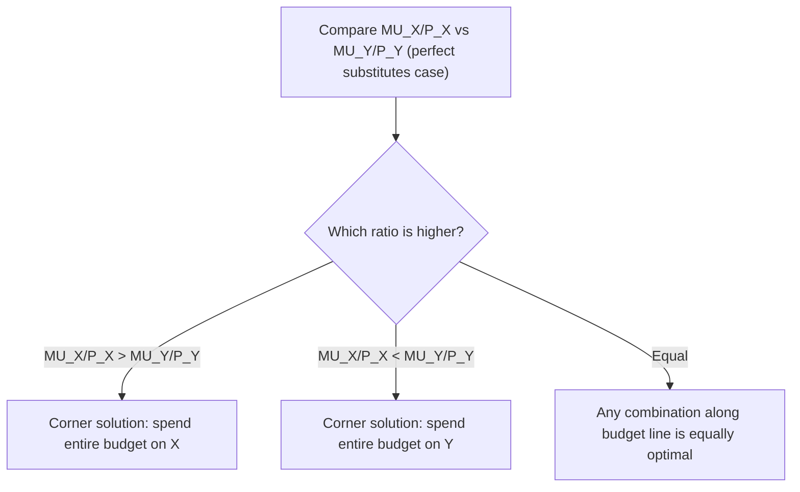

## Consumer Equilibrium

### Overview

Consumer equilibrium describes the state in which a consumer, given a fixed income and fixed market prices, has allocated their spending across available goods in a way that maximizes total utility, leaving no incentive to reallocate the budget further. At this point, the consumer's subjective willingness to trade between goods (as captured by the marginal rate of substitution) exactly matches the objective rate at which the market allows them to trade goods (the relative price ratio). Consumer equilibrium is the central solution concept of consumer choice theory, unifying budget constraints, indifference curves, and marginal utility analysis.

### Conditions for Consumer Equilibrium

**Key Points**

- Consumer equilibrium requires two conditions to be satisfied simultaneously:

**1. The Budget Exhaustion Condition:** The consumer spends their entire income (assuming non-satiation — more is always preferred to less, so no rational consumer leaves income unspent):

$$P_X X + P_Y Y = I$$

**2. The Tangency (Optimality) Condition:** The marginal rate of substitution equals the ratio of prices:

$$MRS_{XY} = \frac{MU_X}{MU_Y} = \frac{P_X}{P_Y}$$

- Equivalently, condition 2 can be restated as the **equimarginal principle**: the marginal utility per dollar spent must be equal across all goods:

$$\frac{MU_X}{P_X} = \frac{MU_Y}{P_Y}$$

### Graphical Representation

<svg xmlns="http://www.w3.org/2000/svg" viewBox="0 0 640 480" font-family="Arial, sans-serif">
<text x="320" y="24" text-anchor="middle" font-size="16" font-weight="bold">Consumer Equilibrium: Tangency of Budget Line and Indifference Curve (svg_diagram)</text>

<line x1="90" y1="420" x2="580" y2="420" stroke="black" stroke-width="2" />
<line x1="90" y1="420" x2="90" y2="60" stroke="black" stroke-width="2" />
<text x="585" y="440" font-size="13">Quantity of X</text>
<text x="55" y="55" font-size="13">Quantity of Y</text>

<line x1="90" y1="100" x2="520" y2="420" stroke="#1f77b4" stroke-width="2.5" />
<text x="95" y="90" font-size="12" fill="#1f77b4">Budget Line</text>

<path d="M 130,400 C 160,330 220,270 320,250" fill="none" stroke="#2ca02c" stroke-width="2" stroke-dasharray="4,3" />
<text x="325" y="250" font-size="11" fill="#2ca02c">IC (lower U, not optimal)</text>

<path d="M 180,390 C 210,290 280,210 400,200" fill="none" stroke="#d62728" stroke-width="2.5" />
<text x="405" y="200" font-size="12" fill="#d62728">IC* (tangent, U maximized)</text>

<path d="M 260,395 C 300,280 370,190 490,175" fill="none" stroke="#888" stroke-width="2" stroke-dasharray="4,3" />
<text x="495" y="175" font-size="11" fill="#888">IC (higher U, unaffordable)</text>

<circle cx="300" cy="255" r="5" fill="black" />
<text x="310" y="248" font-size="13" font-weight="bold">E (X*, Y*)</text>

<line x1="300" y1="255" x2="300" y2="420" stroke="gray" stroke-width="1" stroke-dasharray="3,3" />
<line x1="300" y1="255" x2="90" y2="255" stroke="gray" stroke-width="1" stroke-dasharray="3,3" />
<text x="290" y="435" font-size="11">X*</text>
<text x="60" y="258" font-size="11">Y*</text>
</svg>

**Key Points**

- At the equilibrium point $E = (X^*, Y^*)$, the indifference curve $IC^*$ is tangent to the budget line — this is the highest utility level attainable given the budget constraint.
- Any indifference curve above $IC^*$ represents a preferred but unaffordable bundle (lies entirely outside the budget line).
- Any indifference curve below $IC^*$ represents an affordable but suboptimal bundle, since a higher utility level remains achievable within the same budget.

### Deriving Consumer Equilibrium Mathematically (Lagrangian Method)

**Key Points**

- The consumer equilibrium problem can be solved formally as a constrained optimization problem using the **Lagrangian method**:

$$\mathcal{L} = U(X, Y) + \lambda (I - P_X X - P_Y Y)$$

- Taking first-order conditions (partial derivatives set to zero):

$$\frac{\partial \mathcal{L}}{\partial X} = MU_X - \lambda P_X = 0 \quad \Rightarrow \quad MU_X = \lambda P_X$$

$$\frac{\partial \mathcal{L}}{\partial Y} = MU_Y - \lambda P_Y = 0 \quad \Rightarrow \quad MU_Y = \lambda P_Y$$

$$\frac{\partial \mathcal{L}}{\partial \lambda} = I - P_X X - P_Y Y = 0 \quad \Rightarrow \quad P_X X + P_Y Y = I$$

- Dividing the first two conditions:

$$\frac{MU_X}{MU_Y} = \frac{P_X}{P_Y}$$

which recovers the tangency condition directly. The **Lagrange multiplier** $\lambda$ has an important economic interpretation: it represents the **marginal utility of income** — the additional utility the consumer would gain from one more unit of income, since:

$$\lambda = \frac{MU_X}{P_X} = \frac{MU_Y}{P_Y}$$

### Worked Numerical Example

**Example**

Suppose a consumer has a Cobb-Douglas utility function $U(X, Y) = X^{0.5} Y^{0.5}$, income $I = \$120$, price of $X$ is $P_X = \$4$, and price of $Y$ is $P_Y = \$2$.

**Step 1 — Compute marginal utilities:**

$$MU_X = 0.5 X^{-0.5} Y^{0.5}, \qquad MU_Y = 0.5 X^{0.5} Y^{-0.5}$$

**Step 2 — Apply the tangency condition:**

$$\frac{MU_X}{MU_Y} = \frac{Y}{X} = \frac{P_X}{P_Y} = \frac{4}{2} = 2$$

This gives $Y = 2X$.

**Step 3 — Apply the budget constraint:**

$$P_X X + P_Y Y = 120 \quad \Rightarrow \quad 4X + 2(2X) = 120 \quad \Rightarrow \quad 4X + 4X = 120 \quad \Rightarrow \quad 8X = 120$$

$$X^* = 15$$

**Step 4 — Solve for $Y^*$:**

$$Y^* = 2(15) = 30$$

**Step 5 — Verify the budget is exhausted:**

$$4(15) + 2(30) = 60 + 60 = 120 \checkmark$$

**Step 6 — Verify the tangency condition holds at $(15, 30)$:**

$$MRS_{XY} = \frac{Y}{X} = \frac{30}{15} = 2 = \frac{P_X}{P_Y} = \frac{4}{2} = 2 \checkmark$$

The consumer's equilibrium bundle is $(X^* = 15, Y^* = 30)$, yielding utility $U^* = \sqrt{15 \times 30} = \sqrt{450} \approx 21.21$.

### Cobb-Douglas Shortcut Formulas

**Key Points**

- For a Cobb-Douglas utility function of the general form $U(X, Y) = X^{\alpha} Y^{\beta}$, the equilibrium demands can be found directly using the following well-known shortcut formulas (derived from the same Lagrangian approach shown above):

$$X^* = \frac{\alpha}{\alpha + \beta} \cdot \frac{I}{P_X}, \qquad Y^* = \frac{\beta}{\alpha + \beta} \cdot \frac{I}{P_Y}$$

- Applying this to the previous example, where $\alpha = \beta = 0.5$:

$$X^* = \frac{0.5}{1.0} \cdot \frac{120}{4} = 0.5 \times 30 = 15 \checkmark$$

$$Y^* = \frac{0.5}{1.0} \cdot \frac{120}{2} = 0.5 \times 60 = 30 \checkmark$$

- These shortcut formulas confirm the results obtained through the full Lagrangian derivation, and are commonly used for rapid computation with Cobb-Douglas preferences.

### Corner Solutions: When Tangency Does Not Apply

**Key Points**

- The tangency condition assumes an **interior solution**, where the consumer purchases positive quantities of both goods.
- A **corner solution** occurs when the consumer's optimal choice involves spending the entire budget on only one good, typically arising with **perfect substitutes** whose fixed MRS does not equal the market price ratio anywhere along the budget line.
- In such cases, the standard tangency condition (MRS = price ratio) does not hold with equality; instead, the consumer's decision rule becomes a direct comparison of marginal utility per dollar for each good, choosing to spend entirely on whichever good offers the higher ratio.

### Comparative Statics: How Equilibrium Changes

**Key Points**

**Change in Income:**

- An increase in income (holding prices constant) shifts the budget line outward in parallel, generally moving the consumer equilibrium to a new tangency point on a higher indifference curve.
- The path traced by successive equilibrium points as income changes (holding prices constant) is called the **Income-Consumption Curve (ICC)**, which underlies the derivation of Engel curves.

**Change in Price:**

- A change in the price of one good (holding income and the other good's price constant) rotates the budget line, generally moving the consumer equilibrium to a new tangency point.
- The path traced by successive equilibrium points as the price of one good changes (holding income and other prices constant) is called the **Price-Consumption Curve (PCC)**, which is used to derive the individual demand curve for that good.

### Second-Order Conditions: Ensuring a Maximum (Not a Minimum)

**Key Points**

- The first-order conditions (tangency and budget exhaustion) identify a **candidate** for the consumer's optimal bundle, but do not by themselves guarantee that this candidate is a utility **maximum** rather than a minimum or saddle point.
- The second-order condition for a genuine utility maximum requires that indifference curves be **convex to the origin** (equivalently, that the MRS is diminishing) in the neighborhood of the candidate equilibrium point.
- If indifference curves were instead concave (bulging outward, implying an *increasing* MRS), the tangency point identified by the first-order conditions would actually represent a utility **minimum**, and the true utility-maximizing choice would instead be a corner solution at one of the budget line's endpoints. [Inference: this second-order condition is a standard mathematical requirement in constrained optimization theory; consumer theory typically assumes convex preferences precisely to guarantee that interior tangency solutions correspond to genuine utility maxima.]

### Consumer Equilibrium and Welfare Interpretation

**Key Points**

- Consumer equilibrium represents the **constrained-optimal** outcome for an individual consumer — the best possible utility level achievable given their income and the prices they face, not an unconstrained or "ideal" level of satisfaction.
- Changes in prices or income that expand the consumer's feasible budget set (e.g., falling prices, rising income) necessarily allow access to a new equilibrium on an equal or higher indifference curve, providing the basis for welfare analysis of policy changes (e.g., using compensating and equivalent variation) in more advanced treatments.

### Common Misconceptions

**Key Points**

- **Misconception:** "Consumer equilibrium means the consumer buys equal amounts of each good." — Incorrect; equilibrium refers to the tangency condition and budget exhaustion, not equal quantities; the specific quantities depend on relative prices, income, and the shape of preferences.
- **Misconception:** "Consumer equilibrium is a one-time event rather than a re-optimization point." — Incorrect; consumer equilibrium is re-derived any time income or prices change, since the budget constraint and hence the feasible set shift.
- **Misconception:** "Tangency between the budget line and an indifference curve always exists for every consumer." — Incorrect; corner solutions (particularly common with perfect substitutes or extreme preference structures) do not require or produce an interior tangency point.

### Conclusion

Consumer equilibrium is the culmination of consumer choice theory, representing the utility-maximizing allocation of a fixed budget across available goods. It requires both full expenditure of income and the tangency condition where the marginal rate of substitution equals the market price ratio — equivalently, where marginal utility per dollar is equalized across all goods. Solved formally through Lagrangian optimization, consumer equilibrium provides the theoretical foundation for deriving individual demand curves, Engel curves, and the broader comparative statics of consumer behavior in response to changes in income and prices.

**Related Topics**

- Indifference curves and their properties
- Marginal rate of substitution
- Budget constraints and the consumer's optimization problem
- The equimarginal principle and marginal utility per dollar
- Lagrangian optimization in constrained consumer choice
- Income-Consumption Curve and Engel curves
- Price-Consumption Curve and deriving individual demand
- Income and substitution effects
- Corner solutions and perfect substitutes/complements
- Cobb-Douglas utility functions