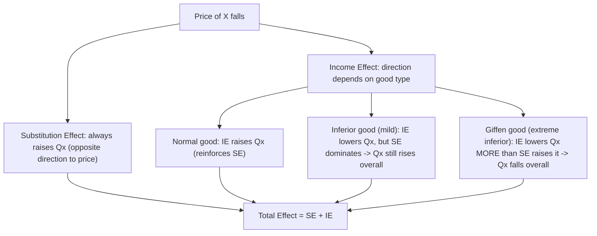

## Income and Substitution Effects

### Overview

When the price of a good changes, the total change in quantity demanded can be decomposed into two distinct components: the **substitution effect**, which captures the change in consumption due purely to the change in relative prices (holding utility constant), and the **income effect**, which captures the change in consumption due to the change in real purchasing power caused by the price change. This decomposition is one of the most powerful analytical tools in consumer theory, explaining phenomena ranging from the shape of standard demand curves to the theoretical possibility of upward-sloping demand for Giffen goods.

### The Total Effect of a Price Change

**Key Points**

- When the price of good $X$ falls (holding income and the price of good $Y$ constant), the consumer's budget line rotates outward, and the consumer generally moves to a new equilibrium bundle.
- The **Total Effect (TE)** is the overall change in quantity demanded of $X$ resulting from this price change:

$$TE = \Delta X_{\text{total}} = X_{\text{new}} - X_{\text{original}}$$

- The Total Effect can be decomposed as:

$$TE = SE + IE$$

where $SE$ is the substitution effect and $IE$ is the income effect.

### The Substitution Effect

**Key Points**

- The **Substitution Effect (SE)** isolates the change in quantity demanded that results purely from the change in the *relative price* of $X$ (relative to $Y$), while holding the consumer's **real income (utility level) constant**.
- To isolate the substitution effect, economists conceptually adjust the consumer's income just enough to keep them on their *original* indifference curve, while facing the *new* relative prices — this hypothetical adjusted budget line is parallel to the new (post-price-change) budget line but tangent to the original indifference curve.
- **The substitution effect always moves in the opposite direction to the price change** (this is a universal law with no exceptions, following directly from the convexity of indifference curves): if $P_X$ falls, the substitution effect always increases the quantity demanded of $X$; if $P_X$ rises, the substitution effect always decreases quantity demanded of $X$.

### The Income Effect

**Key Points**

- The **Income Effect (IE)** isolates the change in quantity demanded that results from the change in the consumer's **real purchasing power** caused by the price change, holding relative prices (the new price ratio) constant.
- A fall in $P_X$ increases the consumer's real income (purchasing power), since the same nominal income can now buy more goods; a rise in $P_X$ decreases real income.
- **Unlike the substitution effect, the direction of the income effect depends on whether the good is normal or inferior:**
  - For a **normal good**, an increase in real income raises quantity demanded, so the income effect reinforces the substitution effect for a normal good.
  - For an **inferior good**, an increase in real income lowers quantity demanded, so the income effect works in the *opposite* direction to the substitution effect.

### Two Decomposition Methods: Hicksian vs. Slutsky

**Key Points**

- There are two standard theoretical methods used to formally separate the substitution effect from the income effect, differing in exactly how "constant real income" is defined:

**Hicksian (Utility-Compensated) Decomposition:**

- Holds the consumer's **utility level** constant — the substitution effect is measured by moving along the *same* original indifference curve to a new tangency point reflecting the new price ratio.
- This is the theoretically cleaner method, directly tied to the indifference curve framework, and is the version typically used in most textbook diagrams.

**Slutsky (Compensating Variation in Income) Decomposition:**

- Holds the consumer's ability to purchase the **original bundle** constant — the compensating income adjustment is calculated as just enough money to allow the consumer to still afford their exact original bundle at the new prices, rather than reaching the same utility level per se.
- This approach requires less information (it only requires observing market bundles and prices, not utility functions directly), making it more directly applicable to empirical demand analysis using observable data.
- [Inference: the Hicksian and Slutsky decompositions produce numerically identical results only for infinitesimally small price changes; for discrete, non-marginal price changes, the two methods can yield slightly different numerical splits between the substitution and income effects, though both are directionally consistent with the qualitative decomposition described above.]

### Graphical Representation (Normal Good, Price Decrease)

<svg xmlns="http://www.w3.org/2000/svg" viewBox="0 0 640 500" font-family="Arial, sans-serif">
<text x="320" y="24" text-anchor="middle" font-size="15" font-weight="bold">Income and Substitution Effects — Normal Good (svg_diagram)</text>

<line x1="90" y1="440" x2="590" y2="440" stroke="black" stroke-width="2" />
<line x1="90" y1="440" x2="90" y2="60" stroke="black" stroke-width="2" />
<text x="595" y="460" font-size="13">Quantity of X</text>
<text x="55" y="55" font-size="13">Quantity of Y</text>

<line x1="90" y1="100" x2="380" y2="440" stroke="#1f77b4" stroke-width="2" />
<text x="95" y="90" font-size="11" fill="#1f77b4">Original Budget Line</text>

<line x1="90" y1="100" x2="560" y2="440" stroke="#2ca02c" stroke-width="2" />
<text x="440" y="415" font-size="11" fill="#2ca02c">New Budget Line</text>

<line x1="210" y1="200" x2="490" y2="440" stroke="#888" stroke-width="1.5" stroke-dasharray="5,3" />
<text x="495" y="440" font-size="10" fill="#888">Compensated Budget Line</text>

<path d="M 150,420 C 190,300 260,220 340,190" fill="none" stroke="#d62728" stroke-width="2" />
<text x="345" y="188" font-size="11" fill="#d62728">IC0 (original)</text>

<path d="M 220,430 C 270,300 350,220 470,180" fill="none" stroke="#9467bd" stroke-width="2" />
<text x="475" y="178" font-size="11" fill="#9467bd">IC1 (new, higher U)</text>

<circle cx="220" cy="290" r="4" fill="black" />
<text x="180" y="285" font-size="12" font-weight="bold">A (original)</text>

<circle cx="310" cy="255" r="4" fill="black" />
<text x="315" y="250" font-size="12" font-weight="bold">B (substitution)</text>

<circle cx="390" cy="235" r="4" fill="black" />
<text x="395" y="230" font-size="12" font-weight="bold">C (new equilibrium)</text>

<line x1="220" y1="450" x2="220" y2="460" stroke="black" />
<line x1="310" y1="450" x2="310" y2="460" stroke="black" />
<line x1="390" y1="450" x2="390" y2="460" stroke="black" />
<text x="245" y="475" font-size="11">SE (A→B)</text>
<text x="330" y="490" font-size="11">IE (B→C)</text>
<text x="270" y="30" font-size="0" />
</svg>

**Key Points**

- Movement from **A to B** (along the original indifference curve, in response to the hypothetical compensated budget line) represents the **pure substitution effect** — quantity of $X$ increases due solely to the change in relative prices.
- Movement from **B to C** (from the compensated budget line to the actual new budget line, both parallel with the same new relative prices) represents the **pure income effect** — quantity of $X$ changes due solely to the increase in real purchasing power.
- The combined movement from **A to C** represents the **total effect** of the price change.

### Substitution and Income Effects for Different Good Types

**Key Points**

| Good Type | Substitution Effect (price falls) | Income Effect (price falls) | Total Effect |
| --- | --- | --- | --- |
| Normal good | Increases quantity of $X$ | Increases quantity of $X$ | Increases (reinforcing) |
| Inferior good (mild) | Increases quantity of $X$ | Decreases quantity of $X$ (smaller magnitude) | Increases (SE dominates) |
| Giffen good (extreme inferior) | Increases quantity of $X$ | Decreases quantity of $X$ (larger magnitude) | **Decreases** (IE dominates) |

### The Giffen Good Case

**Key Points**

- A **Giffen good** is a good for which the income effect is not only opposite in direction to the substitution effect (as with any inferior good) but is also **larger in magnitude**, causing the total effect of a price change to move in the *same* direction as the price change — producing an **upward-sloping demand curve**, violating the standard law of demand.
- For a Giffen good, a fall in price actually *decreases* quantity demanded, because the income effect (which reduces consumption of this strongly inferior good as real income rises) outweighs the substitution effect (which would normally increase consumption).
- Giffen goods are considered a rare theoretical possibility, typically requiring the good to be both strongly inferior and to represent a very large share of the consumer's total budget (the classic textbook illustration involves a dietary staple food consumed by very poor households, such as historically discussed cases involving basic starches). [Unverified: well-documented, unambiguous real-world empirical examples of Giffen goods are rare and often debated among economists regarding whether observed patterns definitively meet the strict theoretical criteria.]

### Slutsky Equation (Formal Mathematical Decomposition)

**Key Points**

- The **Slutsky equation** formally expresses the total effect of a price change on quantity demanded as the sum of the substitution and income effects, in calculus terms:

$$\frac{\partial X}{\partial P_X}\bigg|_{\text{total, uncompensated}} = \frac{\partial X}{\partial P_X}\bigg|_{\text{compensated (utility held constant)}} - X \cdot \frac{\partial X}{\partial I}$$

- Here:
  - The first term on the right-hand side is the **substitution effect** (always negative, i.e., quantity demanded moves opposite to price, assuming standard convex preferences).
  - The second term, $-X \cdot \frac{\partial X}{\partial I}$, is the **income effect**, where $\frac{\partial X}{\partial I}$ is the change in quantity demanded per unit change in income (positive for normal goods, negative for inferior goods), scaled by the negative sign and by the quantity $X$ itself (reflecting how much income effectively changes for a given price change, proportional to how much of the good is already being purchased).
- For a normal good, both terms on the right-hand side are negative (assuming a price increase raises $P_X$: substitution effect is negative, and income effect term is also negative since $\frac{\partial X}{\partial I} > 0$), reinforcing a standard downward-sloping demand relationship.
- For a Giffen good, the income effect term becomes large enough in magnitude (and positive, since $\frac{\partial X}{\partial I}$ is sufficiently negative) to overcome the negative substitution effect term, producing an overall positive relationship between price and quantity demanded.

### Numerical Example

**Example**

Consider a consumer with income $I = \$200$, initially facing $P_X = \$4$ and $P_Y = \$2$, consuming the equilibrium bundle $(X_0 = 20, Y_0 = 60)$.

Suppose $P_X$ falls to $\$2$ (with $P_Y$ and $I$ unchanged), and the consumer's new equilibrium bundle becomes $(X_1 = 40, Y_1 = 60)$.

**Step 1 — Total Effect:**

$$TE = X_1 - X_0 = 40 - 20 = 20 \text{ units}$$

**Step 2 — Hypothetical Substitution Point:** Suppose, using the Hicksian method, the amount of income that would allow the consumer to just reach their *original* utility level at the *new* price ratio is calculated, yielding a hypothetical bundle $(X_B = 32, Y_B = 48)$.

**Step 3 — Substitution Effect:**

$$SE = X_B - X_0 = 32 - 20 = 12 \text{ units}$$

**Step 4 — Income Effect:**

$$IE = X_1 - X_B = 40 - 32 = 8 \text{ units}$$

**Step 5 — Verify decomposition:**

$$SE + IE = 12 + 8 = 20 = TE \checkmark$$

In this example, both the substitution effect (+12) and income effect (+8) move in the same direction (increasing quantity demanded), consistent with $X$ being a **normal good**.

### Application: Deriving the Individual Demand Curve

**Key Points**

- The decomposition of total price effects into substitution and income components underlies the theoretical derivation of the individual demand curve from consumer optimization.
- For the overwhelming majority of goods (normal and mildly inferior goods), the substitution effect either reinforces or is not outweighed by the income effect, producing the standard downward-sloping demand curve consistent with the law of demand.
- Only in the rare Giffen good case does the income effect dominate sufficiently to produce an upward-sloping demand relationship.

### Application: Income and Substitution Effects in Labor Supply

**Key Points**

- The income-substitution framework extends naturally to labor economics: a change in the wage rate (the "price" of leisure, in opportunity-cost terms) can be decomposed into a substitution effect (higher wages make leisure more expensive relative to income, encouraging more work) and an income effect (higher wages raise real income, which — if leisure is a normal good — encourages consuming more leisure, i.e., working less).
- This framework is commonly used to explain the theoretical possibility of a **backward-bending labor supply curve**, where at sufficiently high wage levels, the income effect (favoring more leisure) can dominate the substitution effect (favoring more work), causing labor supply to decrease as wages continue rising. [Inference: this is a widely used theoretical model in labor economics, though the specific wage level at which the income effect begins to dominate varies by empirical context and individual preferences.]

### Common Misconceptions

**Key Points**

- **Misconception:** "The substitution effect and income effect always move in the same direction." — Incorrect; they move in the same direction only for normal goods. For inferior goods (including Giffen goods), they move in opposite directions.
- **Misconception:** "Giffen goods and inferior goods are the same thing." — Incorrect; all Giffen goods are inferior goods, but not all inferior goods are Giffen goods — a Giffen good additionally requires the income effect to be large enough in magnitude to dominate and reverse the substitution effect.
- **Misconception:** "The income effect refers to a literal change in the consumer's nominal income." — Incorrect; nominal income (money income) does not change when only prices change; the income effect refers to the change in **real** purchasing power/utility resulting from the price change, not a change in the nominal income figure itself.

### Conclusion

The decomposition of a price change's total effect into substitution and income effects provides critical insight into consumer behavior beyond simple demand curve observation. The substitution effect, driven by relative price changes and constrained by the convexity of preferences, always moves in the predictable direction opposite to the price change. The income effect, driven by changes in real purchasing power, varies in direction depending on whether a good is normal or inferior — and in the rare Giffen good case, can dominate the substitution effect entirely, producing the theoretically important but empirically rare exception to the law of demand. This framework, formalized through the Slutsky equation, extends beyond simple consumer goods markets into applications such as labor supply and savings behavior.

**Related Topics**

- The law of demand and exceptions to it (Giffen goods, Veblen goods)
- Normal goods, inferior goods, and Engel curves
- The Slutsky equation in full derivation
- Hicksian vs. Marshallian (uncompensated) demand curves
- Consumer equilibrium and the tangency condition
- Deriving individual and market demand curves
- Backward-bending labor supply curve
- Compensating variation and equivalent variation (welfare measures)
- Indifference curves and marginal rate of substitution