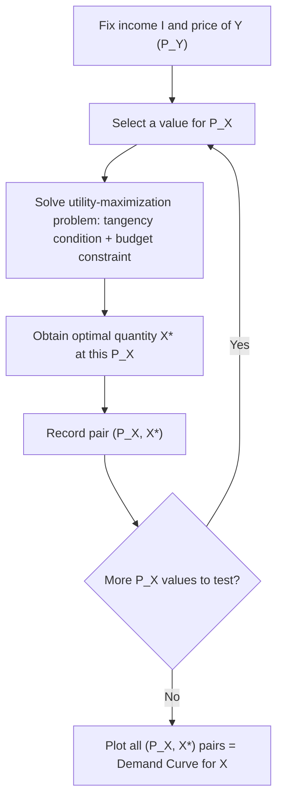

## Deriving the Demand Curve from Utility Maximization

### Overview

The individual demand curve, which shows the quantity of a good a consumer chooses to purchase at each possible price, is not an independent behavioral postulate but is instead formally derived from the consumer's constrained utility-maximization problem. By systematically varying the price of one good while holding income and other prices constant, and tracing the resulting sequence of utility-maximizing bundles, economists can construct the demand curve directly from the more fundamental building blocks of preferences (indifference curves) and the budget constraint.

### The Consumer's Optimization Problem (Starting Point)

**Key Points**

- The derivation begins with the consumer's utility-maximization problem, as established in consumer equilibrium theory:

$$\max_{X,Y} \, U(X, Y) \quad \text{subject to} \quad P_X X + P_Y Y = I$$

- Solving this problem (via the Lagrangian method or direct substitution using the tangency condition $MRS_{XY} = P_X/P_Y$) yields the consumer's **optimal quantity demanded of each good as a function of prices and income**:

$$X^* = X(P_X, P_Y, I)$$

$$Y^* = Y(P_X, P_Y, I)$$

- These functions, $X(P_X, P_Y, I)$ and $Y(P_X, P_Y, I)$, are known as **Marshallian (uncompensated) demand functions**. The individual demand curve for good $X$ is obtained by holding $P_Y$ and $I$ fixed and examining how $X^*$ varies solely as a function of $P_X$.

### Step-by-Step Derivation Process

**Key Points**

**Step 1:** Fix income $I$ and the price of good $Y$, $P_Y$, at specific values.

**Step 2:** Choose a specific value for $P_X$, then solve the consumer's utility-maximization problem (via tangency condition + budget constraint) to find the optimal $X^*$ at that price.

**Step 3:** Repeat Step 2 for a range of different values of $P_X$, generating a series of $(P_X, X^*)$ pairs.

**Step 4:** Plot these $(P_X, X^*)$ pairs, conventionally with price on the vertical axis and quantity on the horizontal axis — this plot is the individual demand curve for good $X$.

### Graphical Derivation: The Price-Consumption Curve (PCC) Method

**Key Points**

- Graphically, the demand curve is derived using the **Price-Consumption Curve (PCC)**: the locus of utility-maximizing tangency points traced out as the price of $X$ varies continuously, holding income and $P_Y$ constant.
- As $P_X$ falls, the budget line rotates outward (pivoting around the fixed vertical intercept $I/P_Y$), and the new tangency points with successively higher indifference curves trace the PCC.
- The horizontal (quantity of $X$) coordinate of each tangency point on the PCC is then transferred down to a separate price-quantity diagram to construct the demand curve.

<svg xmlns="http://www.w3.org/2000/svg" viewBox="0 0 640 620" font-family="Arial, sans-serif">
<text x="320" y="24" text-anchor="middle" font-size="15" font-weight="bold">Deriving the Demand Curve from the Price-Consumption Curve (svg_diagram)</text>

<text x="320" y="50" text-anchor="middle" font-size="13" font-weight="bold">Consumer Optimization (X, Y space)</text>

<line x1="90" y1="280" x2="590" y2="280" stroke="black" stroke-width="2" />

<line x1="90" y1="280" x2="90" y2="60" stroke="black" stroke-width="2" />

<text x="595" y="295" font-size="12">Quantity of X</text>

<text x="55" y="55" font-size="12">Quantity of Y</text>

<line x1="90" y1="90" x2="230" y2="280" stroke="#1f77b4" stroke-width="1.8" />
<line x1="90" y1="90" x2="330" y2="280" stroke="#1f77b4" stroke-width="1.8" />
<line x1="90" y1="90" x2="480" y2="280" stroke="#1f77b4" stroke-width="1.8" />

<path d="M 140,270 C 160,220 190,190 230,180" fill="none" stroke="#d62728" stroke-width="2" />
<path d="M 190,275 C 220,220 270,190 330,175" fill="none" stroke="#2ca02c" stroke-width="2" />
<path d="M 260,278 C 320,220 400,180 480,165" fill="none" stroke="#9467bd" stroke-width="2" />

<circle cx="230" cy="180" r="4" fill="black" />
<circle cx="330" cy="175" r="4" fill="black" />
<circle cx="480" cy="165" r="4" fill="black" />
<path d="M 230,180 L 330,175 L 480,165" fill="none" stroke="orange" stroke-width="2" stroke-dasharray="4,3" />
<text x="485" y="160" font-size="11" fill="orange">Price-Consumption Curve (PCC)</text>

<line x1="230" y1="180" x2="230" y2="280" stroke="gray" stroke-width="1" stroke-dasharray="2,2" />
<line x1="330" y1="175" x2="330" y2="280" stroke="gray" stroke-width="1" stroke-dasharray="2,2" />
<line x1="480" y1="165" x2="480" y2="280" stroke="gray" stroke-width="1" stroke-dasharray="2,2" />

<text x="320" y="330" text-anchor="middle" font-size="13" font-weight="bold">Resulting Demand Curve (P_X, X space)</text>

<line x1="90" y1="580" x2="590" y2="580" stroke="black" stroke-width="2" />

<line x1="90" y1="580" x2="90" y2="360" stroke="black" stroke-width="2" />

<text x="595" y="595" font-size="12">Quantity of X</text>

<text x="55" y="358" font-size="12">Price of X (P_X)</text>

<circle cx="230" cy="410" r="4" fill="black" />
<circle cx="330" cy="470" r="4" fill="black" />
<circle cx="480" cy="540" r="4" fill="black" />
<path d="M 230,410 C 280,440 400,500 480,540" fill="none" stroke="#1f77b4" stroke-width="2.5" />
<text x="485" y="540" font-size="12" fill="#1f77b4">Demand Curve D_X</text>

<line x1="230" y1="280" x2="230" y2="410" stroke="gray" stroke-width="1" stroke-dasharray="2,2" />
<line x1="330" y1="280" x2="330" y2="470" stroke="gray" stroke-width="1" stroke-dasharray="2,2" />
<line x1="480" y1="280" x2="480" y2="540" stroke="gray" stroke-width="1" stroke-dasharray="2,2" />
</svg>

**Key Points**

- As $P_X$ falls (top panel: budget line rotates outward, becoming flatter), the tangency point moves rightward and generally upward to a higher indifference curve, increasing $X^*$ (assuming $X$ is a normal good).
- Transferring each equilibrium quantity down to the price-quantity space (bottom panel) at its corresponding price produces points along the downward-sloping demand curve.

### Numerical Example: Deriving Discrete Points on the Demand Curve

**Example**

Consider a consumer with Cobb-Douglas utility $U(X, Y) = X^{0.4} Y^{0.6}$, income $I = \$100$, and $P_Y = \$5$ fixed. Using the Cobb-Douglas shortcut formula:

$$X^* = \frac{\alpha}{\alpha + \beta} \cdot \frac{I}{P_X} = \frac{0.4}{1.0} \cdot \frac{100}{P_X} = \frac{40}{P_X}$$

**Step 1 — Compute $X^*$ at several values of $P_X$:**

| $P_X$ | $X^* = 40 / P_X$ |
| --- | --- |
| $2 | 20 |
| $4 | 10 |
| $5 | 8 |
| $8 | 5 |
| $10 | 4 |

**Step 2 — Interpret the results:** As $P_X$ rises from $2 to $10, the quantity demanded of $X$ falls monotonically from 20 to 4 units — this table of $(P_X, X^*)$ pairs, when plotted with $P_X$ on the vertical axis and $X^*$ on the horizontal axis, constitutes the individual demand curve for good $X$ for this consumer. Note that in this specific Cobb-Douglas case, the demand function $X^* = 40/P_X$ takes the form of a **rectangular hyperbola**, implying constant expenditure on $X$ (equal to $\alpha \times I = 0.4 \times 100 = \$40$) regardless of the price — a property specific to Cobb-Douglas preferences reflecting **unit price elasticity of demand**. [Inference: this constant-expenditure-share property is a well-known mathematical feature of Cobb-Douglas utility functions specifically, and does not generalize to demand functions derived from other utility function forms, which may exhibit elastic or inelastic demand instead.]

### The Role of the Substitution and Income Effects in Shaping the Demand Curve

**Key Points**

- The overall downward slope of the demand curve, for most goods, reflects the combined action of the substitution effect (which always increases quantity demanded when price falls) and the income effect (whose direction depends on whether the good is normal or inferior).
- For **normal goods**, both effects reinforce each other in the same direction, guaranteeing an unambiguously downward-sloping demand curve.
- For **inferior goods** (but not Giffen goods), the substitution effect dominates the opposing income effect, still producing a downward-sloping — though possibly less steep — demand curve.
- For the rare theoretical case of a **Giffen good**, the income effect dominates the substitution effect, producing the exceptional case of an upward-sloping demand curve — this is why the "Law of Demand" is considered a strong empirical regularity but not a strict mathematical necessity derivable from utility maximization alone without additional assumptions ruling out the Giffen case.

### Marshallian vs. Hicksian (Compensated) Demand Curves

**Key Points**

- The demand curve derived directly from the standard utility-maximization problem (holding nominal income constant as price varies) is called the **Marshallian demand curve** (also called the ordinary or uncompensated demand curve) — this is the standard demand curve typically referenced in introductory analysis.
- An alternative demand curve, called the **Hicksian demand curve** (or compensated demand curve), is derived from a related but distinct optimization problem: minimizing expenditure needed to achieve a *fixed target utility level*, as prices vary:

$$\min_{X,Y} \, P_X X + P_Y Y \quad \text{subject to} \quad U(X, Y) = \bar{U}$$

- The Hicksian demand curve isolates only the pure substitution effect (since utility, not nominal income, is held fixed), and therefore is **always downward sloping**, with no Giffen good exception — differences between Marshallian and Hicksian demand curves are attributable entirely to the income effect.
- [Inference: while the Hicksian demand curve is a standard and rigorously derived theoretical construct in intermediate and advanced microeconomics, it is not directly observable from market data in the same way Marshallian demand is, since it requires holding utility (not directly observable) constant rather than income.]

### From Individual Demand to Market Demand

**Key Points**

- Once an individual demand curve has been derived for each consumer in a market via the above process, the **market demand curve** is obtained by **horizontally summing** the individual demand curves — that is, adding up the total quantity demanded by all consumers at each given price level:

$$Q_{\text{market}}(P) = \sum_{i=1}^{n} X_i(P)$$

- This aggregation step formally connects the microeconomic foundations of individual utility-maximizing behavior to the market-level demand curves typically used in supply-and-demand analysis of price and quantity determination.

### Comparative Statics: Shifts vs. Movements Along the Demand Curve

**Key Points**

- Because the individual demand curve is derived by holding income ($I$) and the price of other goods ($P_Y$) constant while varying only $P_X$, changes in $P_X$ produce **movements along** the existing demand curve.
- Changes in any of the variables held constant during the derivation — income, the price of related goods, or consumer preferences (the underlying utility function itself) — instead cause the **entire demand curve to shift**, since a new set of $(P_X, X^*)$ pairs must be recalculated at the new fixed values of $I$ or $P_Y$.

### Common Misconceptions

**Key Points**

- **Misconception:** "The demand curve is simply a stylized assumption of economic models rather than something formally derivable." — Incorrect; the demand curve is a direct mathematical consequence of solving the consumer's constrained utility-maximization problem across a range of prices.
- **Misconception:** "Marshallian and Hicksian demand curves are identical." — Incorrect; they coincide only in the absence of any income effect (or for infinitesimally small price changes); for goods with meaningful income effects, the two curves differ, with the Hicksian curve isolating the pure substitution effect only.
- **Misconception:** "The Law of Demand (downward-sloping demand) is a mathematical certainty proven directly from utility maximization." — Incorrect; downward-sloping demand holds for the vast majority of real-world goods (normal and most inferior goods) but is not a strict logical necessity, as the Giffen good case demonstrates theoretically.

### Conclusion

The individual demand curve, rather than being an independent primitive assumption, is formally derived from the consumer's utility-maximization problem by systematically varying the price of one good while holding income and other prices constant, and tracing the resulting price-consumption curve of tangency points. This derivation reveals that the shape and slope of the demand curve is governed by the interaction of substitution and income effects, explains the theoretical (though rare) possibility of Giffen goods, and provides the crucial conceptual link between individual consumer optimization and the market-level demand curves used throughout applied microeconomic and market analysis.

**Related Topics**

- Consumer equilibrium and the tangency condition
- Income and substitution effects
- Price-Consumption Curve and Income-Consumption Curve
- Marshallian vs. Hicksian demand functions
- Giffen goods and exceptions to the law of demand
- Market demand and horizontal summation of individual demand curves
- Price elasticity of demand
- Cobb-Douglas utility functions and demand properties
- Consumer surplus derivation from the demand curve