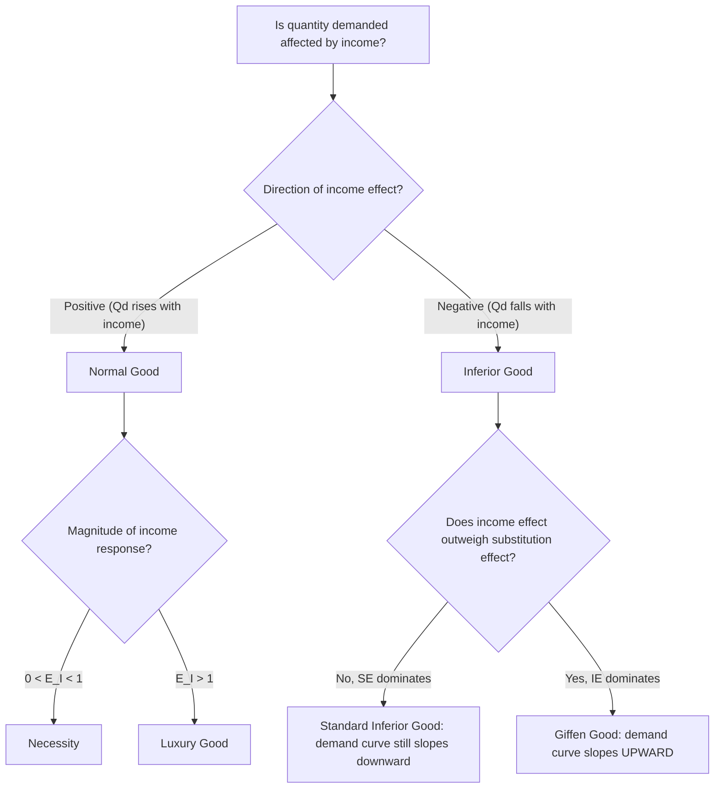

## Normal, Inferior, and Giffen Goods

### Overview

Goods are classified according to how quantity demanded responds to changes in a consumer's income, holding prices constant. This classification — normal, inferior, and the special case of Giffen goods — is fundamental to consumer theory, providing the conceptual link between income effects, Engel curves, and demand curve behavior, and explaining important theoretical exceptions to the standard law of demand.

### Normal Goods

**Key Points**

- A **normal good** is a good for which quantity demanded **increases** as consumer income increases (holding prices constant), and decreases as income falls.
- Formally, a good is normal if:

$$\frac{\partial X}{\partial I} > 0$$

- Normal goods are further subdivided based on the magnitude of their income responsiveness (income elasticity of demand, $E_I$):
  - **Necessities** (or necessary goods): $0 < E_I < 1$ — quantity demanded rises with income, but proportionally less than the rise in income (e.g., basic groceries, utilities).
  - **Luxury goods** (or superior goods): $E_I > 1$ — quantity demanded rises more than proportionally with income (e.g., international travel, luxury vehicles, fine dining).
- Most goods in a typical consumer's budget are normal goods.

### Inferior Goods

**Key Points**

- An **inferior good** is a good for which quantity demanded **decreases** as consumer income increases (holding prices constant), and increases as income falls.
- Formally, a good is inferior if:

$$\frac{\partial X}{\partial I} < 0$$

- Inferior goods are typically goods that consumers substitute away from as they can afford higher-quality or more preferred alternatives — classic textbook examples include instant noodles, low-cost ground meat substitutes, or public transportation in contexts where consumers switch to private vehicles as income rises. [Inference: whether a specific good is normal or inferior is not an intrinsic physical property of the good itself, but depends on the preferences of the population being studied and the income range under consideration — a good can be inferior for one consumer or income bracket and normal for another.]
- Being inferior does not imply the good is low-quality or undesirable in an absolute sense — it strictly describes an empirical relationship between income and quantity demanded for a specific consumer or population.

### Graphical Illustration: Engel Curves for Normal vs. Inferior Goods

<svg xmlns="http://www.w3.org/2000/svg" viewBox="0 0 640 460" font-family="Arial, sans-serif">
<text x="320" y="24" text-anchor="middle" font-size="15" font-weight="bold">Engel Curves: Normal vs. Inferior Goods (svg_diagram)</text>

<text x="180" y="55" text-anchor="middle" font-size="13" font-weight="bold">Normal Good</text>

<line x1="90" y1="380" x2="290" y2="380" stroke="black" stroke-width="2" />

<line x1="90" y1="380" x2="90" y2="70" stroke="black" stroke-width="2" />

<text x="290" y="400" font-size="11">Quantity of X</text>

<text x="55" y="65" font-size="11">Income (I)</text>

<path d="M 100,360 C 150,280 200,180 260,100" fill="none" stroke="`#1f77b4`" stroke-width="2.5" />

<text x="150" y="130" font-size="11" fill="`#1f77b4`">Engel curve slopes upward throughout</text>

<text x="480" y="55" text-anchor="middle" font-size="13" font-weight="bold">Inferior Good</text>

<line x1="390" y1="380" x2="590" y2="380" stroke="black" stroke-width="2" />

<line x1="390" y1="380" x2="390" y2="70" stroke="black" stroke-width="2" />

<text x="590" y="400" font-size="11">Quantity of X</text>

<text x="355" y="65" font-size="11">Income (I)</text>

<path d="M 400,360 C 440,280 470,220 500,190 C 530,215 560,260 580,330" fill="none" stroke="`#d62728`" stroke-width="2.5" />

<circle cx="500" cy="190" r="4" fill="`#d62728`" />

<text x="420" y="420" font-size="10" fill="`#d62728`">Rises at low income (normal range), then falls at higher income (inferior range) past the turning point</text>

</svg>

**Key Points**

- A good's Engel curve (relating income to quantity demanded, holding prices fixed) can exhibit **both** normal and inferior behavior across different income ranges: many goods behave as normal goods at lower income levels and become inferior once income rises past a certain threshold (as illustrated in the "Inferior Good" panel, where the curve turns backward after the peak).

### Income Elasticity of Demand and Good Classification

**Key Points**

- The formal classification of goods relies on the **income elasticity of demand**:

$$E_I = \frac{\% \Delta Q_d}{\% \Delta I} = \frac{\partial Q_d}{\partial I} \times \frac{I}{Q_d}$$

| Income Elasticity Range | Classification |
| --- | --- |
| $E_I < 0$ | Inferior good |
| $0 < E_I < 1$ | Normal good — necessity |
| $E_I > 1$ | Normal good — luxury |
| $E_I = 0$ | Neutral good (demand unaffected by income) |

### Giffen Goods: The Extreme Special Case

**Key Points**

- A **Giffen good** is a very specific, extreme sub-category of inferior good for which the **substitution effect is outweighed by the income effect**, causing the good's quantity demanded to move in the *same direction* as its own price — producing an **upward-sloping demand curve**, in direct violation of the standard law of demand.
- **Conditions required for a Giffen good to occur** (all must generally hold simultaneously):
  1. The good must be **strongly inferior** (a large, negative income effect).
  2. The good must occupy a **very large share of the consumer's total budget** (so that a price change produces a substantial real-income effect).
  3. There must be **limited availability of close substitutes**, so the substitution effect (which always pushes in the standard direction) remains relatively small in magnitude.
- Because all three conditions must hold simultaneously and to a significant degree, Giffen goods are considered a rare theoretical curiosity rather than a commonly observed empirical phenomenon.

### Why Every Giffen Good Is Inferior, But Not Every Inferior Good Is Giffen

**Key Points**

- All Giffen goods are, by definition, inferior goods — since the defining feature of a Giffen good (income effect outweighing substitution effect and reversing the total effect) *requires* a negative income effect, which is the defining property of any inferior good.
- However, most inferior goods are **not** Giffen goods, because for a typical inferior good, the (negative) income effect is smaller in magnitude than the (always quantity-increasing-when-price-falls) substitution effect — the substitution effect dominates, so demand still slopes downward overall, just less steeply than it would for an equivalent normal good.
- A Giffen good therefore represents the extreme tail case within the broader category of inferior goods.

### The Classic Historical Illustration of a Giffen Good

**Key Points**

- The theoretical Giffen good scenario is traditionally illustrated using a hypothetical example of a dietary staple food (historically often illustrated using a basic starch such as bread or potatoes) consumed heavily by very poor households.
- **Illustrative logic**: If the price of the staple food rises, extremely poor households — who spend a very large share of their limited income on this staple — experience a substantial fall in real income. This large negative income effect may force them to cut back on more expensive foods (such as meat) and instead purchase even *more* of the now-more-expensive staple simply to maintain minimally adequate caloric intake, since the staple remains their cheapest source of calories despite the price increase.
- [Unverified: while this logical mechanism is widely used as a pedagogical illustration in economics textbooks, rigorous, unambiguous empirical confirmation of specific real-world Giffen goods is considered rare and has historically been a subject of academic debate; some empirical studies conducted in specific developing-region contexts have reported price-quantity relationships broadly consistent with Giffen behavior for certain staple foods, though such findings are context-specific and not considered universally generalizable.]

### Distinguishing Giffen Goods from Veblen Goods

**Key Points**

- Giffen goods are sometimes confused with **Veblen goods**, but the two phenomena arise from entirely different underlying mechanisms:
  - **Giffen goods** produce an apparent upward-sloping demand curve due to the **income effect** dominating the substitution effect within standard utility-maximizing behavior (no change in preferences is required).
  - **Veblen goods** (associated with conspicuous consumption) exhibit apparent upward-sloping demand because the good's **price itself directly enters the consumer's utility function** as a signal of status or exclusivity — a higher price literally makes the good more desirable to certain consumers, independent of any income effect mechanism.
- Both are theoretical exceptions to the standard law of demand, but they operate through conceptually distinct channels (real-income effects vs. price-as-status-signal preferences).

### Effect on the Slutsky Equation

**Key Points**

- Recall the Slutsky equation decomposing the total price effect:

$$\frac{\partial X}{\partial P_X}\bigg|_{\text{total}} = \underbrace{\frac{\partial X}{\partial P_X}\bigg|_{\text{compensated}}}_{\text{always} \leq 0} \; - \; \underbrace{X \cdot \frac{\partial X}{\partial I}}_{\text{income effect term}}$$

- For a **normal good**: $\frac{\partial X}{\partial I} > 0$, so the income effect term is negative, reinforcing the (already negative) substitution effect — guaranteeing an unambiguously downward-sloping demand curve.
- For a **standard inferior good**: $\frac{\partial X}{\partial I} < 0$, making the income effect term positive, but of smaller magnitude than the negative substitution effect term — net effect remains negative (demand still slopes downward, but less steeply).
- For a **Giffen good**: $\frac{\partial X}{\partial I} < 0$ and sufficiently large in magnitude that the (positive) income effect term outweighs the (negative) substitution effect term — net effect becomes positive, producing upward-sloping demand.

### Numerical Illustration

**Example**

Suppose for a particular consumer, a $1 decrease in the price of good $X$ produces the following decomposition (using the Hicksian/Slutsky method) under three different hypothetical scenarios for the same nominal price change:

| Scenario | Substitution Effect (SE) | Income Effect (IE) | Total Effect (TE = SE + IE) | Classification |
| --- | --- | --- | --- | --- |
| A | +8 units | +5 units | +13 units | Normal good |
| B | +8 units | −3 units | +5 units | Inferior good (standard) |
| C | +8 units | −11 units | −3 units | Giffen good |

In Scenario A, both effects reinforce (normal good). In Scenario B, the effects oppose but the substitution effect dominates, so quantity still rises overall despite the price fall — standard inferior good behavior. In Scenario C, the income effect's magnitude (−11) exceeds the substitution effect's magnitude (+8), so total quantity demanded *falls* despite the price decrease — the hallmark of Giffen good behavior.

### Common Misconceptions

**Key Points**

- **Misconception:** "An inferior good is a low-quality or poorly-made product." — Incorrect; "inferior" in this context is a strict technical term referring only to the negative relationship between income and quantity demanded, carrying no connotation about physical quality.
- **Misconception:** "All inferior goods violate the law of demand." — Incorrect; only the extreme Giffen good sub-case violates the standard downward-sloping demand relationship; most inferior goods still exhibit standard downward-sloping demand, just with a weaker response to price changes than an equivalent normal good would show.
- **Misconception:** "Whether a good is normal or inferior is a fixed, universal property of that specific good." — Incorrect; classification can vary by consumer, by income level/range, and by context, since it depends on the underlying preference structure of the population being studied, not solely on the physical characteristics of the good.

### Conclusion

The classification of goods as normal, inferior, or (in the extreme case) Giffen provides a critical link between income effects and observed consumer demand behavior. Normal goods see quantity demanded rise with income, inferior goods see it fall, and the rare Giffen good represents the specific case where a strong negative income effect for a heavily-budgeted, substitute-poor staple good overwhelms the standard substitution effect, producing the theoretically important but empirically uncommon exception of an upward-sloping demand curve. This framework, formalized through income elasticity of demand and the Slutsky equation, is essential for understanding Engel curves, the shape of demand curves, and the theoretical boundaries of the law of demand.

**Related Topics**

- Income and substitution effects
- Income elasticity of demand in depth
- Engel curves and their derivation
- The Slutsky equation
- Giffen goods vs. Veblen goods
- Deriving the demand curve from utility maximization
- The law of demand and its theoretical exceptions
- Necessities vs. luxury goods classification
- Consumer equilibrium and comparative statics