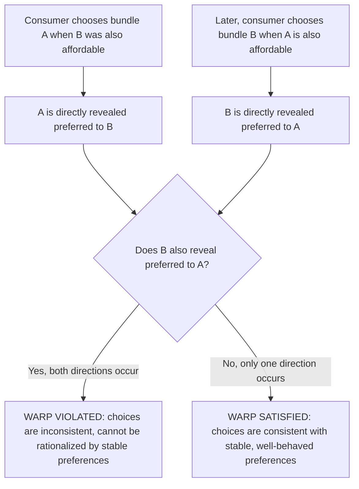
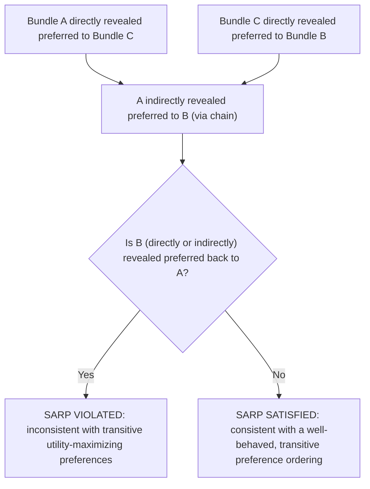

## Revealed Preference Theory

### Overview

Revealed preference theory is an approach to consumer theory that infers a consumer's underlying preferences from their **observed purchasing behavior** across different price and income situations, rather than assuming a specific utility function or indifference map from the outset. Developed to place consumer theory on a more empirically grounded, testable foundation, revealed preference theory allows economists to test the internal consistency of observed consumer choices without requiring direct knowledge or measurement of utility.

### Motivation and Core Idea

**Key Points**

- Traditional consumer theory typically begins with an assumed utility function or indifference map and *derives* predicted consumer behavior (demand functions) as an output.
- Revealed preference theory inverts this logic: it starts from **actually observed choices** (what bundles a consumer purchased at various prices and income levels) and asks what these choices imply about the consumer's underlying preference ordering — and crucially, whether those implied preferences are even **internally consistent**.
- The central premise is that if a consumer chooses bundle $A$ when bundle $B$ was also affordable (i.e., $B$ was within their budget set at the time), the consumer's choice of $A$ over the available alternative $B$ **reveals** that $A$ is preferred to $B$.

### The Concept of Direct Revealed Preference

**Key Points**

- Bundle $A$ is said to be **directly revealed preferred** to bundle $B$ if, at some point, the consumer purchased bundle $A$ when bundle $B$ was also affordable within the same budget constraint:

$$\text{If } P_A \cdot A \geq P_A \cdot B \text{ and the consumer chose } A, \text{ then } A \text{ is revealed preferred to } B$$

- More formally, using price vector $P^0$ and chosen bundle $X^0$: if a bundle $X^1$ satisfies $P^0 \cdot X^0 \geq P^0 \cdot X^1$ (meaning $X^1$ was affordable under the prices and income that prevailed when $X^0$ was actually chosen), then $X^0$ is directly revealed preferred to $X^1$.

### The Weak Axiom of Revealed Preference (WARP)

**Key Points**

- The **Weak Axiom of Revealed Preference (WARP)** is the foundational consistency requirement of revealed preference theory. It states:

> If bundle $A$ is directly revealed preferred to bundle $B$ (i.e., $A$ was chosen when $B$ was also affordable), then it must **never** be the case that $B$ is also directly revealed preferred to $A$ (i.e., $B$ must never be chosen in some other situation where $A$ was also affordable).

- In plain terms: **a consumer's choices must not contradict themselves** — if you chose $A$ over an available $B$ once, you cannot later choose $B$ over an available $A$; doing so exposes an inconsistency in the underlying preference ordering implied by the observed choices.
- WARP is a **necessary condition** for behavior to be consistent with an underlying, well-behaved utility-maximization framework — if a set of observed choices violates WARP, those choices **cannot** be rationalized by any single, consistent set of stable preferences.

### Numerical Example: Testing WARP

**Example**

Suppose a consumer's income and the prices of goods $X$ and $Y$ change across two observed situations:

**Situation 1:** Prices $(P_X, P_Y) = (2, 2)$; consumer chooses bundle $A = (X=6, Y=2)$.

**Situation 2:** Prices $(P_X, P_Y) = (1, 3)$; consumer chooses bundle $B = (X=3, Y=5)$.

**Step 1 — Check if $B$ was affordable in Situation 1** (using Situation 1 prices):

$$P_X^{(1)} \cdot X_B + P_Y^{(1)} \cdot Y_B = 2(3) + 2(5) = 6 + 10 = 16$$

$$P_X^{(1)} \cdot X_A + P_Y^{(1)} \cdot Y_A = 2(6) + 2(2) = 12 + 4 = 16$$

Since the cost of $B$ at Situation 1 prices ($16$) equals the cost of $A$ at Situation 1 prices ($16$), bundle $B$ was exactly affordable when $A$ was chosen. Therefore, **$A$ is directly revealed preferred to $B$**.

**Step 2 — Check if $A$ was affordable in Situation 2** (using Situation 2 prices):

$$P_X^{(2)} \cdot X_A + P_Y^{(2)} \cdot Y_A = 1(6) + 3(2) = 6 + 6 = 12$$

$$P_X^{(2)} \cdot X_B + P_Y^{(2)} \cdot Y_B = 1(3) + 3(5) = 3 + 15 = 18$$

Since income in Situation 2 must equal at least the cost of the chosen bundle $B$ ($18$), and bundle $A$ costs only $12$ at Situation 2 prices, bundle $A$ **was also affordable** in Situation 2 — yet the consumer chose $B$ instead. Therefore, **$B$ is directly revealed preferred to $A$**.

**Step 3 — Conclusion:** Since $A$ is revealed preferred to $B$ (Step 1) **and** $B$ is revealed preferred to $A$ (Step 2), this consumer's observed choices **violate WARP** — these two choices cannot be rationalized by any single, stable, well-behaved set of underlying preferences.

### The Strong Axiom of Revealed Preference (SARP)

**Key Points**

- While WARP handles direct comparisons between two bundles, real-world consumer choice data often involves **chains** of comparisons across many different bundles and price situations.
- The **Strong Axiom of Revealed Preference (SARP)** extends the consistency requirement to **indirect** revealed preference relationships formed through such chains: if $A$ is (directly or indirectly, via a chain of intermediate bundles) revealed preferred to $B$, then $B$ must never be (directly or indirectly) revealed preferred back to $A$.
- **Indirect revealed preference example:** If $A$ is directly revealed preferred to $C$, and $C$ is directly revealed preferred to $B$, then $A$ is *indirectly* revealed preferred to $B$ (through the transitive chain $A \to C \to B$), even if $A$ and $B$ were never directly compared against each other in a single observed choice situation.
- **SARP is both necessary and sufficient** for a finite set of observed choice data to be consistent with utility maximization based on transitive preferences — WARP alone is necessary but not always sufficient once three or more bundles are involved, since WARP only checks pairwise direct comparisons and can, in some cases with three or more goods, fail to detect certain inconsistencies arising specifically through indirect, multi-step chains. [Inference: this distinction between the necessity of WARP and the necessity-and-sufficiency of SARP is a well-established formal result in revealed preference theory, particularly relevant for choice sets involving three or more goods.]

### Why Revealed Preference Theory Matters: Testability

**Key Points**

- One of the primary contributions of revealed preference theory is that it provides a way to **empirically test** whether observed consumer behavior is consistent with the standard utility-maximization framework, using only **observable data** (prices and quantities purchased) — without needing to measure or assume a specific cardinal or ordinal utility function.
- This addresses a foundational methodological concern in economics: utility itself is not directly observable or measurable, but the *implications* of utility-maximizing behavior (namely, the consistency requirements captured by WARP and SARP) can be tested directly against real-world purchasing data.
- If observed data satisfies SARP, revealed preference theory guarantees that **some** well-behaved (complete, transitive) utility function exists that could have generated those exact observed choices — even though the specific form of that utility function remains unidentified without further assumptions.

### Recovering Indifference Curves from Revealed Preference

**Key Points**

- Beyond consistency testing, revealed preference theory can also be used constructively to **approximate** portions of a consumer's underlying indifference curve using only observed choice data, without requiring direct knowledge of the utility function.
- Given a single observed choice (bundle $A$ chosen at prices $P^0$), any bundle *more expensive* than $A$ at those same prices is presumed to be preferred to $A$ (since the consumer could have purchased it but did not — actually, more precisely, any bundle costing strictly less than $A$ that was *not* chosen must be *revealed less preferred*, while any bundle costing *more* than the consumer's budget cannot be directly ranked from this single observation alone).
- By combining multiple observed choices across different price and income scenarios, economists can progressively narrow down the region within which the true indifference curve through a given bundle must lie, constructing an increasingly precise "revealed preference envelope" without ever needing to specify a parametric utility function.

### Relationship to Traditional Utility-Based Consumer Theory

**Key Points**

- Revealed preference theory and traditional utility-function-based consumer theory (indifference curves, marginal utility, consumer equilibrium) are **complementary and mutually consistent** frameworks, not competing theories with different predictions.
- A key theoretical result (established in foundational work on revealed preference, notably associated with economists such as Paul Samuelson and later extended by Hendrik Houthakker) demonstrates that satisfying SARP is **equivalent** to the existence of a well-behaved utility function that rationalizes the observed choice data — effectively proving that the revealed preference approach and the traditional utility-maximization approach are two different but ultimately equivalent ways of characterizing the same underlying rational consumer behavior.
- This equivalence is philosophically significant: it shows that assuming a utility function is not strictly *necessary* to derive the standard, testable predictions of consumer theory — those predictions can instead be derived directly from minimal, directly observable consistency axioms on choice behavior.

### Practical and Empirical Applications

**Key Points**

- Revealed preference theory is applied in **empirical demand analysis** to test whether real-world household expenditure survey data is consistent with rational utility-maximizing behavior, without needing to specify (and potentially mis-specify) a particular parametric utility function in advance.
- It is also used in constructing and validating **cost-of-living index numbers** (such as evaluating whether a given price index over- or under-states the true change in the cost of maintaining a constant standard of living), since revealed preference bounds can be used to bracket the true compensating variation using only observable price and expenditure data.
- Revealed preference logic underlies certain **welfare analysis techniques**, providing bounds on how a consumer's well-being has changed in response to price changes using only observable purchasing decisions, again without requiring a fully specified utility function.

### Limitations of Revealed Preference Theory

**Key Points**

- Revealed preference analysis requires observing a consumer's choices across **multiple different price/income scenarios** to generate meaningful testable implications — a single observed choice alone carries very limited information.
- The theory assumes **stable preferences** over the period during which multiple choice observations are collected; if genuine preference change occurs between observations (rather than mere inconsistency), apparent WARP or SARP violations may reflect legitimate preference evolution rather than true "irrationality."
- Revealed preference theory, by itself, does not identify a **unique** utility function consistent with the data — it only establishes that *some* well-behaved utility function exists (when SARP holds); pinning down cardinal magnitudes or a single specific functional form requires additional assumptions beyond the revealed preference framework itself.

### Common Misconceptions

**Key Points**

- **Misconception:** "Revealed preference theory proves what a consumer's exact utility function is." — Incorrect; it only tests whether observed choices are *consistent with the existence of* some well-behaved utility function, without identifying a unique specific function.
- **Misconception:** "WARP and SARP are the same requirement." — Incorrect; WARP only rules out direct pairwise inconsistencies between two bundles, while SARP additionally rules out inconsistencies arising through longer, indirect chains of comparisons across three or more bundles — SARP is the fully sufficient condition, while WARP alone is necessary but can be insufficient in more complex cases.
- **Misconception:** "A WARP or SARP violation always means the consumer is behaving irrationally in a psychological sense." — Incorrect; a violation strictly indicates that the *observed choices* are inconsistent with a single stable set of underlying preferences over the observation period; this could reflect measurement error, genuine preference change over time, or other factors, rather than necessarily reflecting irrational psychological decision-making at any single point in time.

### Conclusion

Revealed preference theory offers a foundational alternative (and complementary) approach to consumer theory by deriving testable consistency requirements — the Weak and Strong Axioms of Revealed Preference — directly from observable consumer purchasing behavior, without requiring an assumed utility function as a starting point. By establishing that satisfying these axioms is equivalent to the existence of a well-behaved, utility-maximizing preference structure, revealed preference theory provides both a rigorous empirical test of consumer rationality and a constructive method for approximating indifference curves and welfare measures using only observable price and quantity data, cementing its role as a cornerstone of empirically grounded microeconomic theory.

**Related Topics**

- Indifference curves and their properties
- Consumer equilibrium and utility maximization
- The Slutsky equation and income/substitution effects
- Marshallian vs. Hicksian demand functions
- Consumer welfare measurement (compensating and equivalent variation)
- Cost-of-living index numbers and their construction
- Axioms of rational preference (completeness, transitivity, non-satiation)
- Empirical demand estimation techniques