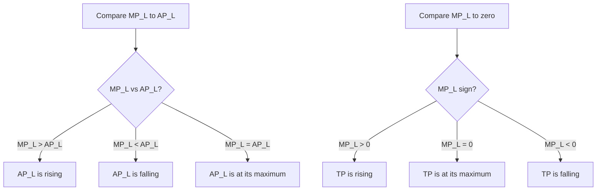

## Production Function and Inputs

### Overview

A production function describes the maximum quantity of output a firm can produce from a given combination of inputs (factors of production), given the current state of technology. It formalizes the technical relationship between inputs — such as labor and capital — and the resulting output, forming the foundational building block of production theory, just as the utility function is the foundational building block of consumer theory. Production functions underlie the derivation of cost curves, firm supply decisions, and the analysis of returns to scale.

### Formal Definition

**Key Points**

- A production function is generally expressed as:

$$Q = f(L, K)$$

where $Q$ is the quantity of output produced, $L$ is the quantity of labor employed, and $K$ is the quantity of capital employed (the two most commonly modeled inputs in introductory production theory, though the framework extends to any number of inputs).

- The production function represents the **maximum** technically feasible output obtainable from a given combination of inputs — it assumes technical efficiency, meaning no input combination could produce more output using the same or fewer resources.
- The production function is a purely **technical** (engineering) relationship; it does not incorporate prices, costs, or profit considerations directly — those are introduced separately when deriving cost functions and profit-maximizing input choices.

### Categories of Inputs (Factors of Production)

**Key Points**

- Inputs to production are traditionally classified into broad categories:
  - **Labor (L):** Human effort, both physical and mental, applied to production.
  - **Capital (K):** Physical capital goods — machinery, equipment, buildings, and tools used in production (distinct from financial capital/money).
  - **Land/Natural Resources:** Raw materials and naturally occurring resources used as inputs.
  - **Entrepreneurship:** The organizational and risk-bearing input that combines the other factors of production (often treated implicitly rather than modeled explicitly in basic production functions).
- Most introductory production theory simplifies analysis to a **two-input model** (typically labor and capital), since this allows the full graphical apparatus of isoquants and isocost lines to be used, while still capturing the essential trade-offs firms face.

### Fixed vs. Variable Inputs and the Short Run vs. Long Run

**Key Points**

- The distinction between **fixed** and **variable** inputs is tied to the economic (not calendar) time horizon under consideration:
  - **Fixed inputs** cannot be adjusted within the time period being analyzed (e.g., a factory building or major machinery in the short run).
  - **Variable inputs** can be freely adjusted within the time period being analyzed (e.g., labor hours, raw materials).
- The **short run** is defined as the time period during which at least one input is fixed (commonly capital, in the standard textbook model) — the firm can only adjust the variable input(s), typically labor.
- The **long run** is defined as the time period during which **all** inputs are variable — the firm has full flexibility to adjust every factor of production, including capital.
- **Key distinction:** The short run and long run are not fixed calendar durations (e.g., "one year") — they are firm- and industry-specific economic concepts defined entirely by which inputs remain fixed versus variable. [Inference: the specific calendar time corresponding to the "long run" varies substantially across industries — a small retail business may reach its long run (able to adjust all inputs, including physical space) in a matter of months, while a large-scale utility or manufacturing plant may take years to fully adjust major capital infrastructure.]

### The Short-Run Production Function

**Key Points**

- In the short run, with capital $\bar{K}$ fixed, the production function simplifies to a function of the single variable input, labor:

$$Q = f(L, \bar{K})$$

- This short-run production function is used to derive the concepts of **Total Product (TP)**, **Marginal Product (MP)**, and **Average Product (AP)** of the variable input.

### Total, Marginal, and Average Product

**Key Points**

- **Total Product (TP):** The total quantity of output produced by a given quantity of the variable input (labor), holding the fixed input (capital) constant. This is simply the short-run production function itself: $TP = Q = f(L, \bar{K})$.
- **Marginal Product of Labor (MPL):** The additional output produced by employing one additional unit of labor, holding capital fixed:

$$MP_L = \frac{\Delta TP}{\Delta L} = \frac{\partial Q}{\partial L}$$

- **Average Product of Labor (APL):** The output produced per unit of labor employed:

$$AP_L = \frac{TP}{L} = \frac{Q}{L}$$

### Numerical Example: TP, MP, and AP Schedule

**Example**

Consider a firm with fixed capital $\bar{K}$, producing output according to the following short-run schedule as labor varies:

| Labor (L) | Total Product (TP) | Marginal Product (MP) | Average Product (AP) |
| --- | --- | --- | --- |
| 0 | 0 | — | — |
| 1 | 10 | 10 | 10.0 |
| 2 | 24 | 14 | 12.0 |
| 3 | 39 | 15 | 13.0 |
| 4 | 52 | 13 | 13.0 |
| 5 | 60 | 8 | 12.0 |
| 6 | 63 | 3 | 10.5 |
| 7 | 63 | 0 | 9.0 |
| 8 | 60 | -3 | 7.5 |

Marginal product is calculated as the change in TP between successive labor units (e.g., $MP_L$ at $L=3$ is $39 - 24 = 15$). Average product is TP divided by L at each level (e.g., $AP_L$ at $L=3$ is $39/3 = 13.0$).

### The Law of Diminishing Marginal Returns

**Key Points**

- The **Law of Diminishing Marginal Returns** (also called the Law of Diminishing Marginal Product) states that as increasing quantities of a variable input are added to a fixed input, the marginal product of the variable input will eventually decline, holding technology constant.
- This law does not claim marginal product declines from the very first unit — as shown in the numerical example above, MP can initially *rise* (increasing marginal returns, from $L=1$ to $L=3$) before eventually declining (diminishing marginal returns, from $L=4$ onward) — the law specifically describes the **eventual** decline, not an immediate one.
- **Economic intuition:** With a fixed amount of capital (e.g., machinery, floor space), each additional unit of labor has progressively less fixed capital to work with, eventually reducing the additional output each new worker can contribute — a form of "crowding" that becomes more severe as more labor is added to unchanging fixed resources.

### Relationship Between TP, MP, and AP Curves

<svg xmlns="http://www.w3.org/2000/svg" viewBox="0 0 640 500" font-family="Arial, sans-serif">
<text x="320" y="24" text-anchor="middle" font-size="15" font-weight="bold">Total, Marginal, and Average Product Curves (svg_diagram)</text>

<text x="320" y="50" text-anchor="middle" font-size="13" font-weight="bold">Total Product (TP)</text>

<line x1="90" y1="190" x2="580" y2="190" stroke="black" stroke-width="2" />

<line x1="90" y1="190" x2="90" y2="60" stroke="black" stroke-width="2" />

<text x="585" y="205" font-size="11">Labor (L)</text>

<path d="M 90,190 C 160,120 220,80 300,68 C 380,60 440,70 520,110" fill="none" stroke="`#1f77b4`" stroke-width="2.5" />

<circle cx="300" cy="68" r="4" fill="`#1f77b4`" />

<line x1="300" y1="68" x2="300" y2="190" stroke="gray" stroke-dasharray="3,3" />

<text x="305" y="205" font-size="10">L* (TP max)</text>

<text x="320" y="250" text-anchor="middle" font-size="13" font-weight="bold">Marginal Product (MP) and Average Product (AP)</text>

<line x1="90" y1="440" x2="580" y2="440" stroke="black" stroke-width="2" />

<line x1="90" y1="440" x2="90" y2="270" stroke="black" stroke-width="2" />

<text x="585" y="455" font-size="11">Labor (L)</text>

<line x1="90" y1="400" x2="580" y2="400" stroke="gray" stroke-width="1" stroke-dasharray="2,2" />

<text x="60" y="404" font-size="10">0</text>

<path d="M 90,380 C 160,300 220,290 260,300 C 300,320 400,395 300,400 C 340,395 440,410 520,430" fill="none" stroke="`#d62728`" stroke-width="2.5" />

<path d="M 90,390 C 150,320 210,300 250,305 C 320,320 300,400 400,410 C 440,415 480,425 520,432" fill="none" stroke-opacity="0" />

<path d="M 90,385 C 140,320 200,295 250,300 C 300,308 300,400 300,400 C 350,405 440,420 520,432" fill="none" stroke="`#d62728`" stroke-width="2.5" />

<text x="530" y="432" font-size="11" fill="`#d62728`">MP</text>

<path d="M 90,395 C 170,340 260,325 320,325 C 400,325 460,345 520,375" fill="none" stroke="`#2ca02c`" stroke-width="2.5" />

<text x="525" y="375" font-size="11" fill="`#2ca02c`">AP</text>

<circle cx="320" cy="325" r="4" fill="black" />
<text x="270" y="315" font-size="10">MP = AP at AP's maximum</text>
<circle cx="300" cy="400" r="4" fill="black" />
<text x="240" y="420" font-size="10">MP = 0 at TP maximum (L*)</text>
</svg>

**Key Points — The Three-Way Relationship:**

- **When $MP_L > AP_L$:** average product is rising (each additional worker contributes more than the current average, pulling the average up).
- **When $MP_L < AP_L$:** average product is falling (each additional worker contributes less than the current average, pulling the average down).
- **When $MP_L = AP_L$:** average product is at its **maximum** point — this is a general mathematical property (the marginal curve always crosses the average curve at the average curve's peak).
- **When $MP_L = 0$:** total product is at its **maximum** point.
- **When $MP_L < 0$:** total product is declining (adding more labor actually reduces total output — often due to genuine overcrowding or interference among workers given fixed capital).

### The Three Stages of Production

**Key Points**

- Short-run production is often divided into three conceptual stages based on the behavior of average and marginal product:

**Stage I:** From zero labor up to the point where $AP_L$ reaches its maximum (where $MP_L = AP_L$). In this stage, both $MP_L$ and $AP_L$ are generally rising or $MP_L$ remains above $AP_L$ — the fixed input is being underutilized relative to the variable input, so firms would rationally continue adding labor.

**Stage II:** From the point where $AP_L$ is at its maximum to the point where $MP_L = 0$ (TP is at its maximum). In this stage, $MP_L$ is positive but declining, and $MP_L < AP_L$. **Stage II is considered the economically rational range of production** — firms operating efficiently are expected to choose an input level within this stage.

**Stage III:** Beyond the point where $MP_L = 0$ — in this stage, $MP_L$ is negative, and adding more labor actually reduces total output. No rational, profit-maximizing firm would operate in Stage III, since a firm could produce the same (or more) output using less labor (and thus lower cost) by simply reducing employment.

- [Inference: the "rational Stage II" framework is a standard and widely taught result in production theory; it assumes labor has a positive cost (wage), such that no firm would rationally pay for labor whose marginal product is negative, or fail to expand employment within Stage I where doing so clearly increases both total and average output.]

### Long-Run Production and Returns to Scale

**Key Points**

- In the long run, since **all** inputs are variable, the relevant concept shifts from diminishing marginal returns (a short-run phenomenon tied to a fixed input) to **returns to scale** — how output responds when **all** inputs are increased proportionally together.
- Formally, for a production function $Q = f(L, K)$, if all inputs are scaled by a positive constant $t > 1$:

$$f(tL, tK) = t^h \cdot f(L, K)$$

- If $h > 1$: **Increasing returns to scale** — output more than proportionally increases (e.g., doubling all inputs more than doubles output).
- If $h = 1$: **Constant returns to scale** — output increases exactly proportionally (e.g., doubling all inputs exactly doubles output).
- If $h < 1$: **Decreasing returns to scale** — output less than proportionally increases (e.g., doubling all inputs less than doubles output).

### Common Production Function Forms

**Key Points**

**Cobb-Douglas Production Function:**

$$Q = A L^{\alpha} K^{\beta}$$

where $A$ is a total factor productivity parameter, and $\alpha, \beta$ are output elasticities with respect to labor and capital, respectively. The returns-to-scale classification for a Cobb-Douglas function is determined directly by the sum $\alpha + \beta$: increasing returns if $\alpha + \beta > 1$, constant returns if $\alpha + \beta = 1$, decreasing returns if $\alpha + \beta < 1$.

**Leontief (Fixed-Proportions) Production Function:**

$$Q = \min(aL, bK)$$

Inputs must be used in a fixed ratio; increasing only one input without the other produces no additional output — analogous in shape to the perfect-complements utility function in consumer theory.

**Linear (Perfect Substitutes) Production Function:**

$$Q = aL + bK$$

Inputs can be substituted for each other at a constant, fixed rate — analogous to the perfect-substitutes utility function in consumer theory.

### Isoquants: The Production-Theory Analogue of Indifference Curves

**Key Points**

- An **isoquant** is the production-theory equivalent of an indifference curve: it represents all combinations of labor and capital that produce the **same level of output**.
- Well-behaved isoquants (for standard, smooth production functions) share several properties analogous to indifference curves: they are typically downward sloping, convex to the origin (reflecting a diminishing marginal rate of technical substitution between labor and capital), and do not cross one another; isoquants farther from the origin represent higher levels of output.
- The slope of an isoquant is called the **Marginal Rate of Technical Substitution (MRTS)**, defined as $MRTS_{LK} = \frac{MP_L}{MP_K}$, representing the rate at which capital can be reduced per additional unit of labor while holding output constant — directly paralleling the role of the MRS in consumer theory.

### Common Misconceptions

**Key Points**

- **Misconception:** "Diminishing marginal returns means total output eventually falls as more labor is added." — Incorrect (or at least imprecise); diminishing marginal returns specifically means marginal product declines, which causes total product to rise at a *decreasing rate* — total product only actually declines once marginal product turns negative (Stage III), a distinct and more extreme condition than diminishing returns itself.
- **Misconception:** "The short run and long run refer to fixed calendar time periods (e.g., one year)." — Incorrect; both are defined by whether inputs are fixed or variable, and the corresponding calendar duration varies significantly by industry and firm.
- **Misconception:** "Returns to scale and diminishing marginal returns describe the same phenomenon." — Incorrect; diminishing marginal returns is inherently a **short-run** concept involving one variable input against a fixed input, while returns to scale is a **long-run** concept involving proportional changes to **all** inputs simultaneously.

### Conclusion

The production function is the technical foundation of production theory, formally linking input quantities (particularly labor and capital) to maximum feasible output. The short-run analysis of total, marginal, and average product — governed by the Law of Diminishing Marginal Returns — explains how firms respond to variable input decisions when at least one input (typically capital) is fixed, while the long-run analysis of returns to scale characterizes how output responds when all inputs can be adjusted proportionally. Together with isoquants and the marginal rate of technical substitution, the production function provides the essential building blocks for deriving cost functions, analyzing firm behavior, and understanding the broader supply side of microeconomic markets.

**Related Topics**

- Total, marginal, and average product in depth
- The Law of Diminishing Marginal Returns
- Isoquants and the marginal rate of technical substitution
- Returns to scale (increasing, constant, decreasing)
- Cobb-Douglas, Leontief, and linear production functions
- Deriving cost curves from production functions
- Short-run vs. long-run cost curves
- Producer/firm equilibrium and cost minimization
- Profit maximization and input demand