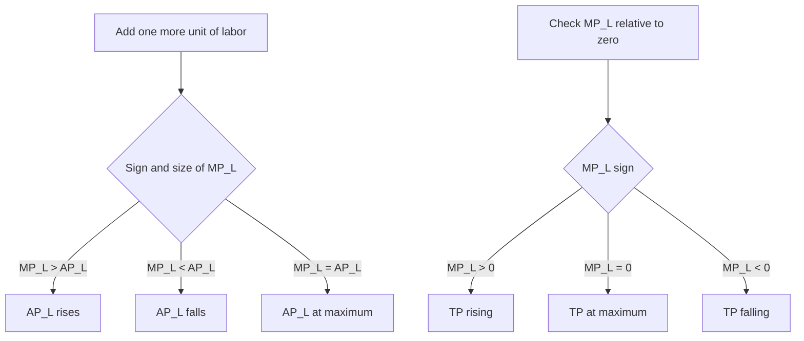

## Total, Average, and Marginal Product

### Overview

Total, average, and marginal product are the three core measures used to describe how a firm's output responds to changes in a variable input (typically labor), holding other inputs (typically capital) fixed. These measures form the analytical basis of short-run production theory, directly underlying the Law of Diminishing Marginal Returns and the derivation of short-run cost curves.

### Total Product

**Key Points**

- **Total Product (TP)** is the total quantity of output produced by a firm using a given quantity of the variable input, holding the fixed input constant. It is simply the short-run production function itself:

$$TP = Q = f(L, \bar{K})$$

where $L$ is the variable input (labor) and $\bar{K}$ is the fixed input (capital), held constant in the short run.

- Total product typically follows a characteristic pattern as labor increases: it rises at an *increasing* rate initially, then rises at a *decreasing* rate, reaches a maximum, and may eventually decline if labor is increased further.

### Marginal Product

**Key Points**

- **Marginal Product of Labor ($MP_L$)** is the additional output generated by employing one more unit of labor, holding capital fixed:

$$MP_L = \frac{\Delta TP}{\Delta L} = \frac{\partial Q}{\partial L}$$

- Marginal product measures the **rate of change** of total product — geometrically, it is the slope of the total product curve at any given quantity of labor.

### Average Product

**Key Points**

- **Average Product of Labor ($AP_L$)** is the output produced per unit of labor employed:

$$AP_L = \frac{TP}{L} = \frac{Q}{L}$$

- Geometrically, average product at any point on the total product curve is the slope of a ray (straight line) drawn from the origin to that point on the TP curve.

### Numerical Schedule

**Example**

| Labor (L) | Total Product (TP) | Marginal Product (MP) | Average Product (AP) |
| --- | --- | --- | --- |
| 0 | 0 | — | — |
| 1 | 8 | 8 | 8.00 |
| 2 | 20 | 12 | 10.00 |
| 3 | 33 | 13 | 11.00 |
| 4 | 44 | 11 | 11.00 |
| 5 | 53 | 9 | 10.60 |
| 6 | 60 | 7 | 10.00 |
| 7 | 63 | 3 | 9.00 |
| 8 | 63 | 0 | 7.88 |
| 9 | 60 | -3 | 6.67 |

**Calculation notes:**

- Marginal product at $L=4$: $MP_4 = TP_4 - TP_3 = 44 - 33 = 11$.
- Average product at $L=4$: $AP_4 = TP_4 / L = 44 / 4 = 11.00$.
- Average product first rises (from 8.00 at $L=1$ to a peak of 11.00 at $L=3$–$4$), then falls thereafter.
- Marginal product first rises (from 8 at $L=1$ to a peak of 13 at $L=3$), then falls, reaching zero at $L=8$ (where TP is at its maximum) and turning negative at $L=9$ (where TP actually declines).

### Graphical Representation of All Three Curves

<svg xmlns="http://www.w3.org/2000/svg" viewBox="0 0 640 560" font-family="Arial, sans-serif">
<text x="320" y="24" text-anchor="middle" font-size="15" font-weight="bold">Total, Marginal, and Average Product Curves (svg_diagram)</text>

<text x="320" y="52" text-anchor="middle" font-size="13" font-weight="bold">Total Product (TP)</text>

<line x1="90" y1="220" x2="580" y2="220" stroke="black" stroke-width="2" />

<line x1="90" y1="220" x2="90" y2="65" stroke="black" stroke-width="2" />

<text x="585" y="235" font-size="11">Labor (L)</text>

<text x="55" y="60" font-size="11">Output</text>

<path d="M 90,220 C 160,150 220,100 300,80 C 380,68 430,72 470,90 C 500,105 520,140 540,175" fill="none" stroke="`#1f77b4`" stroke-width="2.5" />

<circle cx="470" cy="90" r="4" fill="`#1f77b4`" />

<line x1="470" y1="90" x2="470" y2="220" stroke="gray" stroke-dasharray="3,3" />

<text x="440" y="235" font-size="10">L (TP max, MP=0)</text>

<text x="320" y="280" text-anchor="middle" font-size="13" font-weight="bold">Marginal Product (MP) and Average Product (AP)</text>

<line x1="90" y1="500" x2="580" y2="500" stroke="black" stroke-width="2" />

<line x1="90" y1="500" x2="90" y2="300" stroke="black" stroke-width="2" />

<text x="585" y="515" font-size="11">Labor (L)</text>

<line x1="90" y1="440" x2="580" y2="440" stroke="gray" stroke-width="1" stroke-dasharray="2,2" />

<text x="60" y="444" font-size="10">0</text>

<path d="M 90,420 C 150,340 210,320 260,325 C 330,335 400,400 440,440 C 460,458 500,470 540,485" fill="none" stroke="`#d62728`" stroke-width="2.5" />

<text x="545" y="485" font-size="11" fill="`#d62728`">MP</text>

<path d="M 90,430 C 170,370 250,350 300,350 C 380,352 460,375 540,410" fill="none" stroke="`#2ca02c`" stroke-width="2.5" />

<text x="545" y="410" font-size="11" fill="`#2ca02c`">AP</text>

<circle cx="300" cy="350" r="4" fill="black" />
<text x="240" y="335" font-size="10">MP = AP at AP max</text>

<circle cx="470" cy="450" r="4" fill="black" />
<line x1="470" y1="220" x2="470" y2="500" stroke="gray" stroke-width="1" stroke-dasharray="2,2" />
<text x="475" y="465" font-size="10">MP = 0 (TP max)</text>
</svg>

### The Relationship Between Marginal and Average Product

**Key Points**

- The relationship between $MP_L$ and $AP_L$ follows a general mathematical principle common to any "marginal vs. average" pairing:
  - **When $MP_L > AP_L$**: $AP_L$ is **rising**. Each additional worker contributes more output than the current average, pulling the average upward.
  - **When $MP_L < AP_L$**: $AP_L$ is **falling**. Each additional worker contributes less output than the current average, pulling the average downward.
  - **When $MP_L = AP_L$**: $AP_L$ is at its **maximum** — the marginal product curve always intersects the average product curve exactly at the average curve's peak.
- This relationship can be derived formally by differentiating $AP_L = Q/L$ with respect to $L$:

$$\frac{d(AP_L)}{dL} = \frac{d}{dL}\left(\frac{Q}{L}\right) = \frac{MP_L \cdot L - Q}{L^2} = \frac{MP_L - AP_L}{L}$$

Setting this derivative equal to zero (to find the maximum of $AP_L$) requires $MP_L = AP_L$, confirming the geometric relationship observed in the graph.

### The Relationship Between Marginal Product and Total Product

**Key Points**

- **When $MP_L > 0$**: $TP$ is **rising**.
- **When $MP_L = 0$**: $TP$ is at its **maximum**.
- **When $MP_L < 0$**: $TP$ is **falling** — this occurs when additional units of labor actually reduce total output, typically due to overcrowding or interference given the fixed capital stock.

### The Law of Diminishing Marginal Returns and Product Curve Shapes

**Key Points**

- The characteristic rise-then-fall shape of both the $MP_L$ and $AP_L$ curves reflects the **Law of Diminishing Marginal Returns**: as increasing units of the variable input (labor) are combined with a fixed input (capital), marginal product eventually declines.
- The **initial rising portion** of $MP_L$ (before diminishing returns set in) is typically attributed to gains from specialization and division of labor as the first few workers are added to a previously understaffed fixed-capital setup.
- The **eventual declining portion** of $MP_L$ reflects the fixed input becoming an increasingly binding constraint as more labor is added — each additional worker has progressively less capital/equipment/space to work with.

### Three Stages of Production (Recap in Terms of Product Curves)

**Key Points**

| Stage | Range | $MP_L$ Behavior | $AP_L$ Behavior | Rational for Firm? |
| --- | --- | --- | --- | --- |
| Stage I | 0 to where $AP_L$ is maximized | Generally rising, $MP_L > AP_L$ | Rising | No — underutilizing fixed input |
| Stage II | From $AP_L$ max to where $MP_L = 0$ (TP max) | Positive but falling, $MP_L < AP_L$ | Falling | **Yes** — economically rational range |
| Stage III | Beyond $MP_L = 0$ | Negative | Falling | No — TP itself is declining |

- A profit-maximizing firm facing a positive input price (wage) for labor will always choose to operate within **Stage II**, since Stage I implies output and average product could still be increased by adding more labor (clearly beneficial), and Stage III implies output is falling even as labor costs continue rising (clearly irrational).

### Numerical Example: Calculating MP and AP from a Production Function

**Example**

Suppose a firm's short-run production function is given by:

$$Q = 12L^2 - L^3$$

with capital held fixed (not appearing explicitly, having been absorbed into the fixed parameters of this specific short-run function).

**Step 1 — Derive the Marginal Product function** by differentiating $Q$ with respect to $L$:

$$MP_L = \frac{dQ}{dL} = 24L - 3L^2$$

**Step 2 — Derive the Average Product function:**

$$AP_L = \frac{Q}{L} = \frac{12L^2 - L^3}{L} = 12L - L^2$$

**Step 3 — Find where $AP_L$ is maximized** by setting $\frac{d(AP_L)}{dL} = 0$:

$$\frac{d(AP_L)}{dL} = 12 - 2L = 0 \quad \Rightarrow \quad L = 6$$

**Step 4 — Verify $MP_L = AP_L$ at this point:**

$$MP_L(6) = 24(6) - 3(6)^2 = 144 - 108 = 36$$

$$AP_L(6) = 12(6) - (6)^2 = 72 - 36 = 36$$

Confirmed: $MP_L = AP_L = 36$ at $L = 6$, consistent with the general property that marginal product crosses average product exactly at average product's maximum.

**Step 5 — Find where $TP$ (i.e., $Q$) is maximized** by setting $MP_L = 0$:

$$24L - 3L^2 = 0 \quad \Rightarrow \quad 3L(8 - L) = 0 \quad \Rightarrow \quad L = 8 \text{ (excluding } L=0\text{)}$$

At $L = 8$, total product reaches its maximum value of $Q = 12(8)^2 - (8)^3 = 768 - 512 = 256$, and beyond $L = 8$, $MP_L$ becomes negative, so total product would begin to decline.

**Step 6 — Identify Stage II (the economically rational range):** Stage II spans from $L = 6$ (where $AP_L$ peaks) to $L = 8$ (where $MP_L = 0$ and $TP$ peaks) — a firm would rationally choose a labor input somewhere within this range, with the precise optimal point (within Stage II) determined by the wage rate and output price once profit maximization is introduced.

### Applications: Linking Product Curves to Cost Curves

**Key Points**

- The shapes of the marginal and average product curves directly determine the shapes of the corresponding short-run **marginal cost (MC)** and **average variable cost (AVC)** curves, since cost curves are essentially the "mirror image" of product curves once input prices are introduced.
- Specifically, if the wage rate $w$ is constant: $MC = \frac{w}{MP_L}$ and $AVC = \frac{w}{AP_L}$ — meaning that where $MP_L$ is maximized, $MC$ is minimized, and where $AP_L$ is maximized, $AVC$ is minimized (an inverse relationship between the product curves and their corresponding cost curves).

### Common Misconceptions

**Key Points**

- **Misconception:** "Marginal product and average product always move in the same direction." — Incorrect; whenever $MP_L \neq AP_L$, one is necessarily pulling the other in a specific direction (as described above) — they do not simply move together in lockstep.
- **Misconception:** "Total product must be maximized wherever average product is maximized." — Incorrect; $AP_L$ reaches its maximum at a **lower** level of labor than where $TP$ reaches its maximum (as shown numerically above: $AP_L$ peaks at $L=6$, while $TP$ peaks at $L=8$) — these are two distinct optimization points corresponding to different underlying conditions ($MP_L = AP_L$ versus $MP_L = 0$).
- **Misconception:** "Negative marginal product means the firm is losing money." — Incorrect (or at least imprecise) as a direct statement; negative marginal product describes a purely technical/physical relationship (declining physical output), which is a distinct concept from the firm's cost or profit position, though a rational firm would never choose to operate in this negative-MP range given positive input costs.

### Conclusion

Total, marginal, and average product together provide a complete description of how a firm's short-run output responds to changes in a variable input, holding fixed capital constant. Their systematic relationships — marginal product crossing average product at its maximum, and marginal product reaching zero exactly where total product peaks — are direct mathematical consequences of the underlying production function and the Law of Diminishing Marginal Returns. These product curve relationships not only define the economically rational Stage II of production but also directly determine the shapes of a firm's short-run marginal and average variable cost curves, linking production theory tightly to the cost-side analysis of firm behavior.

**Related Topics**

- The Law of Diminishing Marginal Returns
- The three stages of production
- Deriving short-run cost curves from product curves
- Production functions and input classification
- Isoquants and the marginal rate of technical substitution
- Returns to scale (long-run production concept)
- Marginal cost and average variable cost curves
- Profit-maximizing input choice for a firm