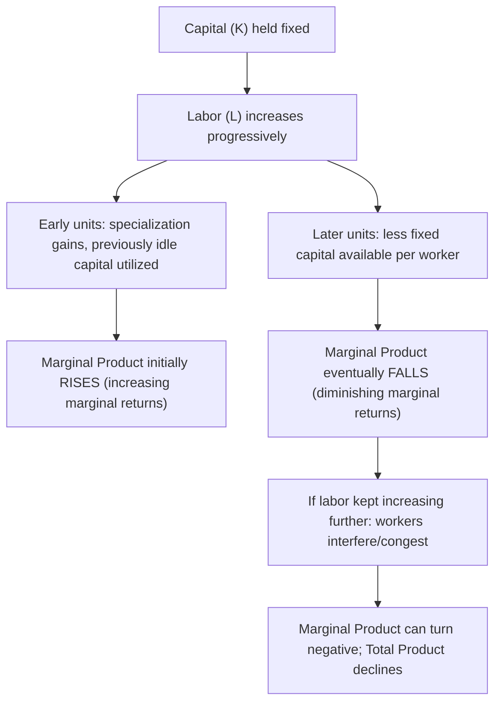

## Law of Diminishing Marginal Returns

### Overview

The Law of Diminishing Marginal Returns (also called the Law of Diminishing Marginal Product, or historically the Law of Variable Proportions) states that as successive units of a variable input are added to a fixed input, holding technology constant, the marginal product of the variable input will eventually decline. This law is one of the most fundamental and empirically robust principles in production theory, explaining the characteristic shape of short-run product and cost curves and providing the technical foundation for the "Stage II" range of rational short-run production.

### Formal Statement

**Key Points**

- Formally, consider a short-run production function $Q = f(L, \bar{K})$, where $L$ is the variable input (labor) and $\bar{K}$ is the fixed input (capital). The Law of Diminishing Marginal Returns states that beyond some quantity of labor $L_0$:

$$\frac{\partial MP_L}{\partial L} < 0 \quad \text{for } L > L_0$$

- Equivalently, in terms of the second derivative of the production function with respect to the variable input:

$$\frac{\partial^2 Q}{\partial L^2} < 0 \quad \text{for } L > L_0$$

- This describes the total product function as **concave** in the variable input beyond the threshold quantity $L_0$, even though it may be convex (marginal product rising) over an initial range before $L_0$.

### Key Conditions Required for the Law to Apply

**Key Points**

- **At least one input must be fixed.** The law is inherently a **short-run** concept; it does not describe what happens when all inputs (including capital) can be adjusted, since that scenario falls under returns to scale (a distinct long-run concept).
- **Technology must remain constant.** The law describes the effect of adding a variable input under a *given* production technology; a genuine technological improvement can shift the entire production function and is a separate phenomenon from diminishing returns along the existing technology.
- **Inputs must be reasonably substitutable/combinable.** The law implicitly assumes some degree of variability in how the fixed and variable inputs can be combined (rather than a completely rigid fixed-proportions technology, where no meaningful "diminishing returns along the variable input" analysis in the standard smooth sense would apply in the same way).

### Numerical Illustration

**Example**

| Units of Labor (with Fixed Capital) | Total Product (TP) | Marginal Product (MP) |
| --- | --- | --- |
| 1 | 10 | 10 |
| 2 | 25 | 15 |
| 3 | 42 | 17 |
| 4 | 56 | 14 |
| 5 | 66 | 10 |
| 6 | 72 | 6 |
| 7 | 74 | 2 |
| 8 | 74 | 0 |
| 9 | 70 | -4 |

In this schedule, marginal product **rises** initially (from 10 to a peak of 17 at $L=3$), reflecting increasing returns over the first few units of labor — often attributed to gains from specialization as workers are added to a previously understaffed fixed-capital setup. Beyond $L=3$, marginal product **declines** continuously (from 17 down to 0 and eventually negative) — this declining portion, from $L=4$ onward, is the range over which the Law of Diminishing Marginal Returns applies.

### Graphical Illustration

<svg xmlns="http://www.w3.org/2000/svg" viewBox="0 0 640 420" font-family="Arial, sans-serif">
<text x="320" y="24" text-anchor="middle" font-size="15" font-weight="bold">Law of Diminishing Marginal Returns (svg_diagram)</text>

<line x1="90" y1="370" x2="580" y2="370" stroke="black" stroke-width="2" />
<line x1="90" y1="370" x2="90" y2="60" stroke="black" stroke-width="2" />
<text x="585" y="390" font-size="12">Units of Variable Input (Labor)</text>
<text x="45" y="55" font-size="12">Marginal Product</text>

<line x1="90" y1="290" x2="580" y2="290" stroke="gray" stroke-width="1" stroke-dasharray="3,3" />
<text x="60" y="294" font-size="10">0</text>

<path d="M 130,220 C 180,140 220,110 260,105 C 320,100 380,150 420,220 C 460,280 500,320 540,350" fill="none" stroke="`#d62728`" stroke-width="3" />

<circle cx="260" cy="105" r="4" fill="#d62728" />
<text x="200" y="90" font-size="11">MP peak (increasing returns end here)</text>
<line x1="260" y1="105" x2="260" y2="370" stroke="gray" stroke-dasharray="2,2" />

<text x="130" y="240" font-size="12" fill="`#1f77b4`" font-weight="bold">Increasing</text>

<text x="130" y="256" font-size="12" fill="`#1f77b4`" font-weight="bold">Marginal Returns</text>

<text x="330" y="240" font-size="12" fill="`#d62728`" font-weight="bold">Diminishing Marginal Returns</text>

<text x="330" y="256" font-size="11" fill="`#d62728`">(MP falling, still &gt; 0 initially)</text>

<text x="450" y="330" font-size="11" fill="#888">Negative MP</text>

<text x="450" y="345" font-size="11" fill="#888">(TP declining)</text>

</svg>

### Why Marginal Product Eventually Declines: Economic Intuition

**Key Points**

- With a **fixed quantity of capital** (machinery, floor space, equipment), each additional unit of labor added has progressively **less fixed capital to work with**.
- Early workers can take advantage of specialization, division of labor, and full utilization of previously idle capital — producing the initial phase of *increasing* marginal returns.
- As more and more workers are added to the same fixed capital stock, workers increasingly compete for the same limited tools, space, and equipment — congestion, idle waiting time, and reduced individual efficiency set in, producing the *diminishing* marginal returns phase.
- If labor continues to be added well beyond the point of full utilization, workers may begin to actively interfere with one another's productivity (e.g., overcrowding a factory floor), potentially driving marginal product negative — total output can genuinely start to fall.

### Relationship to Average Product

**Key Points**

- Diminishing marginal returns also drive the eventual decline of **average product** ($AP_L = Q/L$), though average product peaks slightly **after** marginal product peaks (since $AP_L$ continues rising as long as $MP_L > AP_L$, even after $MP_L$ itself has already started its decline from its own peak).
- The point where $MP_L = AP_L$ marks the maximum of average product — a distinct milestone from the initial marginal-product peak, and the standard boundary used to divide Stage I from Stage II of production.

### The Three Stages of Production (Recap)

**Key Points**

| Stage | Labor Range | Characterization |
| --- | --- | --- |
| Stage I | Up to where $AP_L$ is maximized (where $MP_L = AP_L$) | Increasing/high marginal returns; fixed input underutilized |
| Stage II | From $AP_L$ max to where $MP_L = 0$ (TP maximized) | Diminishing but positive marginal returns — the economically rational range |
| Stage III | Beyond $MP_L = 0$ | Negative marginal returns; TP actually falling |

- The Law of Diminishing Marginal Returns is the underlying mechanism that drives the transition through and eventually out of Stage II into Stage III if labor is added without limit — a profit-maximizing firm facing a positive wage rate will always choose to stop adding labor within Stage II, precisely because diminishing (though still positive) marginal returns are already occurring there.

### Historical Origins and Broader Applications

**Key Points**

- The concept originated in classical economic analysis of **agricultural production**, where early economists (including writers associated with classical political economy such as Turgot, Malthus, and Ricardo) observed that adding successive units of labor to a fixed quantity of land eventually yields smaller and smaller increases in crop output. [Inference: this agricultural framing is the traditional historical origin commonly cited in economics textbooks; the underlying mathematical principle has since been generalized far beyond agriculture to apply broadly across manufacturing, services, and other production contexts involving any fixed input.]
- The law has since been generalized as a foundational principle applicable to virtually any production process involving at least one genuinely fixed factor, forming a cornerstone assumption throughout modern microeconomic production and cost theory.

### Diminishing Marginal Returns and the Shape of Cost Curves

**Key Points**

- The Law of Diminishing Marginal Returns is the direct technical driver behind the eventual **upward-sloping** portion of the short-run marginal cost (MC) curve.
- Formally, with a constant wage rate $w$ for the variable input:

$$MC = \frac{w}{MP_L}$$

- Since $MP_L$ eventually declines (diminishing marginal returns) as labor increases, and $w$ is held constant, marginal cost must eventually **rise** — this is precisely why short-run marginal cost curves are conventionally drawn as eventually upward-sloping (often following an initial declining segment corresponding to the earlier phase of increasing marginal returns).
- This relationship directly connects the physical/technical production concept of diminishing marginal returns to the monetary cost-side behavior firms actually observe and respond to in their short-run output decisions.

### Distinguishing Diminishing Marginal Returns from Diseconomies of Scale

**Key Points**

- A common point of confusion is conflating diminishing marginal returns with **diseconomies of scale** — these are related but conceptually distinct phenomena tied to different time horizons:
  - **Diminishing marginal returns** is a **short-run** concept: it describes what happens to the marginal product of a **single variable input** when combined with **at least one fixed input**.
  - **Diseconomies of scale** is a **long-run** concept: it describes what happens to **long-run average cost** when a firm scales up **all** inputs simultaneously (a long-run returns-to-scale phenomenon), with no input held fixed.
- These two concepts should not be used interchangeably, since they apply to entirely different economic time horizons and different sets of assumptions about which inputs are adjustable.

### Common Misconceptions

**Key Points**

- **Misconception:** "The law applies from the very first unit of the variable input." — Incorrect; marginal product commonly rises over an initial range (increasing marginal returns, often due to specialization) before the law's characteristic decline sets in — the law describes the **eventual**, not immediate, decline.
- **Misconception:** "Diminishing marginal returns means total output is falling." — Incorrect; diminishing marginal returns means each additional unit of the variable input adds *less* to total output than the previous unit did — total output can still be rising (just at a decreasing rate), only actually falling once marginal product turns negative (Stage III), a distinct and more extreme condition.
- **Misconception:** "Diminishing marginal returns and diseconomies of scale are the same thing." — Incorrect, as detailed above; they apply to different time horizons (short run vs. long run) and different sets of assumptions about fixed versus variable inputs.

### Conclusion

The Law of Diminishing Marginal Returns is a foundational short-run production principle stating that, given at least one fixed input, the marginal product of an increasingly employed variable input will eventually decline. This law explains the characteristic rise-then-fall shape of marginal and average product curves, underlies the definition of the economically rational Stage II of production, and directly determines the eventual upward slope of short-run marginal cost curves through the inverse relationship between marginal product and marginal cost. Clearly distinguished from the related but conceptually distinct long-run phenomenon of diseconomies of scale, this law remains one of the most empirically robust and widely applicable principles across the entire study of firm production behavior.

**Related Topics**

- Total, marginal, and average product
- The three stages of production
- Production functions and input classification
- Deriving short-run marginal and average variable cost curves
- Returns to scale and diseconomies of scale (long-run distinction)
- Isoquants and the marginal rate of technical substitution
- Profit-maximizing input choice for a firm
- Short-run vs. long-run cost curve derivation