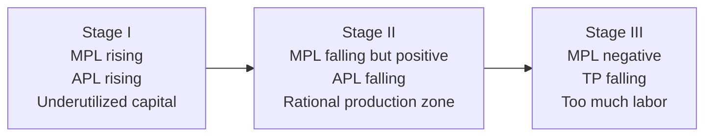

## Short-Run vs Long-Run Production

### Definitions

**Short Run**: A time period in which at least one factor of production is fixed (cannot be varied), while other factors are variable. In standard microeconomic models, capital ($K$) is typically treated as the fixed factor and labor ($L$) as the variable factor.

**Long Run**: A time period sufficiently long that all factors of production are variable. There are no fixed factors in the long run — firms can adjust plant size, capital stock, and all other inputs.

[Inference] The specific calendar length of the "short run" is not fixed and varies by industry — a fast-food restaurant's short run may be weeks, while a semiconductor fabrication plant's short run may span years, since it depends on the time needed to adjust the fixed factor rather than any set duration.

### Core Distinction

| Aspect | Short Run | Long Run |
| --- | --- | --- |
| Fixed factors | At least one (e.g., capital, plant size) | None |
| Variable factors | One or more | All |
| Firm decisions | Output level given existing capacity | Output level AND scale/capacity |
| Cost structure | Fixed costs + variable costs exist | All costs are variable |
| Entry/exit | Cannot occur (plant is fixed) | Firms can enter or exit the market |
| Relevant production function | $Q = f(L, \bar{K})$ | $Q = f(L, K)$ |

### Short-Run Production Function

With capital fixed at $\bar{K}$, the short-run production function is:

$$Q = f(L, \bar{K})$$

Output can only be changed by adjusting the variable input (labor). This gives rise to three key short-run product concepts:

**Total Product (TP)**: Total output produced, $TP = Q = f(L, \bar{K})$

**Average Product of Labor (APL)**:

$$AP_L = \frac{Q}{L}$$

**Marginal Product of Labor (MPL)**:

$$MP_L = \frac{\Delta Q}{\Delta L} = \frac{\partial Q}{\partial L}$$

### The Law of Diminishing Marginal Returns

**Key Points**

- States that as more units of a variable input are added to a fixed input, holding technology constant, the marginal product of the variable input will eventually decline.
- This is a short-run phenomenon by definition — it requires at least one fixed factor to bind.
- It does not claim marginal product declines immediately; typically MPL rises initially (due to specialization and better utilization of fixed capital), reaches a maximum, then declines.

**Three Stages of Production (Short Run)**

- **Stage I**: $MP_L > AP_L$, both rising. Fixed capital is underutilized relative to labor; firms should keep hiring.
- **Stage II**: $MP_L < AP_L$, both positive but $MP_L$ declining. This is the economically rational stage — profit-maximizing firms operate here.
- **Stage III**: $MP_L < 0$, so $TP$ is falling. Adding more labor is counterproductive (e.g., overcrowding).

**Example**

A bakery with one oven (fixed capital) hires bakers (variable labor):

| Labor ($L$) | Total Product ($TP$) | $MP_L$ | $AP_L$ |
| --- | --- | --- | --- |
| 1 | 10 | — | 10.0 |
| 2 | 25 | 15 | 12.5 |
| 3 | 45 | 20 | 15.0 |
| 4 | 60 | 15 | 15.0 |
| 5 | 70 | 10 | 14.0 |
| 6 | 75 | 5 | 12.5 |
| 7 | 75 | 0 | 10.7 |
| 8 | 70 | -5 | 8.75 |

Here, $MP_L$ peaks at $L=3$ (Stage I ends), $AP_L$ peaks at $L=4$ (where $MP_L = AP_L$), and $MP_L$ turns negative at $L=8$ (Stage III begins). Beyond one oven's capacity, additional bakers get in each other's way.

### Relationship Between MPL and APL

$$AP_L = \frac{TP}{L}$$

Differentiating shows the geometric relationship:

- When $MP_L > AP_L$, $AP_L$ is rising.
- When $MP_L < AP_L$, $AP_L$ is falling.
- When $MP_L = AP_L$, $AP_L$ is at its maximum (the MPL curve intersects the APL curve at the APL peak).

This is analogous to the relationship between marginal and average values in general (e.g., a new test score's effect on a class average).

**Diagram: TP, MP, AP Curves (svg_diagram)**

<svg xmlns="http://www.w3.org/2000/svg" viewBox="0 0 700 480" font-family="sans-serif">
<text x="350" y="24" text-anchor="middle" font-size="16" font-weight="bold">TP, MP, AP Curves (svg_diagram)</text>

<line x1="60" y1="180" x2="640" y2="180" stroke="black" stroke-width="1.5" />
<line x1="60" y1="180" x2="60" y2="50" stroke="black" stroke-width="1.5" />
<text x="30" y="60" font-size="12">TP</text>
<text x="620" y="200" font-size="12">L</text>
<path d="M 60 180 C 150 150, 200 80, 300 65 S 450 90, 550 140 S 600 165, 620 175" stroke="#2563eb" stroke-width="2.5" fill="none" />
<text x="300" y="55" font-size="11" fill="#2563eb">Total Product</text>
<line x1="300" y1="185" x2="300" y2="175" stroke="#888" stroke-dasharray="3,3" />
<text x="280" y="200" font-size="10" fill="#555">Inflection</text>

<line x1="60" y1="440" x2="640" y2="440" stroke="black" stroke-width="1.5" />
<line x1="60" y1="440" x2="60" y2="230" stroke="black" stroke-width="1.5" />
<line x1="60" y1="340" x2="640" y2="340" stroke="#ccc" stroke-width="1" stroke-dasharray="2,2" />
<text x="30" y="240" font-size="12">MP/AP</text>
<text x="620" y="460" font-size="12">L</text>

<path d="M 60 400 C 130 300, 180 250, 240 245 S 340 280, 420 340 S 520 400, 580 440 S 610 450, 620 455" stroke="#dc2626" stroke-width="2.5" fill="none" />
<text x="200" y="235" font-size="11" fill="#dc2626">MPL</text>

<path d="M 60 420 C 160 340, 260 300, 340 300 S 480 320, 580 360" stroke="#16a34a" stroke-width="2.5" fill="none" />
<text x="480" y="310" font-size="11" fill="#16a34a">APL</text>

<circle cx="340" cy="300" r="4" fill="black" />
<text x="350" y="295" font-size="10">MPL = APL (APL max)</text>

<line x1="240" y1="230" x2="240" y2="440" stroke="#999" stroke-dasharray="4,4" />
<line x1="580" y1="230" x2="580" y2="440" stroke="#999" stroke-dasharray="4,4" />
<text x="130" y="425" font-size="11" fill="#444">Stage I</text>
<text x="390" y="425" font-size="11" fill="#444">Stage II</text>
<text x="595" y="425" font-size="11" fill="#444">Stage III</text>
</svg>

### Long-Run Production Function

In the long run, all inputs vary:

$$Q = f(L, K)$$

Firms choose the optimal combination of $L$ and $K$ subject to a cost constraint, typically visualized with **isoquants** (combinations of $L$ and $K$ yielding the same output) and **isocost lines** (combinations of $L$ and $K$ with the same total cost).

**Isoquant map (svg_diagram)**

<svg xmlns="http://www.w3.org/2000/svg" viewBox="0 0 500 400" font-family="sans-serif">
<text x="250" y="24" text-anchor="middle" font-size="16" font-weight="bold">Isoquant Map (svg_diagram)</text>
<line x1="60" y1="360" x2="460" y2="360" stroke="black" stroke-width="1.5" />
<line x1="60" y1="360" x2="60" y2="50" stroke="black" stroke-width="1.5" />
<text x="470" y="365" font-size="12">L</text>
<text x="35" y="50" font-size="12">K</text>
<path d="M 90 340 C 150 200, 250 150, 420 130" stroke="#2563eb" stroke-width="2" fill="none" />
<text x="425" y="128" font-size="10" fill="#2563eb">Q1</text>
<path d="M 120 340 C 190 230, 290 180, 440 160" stroke="#7c3aed" stroke-width="2" fill="none" />
<text x="443" y="158" font-size="10" fill="#7c3aed">Q2</text>
<path d="M 150 340 C 230 260, 330 210, 450 195" stroke="#059669" stroke-width="2" fill="none" />
<text x="453" y="193" font-size="10" fill="#059669">Q3</text>

<text x="250" y="380" text-anchor="middle" font-size="11" fill="#555">Higher isoquants (Q3 &gt; Q2 &gt; Q1) represent greater output</text>

</svg>

### Returns to Scale (Long-Run Concept)

Because all inputs can be varied together, the long run introduces **returns to scale** — how output responds when *all* inputs are scaled by the same factor $\lambda$:

$$f(\lambda L, \lambda K) \; \text{vs} \; \lambda \cdot f(L, K)$$

- **Increasing returns to scale (IRS)**: $f(\lambda L, \lambda K) > \lambda f(L, K)$ — doubling inputs more than doubles output (e.g., specialization gains, indivisibilities).
- **Constant returns to scale (CRS)**: $f(\lambda L, \lambda K) = \lambda f(L, K)$ — doubling inputs exactly doubles output.
- **Decreasing returns to scale (DRS)**: $f(\lambda L, \lambda K) < \lambda f(L, K)$ — doubling inputs less than doubles output (e.g., coordination/management difficulties).

**Important distinction**: Diminishing marginal returns (short run, one input varies) is conceptually distinct from decreasing returns to scale (long run, all inputs vary proportionally). It is possible to have diminishing marginal returns to labor in the short run while the underlying long-run technology exhibits constant or increasing returns to scale.

### Cost Implications

**Short-run costs**:

$$TC_{SR} = TFC + TVC$$

where $TFC$ (total fixed cost) does not vary with output, and $TVC$ (total variable cost) does.

**Long-run costs**:

$$TC_{LR} = f(\text{all inputs at their cost-minimizing levels for each output } Q)$$

There is no fixed cost in the long run; the **Long-Run Average Cost (LRAC)** curve is the envelope of all possible **Short-Run Average Cost (SRAC)** curves, each corresponding to a different fixed plant size.

**LRAC as Envelope Curve (svg_diagram)**

<svg xmlns="http://www.w3.org/2000/svg" viewBox="0 0 600 380" font-family="sans-serif">
<text x="300" y="24" text-anchor="middle" font-size="16" font-weight="bold">LRAC as Envelope Curve (svg_diagram)</text>
<line x1="60" y1="330" x2="560" y2="330" stroke="black" stroke-width="1.5" />
<line x1="60" y1="330" x2="60" y2="50" stroke="black" stroke-width="1.5" />
<text x="570" y="335" font-size="12">Q</text>
<text x="35" y="50" font-size="12">Cost</text>
<path d="M 90 300 C 130 180, 170 150, 220 220 S 280 320, 300 330" stroke="#dc2626" stroke-width="1.8" fill="none" />
<text x="95" y="175" font-size="10" fill="#dc2626">SRAC1</text>
<path d="M 150 300 C 200 150, 250 130, 300 190 S 370 300, 390 320" stroke="#f97316" stroke-width="1.8" fill="none" />
<text x="200" y="128" font-size="10" fill="#f97316">SRAC2</text>
<path d="M 230 290 C 290 140, 340 120, 390 170 S 460 280, 480 310" stroke="#eab308" stroke-width="1.8" fill="none" />
<text x="335" y="118" font-size="10" fill="#eab308">SRAC3</text>
<path d="M 90 300 C 90 300, 220 150, 340 145 S 480 280, 480 310" stroke="#1d4ed8" stroke-width="3" fill="none" stroke-dasharray="0" />
<text x="420" y="230" font-size="12" fill="#1d4ed8" font-weight="bold">LRAC</text>
</svg>

The **Minimum Efficient Scale (MES)** is the smallest output level at which LRAC reaches its minimum point.

### Optimal Input Choice in the Long Run

Firms minimize cost for a given output level where the isoquant is tangent to the isocost line:

$$\frac{MP_L}{MP_K} = \frac{w}{r}$$

where $w$ is the wage rate and $r$ is the rental rate of capital. Equivalently:

$$\frac{MP_L}{w} = \frac{MP_K}{r}$$

This states that at the optimum, the marginal product per dollar spent is equalized across all inputs — a firm cannot reduce cost by reallocating a dollar of spending from one input to another.

### Why the Distinction Matters

**Key Points**

- **Policy analysis**: Short-run supply responses (e.g., to a price shock) differ substantially from long-run responses, since firms cannot adjust capacity immediately.
- **Market structure**: Long-run analysis incorporates entry and exit, which determines whether economic profits persist (they are competed away in the long run under perfect competition, but fixed in the short run).
- **Cost curve shapes**: Short-run marginal and average cost curves are U-shaped primarily due to diminishing marginal returns to the variable factor; long-run average cost curves are U-shaped (or L-shaped) due to returns to scale and other scale economies/diseconomies — these are analytically distinct explanations even though the curve shapes look similar.
- [Unverified] The exact numerical duration separating "short run" from "long run" for a specific real-world industry would require empirical, industry-specific data (e.g., average time to build new manufacturing capacity) rather than a general theoretical answer.

### Common Pitfalls

- Confusing diminishing marginal returns (short-run, single variable input) with decreasing returns to scale (long-run, all inputs scaled proportionally) — these are different concepts governed by different conditions.
- Assuming the "long run" means a specific number of months or years; it is defined by input flexibility, not calendar time.
- Treating fixed costs as relevant to short-run marginal decisions — sunk fixed costs do not affect the marginal cost of producing additional units in the short run and should not enter the shutdown/continue-production decision.

**Related Topics**

- Isoquants and Isocost Lines
- Marginal Rate of Technical Substitution (MRTS)
- Cost Curves (Short-Run and Long-Run)
- Returns to Scale and Economies of Scale
- Firm Entry and Exit in Perfect Competition
- Shutdown Point and Break-Even Point
- Cobb-Douglas Production Function