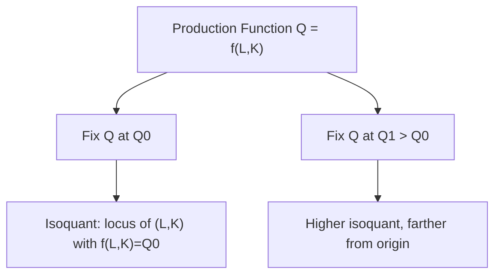
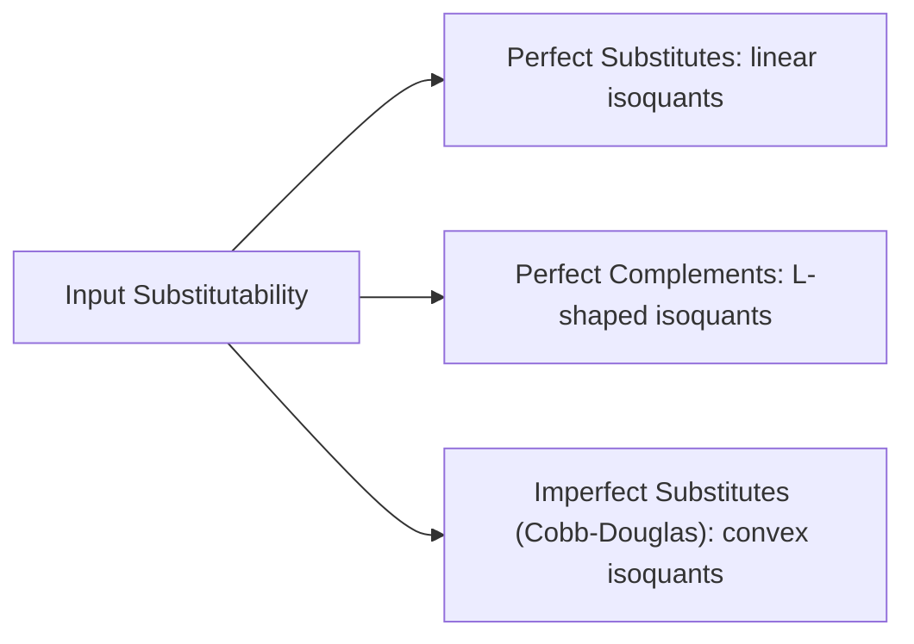
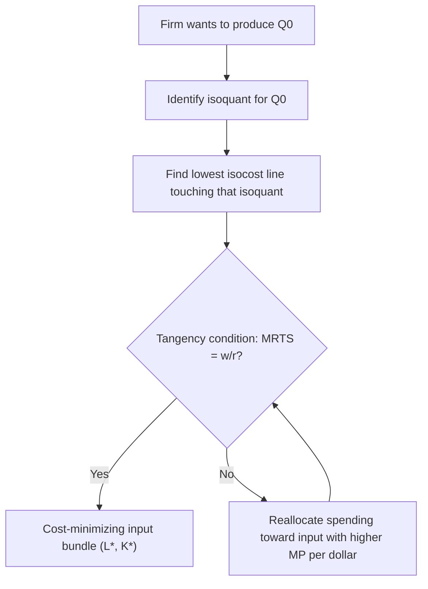

## Isoquants and Isocosts

### Definitions

**Isoquant**: A curve showing all combinations of two inputs (typically labor $L$ and capital $K$) that produce the same level of output $Q$. The term derives from "iso" (equal) and "quant" (quantity). Mathematically, an isoquant is a level curve of the production function:

$$Q_0 = f(L, K)$$

for a fixed output level $Q_0$.

**Isocost line**: A line showing all combinations of two inputs that a firm can purchase for a given total expenditure, given input prices. If $w$ is the wage rate (price of labor) and $r$ is the rental rate of capital, the isocost line is:

$$C = wL + rK$$

where $C$ is total cost.

### The Isoquant Map

A single production function generates a family of isoquants, collectively called an **isoquant map**. Each isoquant corresponds to a different output level, with isoquants farther from the origin representing higher output.

**Key Points**

- Isoquants are typically drawn as convex to the origin, reflecting diminishing marginal rate of technical substitution
- Isoquants cannot intersect (an intersection would imply two different output levels from the same input bundle, violating the definition of a function)
- Higher isoquants represent higher output levels
- The slope of an isoquant at any point equals the negative of the marginal rate of technical substitution (MRTS)

### Marginal Rate of Technical Substitution (MRTS)

The MRTS measures the rate at which one input can be substituted for another while holding output constant. It is the absolute value of the slope of the isoquant:

$$MRTS_{LK} = -\frac{dK}{dL}\bigg|_{Q=\bar{Q}} = \frac{MP_L}{MP_K}$$

where $MP_L$ and $MP_K$ are the marginal products of labor and capital, respectively.

**Derivation**: Along an isoquant, total differential of $Q = f(L,K)$ is zero:

$$dQ = MP_L \, dL + MP_K \, dK = 0$$

Rearranging:

$$\frac{dK}{dL} = -\frac{MP_L}{MP_K}$$

so $MRTS_{LK} = MP_L / MP_K$.

**Diminishing MRTS**: As a firm moves along an isoquant substituting labor for capital (increasing $L$, decreasing $K$), the MRTS typically diminishes. This reflects the fact that as labor becomes relatively abundant and capital scarce, each additional unit of labor substitutes for progressively less capital, giving isoquants their characteristic convex shape.

### Special Cases of Isoquants

**Key Points**

- **Perfect substitutes**: Inputs can be substituted at a constant rate. Production function $Q = aL + bK$. Isoquants are straight lines with constant slope $-a/b$. MRTS is constant.
- **Perfect complements (Leontief)**: Inputs must be used in fixed proportions. Production function $Q = \min(aL, bK)$. Isoquants are L-shaped (right angles). MRTS is undefined at the kink (either zero or infinite) and zero along the flat/vertical segments.
- **Cobb-Douglas**: Production function $Q = AL^{\alpha}K^{\beta}$. Isoquants are smooth, convex curves that never touch the axes (asymptotic). MRTS diminishes smoothly along the curve.

**Below is an SVG comparing the three isoquant shapes.**

<svg xmlns="http://www.w3.org/2000/svg" viewBox="0 0 780 300" font-family="Arial, sans-serif">
<text x="390" y="20" text-anchor="middle" font-size="14" font-weight="bold">Isoquant Shapes by Input Substitutability (svg_diagram)</text>

<g transform="translate(20,40)">
<line x1="20" y1="220" x2="20" y2="20" stroke="black" stroke-width="1.5" />
<line x1="20" y1="220" x2="230" y2="220" stroke="black" stroke-width="1.5" />
<text x="115" y="245" text-anchor="middle" font-size="12">Labor (L)</text>
<text x="10" y="15" text-anchor="middle" font-size="12" transform="rotate(0)">K</text>
<line x1="30" y1="200" x2="200" y2="40" stroke="#2563eb" stroke-width="2" />
<line x1="50" y1="200" x2="220" y2="40" stroke="#2563eb" stroke-width="2" />
<line x1="70" y1="200" x2="240" y2="40" stroke="#2563eb" stroke-width="2" opacity="0.4" />
<text x="115" y="270" text-anchor="middle" font-size="13" font-weight="bold">Perfect Substitutes</text>
</g>

<g transform="translate(290,40)">
<line x1="20" y1="220" x2="20" y2="20" stroke="black" stroke-width="1.5" />
<line x1="20" y1="220" x2="230" y2="220" stroke="black" stroke-width="1.5" />
<text x="115" y="245" text-anchor="middle" font-size="12">Labor (L)</text>
<path d="M 60 220 L 60 100 L 180 100" stroke="#dc2626" stroke-width="2" fill="none" />
<path d="M 90 220 L 90 140 L 210 140" stroke="#dc2626" stroke-width="2" fill="none" opacity="0.6" />
<circle cx="60" cy="100" r="3" fill="#dc2626" />
<text x="115" y="270" text-anchor="middle" font-size="13" font-weight="bold">Perfect Complements</text>
</g>

<g transform="translate(560,40)">
<line x1="20" y1="220" x2="20" y2="20" stroke="black" stroke-width="1.5" />
<line x1="20" y1="220" x2="230" y2="220" stroke="black" stroke-width="1.5" />
<text x="115" y="245" text-anchor="middle" font-size="12">Labor (L)</text>
<path d="M 35 210 Q 80 90 200 55" stroke="#16a34a" stroke-width="2" fill="none" />
<path d="M 50 215 Q 100 110 220 75" stroke="#16a34a" stroke-width="2" fill="none" opacity="0.5" />
<text x="115" y="270" text-anchor="middle" font-size="13" font-weight="bold">Cobb-Douglas</text>
</g>
</svg>

### The Isocost Line in Detail

The isocost equation, rearranged in slope-intercept form (with $K$ on the vertical axis):

$$K = \frac{C}{r} - \frac{w}{r}L$$

**Key Points**

- Vertical intercept ($L=0$): $K = C/r$ — maximum capital purchasable
- Horizontal intercept ($K=0$): $L = C/w$ — maximum labor purchasable
- Slope: $-w/r$, the negative ratio of input prices; represents the market rate at which capital can be traded for labor
- A change in total budget $C$ (with prices fixed) shifts the isocost line parallel outward (higher $C$) or inward (lower $C$)
- A change in $w$ or $r$ alone rotates the isocost line, pivoting on the intercept of the unchanged input's axis

**Example**

If a firm has a budget $C = \$1{,}000$, wage $w = \$20$/hour, and rental rate $r = \$50$/machine-hour:

- Maximum labor: $L = 1000/20 = 50$ units
- Maximum capital: $K = 1000/50 = 20$ units
- Isocost equation: $K = 20 - 0.4L$
- Slope: $-w/r = -20/50 = -0.4$

### Producer Equilibrium: Cost Minimization

A firm minimizing cost subject to an output constraint chooses the input bundle where the isoquant is tangent to the lowest attainable isocost line. At this tangency:

$$MRTS_{LK} = \frac{MP_L}{MP_K} = \frac{w}{r}$$

Equivalently:

$$\frac{MP_L}{w} = \frac{MP_K}{r}$$

This condition states that the marginal product per dollar spent must be equal across all inputs — the **least-cost input combination** or **optimal input mix**.

**Key Points**

- This is the dual of utility-maximization in consumer theory (indifference curves tangent to budget lines)
- The tangency point identifies the cost-minimizing combination of $L$ and $K$ for a given output level $Q_0$
- If $MP_L/w > MP_K/r$, the firm should reallocate spending toward labor (it yields more output per dollar) until the ratios equalize
- Second-order condition: the isoquant must be convex to the origin at the tangency point (diminishing MRTS) for it to be a true minimum

**Illustration: Tangency of Isoquant and Isocost**

<svg xmlns="http://www.w3.org/2000/svg" viewBox="0 0 500 350" font-family="Arial, sans-serif">
<text x="250" y="20" text-anchor="middle" font-size="14" font-weight="bold">Cost-Minimizing Tangency (svg_diagram)</text>
<line x1="60" y1="300" x2="60" y2="40" stroke="black" stroke-width="1.5" />
<line x1="60" y1="300" x2="460" y2="300" stroke="black" stroke-width="1.5" />
<text x="460" y="320" font-size="13">Labor (L)</text>
<text x="30" y="45" font-size="13">Capital (K)</text>

<line x1="80" y1="280" x2="280" y2="60" stroke="#94a3b8" stroke-width="1.5" stroke-dasharray="4,3" />
<line x1="130" y1="280" x2="330" y2="60" stroke="#2563eb" stroke-width="2" />
<line x1="180" y1="280" x2="380" y2="60" stroke="#94a3b8" stroke-width="1.5" stroke-dasharray="4,3" />

<path d="M 150 270 Q 220 150 320 100 Q 340 92 360 90" stroke="#16a34a" stroke-width="2.5" fill="none" />

<circle cx="248" cy="163" r="4" fill="#dc2626" />
<text x="258" y="160" font-size="12" fill="#dc2626">Tangency (L*, K*)</text>

<text x="340" y="105" font-size="12" fill="`#16a34a`">Isoquant Q0</text>

<text x="335" y="65" font-size="12" fill="`#2563eb`">Isocost (min cost)</text>

<text x="360" y="55" font-size="11" fill="`#94a3b8`">Higher budget</text>

<text x="90" y="290" font-size="11" fill="`#94a3b8`">Lower budget</text>

</svg>

### The Expansion Path

Connecting the cost-minimizing input combinations across all possible output levels (holding input prices constant) traces the **expansion path** — the firm's least-cost way of scaling production up or down.

**Key Points**

- For Cobb-Douglas and other homothetic production functions, the expansion path is a straight line through the origin, implying a constant capital-labor ratio $K/L$ as output scales
- For non-homothetic production functions, the expansion path may curve, meaning the optimal input ratio changes with output level
- The expansion path underlies the derivation of the firm's long-run total cost curve: plotting cost against output along the expansion path yields $LTC(Q)$

### Corner Solutions

When isoquants are not smoothly convex (e.g., perfect substitutes) or when relative prices are extreme, the cost-minimizing solution may occur at a corner (axis) rather than an interior tangency.

**Example**

For perfect substitutes $Q = aL + bK$ with isocost slope $-w/r$:

- If $w/r < a/b$ (labor is relatively cheap per unit of marginal product), the firm uses only labor
- If $w/r > a/b$, the firm uses only capital
- If $w/r = a/b$, any combination on the isoquant is cost-minimizing (isocost and isoquant coincide in slope)

### Returns to Scale and Isoquant Spacing

The spacing between successive isoquants (for equal increments of output, e.g., $Q=100, 200, 300$) reveals the nature of returns to scale:

**Key Points**

- **Constant returns to scale**: Isoquants are evenly spaced along any ray from the origin as output increases in equal increments
- **Increasing returns to scale**: Isoquants become closer together as output rises (less proportional input increase needed for equal output increments)
- **Decreasing returns to scale**: Isoquants become farther apart as output rises

### Comparative Statics: Effects of Price Changes

**Key Points**

- **Change in wage ($w$) rises**: Isocost line pivots inward along the labor axis (steeper slope $-w/r$). At the new tangency, the firm substitutes toward capital and away from labor — this is the **substitution effect** of an input price change (analogous to the substitution effect in consumer theory, but without an "income effect" since it operates along a fixed isoquant)
- **Change in rental rate ($r$) rises**: Isocost line pivots inward along the capital axis (flatter slope). Firm substitutes toward labor
- **Equal proportional increase in both $w$ and $r$**: Isocost line shifts inward parallel (steeper budget for the same total cost), but the tangency point (input ratio) is unchanged since relative prices are unchanged — only the cost of production rises

### Numerical Example: Full Optimization

**Example**

Given production function $Q = 10L^{0.5}K^{0.5}$, wage $w = \$4$, rental rate $r = \$1$. Find the cost-minimizing input combination to produce $Q = 200$.

Step 1 — Marginal products:

$$MP_L = 5L^{-0.5}K^{0.5}, \quad MP_K = 5L^{0.5}K^{-0.5}$$

Step 2 — Tangency condition:

$$\frac{MP_L}{MP_K} = \frac{K}{L} = \frac{w}{r} = \frac{4}{1} \implies K = 4L$$

Step 3 — Substitute into production constraint:

$$200 = 10L^{0.5}(4L)^{0.5} = 10L^{0.5} \cdot 2L^{0.5} = 20L$$

$$L^* = 10, \quad K^* = 40$$

Step 4 — Minimum cost:

$$C^* = wL^* + rK^* = 4(10) + 1(40) = \$80$$

### Common Pitfalls and Misconceptions

**Key Points**

- Confusing MRTS with the price ratio $w/r$: MRTS is a technological relationship (derived from the production function); $w/r$ is a market relationship (input prices). They are equal only at the optimum, not by definition
- Assuming isoquants always have constant elasticity of substitution — this is only true for CES production functions in general; Cobb-Douglas is the special case where the elasticity of substitution equals 1
- Treating the isoquant/isocost tangency as a profit-maximization condition — it is a cost-minimization condition for a *given* output level; profit maximization requires an additional condition equating marginal revenue product to input price
- Assuming isoquants are always smooth curves — perfect substitutes and perfect complements produce isoquants with straight-line or kinked shapes, and the standard tangency rule does not directly apply at kinks

### Relationship to Cost Curves

The isoquant-isocost framework is the microfoundation for the firm's cost functions:

- Minimizing cost for each output level along the expansion path generates the **long-run total cost curve** $LTC(Q)$
- Differentiating $LTC(Q)$ gives **long-run marginal cost**; dividing by $Q$ gives **long-run average cost**
- Short-run cost curves emerge when one input (typically capital) is fixed, restricting the firm to a horizontal or vertical slice of the isoquant map rather than free movement along the expansion path

[Inference] The extent to which real-world firms exhibit smooth, differentiable isoquants (as opposed to discrete technology choices) depends on the granularity of available production technologies in a given industry, and can affect how closely the calculus-based tangency condition approximates actual input decisions.

**Related Topics**

- Marginal product and the law of diminishing marginal returns
- Returns to scale (increasing, constant, decreasing)
- Cobb-Douglas and CES production functions
- Elasticity of substitution
- Long-run vs. short-run cost curves
- Expansion path and output elasticity of cost
- Duality between production theory and consumer theory (isoquants/isocosts vs. indifference curves/budget lines)
- Profit maximization and input demand (marginal revenue product)
- Technical efficiency vs. allocative efficiency