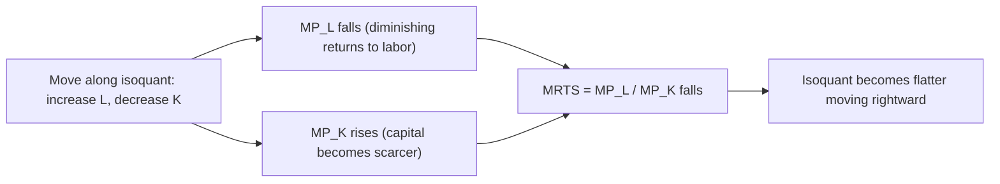

## Marginal Rate of Technical Substitution

### Definition

The **marginal rate of technical substitution (MRTS)** measures the rate at which one input can be reduced as another input is increased by one unit, while holding output constant. It is the amount of capital ($K$) that can be given up in exchange for one more unit of labor ($L$) without changing total output.

Formally, MRTS is the absolute value of the slope of an isoquant at a given point:

$$MRTS_{LK} = -\frac{dK}{dL}\bigg|_{Q=\bar{Q}}$$

### Derivation from the Production Function

Given a production function $Q = f(L, K)$, the total differential is:

$$dQ = \frac{\partial f}{\partial L}dL + \frac{\partial f}{\partial K}dK = MP_L \, dL + MP_K \, dK$$

Along an isoquant, output is constant, so $dQ = 0$:

$$MP_L \, dL + MP_K \, dK = 0$$

Solving for $dK/dL$:

$$\frac{dK}{dL} = -\frac{MP_L}{MP_K}$$

Therefore:

$$MRTS_{LK} = \frac{MP_L}{MP_K}$$

This is the central result: **MRTS equals the ratio of marginal products** of the two inputs.

**Key Points**

- $MRTS_{LK}$ specifically denotes the rate of substitution of labor for capital (labor in the numerator of the ratio, capital being given up)
- $MRTS_{KL} = MP_K/MP_L = 1/MRTS_{LK}$ is the reciprocal, denoting substitution of capital for labor
- MRTS is defined only along a given isoquant — it changes as the input combination moves along the curve
- MRTS is always reported as a positive number by convention, even though the isoquant's actual slope is negative (for well-behaved, downward-sloping isoquants)

### Diminishing MRTS

As a firm moves along an isoquant substituting more labor for capital (increasing $L$, decreasing $K$), MRTS typically **diminishes**. This is the principle of **diminishing marginal rate of technical substitution**, and it is what gives standard isoquants their convex-to-the-origin shape.

**Intuition**: As labor becomes relatively abundant along the isoquant, its marginal product $MP_L$ falls (diminishing marginal returns to labor), while capital becomes relatively scarce, so its marginal product $MP_K$ rises. Since $MRTS_{LK} = MP_L/MP_K$, a falling numerator and rising denominator drive MRTS down.

**Key Points**

- Diminishing MRTS reflects imperfect substitutability between inputs — it is generally *not* true for perfect substitutes (constant MRTS) or perfect complements (MRTS undefined except at the kink)
- Diminishing MRTS is analogous to diminishing marginal rate of substitution (MRS) in consumer theory
- Convexity of isoquants (equivalent to diminishing MRTS) is a standard assumption ensuring well-behaved interior tangency solutions in cost minimization

### Graphical Representation

<svg xmlns="http://www.w3.org/2000/svg" viewBox="0 0 520 340" font-family="Arial, sans-serif">
<text x="260" y="20" text-anchor="middle" font-size="14" font-weight="bold">MRTS as the Slope of an Isoquant (svg_diagram)</text>
<line x1="60" y1="300" x2="60" y2="40" stroke="black" stroke-width="1.5" />
<line x1="60" y1="300" x2="480" y2="300" stroke="black" stroke-width="1.5" />
<text x="480" y="320" font-size="13">Labor (L)</text>
<text x="30" y="45" font-size="13">Capital (K)</text>
<path d="M 80 280 Q 150 130 420 80" stroke="#16a34a" stroke-width="2.5" fill="none" />
<text x="410" y="70" font-size="12" fill="#16a34a">Isoquant Q0</text>

<line x1="90" y1="330" x2="180" y2="150" stroke="#dc2626" stroke-width="1.5" stroke-dasharray="4,3" />
<circle cx="130" cy="235" r="4" fill="#dc2626" />
<text x="140" y="230" font-size="11" fill="#dc2626">A: high MRTS (steep)</text>

<line x1="300" y1="140" x2="440" y2="105" stroke="#2563eb" stroke-width="1.5" stroke-dasharray="4,3" />
<circle cx="360" cy="123" r="4" fill="#2563eb" />
<text x="330" y="145" font-size="11" fill="#2563eb">B: low MRTS (flat)</text>

<text x="65" y="315" font-size="10" fill="#555">More K, less L</text>

<text x="400" y="315" font-size="10" fill="#555">More L, less K</text>

</svg>

### MRTS for Specific Production Functions

**Cobb-Douglas**: $Q = AL^{\alpha}K^{\beta}$

$$MP_L = \alpha A L^{\alpha-1}K^{\beta}, \quad MP_K = \beta A L^{\alpha}K^{\beta-1}$$

$$MRTS_{LK} = \frac{MP_L}{MP_K} = \frac{\alpha K}{\beta L}$$

MRTS depends only on the capital-labor ratio $K/L$, not on the absolute scale of output — a property shared by all homothetic production functions.

**Perfect substitutes**: $Q = aL + bK$

$$MP_L = a, \quad MP_K = b \implies MRTS_{LK} = \frac{a}{b} \text{ (constant)}$$

MRTS does not diminish; it is the same at every point on the isoquant, consistent with the isoquant being a straight line.

**Perfect complements (Leontief)**: $Q = \min(aL, bK)$

MRTS is undefined at the kink (where $aL = bK$) and equals either zero or infinity along the flat and vertical segments, respectively, since one input's marginal product is zero away from the kink.

**CES (Constant Elasticity of Substitution)**: $Q = [\alpha L^{\rho} + \beta K^{\rho}]^{1/\rho}$

$$MRTS_{LK} = \frac{\alpha}{\beta}\left(\frac{K}{L}\right)^{1-\rho}$$

The elasticity of substitution $\sigma = 1/(1-\rho)$ governs how quickly MRTS changes as the input ratio changes — Cobb-Douglas is the special case $\sigma = 1$.

### Elasticity of Substitution and MRTS

The **elasticity of substitution** ($\sigma$) measures the responsiveness of the input ratio $K/L$ to a change in MRTS (or equivalently, the price ratio $w/r$ at the optimum):

$$\sigma = \frac{\% \Delta (K/L)}{\% \Delta MRTS} = \frac{d\ln(K/L)}{d\ln(MRTS)}$$

**Key Points**

- High $\sigma$: inputs are easily substitutable; MRTS changes little as the input ratio shifts (isoquant relatively flat/close to linear)
- Low $\sigma$: inputs are poor substitutes; MRTS changes sharply as the input ratio shifts (isoquant close to L-shaped)
- $\sigma \to \infty$: perfect substitutes; $\sigma \to 0$: perfect complements; $\sigma = 1$: Cobb-Douglas

### MRTS and Cost Minimization

At the cost-minimizing input combination, the firm equates MRTS to the ratio of input prices:

$$MRTS_{LK} = \frac{MP_L}{MP_K} = \frac{w}{r}$$

This is the tangency condition between the isoquant and the isocost line (see Isoquants and isocosts). Rearranged, this gives the equal marginal product per dollar rule:

$$\frac{MP_L}{w} = \frac{MP_K}{r}$$

**Example**

Given $Q = 12L^{0.5}K^{0.5}$, at $L=9, K=16$:

$$MP_L = 6L^{-0.5}K^{0.5} = 6(1/3)(4) = 8, \quad MP_K = 6L^{0.5}K^{-0.5} = 6(3)(0.25) = 4.5$$

$$MRTS_{LK} = \frac{8}{4.5} \approx 1.78$$

This means the firm can give up approximately 1.78 units of capital for 1 additional unit of labor and keep output unchanged, at this specific input combination.

If $w = \$10$ and $r = \$4$, then $w/r = 2.5 \neq 1.78$, indicating this is *not* the cost-minimizing combination — since $MRTS_{LK} < w/r$, labor is relatively less productive per dollar than capital, and the firm should use less labor and more capital to reduce cost for the same output. [Inference regarding directional interpretation follows standard comparative-statics logic and is not itself an uncertain fact, but is included here as a worked pedagogical illustration rather than an empirical claim about any specific firm.]

### MRTS vs. Marginal Rate of Substitution (MRS) — Key Distinction

**Key Points**

- MRTS is a producer-theory concept applying to *inputs* along an isoquant (constant output)
- MRS is a consumer-theory concept applying to *goods* along an indifference curve (constant utility)
- Both are ratios of marginal effects (marginal products vs. marginal utilities) and both typically diminish due to analogous convexity assumptions
- The two concepts are mathematical analogues under the duality between production and consumer theory, but MRTS has cardinal meaning in the sense that marginal products are measurable in physical units of output, whereas marginal utility (and hence MRS) is often treated as ordinal

### Common Pitfalls and Misconceptions

**Key Points**

- Writing $MRTS_{LK} = MP_K/MP_L$ instead of $MP_L/MP_K$ — the subscript order matters: $MRTS_{LK}$ refers to substituting **L for K**, so labor's marginal product goes in the numerator
- Assuming MRTS is constant for all production functions — this holds only for perfect substitutes; most standard production functions exhibit diminishing MRTS
- Confusing MRTS (a technological/production-side ratio) with $w/r$ (a market/price-side ratio) — they are set equal only at the cost-minimizing optimum, not as a general identity
- Assuming MRTS depends on the scale of production for all functions — this is true for non-homothetic production functions, but for homothetic functions like Cobb-Douglas, MRTS depends only on the input ratio $K/L$

### Related Topics

**Related Topics**

- Isoquants and isocosts (tangency condition, cost minimization)
- Marginal product and diminishing marginal returns
- Elasticity of substitution and CES production functions
- Marginal rate of substitution (consumer theory analogue)
- Homothetic production functions
- Expansion path and long-run cost curves
- Euler's theorem and returns to scale