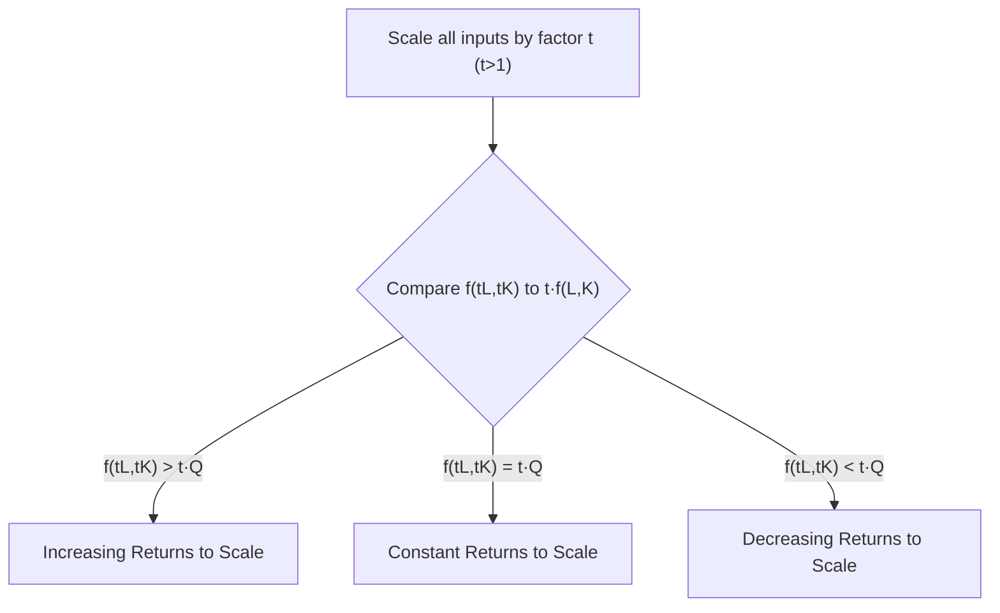
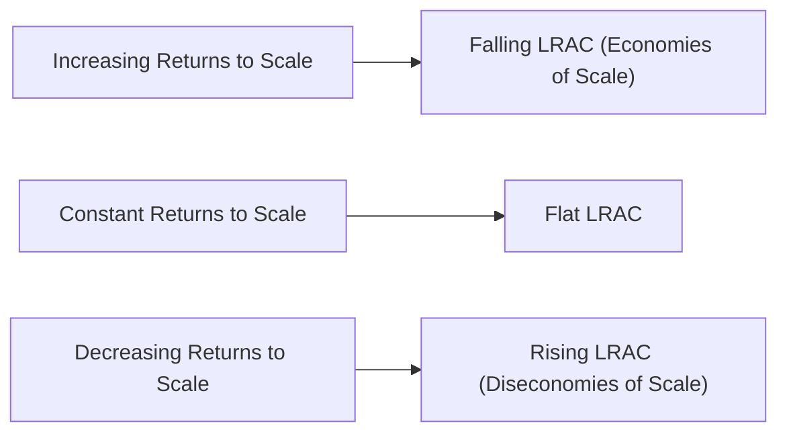

## Returns to Scale

### Definition

**Returns to scale** describes how output responds when *all* inputs are increased by the same proportion. It is a long-run concept, since it requires every input (including those fixed in the short run, such as capital) to be variable.

Formally, given a production function $Q = f(L, K)$, returns to scale examines the relationship:

$$f(tL, tK) \; \text{vs.} \; tQ \quad \text{for } t > 1$$

where all inputs are scaled by the same factor $t$.

**Key Points**

- Returns to scale is distinct from **diminishing marginal returns**, which examines the effect of changing *one* input while holding others fixed (a short-run concept)
- Returns to scale answers: "If I double every input, does output more than double, exactly double, or less than double?"
- The concept applies to the technology as a whole and can vary across different ranges of output for the same production function

### The Three Categories

**Increasing Returns to Scale (IRS)**: Output increases by *more* than the proportional increase in inputs.

$$f(tL, tK) > tf(L,K) \quad \text{for } t > 1$$

**Constant Returns to Scale (CRS)**: Output increases by *exactly* the same proportion as inputs.

$$f(tL, tK) = tf(L,K) \quad \text{for } t > 1$$

**Decreasing Returns to Scale (DRS)**: Output increases by *less* than the proportional increase in inputs.

$$f(tL, tK) < tf(L,K) \quad \text{for } t > 1$$

### Testing Returns to Scale: The Degree of Homogeneity Method

For a production function that is **homogeneous of degree $k$**, meaning:

$$f(tL, tK) = t^k f(L,K)$$

the returns to scale can be identified directly from $k$:

- $k > 1$: Increasing returns to scale
- $k = 1$: Constant returns to scale
- $k < 1$: Decreasing returns to scale

**Example**

For Cobb-Douglas $Q = AL^{\alpha}K^{\beta}$:

$$f(tL, tK) = A(tL)^{\alpha}(tK)^{\beta} = At^{\alpha+\beta}L^{\alpha}K^{\beta} = t^{\alpha+\beta}f(L,K)$$

The degree of homogeneity is $k = \alpha + \beta$. Therefore:

- $\alpha + \beta > 1$: increasing returns to scale
- $\alpha + \beta = 1$: constant returns to scale
- $\alpha + \beta < 1$: decreasing returns to scale

**Numerical Example**

Given $Q = 5L^{0.6}K^{0.5}$: since $\alpha + \beta = 0.6 + 0.5 = 1.1 > 1$, this exhibits increasing returns to scale.

Check: $f(2L, 2K) = 5(2L)^{0.6}(2K)^{0.5} = 5 \cdot 2^{1.1} \cdot L^{0.6}K^{0.5} \approx 2.14 \cdot Q$. Doubling inputs increases output by a factor of approximately 2.14, more than double.

### Isoquant Spacing as a Visual Test

Returns to scale can be identified geometrically by examining the spacing of isoquants along any ray from the origin, for equal increments of output (e.g., $Q = 100, 200, 300$):

**Key Points**

- **Increasing returns to scale**: Isoquants for equal output increments become progressively *closer together* — less-than-proportional input increases are needed for each successive output increment
- **Constant returns to scale**: Isoquants for equal output increments are *evenly spaced*
- **Decreasing returns to scale**: Isoquants for equal output increments become progressively *farther apart*

<svg xmlns="http://www.w3.org/2000/svg" viewBox="0 0 780 300" font-family="Arial, sans-serif">
<text x="390" y="20" text-anchor="middle" font-size="14" font-weight="bold">Isoquant Spacing and Returns to Scale (svg_diagram)</text>

<g transform="translate(20,40)">
<line x1="20" y1="220" x2="20" y2="20" stroke="black" stroke-width="1.5" />
<line x1="20" y1="220" x2="230" y2="220" stroke="black" stroke-width="1.5" />
<line x1="20" y1="220" x2="220" y2="30" stroke="#94a3b8" stroke-width="1" stroke-dasharray="3,2" />
<path d="M 45 210 Q 70 130 110 90" stroke="#16a34a" stroke-width="2" fill="none" />
<path d="M 65 215 Q 95 145 140 100" stroke="#16a34a" stroke-width="2" fill="none" />
<path d="M 78 217 Q 112 155 160 108" stroke="#16a34a" stroke-width="2" fill="none" />
<text x="115" y="245" text-anchor="middle" font-size="11">Q=100, 200, 300</text>
<text x="115" y="270" text-anchor="middle" font-size="13" font-weight="bold">Increasing RTS</text>
<text x="115" y="285" text-anchor="middle" font-size="10" fill="#555">(closer spacing)</text>
</g>

<g transform="translate(290,40)">
<line x1="20" y1="220" x2="20" y2="20" stroke="black" stroke-width="1.5" />
<line x1="20" y1="220" x2="230" y2="220" stroke="black" stroke-width="1.5" />
<line x1="20" y1="220" x2="220" y2="30" stroke="#94a3b8" stroke-width="1" stroke-dasharray="3,2" />
<path d="M 45 210 Q 70 130 100 100" stroke="#2563eb" stroke-width="2" fill="none" />
<path d="M 75 215 Q 100 145 140 115" stroke="#2563eb" stroke-width="2" fill="none" />
<path d="M 105 218 Q 130 155 180 130" stroke="#2563eb" stroke-width="2" fill="none" />
<text x="115" y="245" text-anchor="middle" font-size="11">Q=100, 200, 300</text>
<text x="115" y="270" text-anchor="middle" font-size="13" font-weight="bold">Constant RTS</text>
<text x="115" y="285" text-anchor="middle" font-size="10" fill="#555">(even spacing)</text>
</g>

<g transform="translate(560,40)">
<line x1="20" y1="220" x2="20" y2="20" stroke="black" stroke-width="1.5" />
<line x1="20" y1="220" x2="230" y2="220" stroke="black" stroke-width="1.5" />
<line x1="20" y1="220" x2="220" y2="30" stroke="#94a3b8" stroke-width="1" stroke-dasharray="3,2" />
<path d="M 45 210 Q 65 130 85 100" stroke="#dc2626" stroke-width="2" fill="none" />
<path d="M 90 215 Q 115 145 150 120" stroke="#dc2626" stroke-width="2" fill="none" />
<path d="M 150 218 Q 175 160 210 145" stroke="#dc2626" stroke-width="2" fill="none" />
<text x="115" y="245" text-anchor="middle" font-size="11">Q=100, 200, 300</text>
<text x="115" y="270" text-anchor="middle" font-size="13" font-weight="bold">Decreasing RTS</text>
<text x="115" y="285" text-anchor="middle" font-size="10" fill="#555">(wider spacing)</text>
</g>
</svg>

### Sources of Increasing Returns to Scale

**Key Points**

- **Specialization and division of labor**: Larger scale allows workers to specialize in narrower tasks, increasing productivity (classic Adam Smith argument)
- **Indivisibilities**: Some capital equipment is efficient only at large scale (e.g., assembly lines, large machinery) and cannot be scaled down proportionally
- **Geometric/volume relationships**: For container-based production (e.g., pipelines, storage tanks), surface area (input, e.g., material cost) grows with the square while volume (output capacity) grows with the cube of a linear dimension — the "cube-square rule"
- **Network effects and organizational efficiencies**: Larger operations can spread fixed costs (e.g., R&D, management overhead) over more output

### Sources of Decreasing Returns to Scale

**Key Points**

- **Managerial/coordination difficulties**: As firms grow, coordination, communication, and monitoring costs increase disproportionately, and decision-making can become slower
- **Bureaucratic inefficiency**: Larger organizations may develop layers of hierarchy that reduce responsiveness and increase agency problems
- **Fixed/scarce factors not fully captured in the model**: If an important input (e.g., entrepreneurial ability, unique managerial talent, a fixed natural resource) cannot be scaled proportionally, apparent decreasing returns can emerge even if the modeled inputs are truly variable

### Relationship to Returns to a Factor (Diminishing Marginal Returns)

**Key Points**

- Returns to scale (all inputs vary, long run) must not be confused with the **law of diminishing marginal returns** (one input varies, others fixed, short run)
- It is possible for a production function to exhibit diminishing marginal returns to each individual input *and* constant or increasing returns to scale simultaneously — these are not contradictory, since they describe different experiments
- Example: Cobb-Douglas with $\alpha, \beta < 1$ (so each input alone exhibits diminishing marginal product) can still have $\alpha + \beta = 1$ (constant returns to scale) or $\alpha + \beta > 1$ (increasing returns to scale)

### Returns to Scale and Long-Run Average Cost

Returns to scale directly determine the shape of the **long-run average cost (LRAC)** curve, assuming input prices are constant:

- **Increasing returns to scale** → falling LRAC (economies of scale)
- **Constant returns to scale** → flat/horizontal LRAC
- **Decreasing returns to scale** → rising LRAC (diseconomies of scale)

**Key Points**

- This link explains why the LRAC curve is often drawn as U-shaped: many real production processes exhibit increasing returns at low output (falling LRAC), transition to constant returns (flat minimum), then decreasing returns at high output (rising LRAC)
- The output level at which LRAC is minimized (if it exists) corresponds to the boundary between economies and diseconomies of scale, sometimes called **minimum efficient scale (MES)**

### Economies of Scale vs. Returns to Scale — Important Distinction

**Key Points**

- **Returns to scale** is a purely technical/physical concept about the production function, independent of input prices
- **Economies of scale** refers to the behavior of *cost* as output increases, which depends on both returns to scale *and* input prices
- The two typically move together when input prices are constant, but they can diverge if input prices change with the scale of purchasing (e.g., bulk discounts, or rising input prices due to scarcity as a firm expands) — in that case, cost behavior can differ from what pure returns to scale would predict [Inference: the extent and direction of such divergence is empirical and depends on specific market conditions for input pricing]

### Worked Example: Determining Returns to Scale

**Example**

Given $Q = 4L^{0.3}K^{0.7}$, determine returns to scale, then verify with a doubling test.

Step 1 — Sum exponents: $\alpha + \beta = 0.3 + 0.7 = 1$

Step 2 — Conclusion: constant returns to scale, since $k=1$.

Step 3 — Verification: Let $L=10, K=10$, so $Q = 4(10)^{0.3}(10)^{0.7} = 4(10)^{1} = 40$.

Double inputs: $L=20, K=20$: $Q' = 4(20)^{0.3}(20)^{0.7} = 4(20)^1 = 80 = 2 \times 40$. Output exactly doubles, confirming constant returns to scale.

### Common Pitfalls and Misconceptions

**Key Points**

- Confusing returns to scale (long-run, all inputs vary proportionally) with diminishing marginal product (short-run, one input varies) — these are separate concepts governed by separate conditions
- Assuming a single production function must exhibit only one type of returns to scale across its entire domain — many realistic production functions exhibit different returns to scale at different output ranges (e.g., IRS at low output, DRS at high output), even though simple Cobb-Douglas forms have constant $\alpha+\beta$ everywhere by construction
- Equating "returns to scale" directly with "economies of scale" without accounting for input price effects
- Misapplying the homogeneity test to non-homogeneous production functions — the simple degree-of-homogeneity shortcut only works cleanly for homogeneous functions; more general functions require directly comparing $f(tL,tK)$ to $tf(L,K)$ at the relevant point

### Related Topics

**Related Topics**

- Isoquants and isocosts
- Marginal rate of technical substitution (MRTS)
- Law of diminishing marginal returns
- Cobb-Douglas and CES production functions
- Homogeneous and homothetic functions
- Long-run average cost curve and minimum efficient scale
- Economies and diseconomies of scale
- Euler's theorem (relation between homogeneous functions and marginal products)