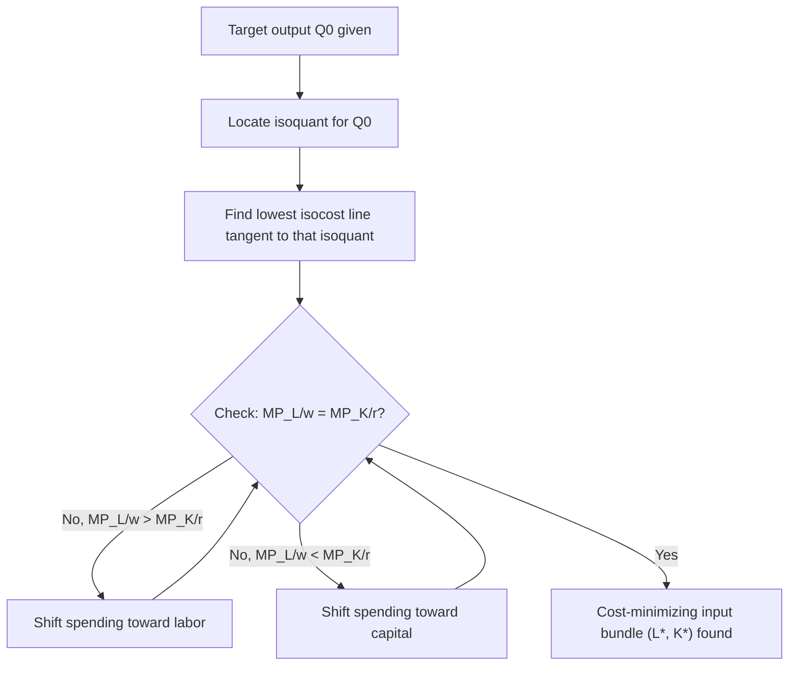

## Cost-Minimizing Input Combination

### Definition

The **cost-minimizing input combination** is the bundle of inputs (typically labor $L$ and capital $K$) that allows a firm to produce a given level of output at the lowest possible total cost, given fixed input prices. This is the solution to a constrained optimization problem: minimize cost subject to an output constraint.

### The Optimization Problem

**Formal statement**:

$$\min_{L,K} \; C = wL + rK \quad \text{subject to} \quad f(L,K) = Q_0$$

where $w$ is the wage rate, $r$ is the rental rate of capital, and $Q_0$ is the target output level.

**Key Points**

- This is the dual problem to output maximization subject to a cost constraint; both approaches yield the same tangency condition
- The solution identifies a single point (or in degenerate cases, a set of points) on the isoquant for $Q_0$
- The problem assumes the firm is a price-taker in input markets (fixed $w$ and $r$)

### Solution via Lagrangian Method

Set up the Lagrangian:

$$\mathcal{L} = wL + rK + \lambda[Q_0 - f(L,K)]$$

First-order conditions (setting partial derivatives to zero):

$$\frac{\partial \mathcal{L}}{\partial L} = w - \lambda MP_L = 0 \implies w = \lambda MP_L$$

$$\frac{\partial \mathcal{L}}{\partial K} = r - \lambda MP_K = 0 \implies r = \lambda MP_K$$

$$\frac{\partial \mathcal{L}}{\partial \lambda} = Q_0 - f(L,K) = 0 \implies f(L,K) = Q_0$$

Dividing the first two conditions:

$$\frac{w}{r} = \frac{MP_L}{MP_K} = MRTS_{LK}$$

**Key Points**

- The Lagrange multiplier $\lambda$ represents the shadow price of the output constraint — it equals the marginal cost of production, $\lambda = MC$
- This can be shown by noting $\lambda = w/MP_L = r/MP_K$, both of which equal the additional cost of producing one more unit of output using either input at the margin
- The condition $w/r = MRTS_{LK}$ is the same tangency condition derived graphically from isoquants and isocosts

### The Tangency Condition (Geometric Interpretation)

The cost-minimizing combination occurs where the isoquant for $Q_0$ is **tangent** to the lowest attainable isocost line. At this point, the slopes of both curves are equal:

$$\text{Slope of isoquant} = \text{Slope of isocost}$$

$$-MRTS_{LK} = -\frac{w}{r} \implies MRTS_{LK} = \frac{w}{r}$$

**Equivalent form — equal marginal product per dollar**:

$$\frac{MP_L}{w} = \frac{MP_K}{r}$$

This states that at the optimum, the additional output obtained per dollar spent must be identical across all inputs. If this were not true, the firm could reduce cost (or increase output) by reallocating spending toward the input with the higher marginal product per dollar.

### Illustration: Tangency Solution

<svg xmlns="http://www.w3.org/2000/svg" viewBox="0 0 520 340" font-family="Arial, sans-serif">
<text x="260" y="20" text-anchor="middle" font-size="14" font-weight="bold">Cost-Minimizing Input Combination (svg_diagram)</text>
<line x1="60" y1="300" x2="60" y2="40" stroke="black" stroke-width="1.5" />
<line x1="60" y1="300" x2="480" y2="300" stroke="black" stroke-width="1.5" />
<text x="480" y="320" font-size="13">Labor (L)</text>
<text x="30" y="45" font-size="13">Capital (K)</text>

<line x1="90" y1="280" x2="290" y2="60" stroke="#94a3b8" stroke-width="1.5" stroke-dasharray="4,3" />
<line x1="150" y1="280" x2="350" y2="60" stroke="#2563eb" stroke-width="2" />
<line x1="210" y1="280" x2="410" y2="60" stroke="#94a3b8" stroke-width="1.5" stroke-dasharray="4,3" />

<path d="M 170 270 Q 230 150 340 100 Q 355 93 380 88" stroke="#16a34a" stroke-width="2.5" fill="none" />
<circle cx="255" cy="170" r="4" fill="#dc2626" />
<text x="265" y="167" font-size="12" fill="#dc2626">(L*, K*)</text>
<line x1="255" y1="170" x2="255" y2="300" stroke="#dc2626" stroke-width="1" stroke-dasharray="2,2" />
<line x1="255" y1="170" x2="60" y2="170" stroke="#dc2626" stroke-width="1" stroke-dasharray="2,2" />
<text x="255" y="315" font-size="11" text-anchor="middle" fill="#dc2626">L*</text>
<text x="45" y="174" font-size="11" text-anchor="end" fill="#dc2626">K*</text>

<text x="365" y="105" font-size="12" fill="`#16a34a`">Isoquant Q0</text>

<text x="355" y="65" font-size="12" fill="`#2563eb`">C* (min cost)</text>

</svg>

### Worked Numerical Example

**Example**

Given production function $Q = 20L^{0.5}K^{0.5}$, wage $w = \$5$, rental rate $r = \$20$. Find the cost-minimizing combination to produce $Q_0 = 200$.

Step 1 — Marginal products:

$$MP_L = 10L^{-0.5}K^{0.5}, \quad MP_K = 10L^{0.5}K^{-0.5}$$

Step 2 — Tangency condition:

$$\frac{MP_L}{MP_K} = \frac{K}{L} = \frac{w}{r} = \frac{5}{20} = 0.25 \implies K = 0.25L$$

Step 3 — Substitute into the production constraint:

$$200 = 20L^{0.5}(0.25L)^{0.5} = 20L^{0.5}(0.5)L^{0.5} = 10L$$

$$L^* = 20, \quad K^* = 0.25(20) = 5$$

Step 4 — Verify output: $Q = 20(20)^{0.5}(5)^{0.5} = 20\sqrt{100} = 20(10) = 200$ ✓

Step 5 — Minimum cost:

$$C^* = wL^* + rK^* = 5(20) + 20(5) = 100 + 100 = \$200$$

### Second-Order Conditions: Ensuring a True Minimum

**Key Points**

- The tangency (first-order) condition is necessary but not sufficient for a cost minimum; the isoquant must also be **convex to the origin** at the tangency point
- Convexity of the isoquant is equivalent to **diminishing MRTS** in the relevant region
- If the isoquant were concave at the point of tangency, the tangency would represent a cost *maximum* along the isoquant, not a minimum — the true minimum would then occur at a corner solution
- For standard well-behaved production functions (Cobb-Douglas, CES with normal parameters), convexity holds globally, so any interior tangency is a genuine minimum

### Corner Solutions

When the isoquant is not smoothly convex everywhere, or when relative input prices are extreme, cost minimization may occur at a corner (using only one input) rather than at an interior tangency.

**Key Points**

- **Perfect substitutes** ($Q = aL + bK$): the firm uses only the input with the lower effective cost per unit of output. If $w/a < r/b$ (cost per unit of output from labor is lower), the firm uses only labor; if $w/a > r/b$, only capital
- **Perfect complements** ($Q = \min(aL, bK)$): the cost-minimizing combination is always at the kink, where $aL = bK$, regardless of relative prices, since using any input beyond the ratio required at the kink wastes that input without raising output
- More generally, corner solutions can arise whenever the isocost line is steeper or flatter than the isoquant across its *entire* relevant range, so no interior tangency exists

**Example — Perfect Complements**

Given $Q = \min(2L, 5K)$, find the cost-minimizing bundle for $Q_0 = 100$, at any prices.

At the kink: $2L = 5K = 100 \implies L = 50, K = 20$. This holds regardless of $w$ and $r$, since the fixed-proportions technology allows no substitution.

### Comparative Statics: How the Optimum Responds to Price Changes

**Key Points**

- **Wage increase ($w \uparrow$)**: the isocost line becomes steeper; the tangency point shifts along the isoquant toward more capital and less labor — a pure **substitution effect**, since output is held fixed at $Q_0$ throughout
- **Rental rate increase ($r \uparrow$)**: the isocost line becomes flatter; the tangency shifts toward more labor and less capital
- **Proportional increase in both $w$ and $r$**: the input ratio at the optimum is unchanged (since $w/r$ is unchanged), but the minimum cost $C^*$ rises proportionally
- Because output is held constant along the isoquant, there is no separate "output effect" analogous to the income effect in consumer theory — all adjustment in producer cost minimization is a substitution effect. This differs from the effect of a wage change on labor demand in profit maximization, which additionally has an output (scale) effect

### Relationship to the Conditional Input Demand Functions

Solving the cost-minimization problem for general $w$, $r$, and $Q$ yields the **conditional factor demand functions**:

$$L^*(w, r, Q), \quad K^*(w, r, Q)$$

These are called "conditional" because they are derived holding output fixed at a target level $Q$, as opposed to unconditional input demands derived from profit maximization (which do not fix $Q$).

**Key Points**

- Substituting the conditional factor demands back into the cost equation yields the firm's **cost function**: $C(w, r, Q) = wL^*(w,r,Q) + rK^*(w,r,Q)$
- By Shephard's Lemma, the conditional factor demand for an input equals the partial derivative of the cost function with respect to that input's price: $L^*(w,r,Q) = \partial C(w,r,Q)/\partial w$
- Conditional factor demands depend on the output target $Q$; unconditional factor demands (from profit maximization) depend only on prices, with output itself determined endogenously

### Relationship to the Expansion Path and Cost Curves

Solving the cost-minimization problem repeatedly across all output levels (at fixed $w$ and $r$) traces the **expansion path** — connecting all cost-minimizing input bundles as $Q$ varies.

**Key Points**

- Plotting minimum cost $C^*(Q)$ against $Q$ along the expansion path generates the **long-run total cost curve**
- For homothetic production functions (including Cobb-Douglas), the expansion path is a straight line through the origin, and the optimal capital-labor ratio $K^*/L^*$ is independent of the output level
- Differentiating the long-run total cost curve yields long-run marginal cost; the shape of this curve reflects the underlying returns to scale of the production function

### Common Pitfalls and Misconceptions

**Key Points**

- Treating cost minimization as equivalent to profit maximization — cost minimization only ensures the *cheapest way to produce a given output level*; it says nothing about whether that output level is the profit-maximizing one
- Applying the interior tangency formula ($MRTS = w/r$) mechanically to production functions with kinked or linear isoquants, where corner solutions may instead apply
- Forgetting to verify the constraint is satisfied exactly (i.e., that the resulting input bundle actually produces $Q_0$) after solving the tangency condition
- Confusing conditional factor demands (function of $w, r, Q$) with unconditional/profit-maximizing factor demands (function of $w, r,$ and output price $p$, with $Q$ determined by the model rather than fixed exogenously)

### Related Topics

**Related Topics**

- Isoquants and isocosts
- Marginal rate of technical substitution (MRTS)
- Returns to scale
- Conditional factor demand functions and Shephard's Lemma
- Expansion path and long-run total cost
- Long-run vs. short-run cost minimization
- Profit maximization and unconditional input demand
- Duality theory in production economics