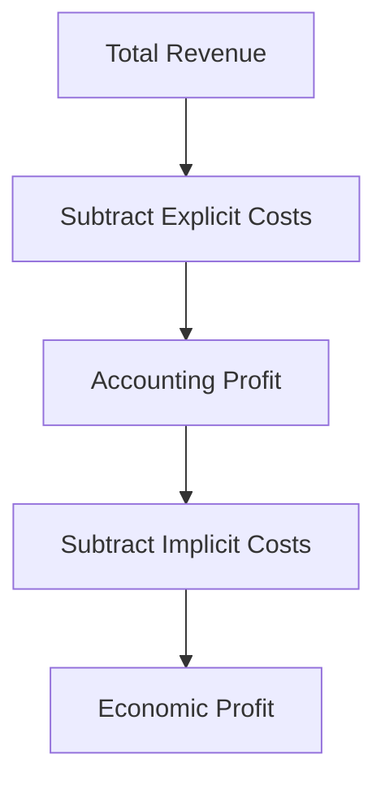

## Explicit vs Implicit Costs

### Definitions

**Explicit costs** are direct, out-of-pocket monetary payments a firm makes to outside suppliers of inputs — actual cash outlays that appear in accounting records. Examples include wages paid to employees, rent paid to a landlord, payments for raw materials, and utility bills.

**Implicit costs** are the opportunity costs of using resources the firm already owns, for which no direct monetary payment is made. They represent the value of the next-best alternative use of self-owned resources — most commonly the owner's own time, capital, or property.

**Key Points**

- Both explicit and implicit costs are **opportunity costs** in the economic sense — explicit costs represent the opportunity cost of money that could have been spent elsewhere, while implicit costs represent the opportunity cost of self-owned resources deployed in the business
- Explicit costs are recorded in standard accounting statements; implicit costs typically are not
- The distinction underlies the difference between **accounting profit** and **economic profit**

### The Economic Cost Identity

$$\text{Total Economic Cost} = \text{Explicit Costs} + \text{Implicit Costs}$$

This total economic cost is then used to compute economic profit:

$$\text{Economic Profit} = \text{Total Revenue} - \text{Explicit Costs} - \text{Implicit Costs}$$

By contrast:

$$\text{Accounting Profit} = \text{Total Revenue} - \text{Explicit Costs}$$

### Common Examples of Implicit Costs

**Key Points**

- **Forgone wages**: If an owner works in their own business instead of taking a salaried job elsewhere, the salary they could have earned elsewhere is an implicit cost (sometimes called the **opportunity cost of the owner's labor**)
- **Forgone return on invested capital**: If an owner invests $100,000 of personal savings into the business rather than investing it in financial markets, the return that money could have earned elsewhere (e.g., interest or expected market return) is an implicit cost
- **Forgone rent on owned property**: If a firm operates out of a building the owner already owns (rather than renting it out to a third party), the rental income forgone is an implicit cost
- **Depreciation/use of owned equipment**: The decline in value or wear of equipment already owned, to the extent it isn't captured by an explicit expense, can be considered part of implicit cost
- Implicit costs are sometimes labeled **normal profit** when specifically referring to the minimum return necessary to keep an entrepreneur engaged in the current business rather than pursuing the next-best alternative

### Worked Numerical Example

**Example**

Maria owns and operates a bakery. Over the past year:

- Total revenue: $150,000
- Explicit costs (ingredients, employee wages, rent paid to a landlord, utilities): $90,000
- Maria could have earned $40,000/year working as a pastry chef elsewhere (forgone wages)
- Maria invested $50,000 of her own savings to start the bakery instead of investing it at an expected 6% annual return elsewhere (forgone return: $3,000)

**Accounting profit**:

$$\$150{,}000 - \$90{,}000 = \$60{,}000$$

**Implicit costs**:

$$\$40{,}000 \text{ (forgone wages)} + \$3{,}000 \text{ (forgone return)} = \$43{,}000$$

**Economic profit**:

$$\$60{,}000 - \$43{,}000 = \$17{,}000$$

Maria's accounting profit of $60,000 makes the bakery look highly successful, but her *economic* profit of $17,000 reflects that she is still $17,000 better off than her next-best alternative — a meaningful but smaller margin.

### Visual Comparison: Accounting Profit vs. Economic Profit

<svg xmlns="http://www.w3.org/2000/svg" viewBox="0 0 520 320" font-family="Arial, sans-serif">
<text x="260" y="20" text-anchor="middle" font-size="14" font-weight="bold">Accounting Profit vs Economic Profit (svg_diagram)</text>

<rect x="60" y="50" width="120" height="220" fill="#93c5fd" stroke="black" />
<text x="120" y="45" text-anchor="middle" font-size="12">Total Revenue</text>
<text x="120" y="165" text-anchor="middle" font-size="11">\$150,000</text>

<rect x="220" y="120" width="120" height="150" fill="#fca5a5" stroke="black" />
<text x="280" y="200" text-anchor="middle" font-size="10">Explicit Costs</text>
<text x="280" y="215" text-anchor="middle" font-size="10">\$90,000</text>
<rect x="220" y="77" width="120" height="43" fill="#fde68a" stroke="black" />
<text x="280" y="100" text-anchor="middle" font-size="10">Implicit Costs</text>
<text x="280" y="112" text-anchor="middle" font-size="9">\$43,000</text>
<rect x="220" y="50" width="120" height="27" fill="#86efac" stroke="black" />
<text x="280" y="66" text-anchor="middle" font-size="10">Econ. Profit \$17,000</text>

<text x="280" y="45" text-anchor="middle" font-size="12">Cost + Profit Breakdown</text>

<text x="400" y="200" font-size="11" fill="`#dc2626`">Accounting Profit</text>

<text x="400" y="213" font-size="11" fill="`#dc2626`">= $60,000</text>

<line x1="345" y1="50" x2="345" y2="120" stroke="`#dc2626`" stroke-width="1.5" />

</svg>

### Why the Distinction Matters for Economic Decision-Making

**Key Points**

- **Zero economic profit does not mean the firm is failing**: a firm earning zero economic profit is earning exactly enough to cover all opportunity costs, including a normal return to the owner's labor and capital — it is still doing as well as its next-best alternative
- **Positive accounting profit can mask a poor decision**: a business can show positive accounting profit while still generating negative economic profit, indicating the owner's resources would be better deployed elsewhere
- Economic profit (not accounting profit) is the theoretically correct signal for **entry and exit decisions** in a market: firms enter when economic profit is positive and exit (in the long run) when it is persistently negative
- In perfectly competitive long-run equilibrium, economic profit is driven to zero through entry and exit, even though accounting profit at that point is typically positive (equal to the sum of implicit costs, or "normal profit")

### Sunk Costs — A Related but Distinct Concept

**Key Points**

- A **sunk cost** is an expenditure that has already been incurred and cannot be recovered, regardless of future decisions
- Sunk costs can be explicit (e.g., a non-refundable payment already made) or, less commonly framed, related to implicit cost history, but the defining feature is *irrecoverability*, not the explicit/implicit distinction
- Rational decision-making should ignore sunk costs going forward, since they do not change as a result of any future choice — only costs and benefits that vary with the decision at hand (marginal costs and marginal benefits) are relevant
- Confusing sunk costs with either explicit or implicit costs is a common error; a cost's *sunk* status is about timing and recoverability, while explicit/implicit is about whether a direct monetary payment was made

### Explicit and Implicit Costs Across the Cost Curve Framework

**Key Points**

- Total economic cost (explicit + implicit) is the cost concept used to derive standard economic cost curves: total cost, average cost, and marginal cost
- Fixed costs and variable costs can each contain both explicit and implicit components — e.g., rent paid to an external landlord (explicit, often fixed) versus the forgone rental value of an owned building (implicit, also typically fixed in the short run)
- Because implicit costs are real opportunity costs even though no cash changes hands, they must be included in marginal cost calculations whenever the marginal use of a self-owned resource has a genuine alternative use

### Common Pitfalls and Misconceptions

**Key Points**

- Assuming implicit costs are somehow "not real" costs because no money is paid out — in economic analysis, forgone opportunities are just as real a cost as cash payments, since they represent genuine resources given up
- Treating accounting profit and economic profit as interchangeable — they differ precisely by the magnitude of implicit costs, and can lead to very different conclusions about whether a venture is "worth it" in the economic sense
- Assuming a firm with zero economic profit is unprofitable in a real-world (accounting) sense — it typically still shows positive accounting profit, exactly equal to the value of its implicit costs (normal profit)
- Confusing sunk costs with implicit costs — sunk costs relate to irreversibility of a past decision, whereas implicit costs relate to the ongoing opportunity cost of resources currently employed
- Omitting some implicit costs from analysis (e.g., forgetting forgone capital returns while including forgone wages) — a complete economic cost calculation requires accounting for the opportunity cost of *every* self-owned resource used in production, not just labor

### Related Topics

**Related Topics**

- Accounting profit vs. economic profit
- Normal profit and zero economic profit as a long-run competitive benchmark
- Sunk costs and the sunk cost fallacy
- Fixed costs vs. variable costs
- Short-run and long-run cost curves
- Opportunity cost (foundational microeconomic concept)
- Entry and exit decisions in perfectly competitive markets
- Economic rent and factor payments